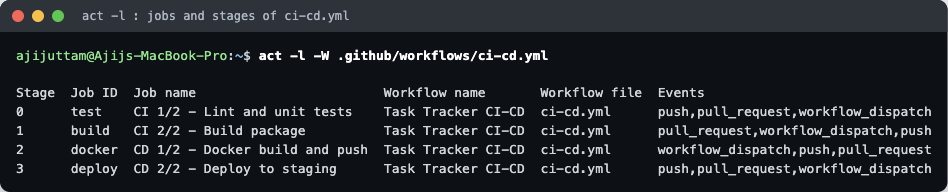
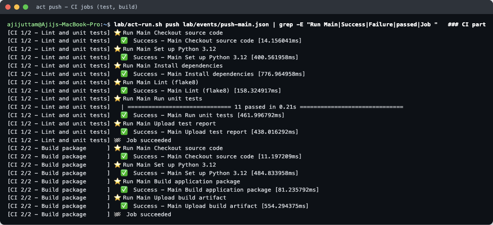
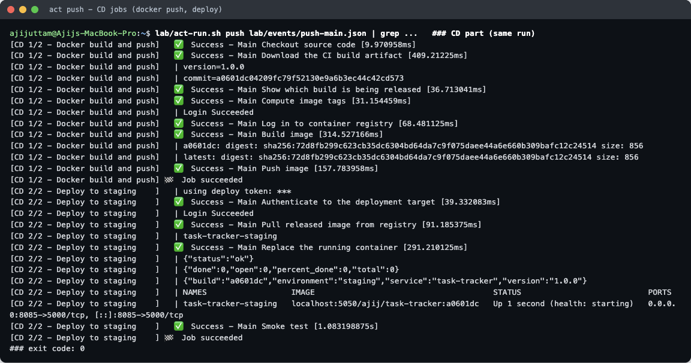
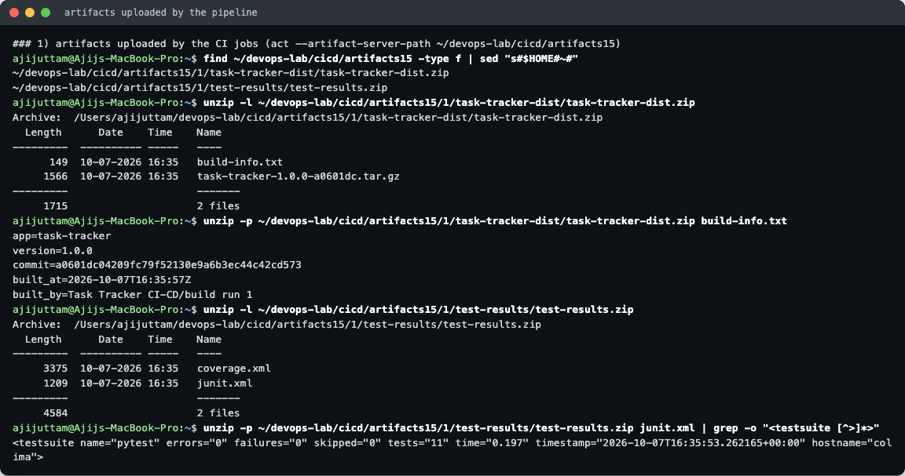
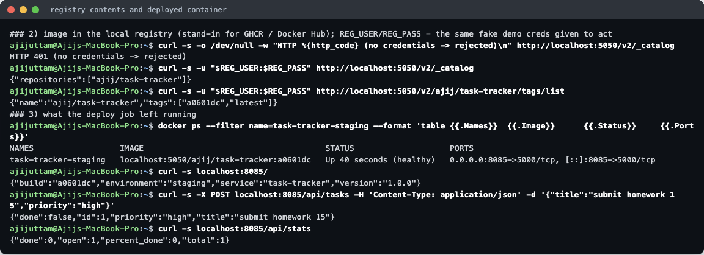
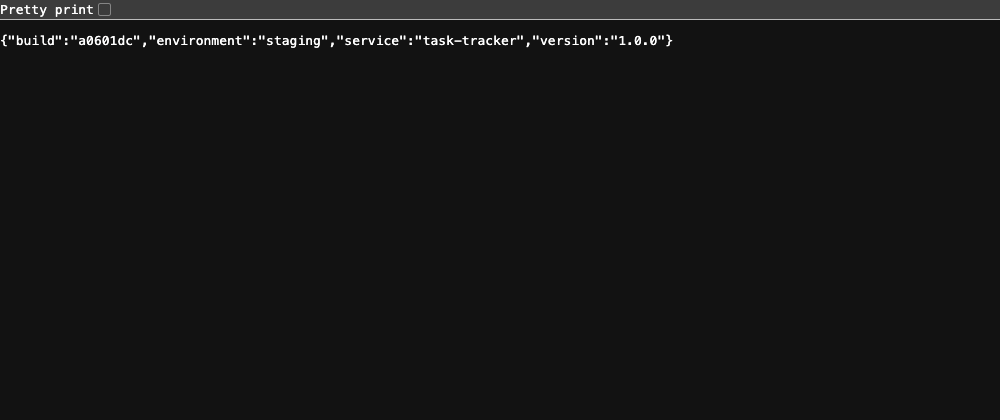
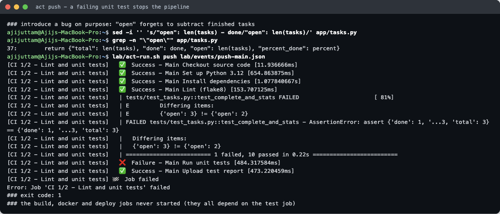
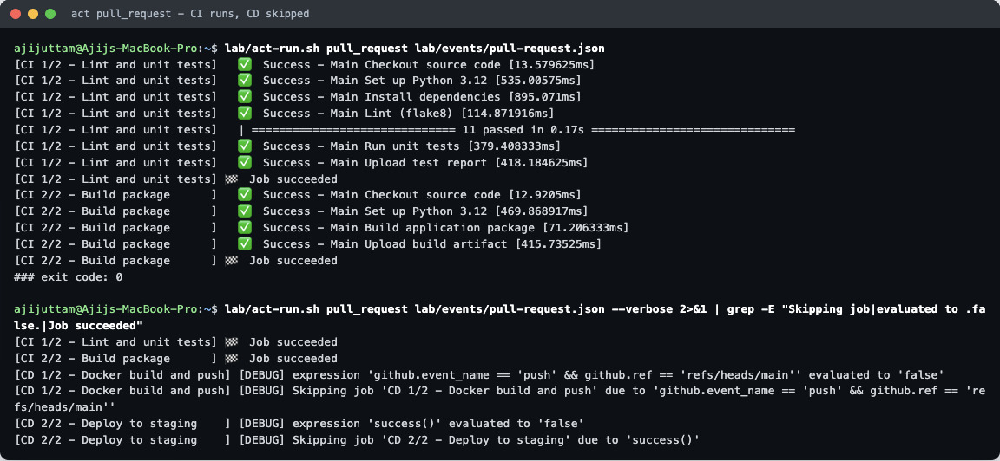

# CI/CD with GitHub Actions — Homework

**Name:** Ajij Uttam  **Enrollment No:** 24bcs10103

**Task:** build a complete CI/CD demo project with GitHub Actions (the instructor's `Github-Actions/10-final-cicd-pipeline` was the reference).

**What I built:** a small Flask REST API called **Task Tracker** with 11 unit tests, a Dockerfile, and one workflow, [`.github/workflows/ci-cd.yml`](.github/workflows/ci-cd.yml). The workflow has **2 CI jobs** (lint + test, then build) and **2 CD jobs** (Docker build + push, then deploy to a staging container).

**How it was run:** this repo is not on GitHub yet, so every pipeline run below was done locally with [`act`](https://github.com/nektos/act) **0.2.89**. `act` reads the same YAML and runs each job in a Docker container that imitates a GitHub `ubuntu-latest` runner (`catthehacker/ubuntu:act-latest`, arm64). The container registry is a local `registry:2` container called **`ajij-registry`** on `localhost:5050`, protected by a username and password. On real GitHub the same workflow pushes to **GHCR** (`ghcr.io/<owner>/task-tracker`), or to Docker Hub if you change `REGISTRY`.

I used the reference folder only for its structure: CI with `needs: test`, a build artifact and a failure demo. The app, the tests, the Dockerfile, the CD half of the pipeline and this write-up are my own.

```
CICD_GitHub_Actions/
├── .github/workflows/ci-cd.yml   ← the pipeline
├── app/        tasks.py (logic) · main.py (Flask routes) · __init__.py (version)
├── tests/      test_tasks.py (6 unit tests) · test_api.py (5 API tests)
├── scripts/build.sh              ← "build" step: versioned tarball + build-info.txt
├── Dockerfile  .dockerignore  requirements*.txt  pytest.ini  .flake8
├── lab/        act-run.sh, event files, raw act logs (*.log.txt), screenshot excerpts
└── images/     screenshots
```

---

## 1. The concepts, and where each one lives in this project

| Concept | What it means | In this project |
|---|---|---|
| **CI** (Continuous Integration) | Every change is automatically built and tested, so broken code is caught within minutes of being pushed. | Jobs `test` and `build`. They run on **every push and every pull request**. |
| **CD** (Continuous Delivery / Deployment) | Code that passed CI is automatically packaged and released. *Delivery* stops at a ready-to-deploy artifact; *Deployment* also rolls it out. | Job `docker` builds the image and pushes it to the registry (**delivery**). Job `deploy` runs it on staging and smoke-tests it (**deployment**). They run **only on a push to `main`**. |
| **CI vs CD** | CI answers "is this change correct?". CD answers "ship the change". A PR should get CI feedback, but it must never deploy. | `if: github.event_name == 'push' && github.ref == 'refs/heads/main'` on the CD jobs. The PR run in section 5 proves CD is skipped. |
| **CI/CD pipeline** | The whole chain from `git push` to a running app, where each stage starts only if the previous one succeeded. | `test → build → docker → deploy`, chained with `needs:`. |
| **GitHub Actions** | GitHub's built-in automation engine. YAML files in `.github/workflows/` say *when* to run (events) and *what* to run (jobs). | One workflow file, triggered by `push`, `pull_request` and `workflow_dispatch` (a manual button). |
| **Workflow** | One YAML file = one automated process with a name, triggers, shared `env` and jobs. | `name: Task Tracker CI-CD`. Shared `env:` holds `PYTHON_VERSION`, `REGISTRY` and `IMAGE_NAME`. |
| **Jobs** | Groups of steps. Each job gets a **fresh runner**, so jobs share nothing unless you pass it explicitly (artifacts, `outputs`). Without `needs:` jobs run in parallel. | 4 jobs. `docker` passes the image tag to `deploy` through `outputs.image`. `build` passes the package to `docker` through an artifact. |
| **Steps** | The ordered commands inside a job. A step either runs a shell command (`run:`) or calls a reusable action (`uses:`). If one step fails, the remaining steps are skipped, unless a step says `if: always()`. | `uses: actions/checkout@v4`, `actions/setup-python@v5`, `actions/upload-artifact@v4`, plus `run:` steps for flake8, pytest, `build.sh`, docker, curl. |
| **Runners** | The machine that executes a job. `runs-on: ubuntu-latest` = a fresh GitHub-hosted Ubuntu VM. You can also register **self-hosted** runners. | `runs-on: ubuntu-latest`. Locally, `act -P ubuntu-latest=catthehacker/ubuntu:act-latest` swaps the VM for a Docker container. |
| **Secrets** | Encrypted values (passwords, tokens) stored in the repo settings, read as `${{ secrets.NAME }}` and **masked as `***` in logs**. Never hard-coded in YAML. | `REGISTRY_USERNAME`, `REGISTRY_PASSWORD` (docker login) and `DEPLOY_TOKEN` (deploy). The log line `using deploy token: ***` shows the masking. |
| **Variables** | Non-secret settings (`${{ vars.NAME }}`). | `vars.REGISTRY` and `vars.IMAGE_NAMESPACE`. They fall back to `ghcr.io` and the repo owner. |
| **Artifacts** | Files a job uploads so that later jobs, or people, can download them after the run. | `test-results` (JUnit XML + coverage XML, uploaded even when tests fail) and `task-tracker-dist` (tarball + `build-info.txt`). The `docker` job downloads `task-tracker-dist` to show which build it is releasing. |
| **Build** | Turn source into something you can ship. | `scripts/build.sh` → `dist/task-tracker-1.0.0-<sha>.tar.gz`. `docker build` → image tagged `<sha>` and `latest`. |
| **Test** | Automatic checks that stop bad code. | `flake8` (lint) + `pytest` with coverage. **11 tests, 98% coverage.** |
| **Pipeline execution** | One run of the workflow for one event (push, PR, manual). Every job and step reports success or failure, and the run passes only if every job that ran succeeded. | Four real runs below: push ✅, push with a broken test ❌, pull request ✅ (CD skipped), push after the fix ✅. |

```
             ┌──────────── CI (push + pull_request) ────────────┐   ┌──────── CD (push to main only) ────────┐
git push ──▶ │ test: checkout → setup-python → pip install →    │──▶│ docker: download artifact → docker      │
             │       flake8 → pytest → upload test-results      │   │         login (secrets) → build → push   │
             │ build (needs test): build.sh → upload dist/      │   │ deploy (needs docker, env: staging):     │
             └──────────────────────────────────────────────────┘   │   pull → replace container → smoke test │
                                                                    └──────────────────────────────────────────┘
```

---

## 2. How to run it

**Locally with act (what I did):**

```bash
# one-time: a password-protected local registry (fake demo credentials)
mkdir -p ~/devops-lab/cicd/registry/auth
docker run --rm --entrypoint htpasswd httpd:2.4-alpine -Bbn ajij-demo fake-demo-pass-123 > ~/devops-lab/cicd/registry/auth/htpasswd
docker run -d --name ajij-registry -p 5050:5000 -v ~/devops-lab/cicd/registry/auth:/auth \
  -e REGISTRY_AUTH=htpasswd -e REGISTRY_AUTH_HTPASSWD_REALM="ajij local registry" \
  -e REGISTRY_AUTH_HTPASSWD_PATH=/auth/htpasswd registry:2

lab/act-run.sh push         lab/events/push-main.json      # full CI + CD
lab/act-run.sh pull_request lab/events/pull-request.json   # CI only
```

[`lab/act-run.sh`](lab/act-run.sh) wraps `act` with the flags below. All secret values in it are **fake demo values** for a throwaway local registry.

| act flag | Why |
|---|---|
| `-W .github/workflows/ci-cd.yml` | Run the workflow from this assignment folder |
| `-P ubuntu-latest=catthehacker/ubuntu:act-latest` | The runner image (arm64 build, so no `--container-architecture` was needed) |
| `-e lab/events/*.json` | Fake event payload. Sets `github.ref=refs/heads/main` for the push, and PR #7 for the pull request |
| `--artifact-server-path ~/devops-lab/cicd/artifacts15` | act starts a local artifact server, so `upload-artifact@v4` and `download-artifact@v4` work |
| `--var REGISTRY=localhost:5050 --var IMAGE_NAMESPACE=ajij` | Same as repository *variables* on GitHub |
| `-s REGISTRY_USERNAME=… -s REGISTRY_PASSWORD=… -s DEPLOY_TOKEN=…` | Same as repository *secrets* on GitHub |
| `--network host`, `--container-daemon-socket /var/run/docker.sock` | Lets the job containers use the Colima Docker daemon and reach `localhost:5050` / `localhost:8085` |
| `--action-offline-mode` | Added after these four runs (it was first needed for assignment 16): reuse cached action repos instead of re-cloning them |

**On real GitHub:** copy `.github/workflows/ci-cd.yml` to the repository root's `.github/workflows/` (GitHub only reads workflows from there). Then, under *Settings → Secrets and variables → Actions*, add:

- secrets `REGISTRY_USERNAME` (your GitHub user), `REGISTRY_PASSWORD` (a PAT with `write:packages`, or switch the login step to `${{ secrets.GITHUB_TOKEN }}`), and `DEPLOY_TOKEN`
- variable `REGISTRY` only if you don't want the default `ghcr.io`

On GitHub, `actions/checkout` really clones the repo. Under act it copies the working folder instead, which is why the first step takes about 10 ms.

---

## 3. Pipeline execution #1 — push to `main`, everything green

`act -l` shows the 4 jobs and the order (*stage*) `needs:` puts them in:



**CI part:** checkout → Python 3.12 → install → flake8 → **11 tests passed** → test report artifact. Then the build job creates the package artifact.



**CD part:** downloads the CI artifact (`commit=a0601dc…`), logs in with the secrets, builds the image, and pushes `a0601dc` and `latest`. Deploy then pulls the image, replaces the container and smoke-tests `/health`, `/api/stats` and `/`. Note `using deploy token: ***`: the secret was masked in the log.



Full logs: [`lab/run1-push-main.log.txt`](lab/run1-push-main.log.txt) (first green run) and [`lab/run4-push-after-fix.log.txt`](lab/run4-push-after-fix.log.txt) (the run the screenshots come from). Both end with `### exit code: 0`.

### Artifacts



```
task-tracker-dist.zip:  build-info.txt, task-tracker-1.0.0-a0601dc.tar.gz
test-results.zip:       coverage.xml, junit.xml   → <testsuite ... errors="0" failures="0" skipped="0" tests="11">
```

### Registry and the deployed app



- `GET /v2/_catalog` without credentials → **HTTP 401**. With the credentials → `{"repositories":["ajij/task-tracker"]}`, tags `["a0601dc","latest"]`.
- Container `task-tracker-staging` runs image `localhost:5050/ajij/task-tracker:a0601dc` and is `(healthy)` (Docker `HEALTHCHECK` in the Dockerfile). It reports `"environment":"staging","build":"a0601dc"`.

The image tag is the **git commit SHA**, so every deployment can be traced back to the exact commit and the exact CI run.



---

## 4. Pipeline execution #2 — a failing test stops the pipeline

I broke `TaskStore.stats()` on purpose: `"open"` forgot to subtract finished tasks. I ran the push pipeline, then restored the file.



```
tests/test_tasks.py::test_complete_and_stats FAILED
E         {'open': 3} != {'open': 2}
========================= 1 failed, 10 passed in 0.22s =========================
❌  Failure - Main Run unit tests
✅  Success - Main Upload test report        ← if: always(), so the report is still uploaded
🏁  Job failed
Error: Job 'CI 1/2 - Lint and unit tests' failed
```

`build`, `docker` and `deploy` **never started**, because they all depend (directly or indirectly) on `test`. Nothing broken reached the registry or staging. Full log: [`lab/run2-failing-test.log.txt`](lab/run2-failing-test.log.txt).

After the fix, the next push ([`lab/run4-push-after-fix.log.txt`](lab/run4-push-after-fix.log.txt)) was green again, and that run produced the screenshots in section 3.

---

## 5. Pipeline execution #3 — pull request: CI runs, CD is skipped



The `pull_request` event (PR #7, `feature/priority-filter → main`, ref `refs/pull/7/merge`) ran `test` and `build`. Both succeeded. With `--verbose`, act shows why the CD jobs were skipped:

```
[CD 1/2 - Docker build and push] expression 'github.event_name == 'push' && github.ref == 'refs/heads/main'' evaluated to 'false'
[CD 1/2 - Docker build and push] Skipping job 'CD 1/2 - Docker build and push' due to 'github.event_name == 'push' && github.ref == 'refs/heads/main''
[CD 2/2 - Deploy to staging    ] Skipping job 'CD 2/2 - Deploy to staging' due to 'success()'
```

`deploy` has no `if:` of its own. Its implicit condition is `success()` of `needs: docker`, and a skipped dependency doesn't count as success, so deploy is skipped too. On GitHub both jobs would show a grey "skipped" icon. Logs: [`lab/run3-pull-request.log.txt`](lab/run3-pull-request.log.txt) and [`lab/run3-pull-request-skips.txt`](lab/run3-pull-request-skips.txt) (I kept only the skip lines from the verbose log, because the full verbose log prints act's internal runtime token).

---

## 6. Notes and differences from real GitHub

- **Timing:** my very first act run (a practice run whose log I didn't keep) spent **4 min 5 s** in `setup-python` downloading Python 3.12. After that, act's tool cache made it about 0.4 s. On GitHub, Python is preinstalled on the runner image.
- **Run number:** act reports every run as run `1`, so each run overwrote the artifacts of the run before it under `artifacts15/1/`. On GitHub every run gets its own number and keeps its own artifacts for `retention-days: 7`.
- **Commit SHA:** act took `GITHUB_SHA` from the local git HEAD (`a0601dc`), because the repo has no remote yet.
- **Deploy target:** "staging" here is a container on the runner's Docker daemon. In a real project this job would SSH to a server, or call a cloud service or Kubernetes (assignment 16 deploys to Kubernetes). The job uses `environment: staging`, so on GitHub you could add required reviewers before it runs.
- **Concurrency:** this workflow is linear. On GitHub you could add `concurrency: deploy-staging` so that two pushes can't deploy at the same time.

## 7. Clean-up

```bash
docker rm -f task-tracker-staging ajij-registry
docker rmi localhost:5050/ajij/task-tracker:a0601dc localhost:5050/ajij/task-tracker:latest
rm -rf ~/devops-lab/cicd/artifacts15
```
