# Cloud & Terraform in Action — Homework

**Name:** Ajij Uttam  **Enrollment No:** 24bcs10103

**Goal:** build a small but complete AWS environment with Terraform (**VPC → public subnet → Internet Gateway + route table → security group → EC2 instance with an IAM role → S3 bucket**), then inspect it, prove it exists with the AWS CLI, look at the dependency graph and the state, and destroy it.

**Environment:** macOS (Apple Silicon), Terraform **v1.16.4**, AWS provider **v5.100.0**, AWS CLI **v2.36.30**, Graphviz **16.1.0**. No real AWS account was used. AWS was emulated by **LocalStack 4.0.3 community** (`localstack/localstack:4.0`, the last tag I found that runs without an auth token) on `http://localhost:4566`. The `.tf` code is ordinary AWS code; only the provider block is LocalStack-specific ([what changes for real AWS](#running-it-on-real-aws)).
The course's [`Cloud-Terraform/08-mini-project`](https://github.com/aryen1101/Learn_DEVOPS) (VPC, subnet, IGW, route table, SG) was my starting point. I wrote my own code and added the EC2 instance, AMI lookup, S3 bucket, IAM role and instance profile, the explicit dependency, and the outputs.

```bash
docker run -d --name ajij-localstack -p 4566:4566 -e SERVICES=s3,ec2,iam,sts localstack/localstack:4.0
bash lab/run.sh     # init → fmt → validate → plan → apply → state → output → aws-cli checks → graph → destroy
```

[`lab/run.sh`](lab/run.sh) loads dummy credentials (`test`/`test`) and `AWS_ENDPOINT_URL=http://localhost:4566`, and it points the AWS config/credential files at `/dev/null`, so a real AWS profile can never be touched. Raw output of every step: [`lab/`](lab/). Screenshots are trimmed from those files (omitted lines are marked `### ...`).

---

## Architecture

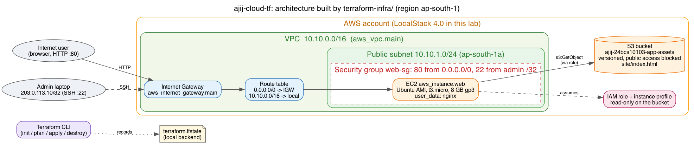

([SVG](images/architecture.svg), drawn with Graphviz from [`images/architecture.dot`](images/architecture.dot).) The same design in Mermaid:

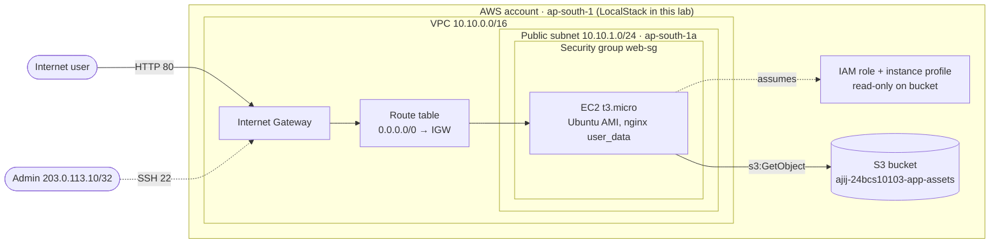

How it works: a browser hits the instance's public IP. The **IGW** and the route table's `0.0.0.0/0` route make the subnet *public*. The **security group** lets port 80 in from everywhere and port 22 only from one admin IP. On boot, `user_data` installs nginx and copies `index.html` from the **S3 bucket**. The instance can read that bucket because it runs with an **IAM role** (through an instance profile), so no access keys are stored on the server.

## The Terraform project — [`terraform-infra/`](terraform-infra/)

| File | Contents | Concept shown |
|---|---|---|
| [`versions.tf`](terraform-infra/versions.tf) | `required_version`, `required_providers` (`hashicorp/aws ~> 5.0`) | **Providers**, version pinning |
| [`provider.tf`](terraform-infra/provider.tf) | `provider "aws"`: region, LocalStack endpoints, `default_tags` on every resource | **Providers** |
| [`variables.tf`](terraform-infra/variables.tf) + [`terraform.tfvars`](terraform-infra/terraform.tfvars) | region, project prefix, VPC/subnet CIDRs, instance type, SSH CIDR, bucket name | **Variables** |
| [`network.tf`](terraform-infra/network.tf) | `aws_vpc`, `aws_subnet`, `aws_internet_gateway`, `aws_route_table`, `aws_route_table_association` | **Resources**, VPC |
| [`security.tf`](terraform-infra/security.tf) | `aws_security_group` (80 from anywhere, 22 from one /32, all egress) | Resources |
| [`compute.tf`](terraform-infra/compute.tf) | `data "aws_ami"` (latest Canonical Ubuntu), `aws_instance` with user_data, gp3 root disk, `depends_on` | **Data sources**, explicit **dependencies** |
| [`storage.tf`](terraform-infra/storage.tf) | `aws_s3_bucket` + versioning + public-access block + `site/index.html` object | S3 |
| [`iam.tf`](terraform-infra/iam.tf) | trust policy, `aws_iam_role`, least-privilege inline policy (List/Get on this bucket only), `aws_iam_instance_profile` | IAM |
| [`outputs.tf`](terraform-infra/outputs.tf) | 11 outputs: VPC/subnet/IGW/SG IDs, AMI, instance ID + IPs, bucket, role ARN | **Outputs** |

Total: **14 managed resources + 3 data sources.** `.terraform.lock.hcl` is committed. `.terraform/`, `*.tfstate*` and plan files are ignored ([`.gitignore`](terraform-infra/.gitignore)).

---

## 1. Provider check, `init`, `fmt`, `validate`

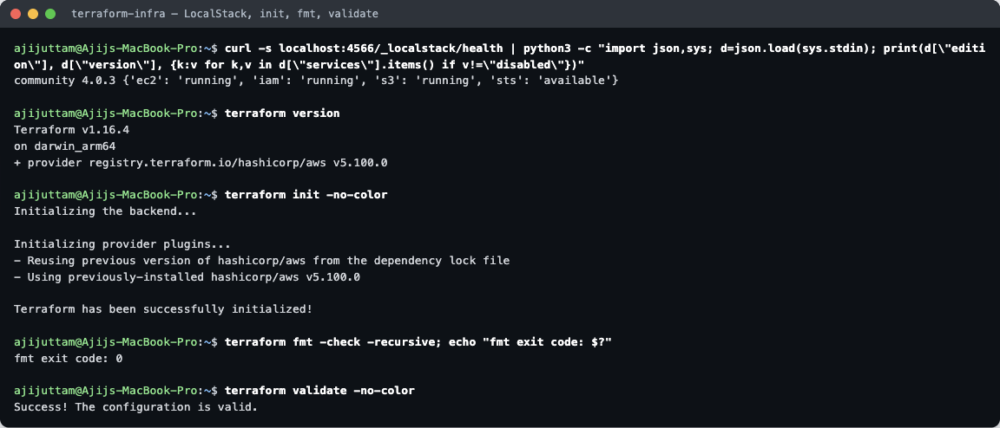

LocalStack reports `community 4.0.3` with `ec2`, `iam`, `s3` and `sts` enabled. `init` installed **hashicorp/aws v5.100.0** (this run reused the plugin already in `.terraform/`), `fmt -check` exited **0**, and `validate` reported *Success!*.

## 2. `terraform plan`

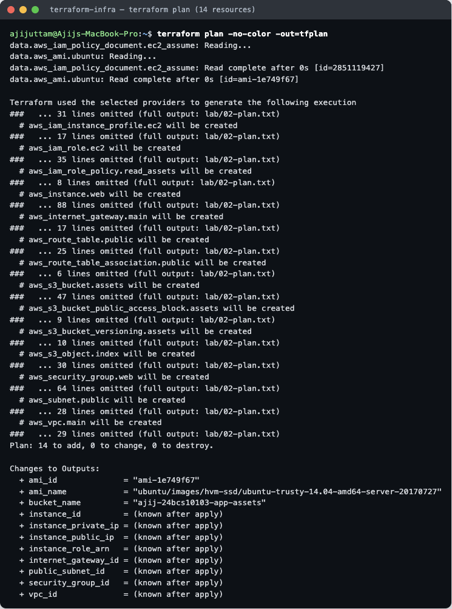

The plan first **reads the data sources**. The AMI lookup found `ami-1e749f67` (`ubuntu-trusty-14.04` from LocalStack's built-in AMI catalogue; on real AWS the same filter returns the newest Ubuntu). It then lists every resource that **will be created**: **Plan: 14 to add, 0 to change, 0 to destroy.** It was saved with `-out=tfplan`. Full plan (480 lines): [`lab/02-plan.txt`](lab/02-plan.txt).

## 3. `terraform apply`

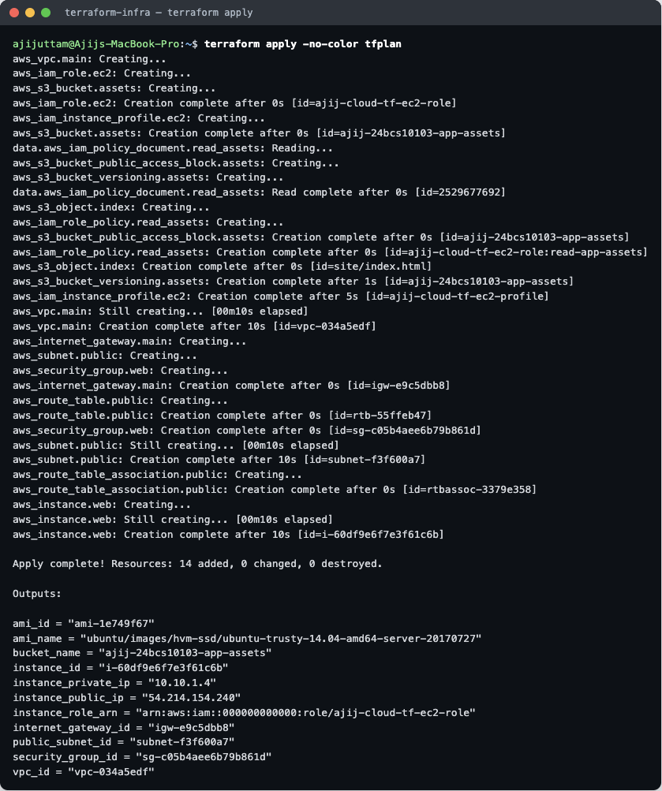

The order of the log shows the **dependency graph at work**:
- The independent roots start **in parallel**: `aws_vpc.main`, `aws_iam_role.ec2` and `aws_s3_bucket.assets`.
- The S3 children and the IAM policy follow as soon as the bucket exists.
- The IGW, subnet and security group wait for the VPC (`vpc-034a5edf`). The route table waits for the IGW, and the association waits for both the subnet and the route table.
- **`aws_instance.web` is created last** because it needs the subnet, SG, instance profile, AMI, bucket name (in user_data), and, through `depends_on`, the route-table association.

*Apply complete! Resources: 14 added, 0 changed, 0 destroyed.*

## 4. Terraform state — `state list` / `state show`

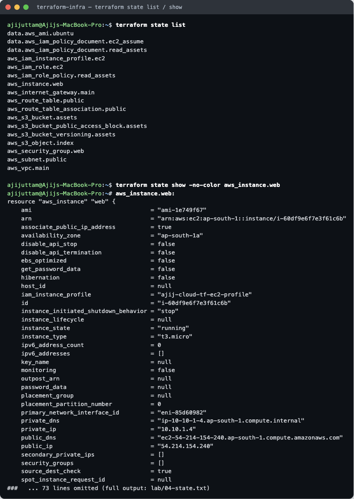

`terraform.tfstate` is Terraform's map from **addresses in the code** to **real IDs in AWS**. `state list` shows all 17 entries (14 resources + 3 data sources). `state show aws_instance.web` shows the real instance: `id = "i-60df9e6f7e3f61c6b"`, `instance_state = "running"`, `private_ip = "10.10.1.4"` (the first usable IP; AWS reserves .0–.3), `public_ip = "54.214.154.240"`, `iam_instance_profile = "ajij-cloud-tf-ec2-profile"`. `state show aws_route_table.public` confirms the route `0.0.0.0/0 → igw-e9c5dbb8`. Full output: [`lab/04-state.txt`](lab/04-state.txt).
Other state commands I would use in real projects: `state mv` (rename a resource without recreating it), `state rm` (stop managing something), `import` (adopt an existing resource), and a remote backend (S3 + locking) so a team shares one state.

## 5. `terraform output`

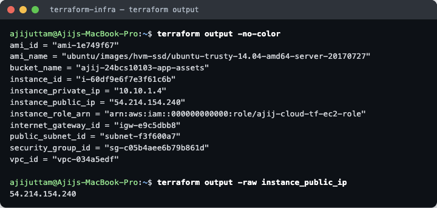

```
ami_id = "ami-1e749f67"
bucket_name = "ajij-24bcs10103-app-assets"
instance_id = "i-60df9e6f7e3f61c6b"
instance_private_ip = "10.10.1.4"
instance_public_ip = "54.214.154.240"
instance_role_arn = "arn:aws:iam::000000000000:role/ajij-cloud-tf-ec2-role"
internet_gateway_id = "igw-e9c5dbb8"
public_subnet_id = "subnet-f3f600a7"
security_group_id = "sg-c05b4aee6b79b861d"
vpc_id = "vpc-034a5edf"
```

## 6. AWS resources — verified with the AWS CLI

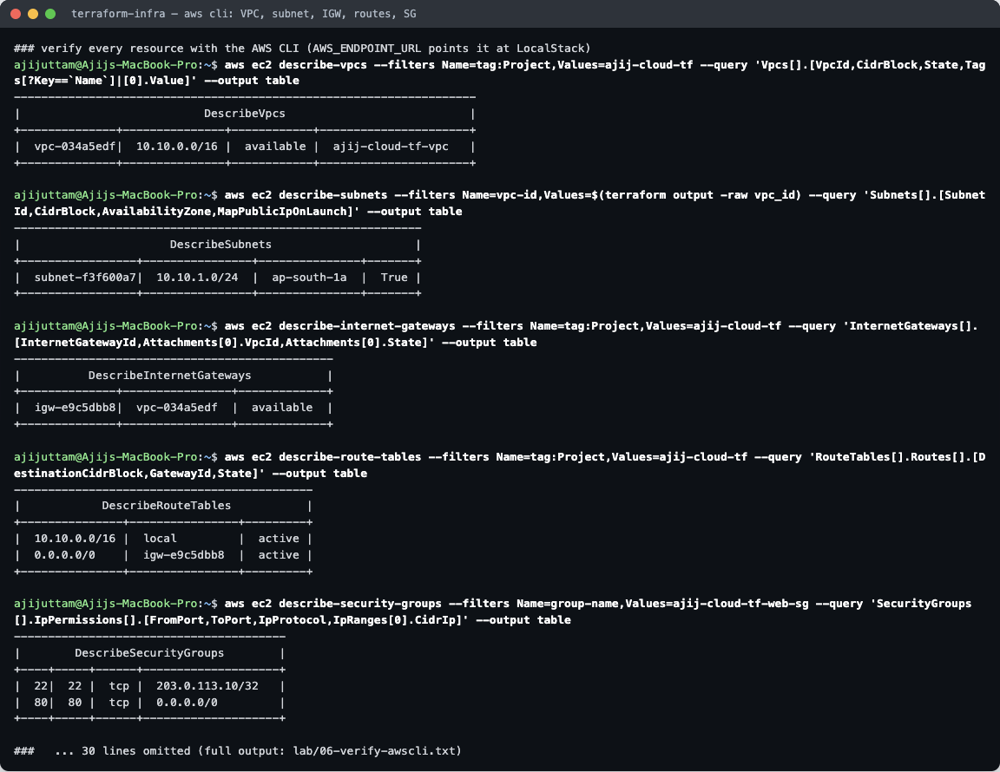
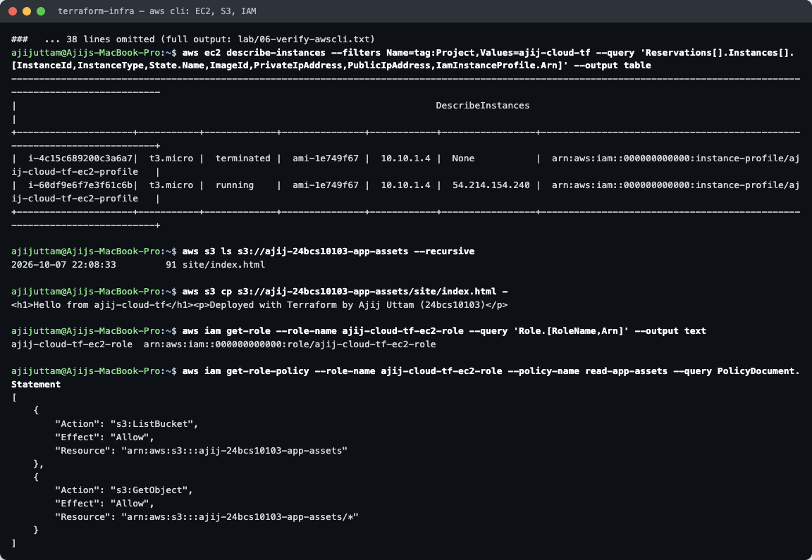

The AWS CLI talks to the cloud API directly (no Terraform involved) and confirms each resource:

| Resource | CLI evidence |
|---|---|
| VPC | `vpc-034a5edf`, `10.10.0.0/16`, `available`, Name `ajij-cloud-tf-vpc` |
| Subnet | `subnet-f3f600a7`, `10.10.1.0/24`, `ap-south-1a`, MapPublicIpOnLaunch `True` |
| Internet gateway | `igw-e9c5dbb8` attached to `vpc-034a5edf`, `available` |
| Route table | `10.10.0.0/16 → local`, `0.0.0.0/0 → igw-e9c5dbb8`, both `active` |
| Security group | `22/tcp` from `203.0.113.10/32`, `80/tcp` from `0.0.0.0/0` |
| EC2 | `i-60df9e6f7e3f61c6b`, `t3.micro`, **running**, `ami-1e749f67`, 10.10.1.4 / 54.214.154.240, instance profile attached |
| S3 | `site/index.html` (91 bytes), content printed |
| IAM | role `ajij-cloud-tf-ec2-role`. The policy allows only `s3:ListBucket` on the bucket and `s3:GetObject` on `bucket/*` (least privilege) |

The EC2 table also lists `i-4c15c689200c3a6a7  terminated`. That is the instance from my **previous full run** on the same LocalStack (I re-ran the whole script after a mistake, see below). Like real AWS, terminated instances stay visible for a while after `destroy`.

## 7. A second `plan` — a LocalStack quirk, found and fixed

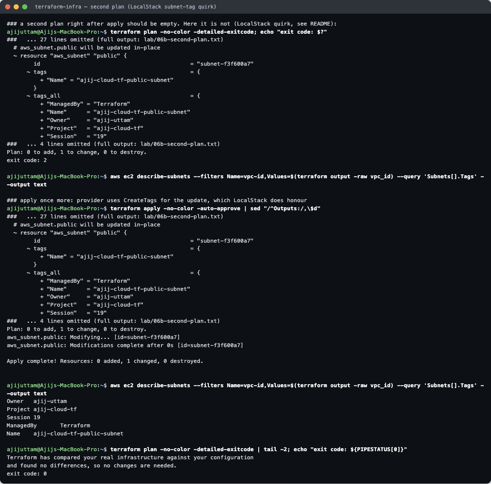

Right after apply, a second `plan` should say *No changes*. It did not: it wanted to **add the tags to `aws_subnet.public`** (exit code **2**), and `describe-subnets` showed **no tags** on the subnet. The provider sends the tags inside `CreateSubnet` (`TagSpecification.1.Tag.N` parameters, confirmed with `TF_LOG=debug`), and **LocalStack 4.0 drops them for subnets** (the VPC, IGW, route table and instance were found by their tags, so those were tagged correctly). One more `apply` adds them with `CreateTags`. After that the subnet has all 5 tags and `plan` is clean (exit code **0**). Real AWS honours the tags on create, so this extra apply would not be needed there. Full output: [`lab/06b-second-plan.txt`](lab/06b-second-plan.txt).

(A related LocalStack issue appeared in the [Terraform homework](../Terraform/README.md#problem-i-hit-provider-6x-and-localstack-tags): with provider 6.x, S3 bucket tags were dropped. That is why both projects pin `hashicorp/aws ~> 5.0`.)

## 8. Dependencies — `terraform graph`

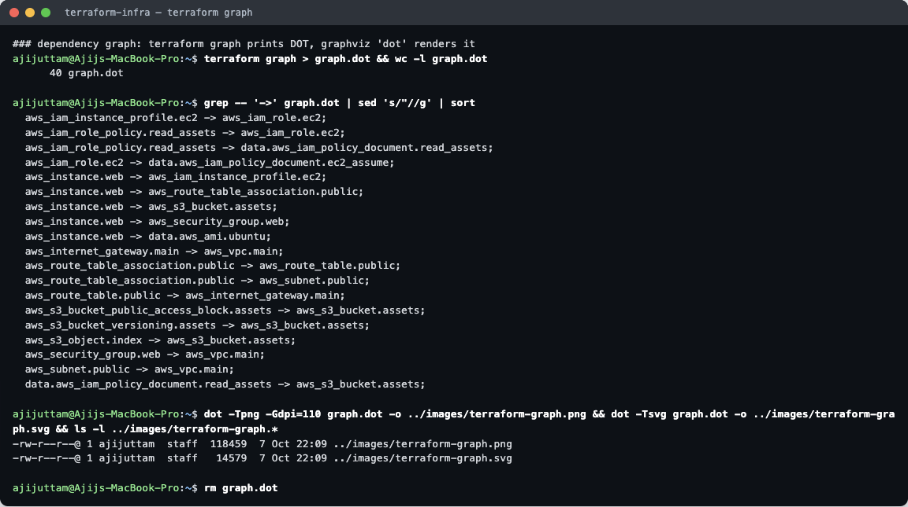

`terraform graph` prints the dependency graph in DOT format, and Graphviz's `dot` renders it ([SVG](images/terraform-graph.svg)):

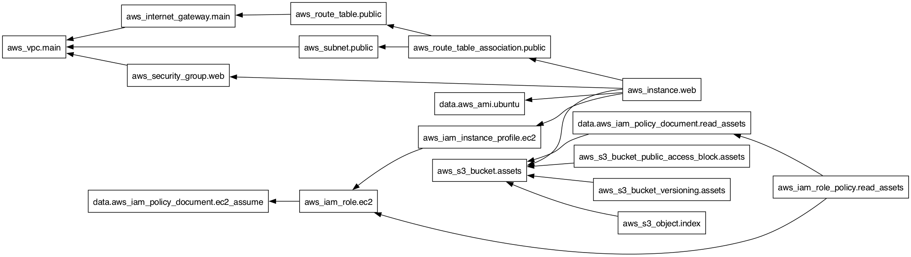

An arrow `A → B` means "A depends on B" (B is created first and destroyed last). Two kinds of dependency show up:
- **Implicit** (from references), which is almost all of them. For example, `vpc_id = aws_vpc.main.id` gives `aws_subnet.public → aws_vpc.main`, and the bucket ARN inside the policy document gives `data.aws_iam_policy_document.read_assets → aws_s3_bucket.assets`.
- **Explicit**: `aws_instance.web → aws_route_table_association.public` comes from `depends_on`. The instance never references the route table, but a public instance is useless until the subnet actually routes to the IGW, and Terraform cannot work that out on its own. `depends_on` is only for hidden dependencies like this; everything else should come from references.

Resources with no path between them (for example the VPC branch and the S3 branch) are created and destroyed **in parallel** (10 at a time by default, `-parallelism=N`).

## 9. `terraform destroy`

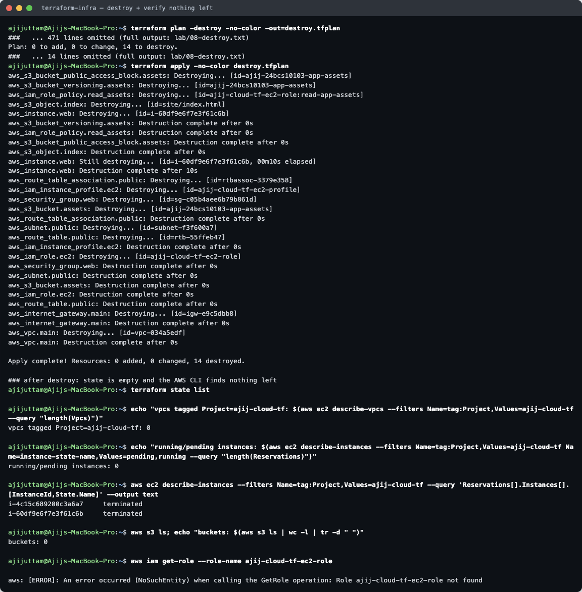

I ran it as `plan -destroy -out=destroy.tfplan` followed by `apply destroy.tfplan` (the same as `terraform destroy`, but reviewable first). *Plan: 0 to add, 0 to change, 14 to destroy.* The order is the **graph reversed**: S3 children, the IAM policy and the instance first; the instance (10 s) had to finish before the route-table association, SG and instance profile could go; the **VPC was deleted last**. *Apply complete! Resources: 0 added, 0 changed, 14 destroyed.*
Afterwards `terraform state list` is empty, there are 0 VPCs tagged `Project=ajij-cloud-tf`, 0 running instances, 0 buckets, and `get-role` returns `NoSuchEntity`.

---

## Terraform commands used

| Command | Purpose |
|---|---|
| `terraform init` | Download providers, create the lock file, set up the backend |
| `terraform fmt -check -recursive` | Check canonical formatting (CI-friendly, exit code ≠ 0 if not formatted) |
| `terraform validate` | Syntax and type check without calling the API |
| `terraform plan -out=tfplan` | Show and save the execution plan |
| `terraform plan -detailed-exitcode` | Exit 0 = no changes, 2 = changes pending (drift checks) |
| `terraform apply tfplan` | Apply exactly the reviewed plan |
| `terraform state list` / `state show <addr>` | Inspect state |
| `terraform output [-raw name]` | Read outputs |
| `terraform graph \| dot -Tpng` | Visualise dependencies |
| `terraform plan -destroy -out=…` + `apply` | Reviewed teardown (same as `terraform destroy`) |

## Problems I hit

1. **LocalStack image.** I pinned `localstack/localstack:4.0`, because current LocalStack images need an auth token and the 4.0 community tag does not.
2. **Subnet tags dropped by LocalStack** on create: found by the second plan and fixed by a second apply ([section 7](#7-a-second-plan--a-localstack-quirk-found-and-fixed)).
3. **Provider 6.x vs LocalStack S3 tags**, so I pinned `~> 5.0` (details in the Terraform homework).
4. **My own mistake:** while re-rendering only the graph, my helper script accidentally also ran the destroy step, which overwrote `08-destroy.txt` with an empty "No changes" plan. I re-ran the complete [`lab/run.sh`](lab/run.sh) so that every file in `lab/` comes from one consistent run. The leftover terminated instance from the first run is the one visible in section 6.

## Running it on real AWS

- `provider.tf`: keep only `region` and `default_tags`. Delete `access_key`/`secret_key = "test"`, the three `skip_*` flags, `s3_use_path_style` and the `endpoints {}` block, and authenticate with `aws configure` / `aws sso login` (or an IAM role in CI).
- Set `ssh_allowed_cidr` to your own `x.x.x.x/32` and pick a globally unique `bucket_name`. Optionally add `key_name` for SSH, or better, use SSM Session Manager.
- The AMI filter then picks the current Ubuntu image. `user_data` really runs, so `http://<instance_public_ip>` serves the page from S3.
- **Costs:** the t3.micro is Free-Tier eligible, but public IPv4 addresses are billed hourly. Run `terraform destroy` when finished.
- For a team: remote state in S3 with locking, and the provider can go back to `~> 6.0`.

## Files

```
Cloud_and_Terraform_in_Action/
├── README.md
├── terraform-infra/        versions.tf provider.tf variables.tf terraform.tfvars network.tf security.tf
│                           compute.tf storage.tf iam.tf outputs.tf .terraform.lock.hcl .gitignore
├── lab/                    run.sh + raw output 01-init-validate.txt … 09-after-destroy.txt
│   └── screens/            trimmed transcripts used for the screenshots
└── images/                 architecture.(png|svg|dot), terraform-graph.(png|svg), 01…10 terminal screenshots
```
