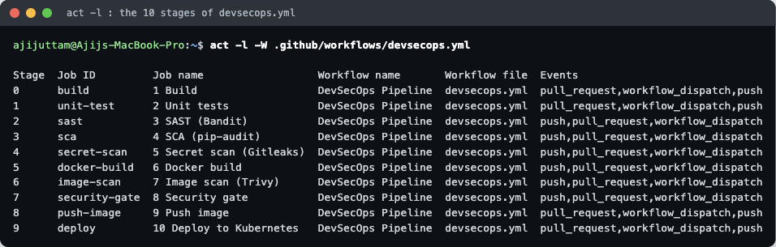
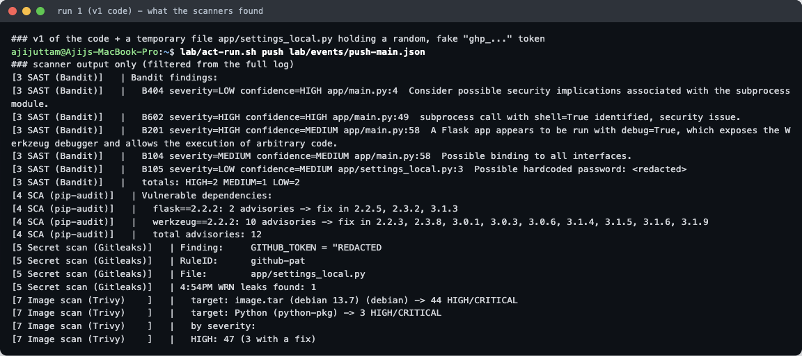
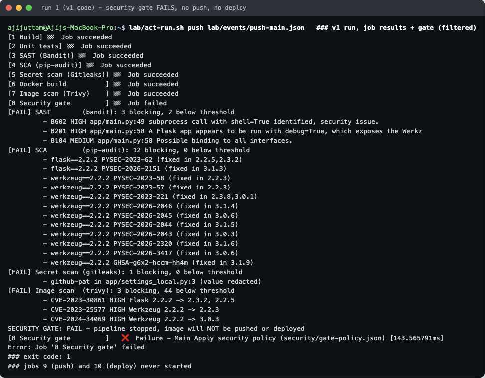
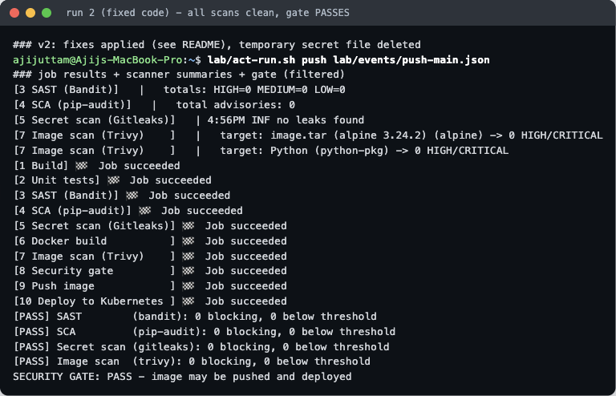
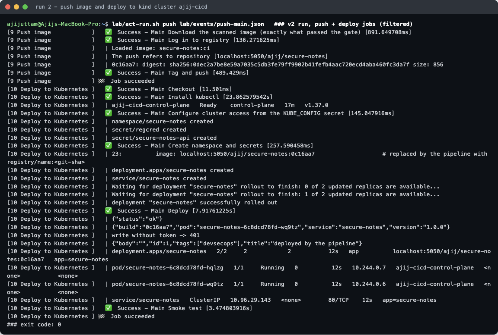
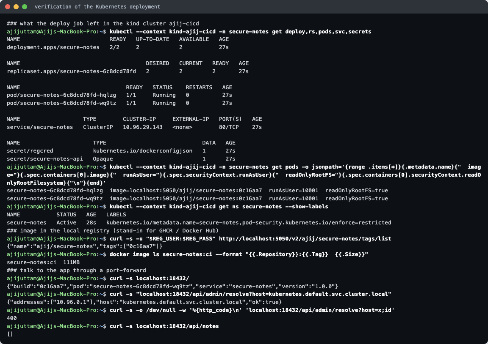
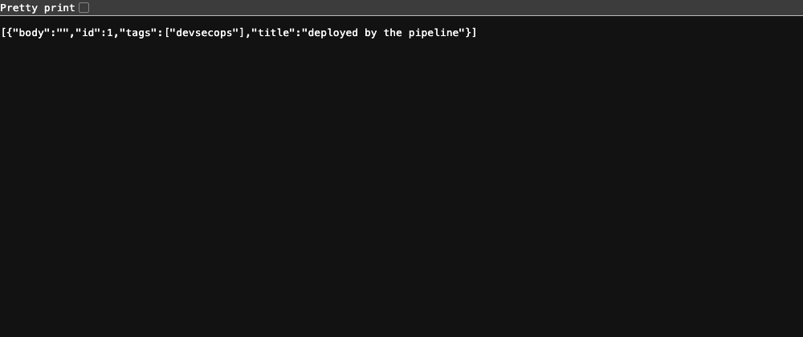
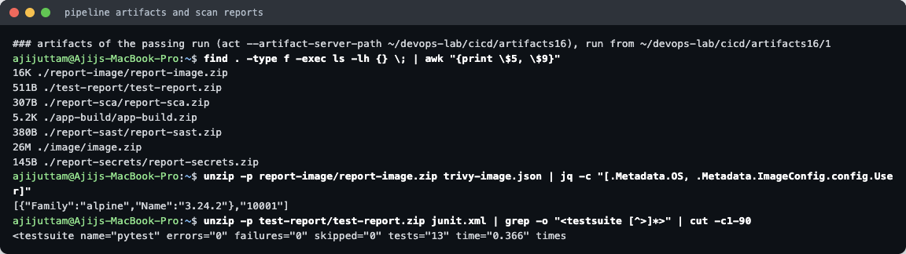
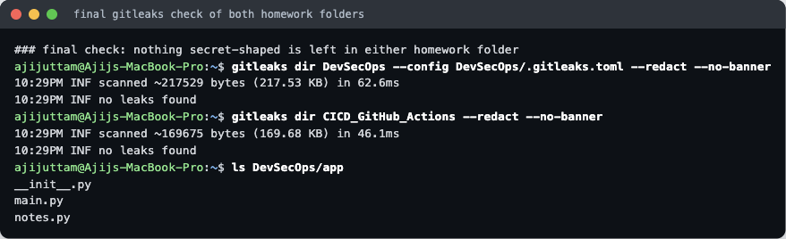

# Complete CI/CD & DevSecOps — Homework

**Name:** Ajij Uttam  **Enrollment No:** 24bcs10103

**Task:** build a complete CI/CD + DevSecOps pipeline: build, unit test, SAST, SCA, secret scan, Docker build, image scan, security gate, push to a registry, deploy to Kubernetes.

**What I built:** a Flask REST API called **Secure Notes** (13 unit tests). The pipeline, [`.github/workflows/devsecops.yml`](.github/workflows/devsecops.yml), has **10 jobs** in exactly the order the task asks for. All four scanners write JSON reports, and one **security-gate** job reads them and decides, against a policy file, whether the image may be pushed and deployed.

**How it was run:** the repo isn't on GitHub yet, so I ran the workflow locally with **act 0.2.89** (runner image `catthehacker/ubuntu:act-latest`, arm64). The registry is a password-protected `registry:2` container called **`ajij-registry`** on `localhost:5050`; on real GitHub it would be **GHCR**. The Kubernetes target is a **kind cluster `ajij-cicd`** (Kubernetes **v1.37.0**, kind v0.33.0).

I used the instructor's `DevSecOps/` folders (`04-sast` … `08-security-gates`, `demo/`) as the reference for which stages to have and how to chain them with `needs:`. The app, the gate script and policy, the tool configs, the manifests and the local setup are my own. Unlike the demo, I use Bandit instead of CodeQL, because CodeQL needs GitHub's backend and can't run under act.

**Result in two runs:**

| Run | Code | Gate | Push / Deploy |
|---|---|---|---|
| 1 | v1: shell-injection endpoint, `debug=True`, Flask/Werkzeug **2.2.2**, Debian-slim base, plus a temporary fake token | **FAIL**: SAST 3, SCA 12, secrets 1, image 3 blocking findings | **never ran** |
| 2 | v2: fixed code, Flask 3.1.3 / Werkzeug 3.1.9, Alpine base, token file deleted | **PASS**: 0 / 0 / 0 / 0 | image `localhost:5050/ajij/secure-notes:0c16aa7` pushed, **2/2 pods** rolled out |

---

## 1. The pipeline

```
Code ─▶ 1 Build ─▶ 2 Unit tests ─▶ 3 SAST ─▶ 4 SCA ─▶ 5 Secret scan ─▶ 6 Docker build ─▶ 7 Image scan
                                  (Bandit)  (pip-audit)  (Gitleaks)       (docker save →     (Trivy on the
                                     │          │            │             artifact)          saved image)
                                     └──────────┴─── JSON reports as artifacts ───────────────────┘
                                                              ▼
                                              8 Security gate (security/gate.py + gate-policy.json)
                                                 FAIL → stop       PASS ▼
                                              9 Push image (only push to main) ─▶ 10 Deploy to Kubernetes
```



| # | Job | What it does | Tool / version |
|---|---|---|---|
| 1 | Build | install deps, `compileall`, import check, tarball → artifact `app-build` | Python 3.12 |
| 2 | Unit tests | `pytest --cov`, JUnit report → artifact `test-report`. A failure stops everything. | pytest 8.4.2 |
| 3 | SAST | Static analysis of `app/` → `bandit.json` | Bandit 1.8.6 |
| 4 | SCA | Checks `requirements.txt` against the PyPI / OSV advisory DB → `pip-audit.json` | pip-audit 2.9.0 |
| 5 | Secret scan | ~200 built-in rules over the whole source tree, **`--redact`** so no secret is ever printed → `gitleaks.json` | Gitleaks 8.30.1 |
| 6 | Docker build | builds the image, `docker save` → artifact `image` (on GitHub, each job is a fresh VM) | Docker |
| 7 | Image scan | scans OS packages **and** Python packages inside the saved image → `trivy-image.json` | Trivy 0.75.0 |
| 8 | **Security gate** | downloads every `report-*` artifact, applies the policy, exits 1 on violations. Fails closed: a missing report counts as FAIL. | own script |
| 9 | Push image | loads the **same tarball that was scanned**, tags `<registry>/ajij/secure-notes:<sha>`, pushes. `if: push to main` | Docker |
| 10 | Deploy | kubectl from the `KUBE_CONFIG` secret → namespace, `regcred` + app-token Secrets → Deployment + Service → `rollout status` → smoke test | kubectl v1.37.0 |

**Why the scanners only report and the gate decides:** if every scanner failed its own job, a developer would fix SAST, push, and only then find out about SCA, then the secret, then the image. With report-only scanners plus one gate, **one run lists every problem**, and the policy lives in one reviewable file instead of four sets of CLI flags.

### Security tool configuration (committed)

| File | Purpose |
|---|---|
| [`bandit.yaml`](bandit.yaml) | SAST scope: `app/` only, excludes `tests/` and `lab/`, no rules skipped |
| [`.gitleaks.toml`](.gitleaks.toml) | extends the default Gitleaks rules. The only allowlist is `reports/` (scanner output, never committed). |
| [`trivy.yaml`](trivy.yaml) | image scan: `HIGH,CRITICAL`, vuln scanner, keep unfixed CVEs visible, `exit-code: 0` (the gate decides) |
| [`.trivyignore`](.trivyignore) | accepted-risk list. **Empty**, with the format documented (CVE + reason + expiry). |
| [`security/gate-policy.json`](security/gate-policy.json) | **the policy:** SAST blocks HIGH+MEDIUM (confidence ≥ MEDIUM). SCA blocks any advisory. Secrets: 0 allowed. Image: blocks CRITICAL+HIGH **that have a fix**. |
| [`security/gate.py`](security/gate.py) | reads the 4 reports, prints PASS/FAIL per check, writes a table to `$GITHUB_STEP_SUMMARY`, exits 1 on FAIL |
| [`security/bandit-summary.jq`](security/bandit-summary.jq) | prints Bandit findings in one line each, **redacting quoted values** (see the note in section 3) |

Kubernetes hardening is in the manifests too: the namespace enforces Pod Security **`restricted`**, and the pods run as UID 10001 with a read-only root filesystem, `drop: ALL` capabilities and the RuntimeDefault seccomp profile. The API token comes from a Secret, and image pulls use `imagePullSecrets`.

---

## 2. Setup (local stand-ins for GitHub, GHCR and a real cluster)

```bash
# registry (same container as assignment 15): registry:2 + htpasswd, user ajij-demo / fake-demo-pass-123
kind create cluster --config lab/kind-config.yaml     # cluster "ajij-cicd", containerd reads /etc/containerd/certs.d
lab/setup-cluster-registry.sh                          # connect ajij-registry to the kind network and
                                                       # mirror localhost:5050 → http://ajij-registry:5000 inside the node
lab/act-run.sh push lab/events/push-main.json          # run the pipeline
```

With this setup the image name `localhost:5050/ajij/secure-notes:<sha>` works in both places: for the Docker daemon (push) and inside the kind node (pull). The pull still needs the `regcred` secret, because the registry requires a password.

[`lab/act-run.sh`](lab/act-run.sh) passes the "GitHub settings" to act:

- `--var REGISTRY=localhost:5050`, `--var IMAGE_NAMESPACE=ajij`
- secrets `REGISTRY_USERNAME`, `REGISTRY_PASSWORD` and `APP_API_TOKEN`: all **fake demo values**
- `KUBE_CONFIG="$(kind get kubeconfig --name ajij-cicd | base64)"`: generated at run time for the throwaway cluster, never written to the repo and masked in logs
- `--artifact-server-path ~/devops-lab/cicd/artifacts16`, `--network host`, `--action-offline-mode`

---

## 3. Run 1 — the security gate blocks (real findings)

The v1 code (saved in [`lab/v1/`](lab/v1) as `main.py.txt`, `requirements.v1`, `Dockerfile.v1`, renamed so no tool mistakes them for live files) had three real problems:

- `/api/admin/ping` ran `subprocess.run(f"ping -c 1 {host}", shell=True)`, which is **command injection**: `?host=x;cat /etc/passwd` would run the second command.
- `app.run(host="0.0.0.0", debug=True)` exposes the Werkzeug debugger.
- `requirements.txt` pinned **Flask 2.2.2 / Werkzeug 2.2.2**, and the image used `python:3.12-slim` (Debian 13).

**About the secret:** to prove the secret scanner works, I created a temporary, untracked file `app/settings_local.py` before this run. It held a variable with a `ghp_` + 36 **random characters** value, so it has the shape of a GitHub token but is **not a real credential**. I deleted it right after the run. It was never committed, and every tool printed it redacted.





```
[FAIL] SAST        (bandit): 3 blocking, 2 below threshold
         - B602 HIGH app/main.py:49 subprocess call with shell=True identified, security issue.
         - B201 HIGH app/main.py:58 A Flask app appears to be run with debug=True, ...
         - B104 MEDIUM app/main.py:58 Possible binding to all interfaces.
[FAIL] SCA         (pip-audit): 12 blocking, 0 below threshold        ← 2 Flask + 10 Werkzeug advisories
[FAIL] Secret scan (gitleaks): 1 blocking, 0 below threshold
         - github-pat in app/settings_local.py:3 (value redacted)
[FAIL] Image scan  (trivy): 3 blocking, 44 below threshold
         - CVE-2023-30861 HIGH Flask 2.2.2 -> 2.3.2, 2.2.5
         - CVE-2023-25577 HIGH Werkzeug 2.2.2 -> 2.2.3
         - CVE-2024-34069 HIGH Werkzeug 2.2.2 -> 3.0.3
SECURITY GATE: FAIL - pipeline stopped, image will NOT be pushed or deployed
Error: Job '8 Security gate' failed
```

Jobs 9 and 10 never started. Nothing reached the registry or the cluster. Full log: [`lab/run1-blocked.log.txt`](lab/run1-blocked.log.txt).

**What the numbers mean:**

- **SAST below threshold (2):** B404 LOW ("subprocess module imported") and B105 LOW. B105 is Bandit noticing the fake token as a "hardcoded password". Both LOW, so they are reported but don't block.
- **Image "44 below threshold":** 44 HIGH CVEs in Debian packages of `python:3.12-slim` that have **no fixed version yet**. Blocking on those would block every build with nothing to upgrade to, so the policy only blocks CVEs that have a fix. I still moved the image to Alpine in v2 (see below). The 3 blocking ones are the same vulnerable Flask/Werkzeug that SCA found: Trivy found them again inside the built image.

**A problem I hit and fixed:** in my first attempt at this run, Bandit's B105 message quoted the token value, and my `jq` one-liner printed `issue_text` as-is, so the fake token appeared in clear text in the job log. That attempt also failed for an unrelated reason: act timed out while re-cloning `actions/download-artifact` from GitHub. I deleted that log and fixed both problems:

- Bandit output now goes through [`security/bandit-summary.jq`](security/bandit-summary.jq), and `gate.py` has a `redact()` helper. Both replace any quoted value of 8+ characters with `<redacted>`.
- act now runs with `--action-offline-mode`.

The log above is the re-run. It contains **no `ghp_` value** (checked with `grep`).

---

## 4. The fixes (v1 → v2)

| Finding | Fix |
|---|---|
| B602 shell injection | Replaced `/api/admin/ping` with `/api/admin/resolve`: the host name is validated with a regex, then resolved with `socket.getaddrinfo`. No shell, no subprocess. New tests: `?host=example.com;cat /etc/passwd` → **400**. |
| B201 debug + B104 0.0.0.0 | The `__main__` block now runs `127.0.0.1` without debug, for local development only. The container runs **gunicorn**. |
| SCA (12) + image Python CVEs (3) | `Flask==3.1.3`, `Werkzeug==3.1.9` (the highest fix version pip-audit listed) |
| 44 unfixed Debian HIGHs | Base image `python:3.12-slim` → **`python:3.12-alpine`** (Alpine 3.24.2): **0** HIGH/CRITICAL. I checked both bases with Trivy before switching. |
| Fake token | Temporary file deleted |

```diff
-        out = subprocess.run(f"ping -c 1 {host}", shell=True, capture_output=True, text=True)
-        return jsonify(host=host, ok=out.returncode == 0)
+        if not HOSTNAME_RE.match(host):
+            return jsonify(error="invalid host name"), 400
+        try:
+            addrs = sorted({info[4][0] for info in socket.getaddrinfo(host, None)})
...
-    app.run(host="0.0.0.0", port=8080, debug=True)
+    app.run(host="127.0.0.1", port=8080)
```

---

## 5. Run 2 — gate passes, image pushed, deployed to Kubernetes



```
SAST totals: HIGH=0 MEDIUM=0 LOW=0 · SCA total advisories: 0 · Gitleaks: no leaks found
Trivy: image.tar (alpine 3.24.2) -> 0 HIGH/CRITICAL · Python (python-pkg) -> 0 HIGH/CRITICAL
SECURITY GATE: PASS - image may be pushed and deployed
```



- **Push:** `Loaded image: secure-notes:ci` → `0c16aa7: digest: sha256:0dec2a7b…`. The pushed image is the exact tarball that Trivy scanned, not a rebuild.
- **Deploy:** namespace + `regcred` + `secure-notes-api` Secrets created. `image:` replaced with `localhost:5050/ajij/secure-notes:0c16aa7`. `deployment "secure-notes" successfully rolled out`.
- **Smoke test** through `kubectl port-forward`: `/health` ok, a write without the token → **401**, a write with the token (from the Secret) → **201**.

Full log: [`lab/run2-pass-deploy.log.txt`](lab/run2-pass-deploy.log.txt) (`### exit code: 0`). All 10 jobs succeeded and the unit-test job reported 13 tests at 93% coverage.

### Verifying the deployment



```
deployment.apps/secure-notes   2/2     2            2
pod/...-hqlzg  image=localhost:5050/ajij/secure-notes:0c16aa7  runAsUser=10001  readOnlyRootFS=true
namespace secure-notes  labels: pod-security.kubernetes.io/enforce=restricted
registry tags: {"name":"ajij/secure-notes","tags":["0c16aa7"]}
/api/admin/resolve?host=kubernetes.default.svc.cluster.local → {"addresses":["10.96.0.1"],"ok":true}
/api/admin/resolve?host=x;id → 400
```

The notes list was `[]` in that check because `port-forward` attached to the *other* pod. Notes are stored in memory per pod, which is fine for a demo but would need a database in a real app.



### Artifacts and final secret check



Run 2 produced 7 artifacts: `app-build`, `test-report` (13 tests, 0 failures), `report-sast`, `report-sca`, `report-secrets`, `image` (26 MB zipped) and `report-image` (Alpine 3.24.2, user `10001`).



`gitleaks dir` over **both** homework folders reports `no leaks found`, and `app/` holds only `__init__.py`, `main.py` and `notes.py`.

---

## 6. Activating it on real GitHub

1. Move `.github/workflows/devsecops.yml` to the repository root's `.github/workflows/`. If the app isn't at the repo root, add `defaults.run.working-directory` or move the app.
2. Secrets:
   - `REGISTRY_USERNAME` / `REGISTRY_PASSWORD` (GHCR: your user + a PAT with `write:packages`, or log in with `GITHUB_TOKEN`)
   - `APP_API_TOKEN`
   - `KUBE_CONFIG` (base64 kubeconfig of a cluster the runner can reach, e.g. EKS/GKE/AKS)
3. Variable `REGISTRY` only if not GHCR. Add required reviewers to the `production` environment for a manual approval before deploy.
4. Optional upgrades that need GitHub's backend: upload Trivy/Bandit SARIF to the *Security* tab, turn on GitHub secret scanning **push protection**, and scan git history with `gitleaks git` (checkout already uses `fetch-depth: 0`).

Under act, `actions/checkout` copies the working folder instead of cloning. That is why the secret scan uses `gitleaks dir` (files on disk) rather than `gitleaks git` (history).

## 7. Clean-up

```bash
kind delete cluster --name ajij-cicd
docker rm -f ajij-registry
docker rmi secure-notes:ci localhost:5050/ajij/secure-notes:0c16aa7
rm -rf ~/devops-lab/cicd/artifacts16
```
