# Final DevOps Project & Troubleshooting — Homework

**Name:** Ajij Uttam  **Enrollment No:** 24bcs10103

**Project:** **CampusDesk**, an IT helpdesk for a college campus (React UI + FastAPI API + PostgreSQL). It goes through the full path from the session 21 spec, and every step was run for real on my laptop:

```text
Application → Git → (GitHub) → CI pipeline → Build & Test → Security scanning → Docker image
  → Container registry → Kubernetes → Helm → Monitoring → GitOps          + Terraform for the cloud infrastructure
```

* The project itself is in [`final-devops-project/`](final-devops-project/), using exactly the folder layout from the spec. Its own [README](final-devops-project/README.md) explains how to run each part.
* `lab/` has every script I ran and the raw output (`*.txt`, `*.log.txt`). `images/` has the screenshots.
* **Provided material used:** the instructor's `session21-python` TaskBoard project (FastAPI/React/Helm/Terraform/monitoring sample plus `troubleshooting/broken-image.yaml` and `broken-service.yaml`). I built on its architecture but changed the domain to a helpdesk, rewrote the code, chart, pipeline and Terraform in my own way, and fixed the parts that did not work. The list is in [What I changed from the sample](#what-i-changed-from-the-sample).

**Environment (all local, nothing in a paid cloud):** macOS arm64, Docker 29.5 (Colima), minikube 1.39 profile `final` (Kubernetes **v1.37.0**, containerd, 3 CPU / 4 GB, addons ingress + metrics-server), Helm 4.3.0, kubectl 1.37.1, act 0.2.89, Terraform 1.16.4 + hashicorp/aws 5.100.0, LocalStack 4.0.3 (community), Trivy 0.75.0, Gitleaks 8.30.1, Argo CD v3.5.4, kube-prometheus-stack 92.1.0, Gitea 1.24.6.

Stand-ins for things that need an account: **GitHub** → a Gitea server running inside the cluster plus `act` to run the GitHub Actions workflow; **GHCR** → a `registry:2` container `ajij-final-registry` on `localhost:5060`; **AWS** → LocalStack container `ajij-final-localstack`; **EKS** → minikube. The workflow and Terraform switch to the real services with one variable (`REGISTRY`, `localstack_endpoint`).

---

## Contents

1. [Project overview](#1-project-overview)
2. [Architecture diagram](#2-architecture-diagram)
3. [Technologies used](#3-technologies-used)
4. [Application setup](#4-application-setup)
5. [Docker setup](#5-docker-setup)
6. [CI/CD pipeline](#6-cicd-pipeline)
7. [DevSecOps implementation](#7-devsecops-implementation)
8. [Kubernetes deployment](#8-kubernetes-deployment)
9. [Helm deployment](#9-helm-deployment)
10. [Terraform infrastructure](#10-terraform-infrastructure)
11. [Monitoring](#11-monitoring)
12. [GitOps](#12-gitops)
13. [Troubleshooting](#troubleshooting)
14. [Screenshots](#14-screenshots)
15. [What I changed from the sample](#what-i-changed-from-the-sample)
16. [Cleanup](#16-cleanup)

---

## 1. Project overview

Students and staff raise tickets ("Lab 3 printer jammed", "Wi-Fi drops on Library 2nd floor"); the IT team moves them **Open → In progress → Resolved**. The UI shows KPI cards, a filterable ticket table, a "Raise a ticket" form and a banner text that comes from Kubernetes config.

| Part | Details |
|---|---|
| Backend | FastAPI, SQLAlchemy 2.1, Alembic migration `0001_create_tickets`, 10 endpoints incl. full CRUD on `/api/tickets`, `/health` (liveness), `/ready` (DB check, 503 when down), `/metrics` |
| Frontend | React 19 + Vite 8, same-origin calls to `/api` |
| Database | PostgreSQL 17 on a PVC |
| Tests | **12** pytest tests, **98%** coverage, SQLite test DB (never the real DB) |

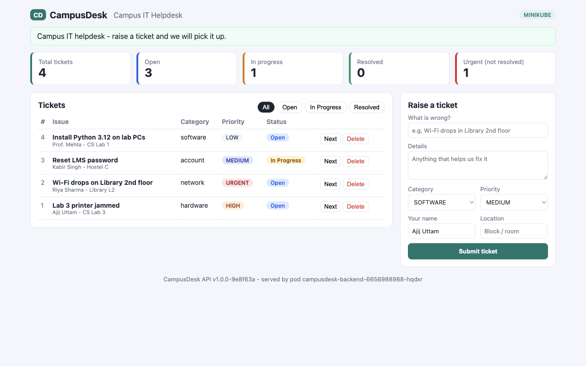

## 2. Architecture diagram

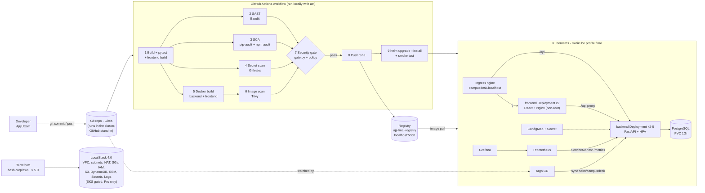
```mermaid
flowchart LR
  dev["Developer<br/>Ajij Uttam"] -->|git commit / push| git[("Git repo - Gitea<br/>(runs in the cluster,<br/>GitHub stand-in)")]
  git --> ci

  subgraph ci["GitHub Actions workflow (run locally with act)"]
    direction TB
    bt["1 Build + pytest<br/>+ frontend build"] --> sast["2 SAST<br/>Bandit"]
    bt --> sca["3 SCA<br/>pip-audit + npm audit"]
    bt --> sec["4 Secret scan<br/>Gitleaks"]
    bt --> db["5 Docker build<br/>backend + frontend"] --> scan["6 Image scan<br/>Trivy"]
    sast & sca & sec & scan --> gate{"7 Security gate<br/>gate.py + policy"}
    gate -->|pass| push["8 Push :sha"]
    push --> dep["9 helm upgrade --install<br/>+ smoke test"]
  end

  push --> reg[("Registry<br/>ajij-final-registry<br/>localhost:5060")]

  subgraph k8s["Kubernetes - minikube profile final"]
    direction TB
    ing["Ingress nginx<br/>campusdesk.localhost"] -->|/| fe["frontend Deployment x2<br/>React + Nginx (non-root)"]
    ing -->|/api| be["backend Deployment x2-5<br/>FastAPI + HPA"]
    fe -->|/api proxy| be
    be --> pg[("PostgreSQL<br/>PVC 1Gi")]
    cm["ConfigMap + Secret"] -.-> be
    prom["Prometheus"] -->|ServiceMonitor /metrics| be
    graf["Grafana"] --> prom
    argo["Argo CD"] -->|sync helm/campusdesk| be
  end

  dep --> k8s
  reg -->|image pull| k8s
  git -. watched by .-> argo

  tf["Terraform<br/>hashicorp/aws ~> 5.0"] --> ls[("LocalStack 4.0<br/>VPC, subnets, NAT, SGs, IAM,<br/>S3, DynamoDB, SSM, Secrets, Logs<br/>(EKS gated: Pro only)")]
```

Rendered with Mermaid 11 (source [`lab/architecture.mmd`](lab/architecture.mmd)): [`images/architecture.svg`](images/architecture.svg)

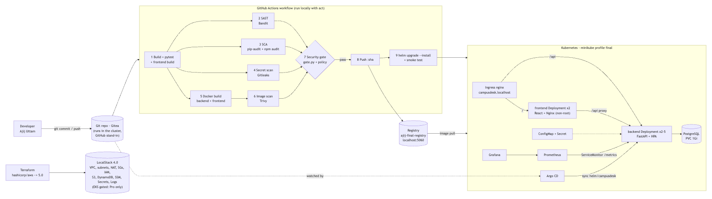

**How a change travels:** commit → the workflow tests, scans and builds → the security gate decides → the exact scanned images are pushed with the commit SHA as tag → Helm rolls them out → Prometheus scrapes the new pods. In GitOps mode Argo CD applies whatever is on `main` in Git instead of the pipeline running Helm.

## 3. Technologies used

| Area | Tool (version) | Used for |
|---|---|---|
| App | Python 3.12, FastAPI 0.142, SQLAlchemy 2.1, Alembic 1.20, React 19.3, Vite 8.3 | the application |
| Tests | pytest 8.4, pytest-cov 7.0 | unit/API tests |
| Containers | Docker 29.5 (Colima), docker-compose 5.6 | images + local stack |
| CI/CD | GitHub Actions syntax, act 0.2.89 | 9-job pipeline |
| Security | Bandit 1.8.6, pip-audit 2.9.0, npm audit, Gitleaks 8.30.1, Trivy 0.75.0 | SAST, SCA, secrets, image scan |
| Registry | registry:2 | image storage (GHCR on GitHub) |
| Kubernetes | minikube 1.39, Kubernetes 1.37, ingress-nginx 1.15.1, metrics-server | runtime |
| Packaging | Helm 4.3.0 | chart `campusdesk` |
| IaC | Terraform 1.16.4, hashicorp/aws 5.100.0, LocalStack 4.0.3 | cloud infrastructure |
| Monitoring | kube-prometheus-stack 92.1.0 (Prometheus, Grafana, kube-state-metrics) | metrics, dashboard |
| GitOps | Argo CD 3.5.4, Gitea 1.24.6 | pull-based deployment |

## 4. Application setup

Script: [`lab/01-app-local.sh`](lab/01-app-local.sh), output: [`lab/01-app-local.txt`](lab/01-app-local.txt).

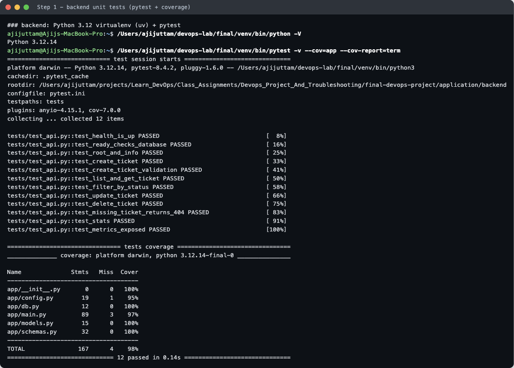

```
tests/test_api.py::test_health_is_up PASSED                              [  8%]
...
tests/test_api.py::test_metrics_exposed PASSED                           [100%]
TOTAL               167      4    98%
============================== 12 passed in 0.14s ==============================
```

* The tests run against a temporary **SQLite** file (`tests/conftest.py` sets `DATABASE_URL` before the app is imported) and recreate the tables for every test, so tests never touch PostgreSQL and do not depend on each other.
* They cover every endpoint: health/ready, CRUD, validation (422 for a 1-letter title or priority `PANIC`), 404s, the status filter, the stats numbers and the custom Prometheus counter.
* The frontend is installed with `npm ci` from `package-lock.json` (exact versions) and built by Vite into a 225 kB JS bundle.

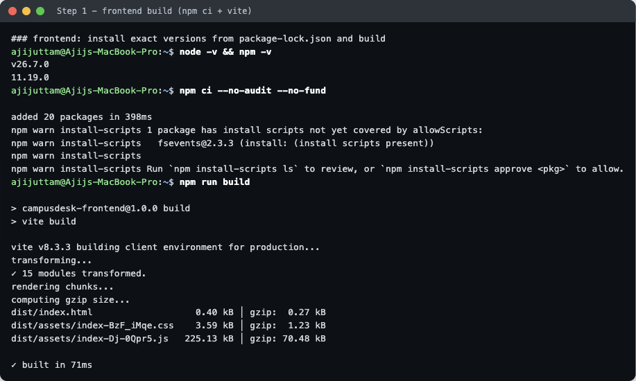

## 5. Docker setup

Files: [`docker/backend.Dockerfile`](final-devops-project/docker/backend.Dockerfile), [`docker/frontend.Dockerfile`](final-devops-project/docker/frontend.Dockerfile), [`docker/nginx/default.conf.template`](final-devops-project/docker/nginx/default.conf.template), [`docker/docker-compose.yml`](final-devops-project/docker/docker-compose.yml). Output: [`lab/02-docker-compose.txt`](lab/02-docker-compose.txt).

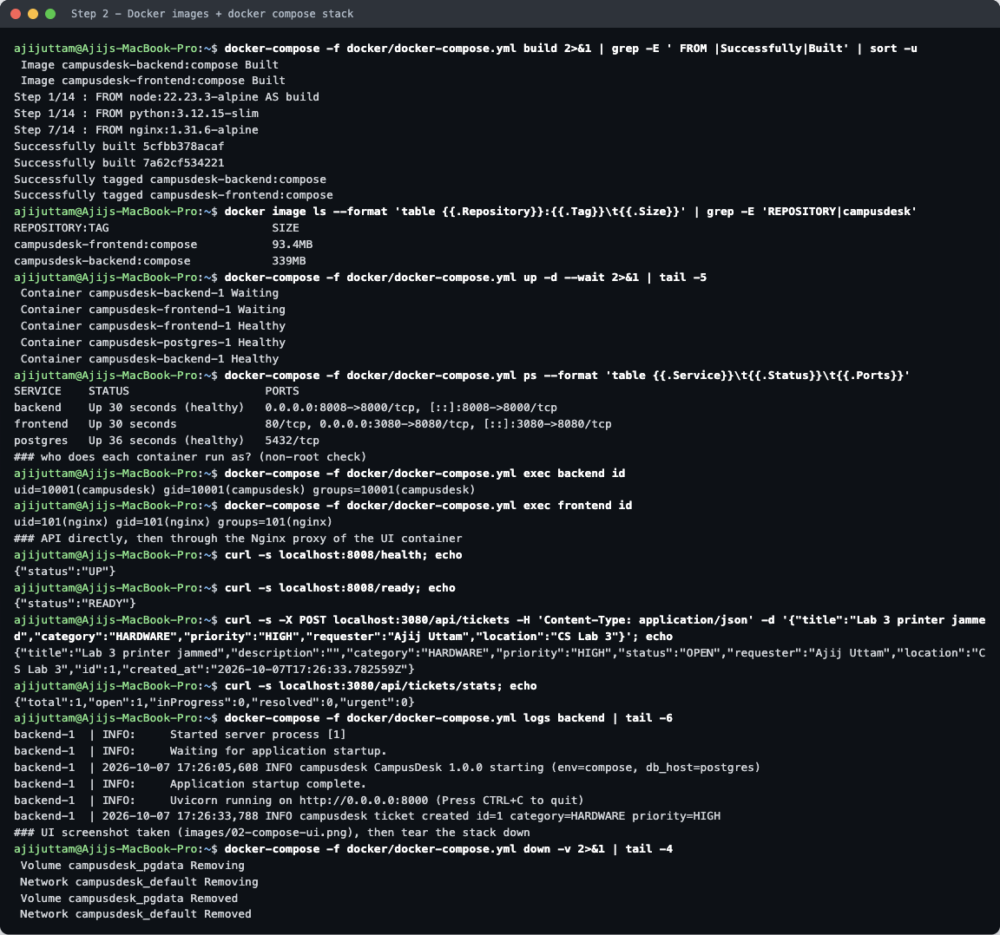

```
SERVICE    STATUS                    PORTS
backend    Up 30 seconds (healthy)   0.0.0.0:8008->8000/tcp, [::]:8008->8000/tcp
frontend   Up 30 seconds             80/tcp, 0.0.0.0:3080->8080/tcp, [::]:3080->8080/tcp
postgres   Up 36 seconds (healthy)   5432/tcp
$ docker-compose -f docker/docker-compose.yml exec backend id
uid=10001(campusdesk) gid=10001(campusdesk) groups=10001(campusdesk)
$ docker-compose -f docker/docker-compose.yml exec frontend id
uid=101(nginx) gid=101(nginx) groups=101(nginx)
```

* **Backend** (339 MB): `python:3.12.15-slim`, dependencies first (better layer cache), non-root uid 10001, Docker `HEALTHCHECK`, starts with `alembic upgrade head && exec uvicorn` so the schema is migrated and uvicorn is PID 1.
* **Frontend** (95 MB): **multi-stage**. Stage 1 `node:22.23.3-alpine` runs `npm ci && npm run build`; stage 2 `nginx:1.31.6-alpine` only gets `dist/`, so no Node or `node_modules` ship. Nginx runs as uid 101 on port 8080 (the `user` line and root-only pid path are removed).
* The Nginx config is a **template**: `/api/` is proxied to `${BACKEND_URL}` (`http://backend:8000` in Compose, the Kubernetes Service name in the cluster). The browser only talks to one origin.
* Compose waits for PostgreSQL's healthcheck before starting the backend. A ticket created through the UI container's proxy (`localhost:3080/api/tickets`) came back with `"id":1`.

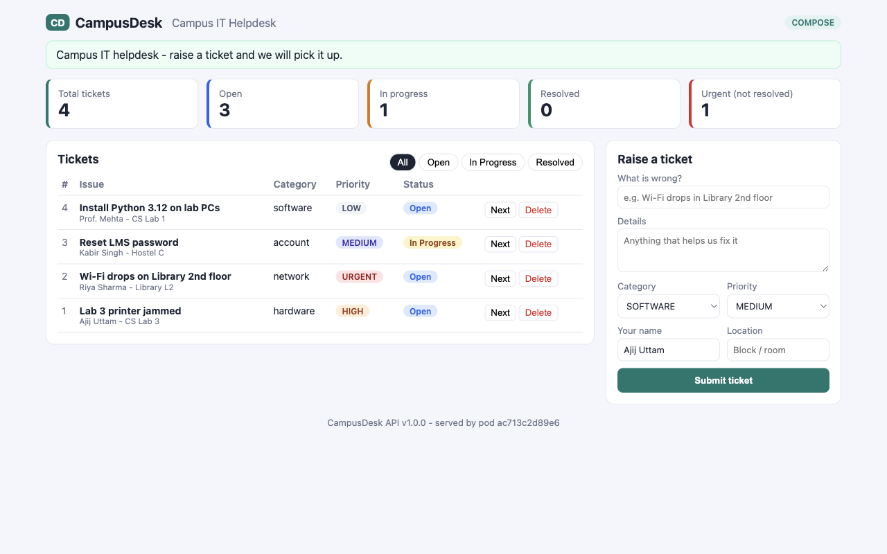

Note: this Docker install had no `compose`/`buildx` plugin, so I installed the standalone `docker-compose` with Homebrew. It builds with the classic builder, which is why the build output shows `Step 1/14 : ...`.

## 6. CI/CD pipeline

Workflow: [`.github/workflows/ci-cd.yml`](final-devops-project/.github/workflows/ci-cd.yml). The Git working copy is `~/devops-lab/final/ws` (copied from `final-devops-project/` by [`lab/sync-workspace.sh`](lab/sync-workspace.sh)), and every commit is authored by **Ajij Uttam**. The workflow runs with [`lab/act-run.sh`](lab/act-run.sh):

```bash
act push -W .github/workflows/ci-cd.yml -P ubuntu-latest=catthehacker/ubuntu:act-latest --pull=false \
  --network host --artifact-server-path ~/devops-lab/final/artifacts \
  --var REGISTRY=localhost:5060 --var IMAGE_NAMESPACE=ajij -s KUBE_CONFIG=<base64 kubeconfig, generated at run time>
# runs 2-4 add --action-offline-mode (actions cached from run 1)
```

`--network host` puts the job containers on the Colima VM network, so they can reach the registry and the minikube API server (`192.168.49.2:8443`). The kubeconfig is only passed as a secret and is never written to the repo. Logs are run without `-v`, so they contain no runtime token. Gitleaks over `lab/` confirms this.

```text
1 build-test ──┬─ 2 sast ────────┐
               ├─ 3 sca ─────────┤
               ├─ 4 secret-scan ─┼─ 7 security-gate ─ 8 push ─ 9 deploy (helm)
               └─ 5 docker-build ─ 6 image-scan ─┘
```

**Four real runs** (commit SHAs from [`lab/git-log.txt`](lab/git-log.txt)):

| Run | Commit | Result | Why |
|---|---|---|---|
| 1 | `4366876` | **blocked at 7 Security gate** | Trivy found 2 fixable HIGH CVEs in the Nginx base image |
| 2 | `7e3ff63` | gate passed, images pushed, **9 Deploy failed** at the smoke test (HTTP 503) | the ingress controller had not picked up the new endpoints yet; backend also restarted twice (DB not ready) |
| 3 | `1c7d093` | **9 Deploy failed**, `helm upgrade` timed out after 5 min | my new `wait-for-db` init container never finished |
| 4 | `9e8f63a` | **all 9 jobs green**, deployed revision 3 | — |

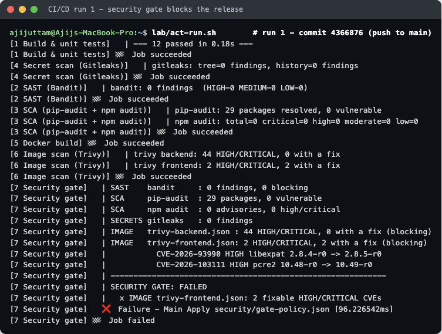

```
[7 Security gate]   | IMAGE   trivy-frontend.json: 2 HIGH/CRITICAL, 2 with a fix (blocking)
[7 Security gate]   |           CVE-2026-93990 HIGH libexpat 2.8.4-r0 -> 2.8.5-r0
[7 Security gate]   |           CVE-2026-103111 HIGH pcre2 10.48-r0 -> 10.49-r0
[7 Security gate]   | SECURITY GATE: FAILED
```

**Fix 1:** `RUN apk upgrade --no-cache libexpat pcre2` in the frontend runtime stage. Run 2: `trivy frontend: 0 HIGH/CRITICAL`.

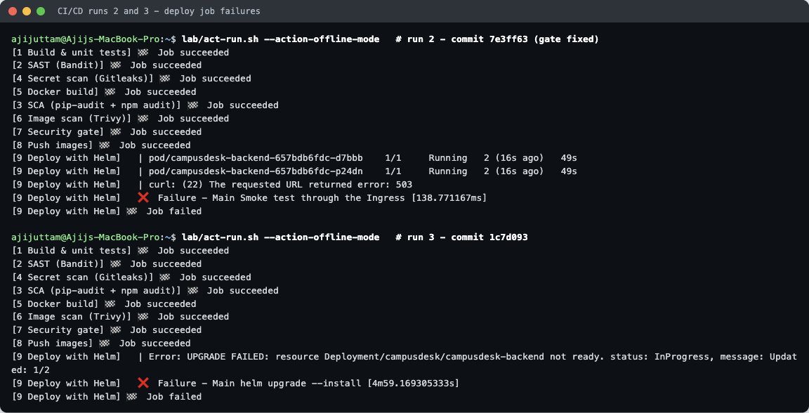

**Fix 2 (run 2):** the smoke test now retries (`curl --retry 10 --retry-all-errors`), and I added a `wait-for-db` init container so `alembic upgrade head` no longer crash-loops on a cold start.
**Fix 3 (run 3):** debugging the stuck init container ([`lab/run3-debug.txt`](lab/run3-debug.txt)):

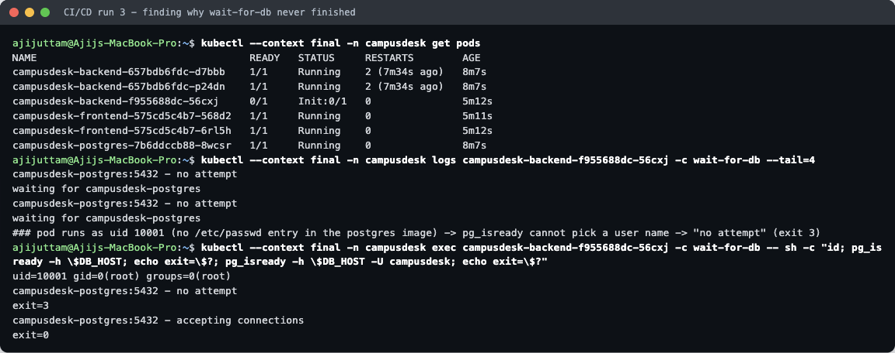

```
$ kubectl ... exec campusdesk-backend-f955688dc-56cxj -c wait-for-db -- sh -c "id; pg_isready -h $DB_HOST; echo exit=$?; pg_isready -h $DB_HOST -U campusdesk; echo exit=$?"
uid=10001 gid=0(root) groups=0(root)
campusdesk-postgres:5432 - no attempt
exit=3
campusdesk-postgres:5432 - accepting connections
exit=0
```

The pod-level `runAsUser: 10001` also applies to the init container. uid 10001 has no entry in the postgres image's `/etc/passwd`, so `pg_isready` cannot work out a user name and gives up ("no attempt", exit 3) without even trying the network. Adding `-U healthcheck` fixed it.

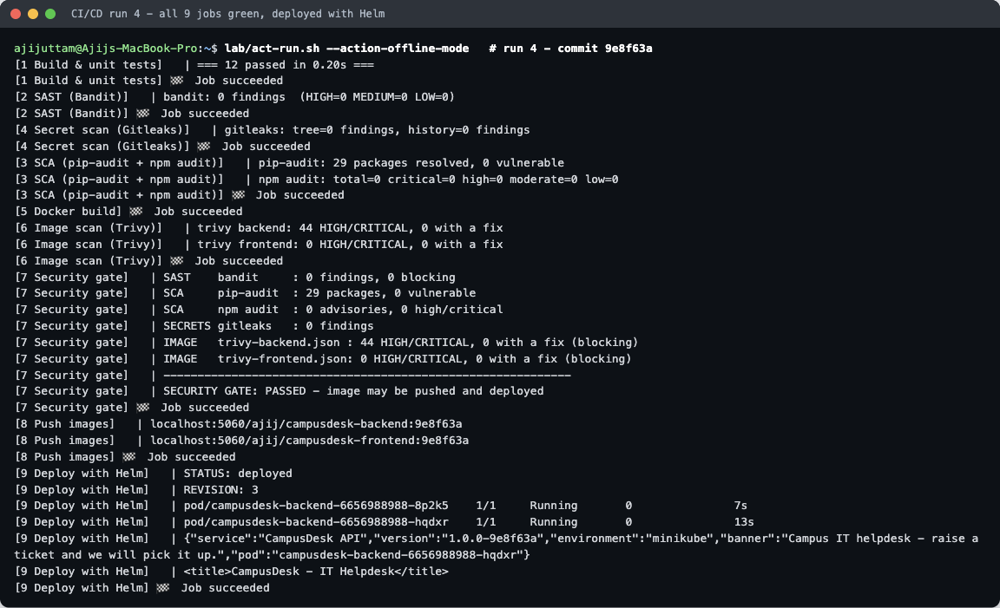

```
[1 Build & unit tests]   | === 12 passed in 0.20s ===
[7 Security gate]   | SECURITY GATE: PASSED - image may be pushed and deployed
[8 Push images]   | localhost:5060/ajij/campusdesk-backend:9e8f63a
[8 Push images]   | localhost:5060/ajij/campusdesk-frontend:9e8f63a
[9 Deploy with Helm]   | {"service":"CampusDesk API","version":"1.0.0-9e8f63a","environment":"minikube",...}
[9 Deploy with Helm]   | <title>CampusDesk - IT Helpdesk</title>
```

* **Build/test before images:** a failing test stops job 1, and nothing after it runs.
* **Traceability:** the image tag *is* the commit (`9e8f63a`), and the API reports `version 1.0.0-9e8f63a`.
* **Push what was scanned:** job 8 loads the tarball that job 6 scanned. It does not rebuild.
* **Artifacts:** JUnit report + frontend bundle, the 6 scanner reports, image tarballs. Copies of the run 4 reports are in [`lab/reports-run4/`](lab/reports-run4/).
* Full logs: [`run1`](lab/run1-gate-blocked.log.txt), [`run2`](lab/run2-smoke-test-503.log.txt), [`run3`](lab/run3-initcontainer-stuck.log.txt), [`run4`](lab/run4-green-deploy.log.txt). Only Node.js deprecation warnings were removed ([`lab/clean-log.sh`](lab/clean-log.sh)).

## 7. DevSecOps implementation

Files: [`security/`](final-devops-project/security/) and [`.gitleaks.toml`](final-devops-project/.gitleaks.toml).

| Control | Tool | Scope | Blocks when (`gate-policy.json`) | Run 4 result |
|---|---|---|---|---|
| SAST | Bandit 1.8.6 | `application/backend/app` | any MEDIUM/HIGH finding | 0 findings |
| SCA (Python) | pip-audit 2.9.0 | `requirements.txt` + transitive (29 pkgs) | any vulnerable package | 0 vulnerable |
| SCA (JS) | npm audit | `package-lock.json` | any high/critical | 0 advisories |
| Secrets | Gitleaks 8.30.1 | working tree **and** full Git history | any finding | 0 / 0 |
| Image scan | Trivy 0.75.0 | both image tarballs, OS + language packages | HIGH/CRITICAL **with a fix available** | backend 44 HIGH (0 fixable), frontend 0 |
| Gate | `security/gate.py` | all 6 JSON reports | prints a summary and exits 1 | PASSED |

* **Why scanners only report and one gate decides:** every scanner runs to the end, so one run shows all problems. The policy lives in one reviewed file, and `push`/`deploy` need only one dependency.
* **The backend's 44 HIGH CVEs** are all in Debian 13 base packages (`util-linux`, `login`, `perl-base`, `ncurses`, `libsystemd0`, ...) with status *affected / no fix yet* ([`trivy-summary.txt`](lab/reports-run4/trivy-summary.txt)). No patched package exists, so they are reported but do not block. When Debian ships a fix, the next build fails the gate until the image is rebuilt. That is the same rule that blocked run 1.
* **Fake secrets:** the chart's DB password (`campusdesk-demo-pw-2026`), the compose password and the Grafana admin password are throw-away demo values for a local cluster. Each is marked with an inline `# gitleaks:allow` comment.
* **Runtime hardening in the chart:** `runAsNonRoot`, fixed UIDs, `seccompProfile: RuntimeDefault`, `allowPrivilegeEscalation: false`, `capabilities.drop: [ALL]` on the API, requests/limits everywhere.

## 8. Kubernetes deployment

Cluster + registry setup: [`lab/03-cluster-registry.sh`](lab/03-cluster-registry.sh). The registry container joins the minikube Docker network, and a containerd `hosts.toml` maps `localhost:5060` *inside the node* to `http://ajij-final-registry:5000`. So the image name `localhost:5060/ajij/...` works the same on the laptop, in CI and in the cluster.

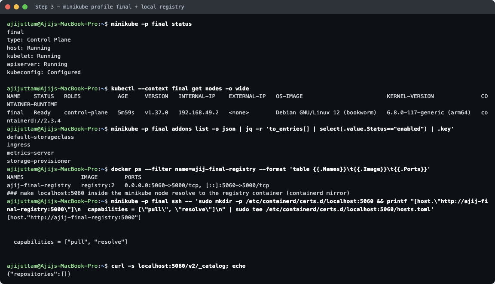

The objects the pipeline deployed ([`lab/05-kubernetes.txt`](lab/05-kubernetes.txt)):

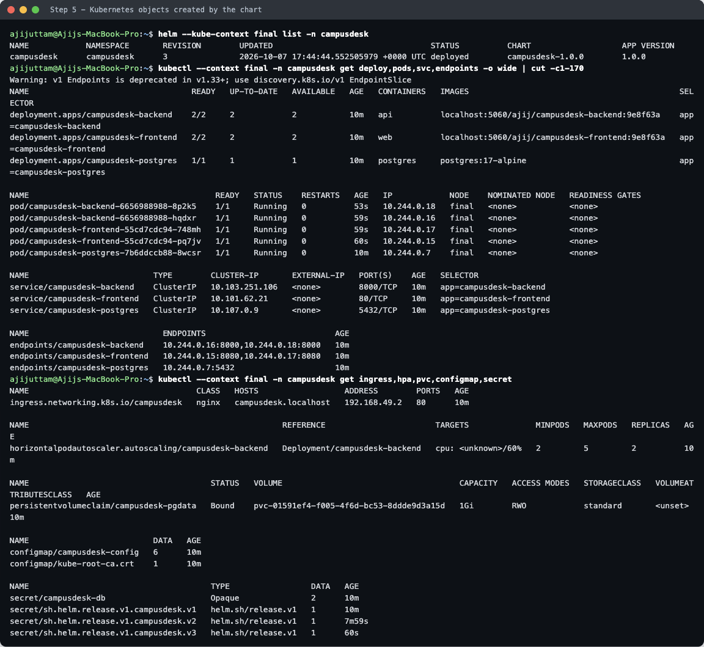
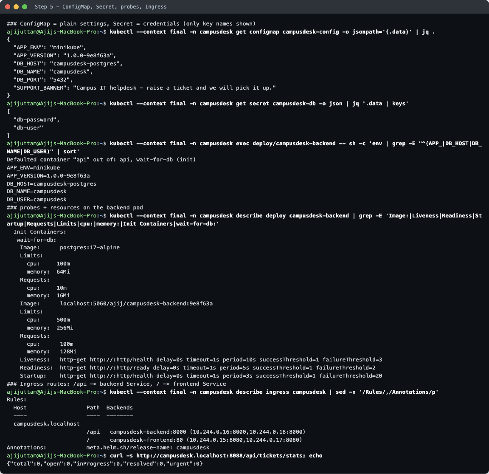

```
    Liveness:   http-get http://:http/health delay=0s timeout=1s period=10s successThreshold=1 failureThreshold=3
    Readiness:  http-get http://:http/ready delay=0s timeout=1s period=5s successThreshold=1 failureThreshold=2
    Startup:    http-get http://:http/health delay=0s timeout=1s period=3s successThreshold=1 failureThreshold=20
  campusdesk.localhost
                        /api   campusdesk-backend:8000 (10.244.0.16:8000,10.244.0.18:8000)
                        /      campusdesk-frontend:80 (10.244.0.15:8080,10.244.0.17:8080)
```

| Requirement | Where |
|---|---|
| Deployment | backend (2–5), frontend (2), postgres (1, `Recreate`) |
| Service | 3 × ClusterIP |
| ConfigMap | `campusdesk-config`: `APP_ENV`, `APP_VERSION`, `SUPPORT_BANNER`, `DB_HOST/PORT/NAME` via `envFrom` |
| Secret | `campusdesk-db`: `db-user`, `db-password` via `secretKeyRef` (my env check prints `DB_USER` only, so the password never appears in a transcript) |
| Ingress | `campusdesk.localhost`: `/api` → backend:8000, `/` → frontend:80 |
| HPA | backend 2–5 at 60% CPU |
| Probes | startup + liveness on `/health` (no DB), readiness on `/ready` (DB), `pg_isready` for postgres, `/healthz` for nginx |
| Storage | PVC `campusdesk-pgdata` 1Gi for PostgreSQL |

**Why liveness and readiness are different endpoints:** if the database goes down, `/ready` fails, so the pods leave the Service but are **not restarted**. Restarting would not fix the database. `/health` only fails when the process itself is stuck.

**Storage test** ([`lab/06a-storage.txt`](lab/06a-storage.txt)): created 4 tickets through the Ingress, deleted the PostgreSQL pod, and the new pod mounted the same PVC. All 4 rows were still in `psql`.

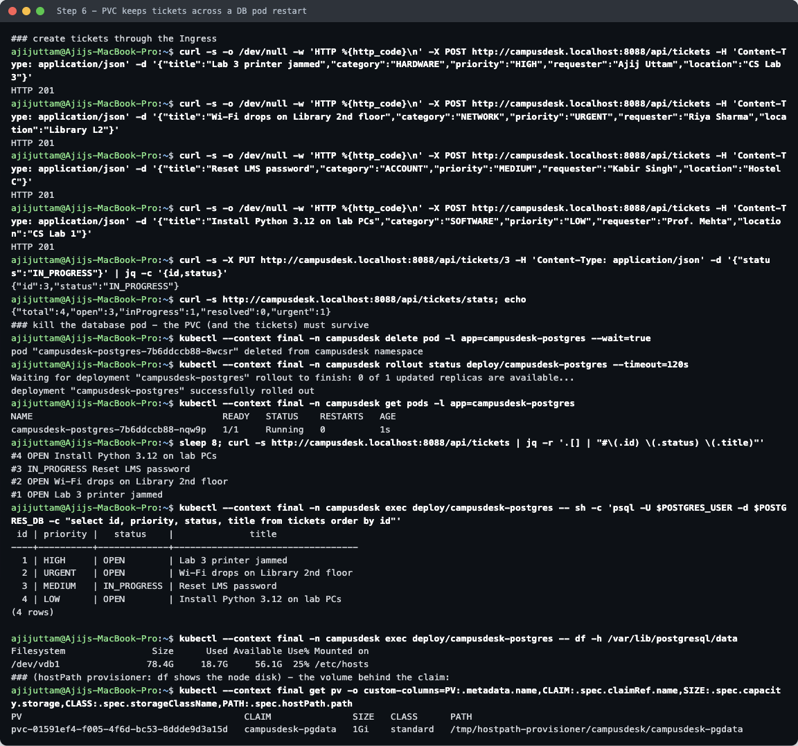

**HPA test** ([`lab/06b-hpa.txt`](lab/06b-hpa.txt)): 12 parallel `wget` loops inside the cluster.

```
campusdesk-backend   Deployment/campusdesk-backend   cpu: 195%/60%   2     5     5     12m
  Normal   SuccessfulRescale   101s   horizontal-pod-autoscaler  New size: 5; reason: cpu resource utilization (percentage of request) above target
```

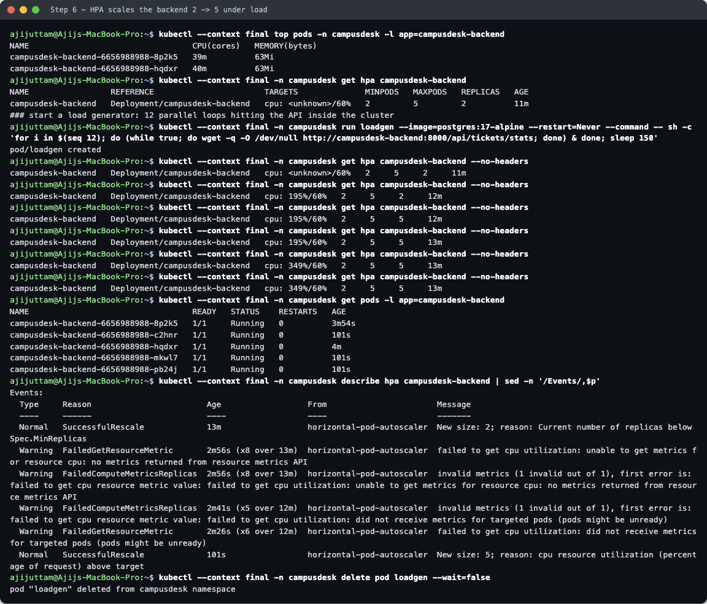

Utilisation is measured against the **request** (100m): 195% means about 195m per pod. That is why the HPA went straight to the max of 5 (2 × 195 / 60 ≈ 6.5, capped at 5). It scaled back to 2 a few minutes after the load stopped (`stabilizationWindowSeconds: 60`). The browser reaches the Ingress through `kubectl port-forward svc/ingress-nginx-controller 8088:80` at `http://campusdesk.localhost:8088`. Chrome and curl resolve `*.localhost` to 127.0.0.1, so no `/etc/hosts` edit is needed.

## 9. Helm deployment

Chart: [`helm/campusdesk/`](final-devops-project/helm/campusdesk/). Templates: `configmap`, `secret`, `backend` (Deployment + Service), `frontend`, `postgres` (PVC + Deployment + Service), `ingress`, `hpa`, `servicemonitor`, `NOTES.txt`.

* The pipeline installs/upgrades with `helm upgrade --install ... --set backend.image.tag=<sha> --wait`.
* By hand, I enabled the ServiceMonitor (`--reuse-values --set monitoring.serviceMonitor.enabled=true`, revision 4) and ran the troubleshooting upgrades/rollbacks (revisions 5–18).
* `checksum/config` and `checksum/secret` pod annotations make a config change roll the pods (GitOps step: banner change → new pods).
* `helm.sh/resource-policy: keep` on the PVC: `helm uninstall` left the data alone. 270 tickets survived the hand-over to Argo CD.
* `values-dev.yaml`, `values-prod.yaml` (GHCR, 3–10 replicas, gp3, password from CI), `values-gitops.yaml` (what Argo CD applies).
* Plain manifests rendered from the chart are in [`kubernetes/manifests/`](final-devops-project/kubernetes/manifests/) for reading. The cluster is never managed by applying them directly.

```
REVISION	UPDATED                 	STATUS    	CHART           	APP VERSION	DESCRIPTION
1       	Wed Oct  7 17:34:50 2026	superseded	campusdesk-1.0.0	1.0.0      	Install complete
2       	Wed Oct  7 17:37:45 2026	failed    	campusdesk-1.0.0	1.0.0      	Upgrade "campusdesk" failed: ...
3       	Wed Oct  7 17:44:44 2026	deployed  	campusdesk-1.0.0	1.0.0      	Upgrade complete
```

## 10. Terraform infrastructure

Code: [`terraform/`](final-devops-project/terraform/). Script: [`lab/08-terraform.sh`](lab/08-terraform.sh). It runs in a scratch copy, so `.terraform/` and state never enter the repo. `AWS_CONFIG_FILE` and `AWS_SHARED_CREDENTIALS_FILE` point at `/dev/null`, so `~/.aws` is never read. The keys are LocalStack's dummy `test/test`.

| File | Resources |
|---|---|
| `network.tf` | VPC `10.20.0.0/16`, public `10.20.0-1.0/24` + private `10.20.10-11.0/24` subnets in `ap-south-1a/b` (with `kubernetes.io/role/elb` tags), IGW, NAT gateway + EIP, public/private route tables |
| `security.tf` | node SG (VPC-only ingress), ingress load balancer SG (80/443) |
| `iam.tf` | EKS cluster role + node role with the 4 AWS managed policies |
| `eks.tf` | `aws_eks_cluster` + `aws_eks_node_group` (t3.medium, 2–4 nodes), **gated by `create_eks`** |
| `app-services.tf` | S3 backup bucket (versioning, AES256, public access block, lifecycle), DynamoDB lock table, SSM parameters, Secrets Manager secret (no value in code/state), CloudWatch log group |
| `providers.tf` | one provider block for LocalStack or real AWS (`localstack_endpoint = ""`) |

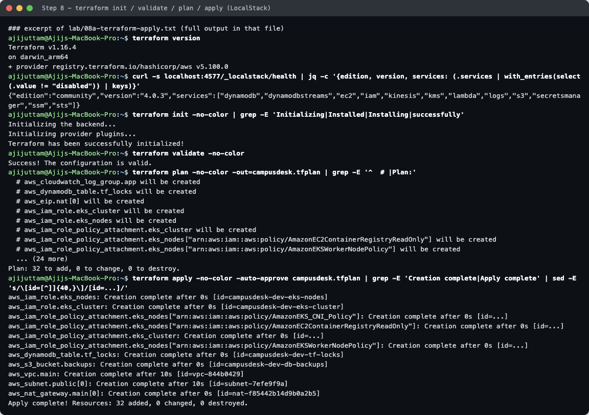

```
Plan: 32 to add, 0 to change, 0 to destroy.
Apply complete! Resources: 32 added, 0 changed, 0 destroyed.
```

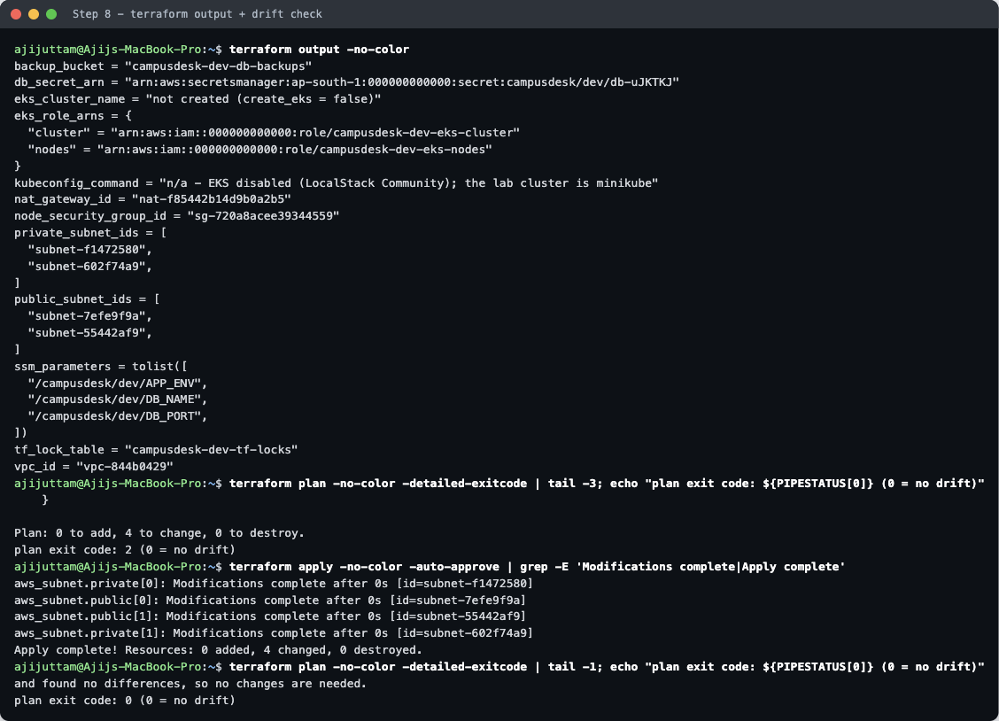
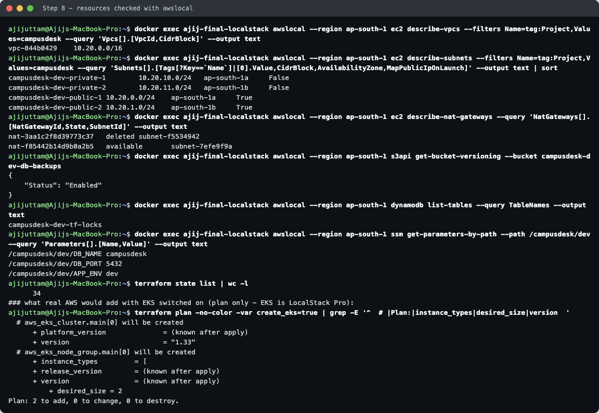

```
campusdesk-dev-private-1	10.20.10.0/24	ap-south-1a	False
campusdesk-dev-private-2	10.20.11.0/24	ap-south-1b	False
campusdesk-dev-public-1	10.20.0.0/24	ap-south-1a	True
campusdesk-dev-public-2	10.20.1.0/24	ap-south-1b	True
...
### what real AWS would add with EKS switched on (plan only - EKS is LocalStack Pro):
  # aws_eks_cluster.main[0] will be created
  # aws_eks_node_group.main[0] will be created
Plan: 2 to add, 0 to change, 0 to destroy.
```

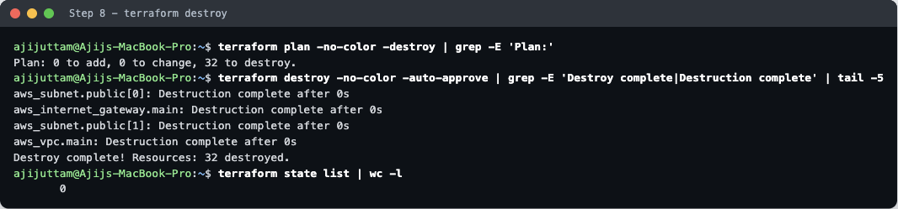

```
Plan: 0 to add, 0 to change, 32 to destroy.
Destroy complete! Resources: 32 destroyed.
$ terraform state list | wc -l
       0
```

**Problems I hit (all in `lab/`):**

1. **Apply timed out after 3 min on `aws_s3_bucket_lifecycle_configuration`** ([first](lab/08a-terraform-apply-first-attempt.txt) and [second](lab/08a-terraform-apply-second-attempt.txt) attempt). With `TF_LOG=debug`, the AWS provider 5.100 waited for the `x-amz-transition-default-minimum-object-size` header on `GET ?lifecycle`. LocalStack 4.0 does not return it, so the waiter never finishes. My first guess (an empty `filter {}`) was wrong: an explicit prefix did not help. Fix: that one resource gets `count = local.use_localstack ? 0 : 1`, with the reason in a comment. It is still created on real AWS. I then destroyed everything ([`08x`](lab/08x-cleanup-after-failed-attempts.txt)) and re-applied from zero.
2. **The plan after apply wanted to update 4 subnets** (tags missing): LocalStack dropped `aws_subnet` tags on create. One more apply converged, and then `terraform plan -detailed-exitcode` returned **0** (no drift).
3. The instructor's sample `main.tf` could not even be parsed, because it put several arguments on one line inside a block. I did not use it.

**Why EKS is gated:** EKS is not in LocalStack Community. Real EKS would also cost money. The code is complete and plans cleanly with `-var create_eks=true`, and the Kubernetes part of the project runs on minikube instead.

## 11. Monitoring

Values: [`monitoring/kube-prometheus-stack-values.yaml`](final-devops-project/monitoring/kube-prometheus-stack-values.yaml) (Alertmanager, node-exporter and unreachable control-plane jobs off, small requests/limits, select every ServiceMonitor). Dashboard: [`monitoring/grafana-dashboard-campusdesk.json`](final-devops-project/monitoring/grafana-dashboard-campusdesk.json), loaded by the Grafana sidecar from a labelled ConfigMap. Output: [`lab/07-monitoring.txt`](lab/07-monitoring.txt), [`lab/07b-metrics-logs.txt`](lab/07b-metrics-logs.txt). Traffic came from [`lab/traffic.sh`](lab/traffic.sh) (GET list/stats/info, a 404, random ticket creation).

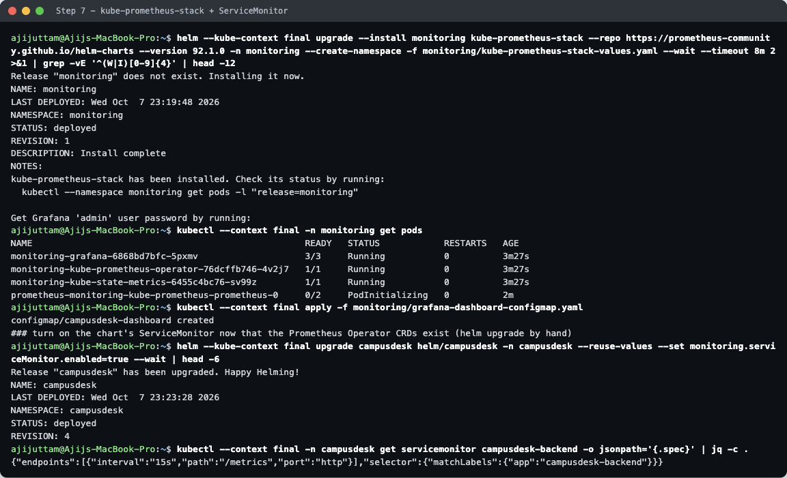
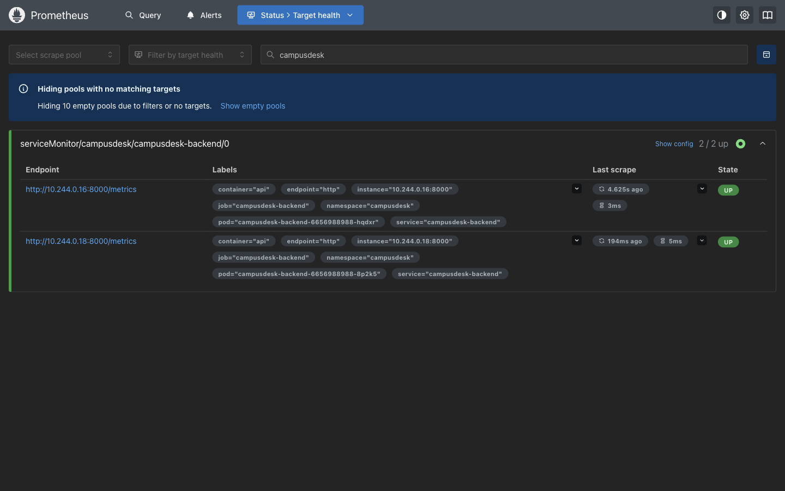

```
$ curl -s localhost:9091/api/v1/query --data-urlencode 'query=sum by (status) (rate(http_requests_total{job="campusdesk-backend"}[2m]))' ...
2xx  21.979
4xx  1.393
... p95 latency  total  0.095
```

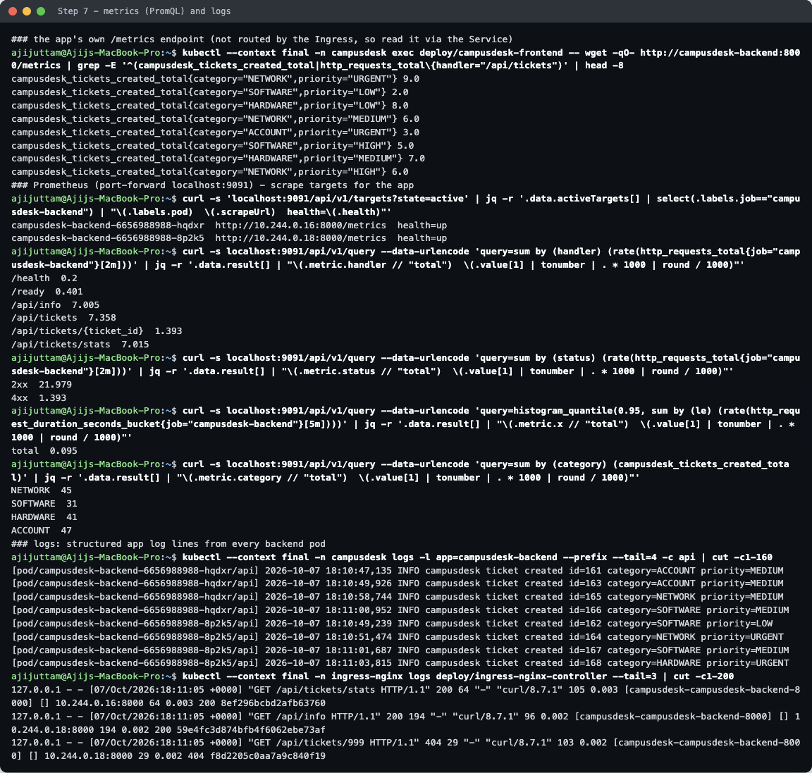
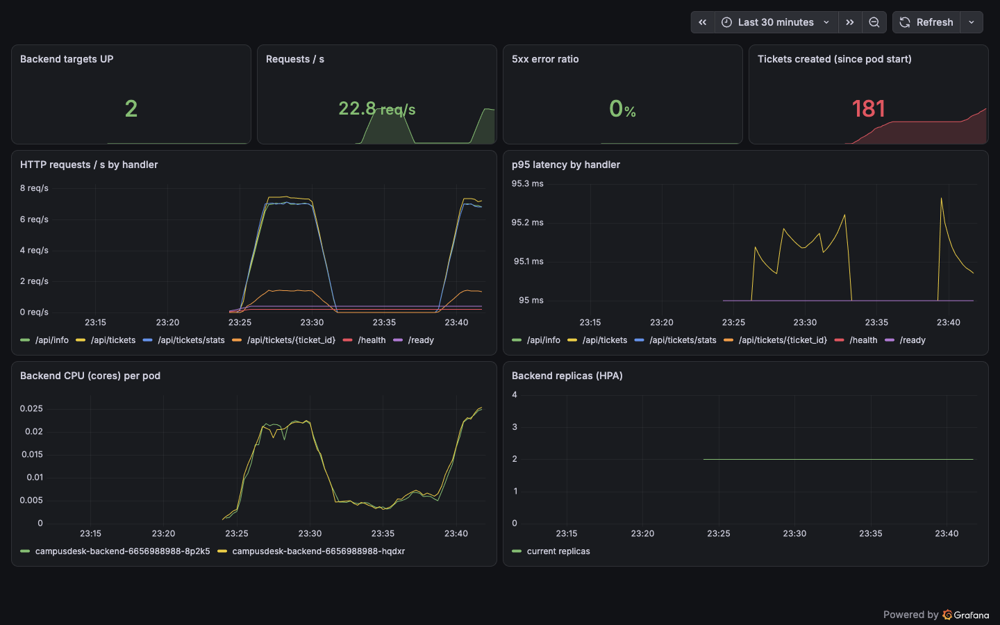

* **Metrics:** request rate per handler, status class, p95 latency, CPU per pod, HPA replicas, and the business counter `campusdesk_tickets_created_total{category,priority}`. The two traffic bursts are clearly visible.
* The 4xx rate is the intentional `GET /api/tickets/999` in the traffic script. The 5xx ratio stayed at **0%**.
* p95 sits at about 95 ms because the default histogram buckets are 50 ms / 100 ms. Prometheus interpolates inside the bucket, so this means "between 50 and 100 ms", not exactly 95.
* **Logs:** the API writes one structured line per change (`ticket created id=161 category=ACCOUNT priority=MEDIUM`), and uvicorn's access log is off (the ingress already logs every request with its upstream pod IP and latency). `kubectl logs -l app=campusdesk-backend --prefix` shows both pods side by side.

## 12. GitOps

Files: [`gitops/git-server.yaml`](final-devops-project/gitops/git-server.yaml) (Gitea, rootless, SQLite, PVC), [`gitops/argocd-light.sh`](final-devops-project/gitops/argocd-light.sh), [`gitops/argocd-application.yaml`](final-devops-project/gitops/argocd-application.yaml). Output: [`lab/10-gitops-setup.txt`](lab/10-gitops-setup.txt), [`lab/10b-gitops-handover.txt`](lab/10b-gitops-handover.txt), [`lab/10c-gitops-commit.txt`](lab/10c-gitops-commit.txt).

1. **Git server inside the cluster:** Gitea, user `ajij`. The image is mirrored into my registry so the node pulls it from `localhost:5060`. Argo CD clones from `http://gitea.gitops.svc.cluster.local:3000/ajij/campusdesk.git`.
2. **Argo CD v3.5.4**, with dex, notifications and applicationset scaled to 0 to save memory.
3. **Hand-over:** `helm uninstall` (PVC kept), then apply the Application. Argo CD rendered `helm/campusdesk` with `values.yaml` + `values-gitops.yaml` and reached `Synced / Healthy` at commit `965e0f0`. The same 270 tickets were still there.
4. **A change only through Git:** I edited `SUPPORT_BANNER` in `values-gitops.yaml` and committed it as *Ajij Uttam*: `b647ad1 config: exam-week support banner`.

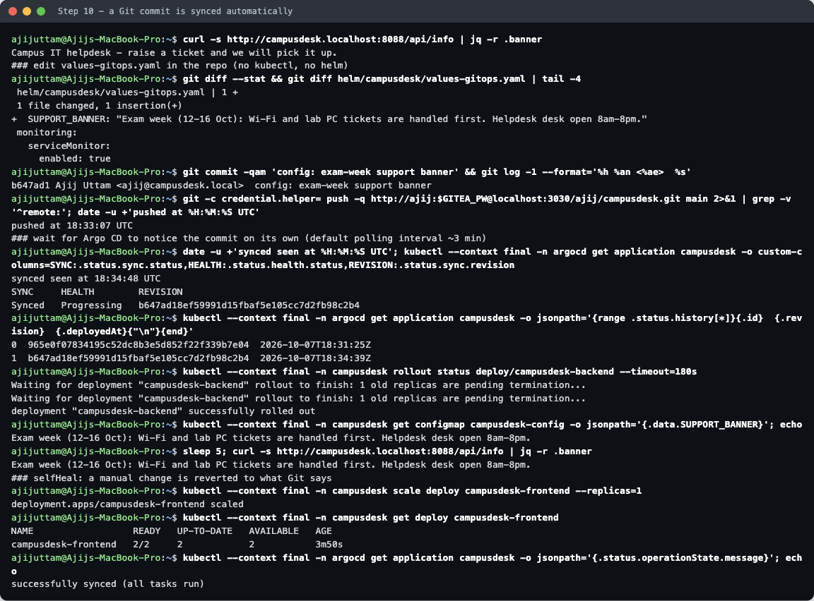

```
pushed at 18:33:07 UTC
synced seen at 18:34:48 UTC
SYNC     HEALTH        REVISION
Synced   Progressing   b647ad18ef59991d15fbaf5e105cc7d2fb98c2b4
0  965e0f07834195c52dc8b3e5d852f22f339b7e04  2026-10-07T18:31:25Z
1  b647ad18ef59991d15fbaf5e105cc7d2fb98c2b4  2026-10-07T18:34:39Z
$ sleep 5; curl -s http://campusdesk.localhost:8088/api/info | jq -r .banner
Exam week (12-16 Oct): Wi-Fi and lab PC tickets are handled first. Helpdesk desk open 8am-8pm.
```

No `kubectl` or `helm` command was used for this change. Argo CD's own polling picked up the commit **92 s** after the push. It rendered the chart, and the ConfigMap checksum annotation changed, so the backend pods rolled. **selfHeal:** `kubectl scale deploy campusdesk-frontend --replicas=1` was undone, and 20 s later it was back to `2/2`.

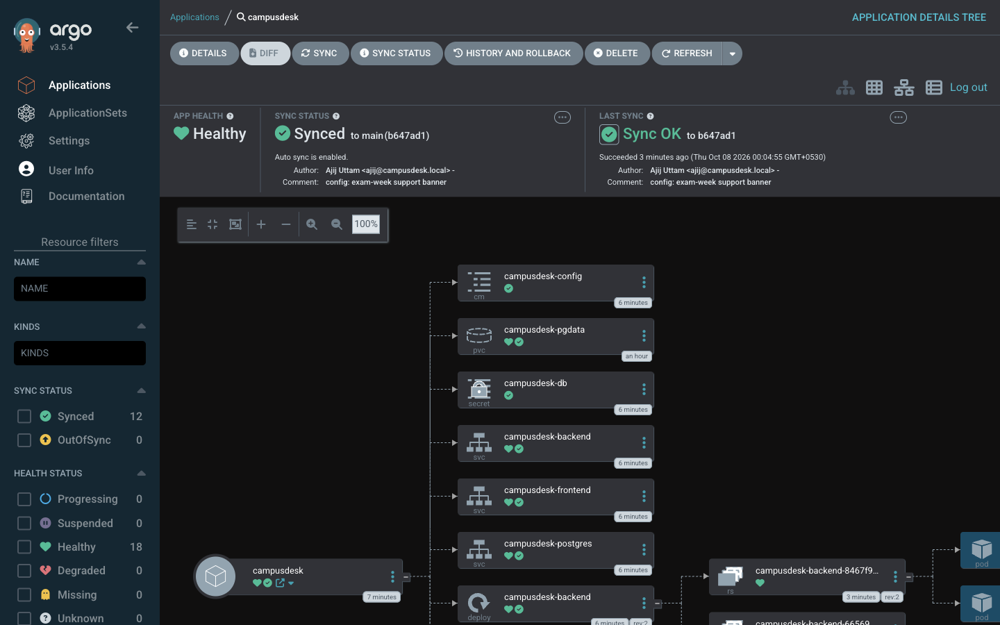
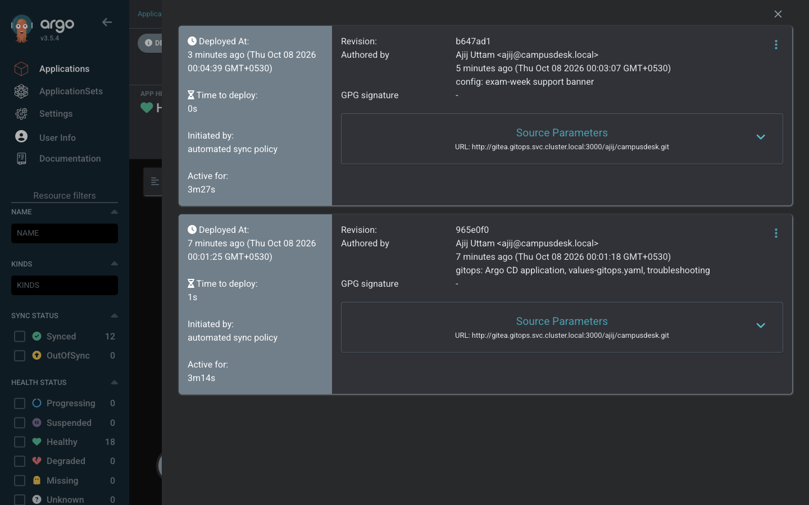
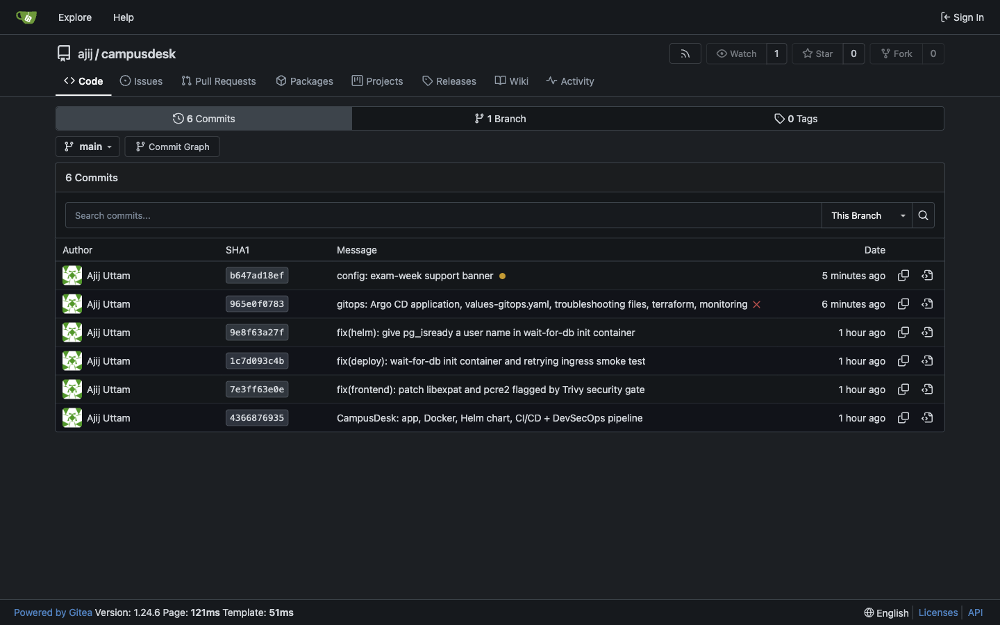
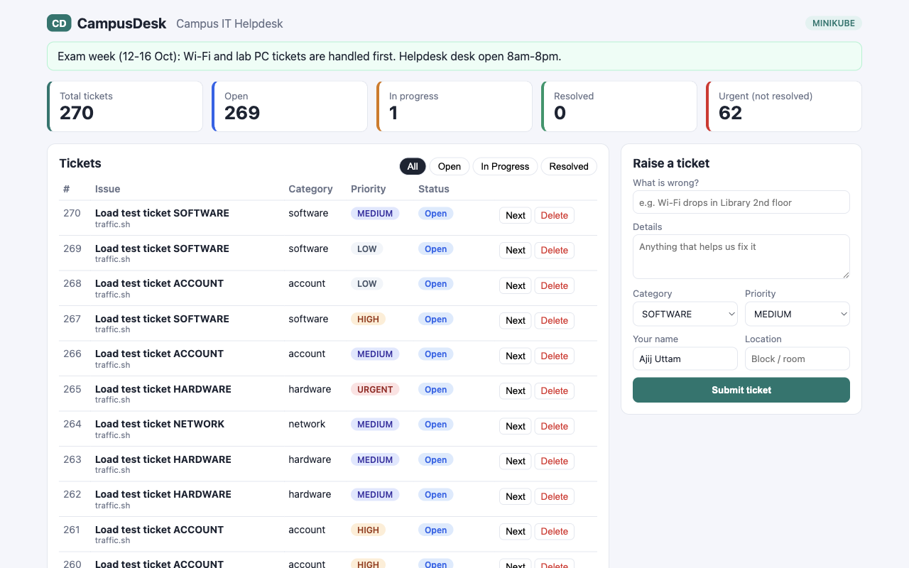

Notes:

* Right after the sync, Argo CD briefly showed the app as *Degraded*. The HPA reports `<unknown>` CPU until metrics-server has data for the new pods, and Argo CD counts that as degraded. A minute later it was *Healthy* (screenshot above).
* The yellow dot and red cross next to two commits in Gitea are statuses from Gitea's built-in Actions runner. It tried to pick up `.github/workflows` but has no runner. I turned Gitea Actions off afterwards (commit `acc6c2f`), because CI runs with `act`.
* In GitOps mode, job 9 of the pipeline would commit the new tag to `values-gitops.yaml` (push → pull model) instead of running Helm.

---

## Troubleshooting

**The final troubleshooting challenge.** I broke the running project in **6 different ways**. The break files are in [`kubernetes/troubleshooting/`](final-devops-project/kubernetes/troubleshooting/). Cases 1 and 4 are my versions of the instructor's `broken-image.yaml` / `broken-service.yaml`, and case 6 is the actual bug in the sample chart's Ingress. Each script follows the same steps: **break → 1 identify → 2 investigate → 3 root cause → 4 fix → 5 verify**. Scripts: `lab/09-troubleshoot-*.sh`, outputs `lab/09-troubleshoot-*.txt`.

| # | Break | Symptom | Investigation | Root cause | Fix | Verified |
|---|---|---|---|---|---|---|
| 1 | backend tag `9e8f63b` | new pod `ErrImagePull`, rollout stuck | `describe pod` events, registry `tags/list` | tag never pushed (CI pushed `9e8f63a`) | `helm rollback` | 2/2 Ready on `9e8f63a` |
| 2 | Deployment reads Secret key `password` | `CreateContainerConfigError` | events, Deployment env, Secret keys | key is `db-password` | `helm upgrade --force-conflicts` | key `db-password`, pods Running |
| 3 | readiness path `/readiness` | pod `0/1 Running`, rollout timeout | `describe` (probe 404), app log healthy, probing both paths from inside | endpoint is `/ready` | `--set backend.probes.readinessPath=/ready` | Readiness `/ready`, 2/2 |
| 4 | Service selector `app=campusdesk-api` | Ingress **503**, UI "Backend problem", pods all Ready | empty EndpointSlice, pod labels, controller log | selector matches no pod | re-apply chart | endpoints back, HTTP 200 |
| 5 | backend `resources: null` | HPA `cpu: <unknown>/60%` | HPA events, empty `resources`, `kubectl top` works | HPA % needs a CPU **request** | restore requests/limits | `cpu: 4%/60%`, `ScalingActive True` |
| 6 | Ingress `/api` → port 8080 | `/` 200 but `/api/*` **503** | `describe ingress` (`campusdesk-backend:8080 ()`), Service port, ingress log upstream `-8080` | Service only has 8000 | re-apply chart | `/api -> campusdesk-backend:8000`, HTTP 200 |

### 1 — Bad image tag

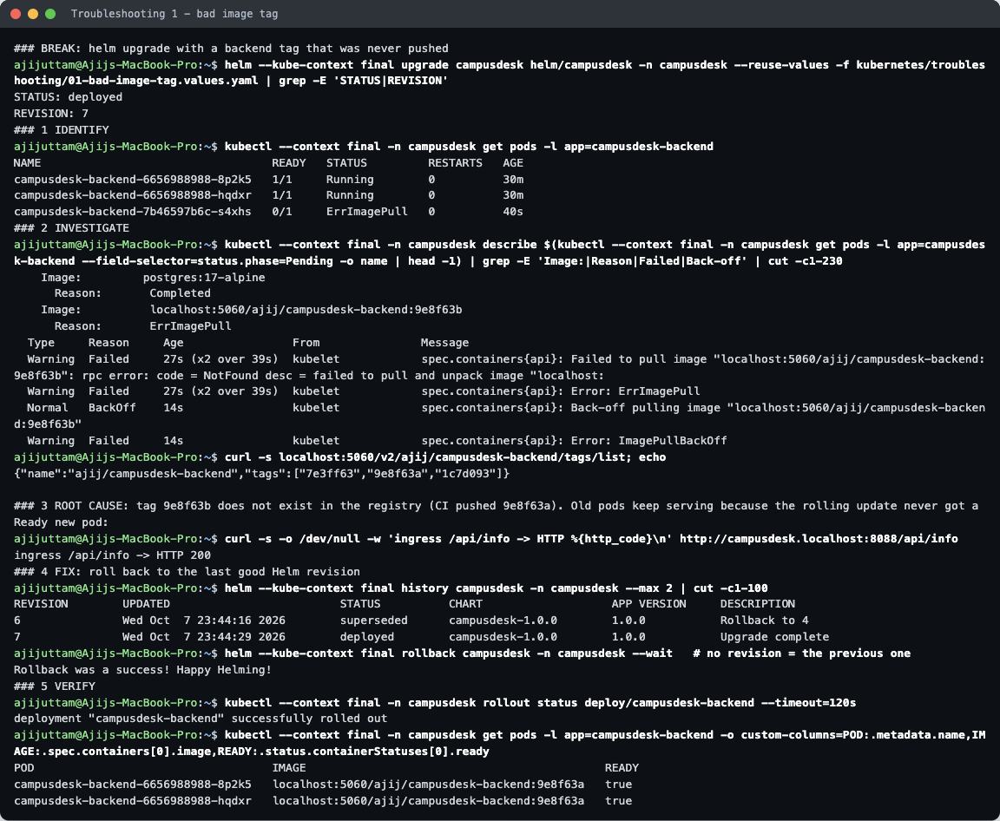

```
campusdesk-backend-7b46597b6c-s4xhs   0/1     ErrImagePull   0          40s
  Warning  Failed     27s (x2 over 39s)  kubelet  ... Failed to pull image "localhost:5060/ajij/campusdesk-backend:9e8f63b": rpc error: code = NotFound ...
{"name":"ajij/campusdesk-backend","tags":["7e3ff63","9e8f63a","1c7d093"]}
ingress /api/info -> HTTP 200
```

The RollingUpdate never removes an old pod until a new one is Ready, so users saw **no outage** (HTTP 200 during the incident). `helm rollback` with no revision number goes back to the previous release.

### 2 — Wrong Secret key

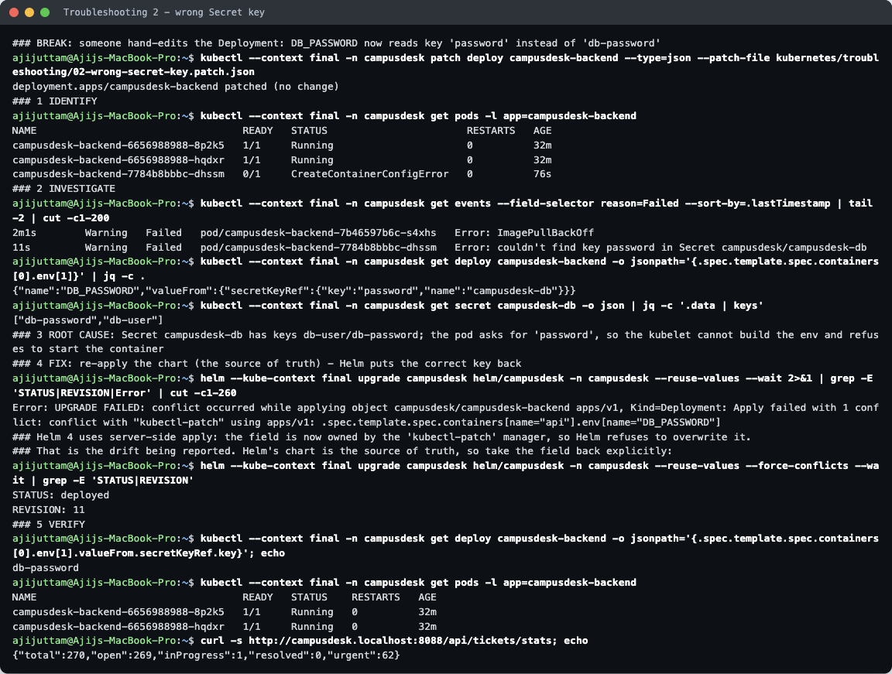

```
Warning   Failed   pod/campusdesk-backend-7784b8bbbc-dhssm   Error: couldn't find key password in Secret campusdesk/campusdesk-db
Error: UPGRADE FAILED: conflict occurred while applying object ... conflict with "kubectl-patch" using apps/v1: ...env[name="DB_PASSWORD"]
```

This case taught me something about Helm 4. Helm 4 applies with **server-side apply**. After a hand edit, `kubectl-patch` owns that field, so a plain `helm upgrade` refuses to overwrite it and reports a conflict. That conflict is useful: it is drift detection. `--force-conflicts` lets the chart (the source of truth) take the field back. The screenshot is the second run of the script. The first run's plain upgrade had failed the same way and left the break in place, which is why the patch printed `(no change)`.

### 3 — Failing readiness probe

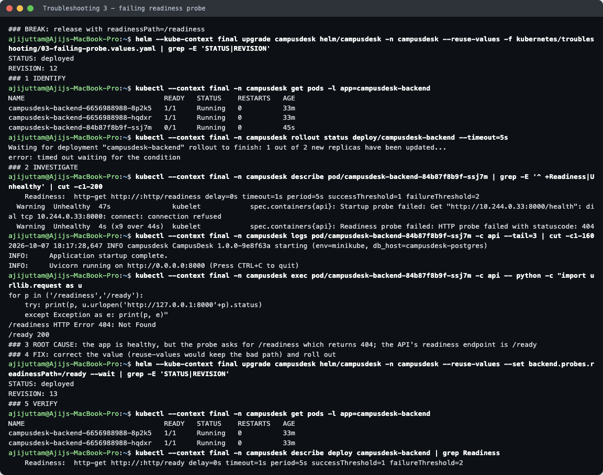

```
  Warning  Unhealthy  4s (x9 over 44s)  kubelet  spec.containers{api}: Readiness probe failed: HTTP probe failed with statuscode: 404
/readiness HTTP Error 404: Not Found
/ready 200
```

The app log shows a normal startup. The probe is wrong, not the app. A readiness failure never restarts the container (no RESTARTS). It only keeps the pod out of the Service.

### 4 — Service selector mismatch

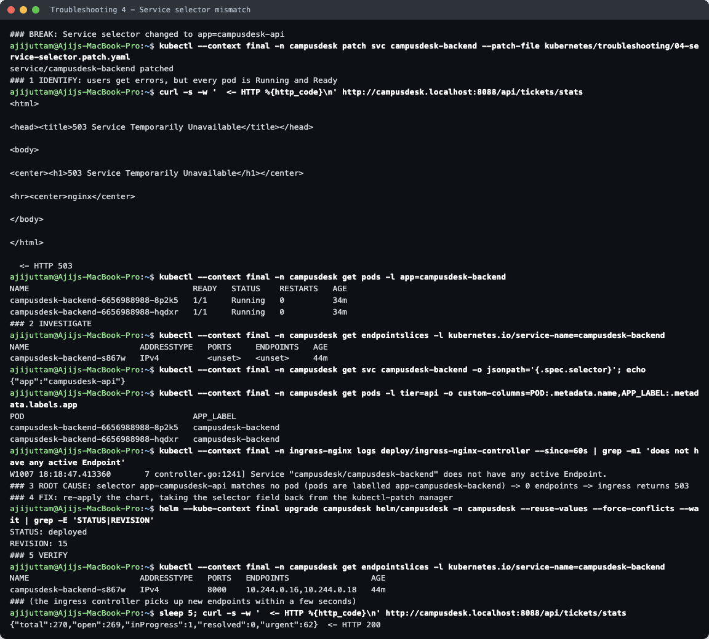
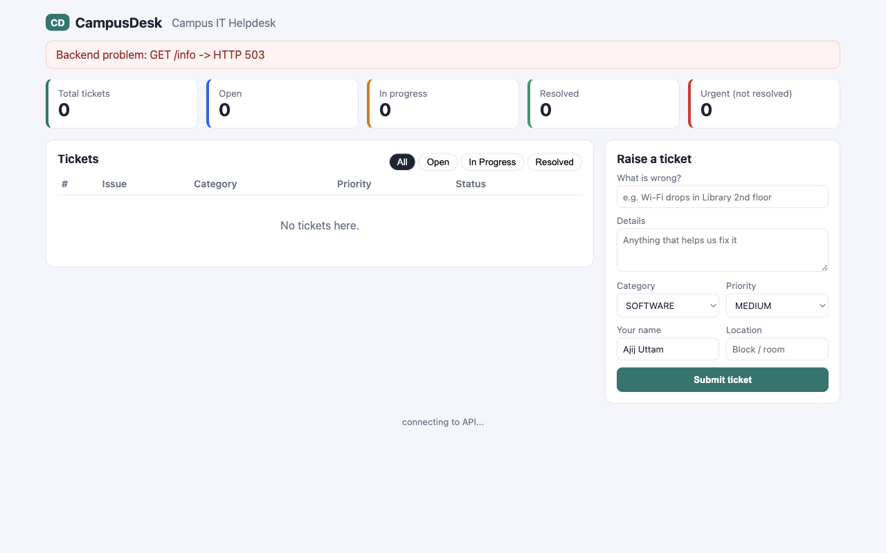

```
campusdesk-backend-s867w   IPv4          <unset>   <unset>     44m
{"app":"campusdesk-api"}
POD                                   APP_LABEL
campusdesk-backend-6656988988-8p2k5   campusdesk-backend
W1007 18:18:47.413360  ... Service "campusdesk/campusdesk-backend" does not have any active Endpoint.
```

Every pod was healthy, but the Service had no endpoints. `get endpointslices` + `--show-labels` is the fastest check. Right after the fix, the first curl still returned 503 (seen in my first run of the script): ingress-nginx takes a few seconds to learn new endpoints. This is the same race that failed pipeline run 2.

### 5 — HPA without resource requests

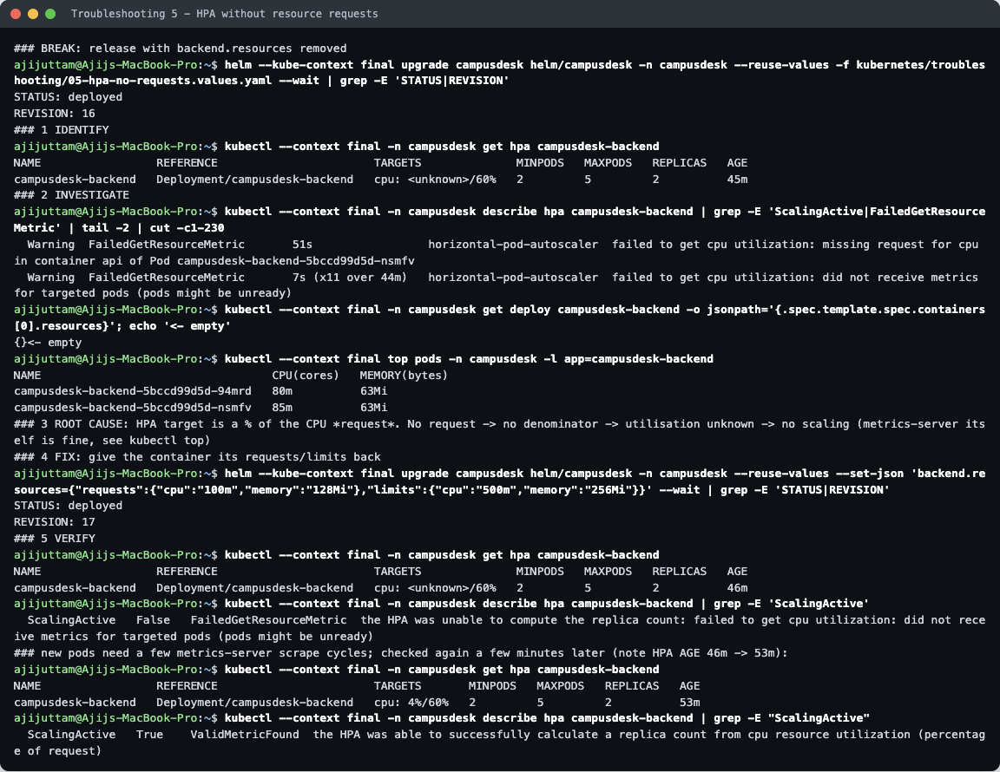

```
campusdesk-backend   Deployment/campusdesk-backend   cpu: <unknown>/60%   2         5         2          45m
  Warning  FailedGetResourceMetric   51s   horizontal-pod-autoscaler  failed to get cpu utilization: missing request for cpu in container api of Pod campusdesk-backend-5bccd99d5d-nsmfv
...
campusdesk-backend   Deployment/campusdesk-backend   cpu: 4%/60%   2         5         2          53m
  ScalingActive   True    ValidMetricFound  the HPA was able to successfully calculate a replica count from cpu resource utilization (percentage of request)
```

`kubectl top` still worked (80m, 85m), which proves metrics-server was fine. The HPA could not compute *utilisation* because there was no request to divide by. After the fix, it took a couple of metrics-server scrapes before the value appeared (the check right after the fix still showed `<unknown>`).

### 6 — Ingress backend on the wrong port

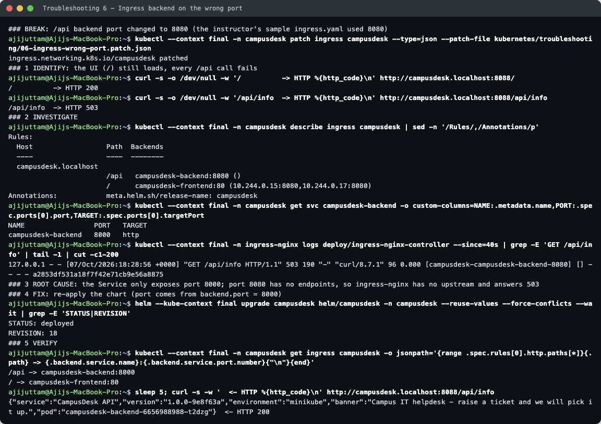

```
/          -> HTTP 200
/api/info  -> HTTP 503
                        /api   campusdesk-backend:8080 ()
campusdesk-backend   8000   http
"GET /api/info HTTP/1.1" 503 190 ... [campusdesk-campusdesk-backend-8080] [] - - - -
```

The empty `()` after the backend in `describe ingress` means "no endpoints for that Service port". The upstream name `...-backend-8080` in the access log confirms it.

### Other real problems solved along the way

| Where | Problem | Root cause | Fix |
|---|---|---|---|
| CI run 1 | gate blocked | fixable CVEs in `nginx:1.31.6-alpine` | `apk upgrade libexpat pcre2` |
| CI run 2 | smoke test 503 + 2 backend restarts | ingress endpoint lag; Alembic ran before PostgreSQL was up | retrying curl; `wait-for-db` init container |
| CI run 3 | Helm timeout, init container stuck | `pg_isready` "no attempt" as uid 10001 | `-U healthcheck` |
| Terraform | lifecycle create timeout | LocalStack lacks a response header the provider waits for | skip that resource on LocalStack only |
| Terraform | permanent subnet tag drift after first apply | LocalStack drops subnet tags on create | second apply, then plan exit code 0 |
| Monitoring / GitOps | port-forwards to Prometheus, Grafana, Gitea and Argo CD dropped | started before the pod was Running, or the pod was replaced (Gitea redeploy); the Argo CD one dropped once during UI streaming | restarted the port-forward |

## 14. Screenshots

All screenshots are in [`images/`](images/). Terminal screenshots are renders of the real transcripts in `lab/`. Browser screenshots are of the running apps.

| Screenshot | Shows |
|---|---|
| `architecture.png` / `.svg` | architecture diagram |
| `01a-pytest.png`, `01b-frontend-build.png` | tests + build |
| `02-docker-compose.png`, `02-compose-ui.png` | Compose stack + UI |
| `03-cluster-registry.png` | minikube + registry |
| `04a`–`04e` | pipeline runs 1–4, run 3 debugging, Git history |
| `05-app-via-ingress.png`, `05a`, `05b` | UI through the Ingress, K8s objects, config/probes/ingress |
| `06a-storage-pvc.png`, `06b-hpa-scaling.png` | PVC persistence, HPA 2 → 5 |
| `07a-monitoring-install.png`, `07-prometheus-targets.png`, `07b-metrics-logs.png`, `07-grafana-campusdesk-dashboard.png` | monitoring |
| `08a`–`08d` | Terraform plan/apply, output, verify, destroy |
| `09-t1` … `09-t6`, `09-t4-ui-broken-service.png` | troubleshooting challenge |
| `10a`–`10c`, `10-argocd-*.png`, `10-gitea-commits.png`, `10-app-after-gitops-commit.png` | GitOps |

## What I changed from the sample

The instructor's `session21-python` project was my starting point. Changes:

* **Own domain and code:** helpdesk tickets (category, priority, requester, location) instead of tasks, 12 tests instead of 3 with a proper `conftest.py`, `/ready` returns 503 instead of an unhandled 500, `lifespan` instead of the deprecated `@app.on_event`, business metrics, a ConfigMap/Secret split for DB settings, `/api/info`.
* **Bugs fixed in the sample:**
  1. The Ingress pointed to `taskboard-backend:8080`, but the Service is `<release>-taskboard-backend:8000`, so `/api` could never work (troubleshooting case 6).
  2. Nginx proxied to a host called `backend`, which only exists in Compose; now it uses a `BACKEND_URL` template.
  3. `vite.config.js` proxied to port 8080, but uvicorn listens on 8000.
  4. Terraform `main.tf` did not parse.
* **Hardening:**
  1. The frontend ran as root on port 80; now it runs as uid 101 on 8080.
  2. npm dependencies were all `"latest"`; now they are pinned with a lockfile.
  3. Base images were floating tags; now they are pinned to the patch version.
  4. The DB password was a plain env value in the Deployment; now it comes from a Secret.
  5. Added an init container and a startup probe.
  6. The PVC is kept on uninstall.
* **Pipeline:** from test → build → Trivy → push, to 9 jobs with SAST, SCA (Python + JS), secret scanning of tree and history, image scanning, a policy-based gate, pushing the exact scanned image, and a Helm deploy with a smoke test.
* **Infrastructure:** the sample used community modules for a real EKS cluster. Mine uses plain resources that run against LocalStack, with EKS gated, plus backup bucket, lock table, SSM, Secrets Manager and logs.

## 16. Cleanup

Everything I created was removed at the end ([`lab/cleanup.txt`](lab/cleanup.txt)): minikube profile `final` (cluster, Argo CD, Gitea, monitoring), containers `ajij-final-registry` and `ajij-final-localstack`, the CampusDesk images and image tags I built or pushed, the compose volume and network. No daemon-wide prune was used. A final `gitleaks dir` over this folder reports **no leaks** ([`lab/gitleaks-final-check.txt`](lab/gitleaks-final-check.txt)).
