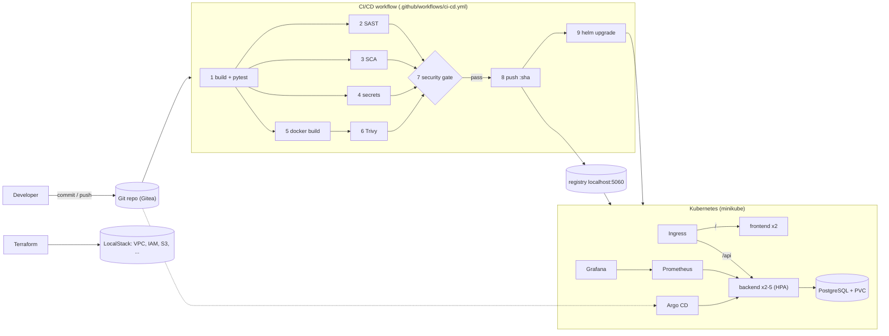

# CampusDesk — Final DevOps Project

**Name:** Ajij Uttam  **Enrollment No:** 24bcs10103

CampusDesk is a small IT helpdesk for a college campus. Students and staff raise tickets ("projector not working in B-204", "Wi-Fi drops in the library"), the IT team moves them from **Open → In progress → Resolved**. This folder is the complete project: application code, Docker, Kubernetes, Helm, Terraform, the CI/CD + DevSecOps pipeline, monitoring and GitOps.

The step-by-step run with all real outputs, the troubleshooting challenge and the screenshots is in the homework report: [`../README.md`](../README.md).

> **Built on the session 21 sample project.** The instructor's `session21-python` TaskBoard project was the starting point for the DevOps layer (FastAPI + React + PostgreSQL, Helm chart, Terraform, Prometheus values, two broken manifests). The application domain, code, chart, pipeline and infrastructure here are my own versions; I also fixed the parts of the sample that did not work (see "What I changed from the sample" at the end).

---

## Project overview

| Layer | What is used |
|---|---|
| Frontend | React 19 + Vite 8, served by Nginx (non-root, port 8080), `/api` proxied to the backend |
| Backend | FastAPI (Python 3.12), SQLAlchemy 2.1, Alembic migrations, `/health`, `/ready`, `/metrics` |
| Database | PostgreSQL 17 on a PersistentVolumeClaim |
| Tests | pytest (12 tests, 98% coverage) against a throw-away SQLite DB |
| Containers | 2 Dockerfiles (`docker/`), Docker Compose for the full local stack |
| CI/CD | GitHub Actions workflow, run locally with `act` (9 jobs) |
| DevSecOps | Bandit (SAST), pip-audit + npm audit (SCA), Gitleaks (secrets), Trivy (images), `security/gate.py` (gate) |
| Registry | `registry:2` container `ajij-final-registry` on `localhost:5060` (GHCR on real GitHub) |
| Kubernetes | minikube 1.39 / Kubernetes 1.37, ingress-nginx, metrics-server |
| Helm | chart `helm/campusdesk` (Deployment, Service, ConfigMap, Secret, Ingress, HPA, probes, PVC, ServiceMonitor) |
| IaC | Terraform 1.16 + hashicorp/aws 5.100 against LocalStack 4.0 (VPC, subnets, NAT, SGs, IAM, S3, DynamoDB, SSM, Secrets Manager, CloudWatch Logs, EKS gated) |
| Monitoring | kube-prometheus-stack 92.1 (Prometheus + Grafana) and a CampusDesk dashboard |
| GitOps | Argo CD v3.5.4 syncing `helm/campusdesk` from a Gitea server running in the cluster |

### REST API

```text
GET    /health                  liveness (process up)
GET    /ready                   readiness (runs SELECT 1 on the DB, 503 if it fails)
GET    /metrics                 Prometheus metrics (HTTP + campusdesk_tickets_* counters)
GET    /api/info                version, environment, banner text, pod name
GET    /api/tickets             list (optional ?status_filter=OPEN)
POST   /api/tickets             create
GET    /api/tickets/{id}        read
PUT    /api/tickets/{id}        update (partial)
DELETE /api/tickets/{id}        delete
GET    /api/tickets/stats       totals per status + urgent count
```

## Architecture diagram



Rendered version: [`../images/architecture.png`](../images/architecture.png) / [`../images/architecture.svg`](../images/architecture.svg).

## Folder structure

```text
final-devops-project/
├── application/
│   ├── backend/            FastAPI app, Alembic migration, pytest tests
│   └── frontend/           React + Vite UI (package-lock.json pins every version)
├── docker/                 backend.Dockerfile, frontend.Dockerfile, nginx template, docker-compose.yml
├── kubernetes/
│   ├── namespace.yaml
│   ├── manifests/          plain YAML rendered from the chart (reference copy)
│   └── troubleshooting/    the 6 deliberate breakages used in the troubleshooting challenge
├── helm/campusdesk/        the chart + values-dev / values-prod / values-gitops
├── terraform/              AWS infrastructure (LocalStack by default)
├── .github/workflows/      ci-cd.yml
├── security/               bandit.yaml, trivy.yaml, gate-policy.json, gate.py
├── monitoring/             kube-prometheus-stack values, Grafana dashboard
├── gitops/                 Gitea server, Argo CD install helper, Argo CD Application
├── .gitleaks.toml  .dockerignore  .gitignore
└── README.md
```

## Application setup

```bash
# backend (Python 3.12)
cd application/backend
python3.12 -m venv .venv && . .venv/bin/activate
pip install -r requirements-dev.txt
pytest -v --cov=app                      # 12 tests, SQLite, no PostgreSQL needed
DATABASE_URL=postgresql+psycopg://campusdesk:<pw>@localhost:5432/campusdesk \
  sh -c 'alembic upgrade head && uvicorn app.main:app --port 8000'

# frontend (Node 22)
cd application/frontend
npm ci && npm run dev                    # http://localhost:5173, /api proxied to :8000
npm run build                            # static files in dist/
```

Configuration is environment-only: `APP_ENV`, `APP_VERSION`, `SUPPORT_BANNER`, `DB_HOST`, `DB_PORT`, `DB_NAME` (ConfigMap in Kubernetes) and `DB_USER`, `DB_PASSWORD` (Secret). `DATABASE_URL` overrides the `DB_*` parts.

## Docker setup

```bash
docker build -f docker/backend.Dockerfile  -t campusdesk-backend:dev .    # build context = project root
docker build -f docker/frontend.Dockerfile -t campusdesk-frontend:dev .
docker compose -f docker/docker-compose.yml up --build                   # UI :3080, API :8008
```

* Backend: `python:3.12.15-slim`, runs as uid **10001**, runs `alembic upgrade head` then `exec uvicorn` (PID 1 gets SIGTERM).
* Frontend: multi-stage (`node:22.23.3-alpine` builds, `nginx:1.31.6-alpine` serves), runs as uid **101** on port 8080, `apk upgrade libexpat pcre2` (fix required by the security gate, see CI/CD run 1).
* The Nginx config is a template: `BACKEND_URL` is `http://backend:8000` in Compose and `http://campusdesk-backend:8000` in Kubernetes.

## Kubernetes deployment

Everything is created by the Helm chart (rendered copies in `kubernetes/manifests/`):

| Object | Name | Notes |
|---|---|---|
| Deployment | `campusdesk-backend` | init container `wait-for-db`, startup/liveness/readiness probes, requests + limits, non-root, drop ALL caps |
| Deployment | `campusdesk-frontend` | 2 replicas, `/healthz` probes |
| Deployment | `campusdesk-postgres` | `Recreate` strategy, `pg_isready` probes |
| Service | backend :8000, frontend :80, postgres :5432 | ClusterIP |
| ConfigMap | `campusdesk-config` | `envFrom` into the backend; checksum annotation rolls pods on change |
| Secret | `campusdesk-db` | `db-user`, `db-password` (fake demo value, marked `gitleaks:allow`) |
| Ingress | `campusdesk` | host `campusdesk.localhost`: `/api` → backend, `/` → frontend |
| HPA | `campusdesk-backend` | 2–5 replicas at 60% CPU of the request |
| PVC | `campusdesk-pgdata` | 1Gi, `helm.sh/resource-policy: keep` |
| ServiceMonitor | `campusdesk-backend` | scrape `/metrics` every 15s (enabled once the Prometheus CRDs exist) |

```bash
minikube start -p final --driver=docker --cpus=3 --memory=4096 --addons=ingress --addons=metrics-server
kubectl --context final -n ingress-nginx port-forward svc/ingress-nginx-controller 8088:80
open http://campusdesk.localhost:8088/     # *.localhost resolves to 127.0.0.1
```

## Helm deployment

```bash
helm lint helm/campusdesk
helm upgrade --install campusdesk helm/campusdesk -n campusdesk --create-namespace \
  --set backend.image.tag=<sha> --set frontend.image.tag=<sha> --wait
helm history campusdesk -n campusdesk
helm rollback campusdesk -n campusdesk          # previous revision
```

`values-dev.yaml` (1 replica, no HPA), `values-prod.yaml` (GHCR, 3–10 replicas, gp3 storage, password from CI), `values-gitops.yaml` (what Argo CD applies).

## Terraform infrastructure

```bash
docker run -d --name ajij-final-localstack -p 4577:4566 localstack/localstack:4.0
export AWS_CONFIG_FILE=/dev/null AWS_SHARED_CREDENTIALS_FILE=/dev/null
cd terraform && terraform init && terraform plan && terraform apply && terraform output
terraform destroy
```

32 resources: VPC `10.20.0.0/16`, 2 public + 2 private subnets in 2 AZs, internet gateway, NAT gateway + EIP, route tables, 2 security groups, EKS cluster/node IAM roles with policy attachments, S3 backup bucket (versioned, encrypted, public access blocked), DynamoDB lock table, SSM parameters, Secrets Manager secret (no value in code), CloudWatch log group. `aws_eks_cluster` + `aws_eks_node_group` are written but gated by `create_eks` (EKS is LocalStack **Pro** only); `-var create_eks=true` plans them for real AWS. Set `localstack_endpoint = ""` to target real AWS.

## CI/CD pipeline

`.github/workflows/ci-cd.yml`, triggered on push / PR to `main`:

| # | Job | What it does |
|---|---|---|
| 1 | Build & unit tests | pytest with coverage + JUnit report, `npm ci && npm run build`, uploads both |
| 2 | SAST | Bandit on `application/backend/app` |
| 3 | SCA | pip-audit (Python, incl. transitive) + npm audit (lockfile) |
| 4 | Secret scan | Gitleaks on the tree **and** full Git history |
| 5 | Docker build | both images tagged with the short commit SHA, saved as an artifact |
| 6 | Image scan | Trivy on both image tarballs (HIGH/CRITICAL) |
| 7 | Security gate | `security/gate.py` applies `security/gate-policy.json` to all reports |
| 8 | Push | pushes exactly the scanned images (`localhost:5060/ajij/...:<sha>` locally, GHCR on GitHub) |
| 9 | Deploy | `helm upgrade --install --wait` + smoke test through the Ingress |

Run locally: [`../lab/act-run.sh`](../lab/act-run.sh) (`act push -P ubuntu-latest=catthehacker/ubuntu:act-latest --network host --artifact-server-path ...`).

## DevSecOps implementation

* **SAST** – Bandit, all rules on; MEDIUM/HIGH findings block.
* **SCA** – pip-audit against the PyPI advisory DB; npm audit for the frontend lockfile. Any vulnerable Python package or high/critical npm advisory blocks.
* **Secret scanning** – Gitleaks with the built-in rules (`.gitleaks.toml`), tree + history. Fake demo values carry an inline `gitleaks:allow`.
* **Container image scanning** – Trivy; HIGH/CRITICAL CVEs **that have a fix** block (unfixed ones are reported, not blocking).
* **Security gate** – one job that reads every JSON report and fails the run; push and deploy depend on it. Run 1 was really blocked by 2 fixable CVEs in the Nginx base image.
* Runtime hardening – non-root containers, `runAsNonRoot`, `seccompProfile: RuntimeDefault`, `allowPrivilegeEscalation: false`, dropped capabilities, resource limits.

## Monitoring

```bash
helm upgrade --install monitoring kube-prometheus-stack --repo https://prometheus-community.github.io/helm-charts \
  --version 92.1.0 -n monitoring --create-namespace -f monitoring/kube-prometheus-stack-values.yaml
kubectl apply -f monitoring/grafana-dashboard-configmap.yaml
```

Trimmed for a 4 GB node (no Alertmanager / node-exporter). The app exposes `http_requests_total`, `http_request_duration_seconds` (prometheus-fastapi-instrumentator) and its own `campusdesk_tickets_created_total{category,priority}` / `campusdesk_tickets_resolved_total`. The **CampusDesk – API overview** dashboard shows targets up, req/s, 5xx ratio, tickets created, req/s and p95 latency per handler, CPU per pod and HPA replicas. Logs: structured app log lines (`kubectl logs -l app=campusdesk-backend`) and the ingress access log.

## GitOps

```bash
kubectl apply -f gitops/git-server.yaml            # Gitea in namespace gitops
CTX=final gitops/argocd-light.sh                   # Argo CD v3.5.4, unused parts scaled to 0
kubectl apply -f gitops/argocd-application.yaml    # watch helm/campusdesk on main
```

The Application uses automated sync with `prune` and `selfHeal`. A commit to `helm/campusdesk/values-gitops.yaml` is picked up by Argo CD's polling (about 1.5 minutes in the run) and rolled out; a manual `kubectl scale` is reverted. In GitOps mode the pipeline's deploy job would commit the new image tag to `values-gitops.yaml` instead of running Helm.

## Troubleshooting

Six deliberate faults are in `kubernetes/troubleshooting/` and each was broken, investigated, fixed and verified on the live cluster:

| # | Fault | Symptom | Root cause found with | Fix |
|---|---|---|---|---|
| 1 | Bad image tag `9e8f63b` | `ErrImagePull` / `ImagePullBackOff` | `describe pod` events, registry tag list | `helm rollback` |
| 2 | Secret key `password` instead of `db-password` | `CreateContainerConfigError` | events: *couldn't find key password in Secret* | `helm upgrade --force-conflicts` |
| 3 | Readiness probe `/readiness` | pod `0/1 Running`, rollout stuck | `describe`: probe 404, `/ready` returns 200 | correct `backend.probes.readinessPath` |
| 4 | Service selector `app=campusdesk-api` | 503 from the Ingress, pods healthy | empty EndpointSlice, pod labels | re-apply chart |
| 5 | Backend `resources: null` | HPA `cpu: <unknown>` | HPA events: *missing request for cpu* | restore requests/limits |
| 6 | Ingress `/api` → port 8080 | UI loads, all `/api` calls 503 | `describe ingress`: no endpoints on 8080, Service is 8000 | re-apply chart |

Plus three real problems hit while building the pipeline (gate blocked by CVEs, smoke-test race, `pg_isready` "no attempt" as uid 10001) and two with Terraform on LocalStack. Details in [`../README.md`](../README.md#troubleshooting).

## Screenshots

All in [`../images/`](../images/): application UI via Ingress, pipeline runs, Kubernetes objects, PVC and HPA tests, Prometheus targets, Grafana dashboard, Terraform plan/apply/destroy, the six troubleshooting cases, Gitea commits and Argo CD sync history.

## What I changed from the sample (session21-python)

* New domain and code: IT helpdesk tickets (category, priority, requester, location), 12 tests instead of 3, `/ready` returns **503** instead of raising, `lifespan` instead of deprecated `on_event`, custom business metrics, DB settings split into ConfigMap + Secret.
* Sample Terraform did not parse (several arguments on one line inside a block); rewritten as plain resources with LocalStack support.
* Sample Ingress pointed at `taskboard-backend:8080` while the Service was `<release>-taskboard-backend:8000`, so `/api` could never work (used as troubleshooting case 6).
* Sample Nginx proxied to a host `backend` that does not exist in Kubernetes; now a template with `BACKEND_URL`.
* Sample frontend ran Nginx as root and used `"latest"` for every npm dependency; now non-root and pinned with a lockfile.
* The DB password moved from a plain env value to a Secret; added init container, startup probe, PVC keep policy, ConfigMap/Secret checksums.
* Pipeline extended from Trivy-only to SAST + SCA + secrets + image scan + a policy gate, and it pushes the exact image that was scanned.
