# Dockerfiles & Images (Multi-Stage Builds) — Homework

**Name:** Ajij Uttam  **Enrollment No:** 24bcs10103

**Environment:** macOS on Apple Silicon (arm64), Docker Engine 29.5.2 in a Colima VM. Every base image used has an arm64 variant. Scripts: [`lab/01-clone.sh`](lab/01-clone.sh), [`lab/02-build-run.sh`](lab/02-build-run.sh), [`lab/03-apps.sh`](lab/03-apps.sh). The raw output of each is in [`lab/`](lab/). The terminal screenshots leave out the layer-download progress lines.

| Folder | What it is |
|---|---|
| [`multi-stage-app/`](multi-stage-app) | The instructor's multi-stage Express app (Task 1), with my two small edits |
| [`apps/node-app/`](apps/node-app) | Node.js + Express, multi-stage (Task 3) |
| [`apps/python-app/`](apps/python-app) | Python + Flask + gunicorn, multi-stage (Task 3) |
| [`apps/java-app/`](apps/java-app) | Java 21, compiled with a JDK, run on a JRE, multi-stage (Task 3) |

Each folder also has a `Dockerfile.single`. That is a single-stage version of the same app, used only for the image-size comparison at the end.

---

## Task 1 — Run the multi-stage Dockerfile

### 1.1 Clone the repository

The multi-stage Dockerfile is in the course repository [`aryen1101/Learn_DEVOPS`](https://github.com/aryen1101/Learn_DEVOPS), folder `Docker Concepts/multi-stage-dockerfile` (provided course material). I made a sparse clone so that only that folder was downloaded, then copied the three app files (`Dockerfile`, `package.json`, `server.js`) into [`multi-stage-app/`](multi-stage-app).

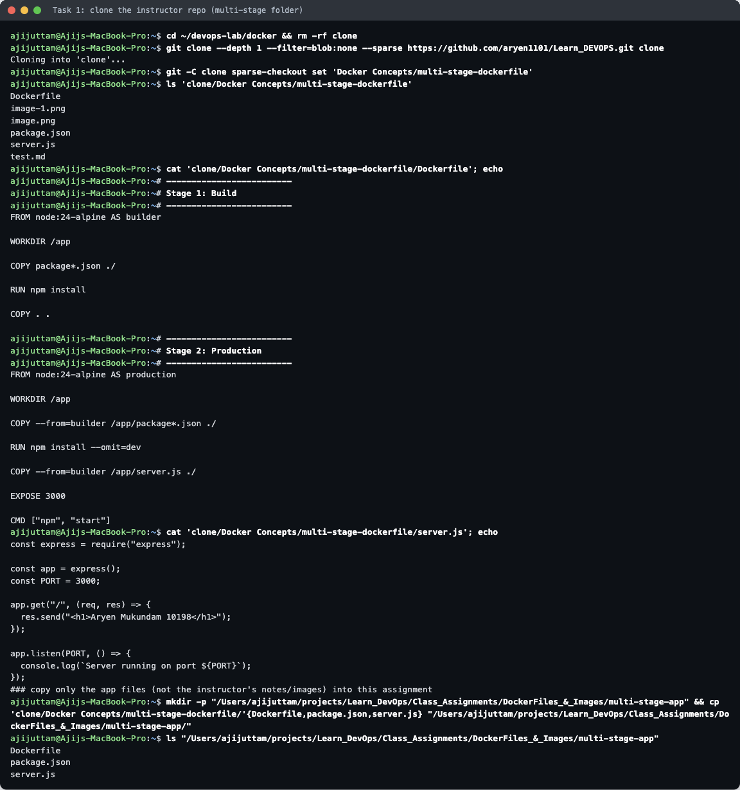

### 1.2 My edits

As provided, the app prints the instructor's name and listens on port 3000. The task asks for *"Hello World from Docker multi-stage build"* on port **8080**, so I changed only those two things (the `diff` against the clone is at the top of the next screenshot):

```diff
- const PORT = 3000;
+ const PORT = process.env.PORT || 8080;
-   res.send("<h1>Aryen Mukundam 10198</h1>");
+   res.send("<h1>Hello World from Docker multi-stage build</h1><p>Ajij Uttam (24bcs10103)</p>");
- EXPOSE 3000          (Dockerfile)
+ EXPOSE 8080
```

The two stages in the [`Dockerfile`](multi-stage-app/Dockerfile):
- **`builder`** (`node:24-alpine`) runs `npm install` and copies in the source.
- **`production`** (`node:24-alpine`) starts again from a clean image and runs `npm install --omit=dev`. It then takes only `server.js` from the builder with `COPY --from=builder`, so anything else created in the builder is left out of the final image.

### 1.3 Build

```bash
docker build -t ajij-multistage-webapp ./multi-stage-app
```

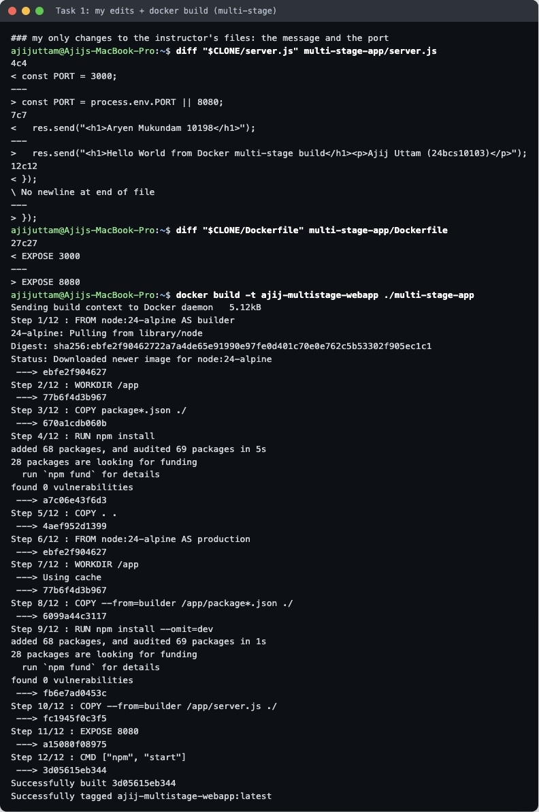

The output shows 12 steps across both stages (`Step 1/12 : FROM node:24-alpine AS builder` … `Step 6/12 : FROM node:24-alpine AS production`), ending with `Successfully tagged ajij-multistage-webapp:latest`.

### 1.4 Run, `docker ps`, access the app (Task 2 evidence)

```bash
docker run -d -p 8080:8080 --name ajij-multistage-app ajij-multistage-webapp:latest
docker ps --filter name=ajij-multistage-app
curl -s http://localhost:8080
```

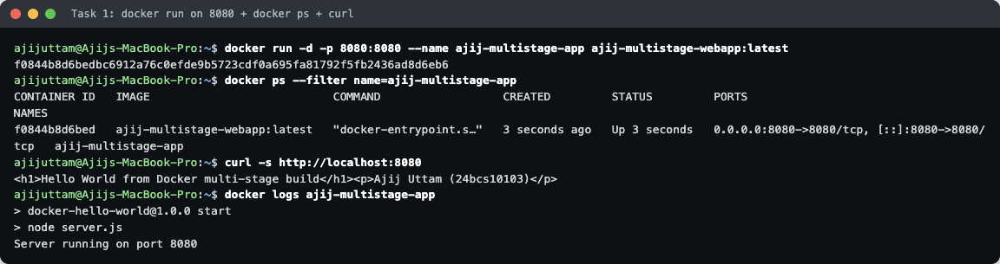

```
CONTAINER ID   IMAGE                           ...   STATUS         PORTS                                         NAMES
f0844b8d6bed   ajij-multistage-webapp:latest   ...   Up 3 seconds   0.0.0.0:8080->8080/tcp, [::]:8080->8080/tcp   ajij-multistage-app

$ curl -s http://localhost:8080
<h1>Hello World from Docker multi-stage build</h1><p>Ajij Uttam (24bcs10103)</p>
```

- `docker ps` shows the container **Up** with `0.0.0.0:8080->8080/tcp`: host port 8080 forwards to port 8080 in the container.
- The log line `Server running on port 8080` confirms the app itself listens on 8080.

Opened in the browser at `http://localhost:8080`:

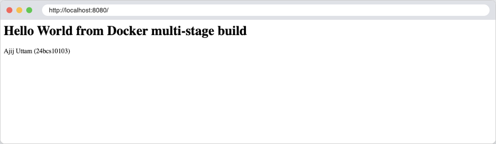

---

## Task 3 — Deploy three kinds of applications with multi-stage Dockerfiles

All three return *Hello World from Docker multi-stage build* and the runtime they run on. Each uses the same idea: **build with a big image that has the tools, run on a small image that has only what the app needs.**

| App | Build stage | Runtime stage | What is left behind | Host port |
|---|---|---|---|---|
| [Node.js](apps/node-app/Dockerfile) | `node:22-alpine`: `npm install` (with the devDependency `nodemon`), `npm test`, then `npm prune --omit=dev` | `node:22-alpine` + production `node_modules` + `server.js`, runs as `node` user | dev dependencies, npm cache | 8111 |
| [Python](apps/python-app/Dockerfile) | `python:3.12` (full image with gcc and headers): builds a virtualenv in `/opt/venv` | `python:3.12-slim` + the copied venv (a **21.3 MB** layer), runs gunicorn as a non-root user | compilers, build headers, pip cache | 8112 |
| [Java](apps/java-app/Dockerfile) | `eclipse-temurin:21-jdk-alpine`: `javac` + `jar` → `app.jar` | `eclipse-temurin:21-jre-alpine` + `app.jar` | the JDK (compiler and tools) and the `.java`/`.class` files | 8113 |

```bash
docker build -t ajij-ms-<app>:multi ./apps/<app>
docker run -d --name ajij-ms-<app> -p <host>:<container> ajij-ms-<app>:multi
```

### Node.js
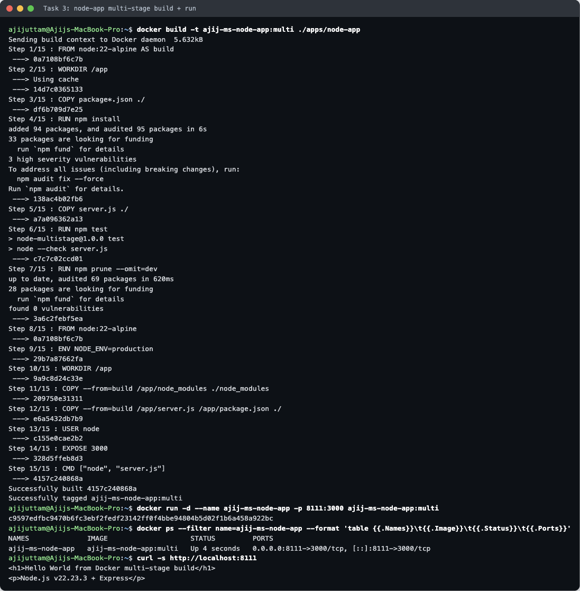
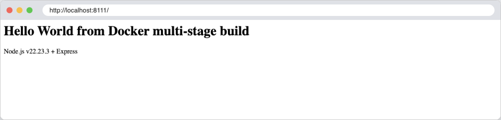

### Python
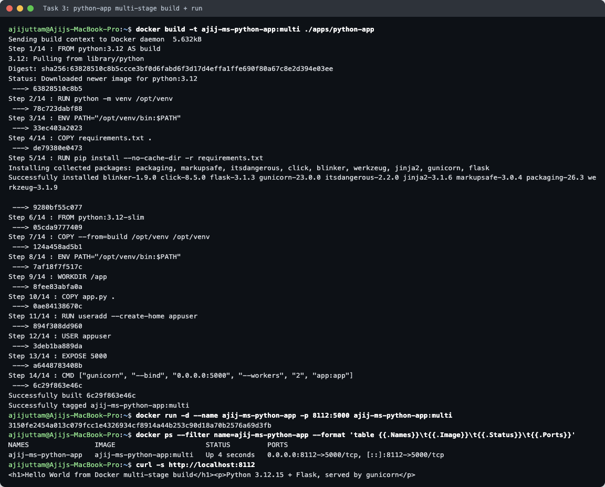
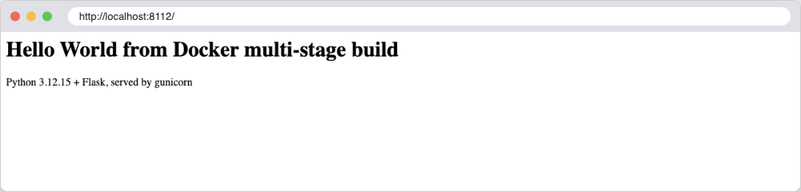

### Java
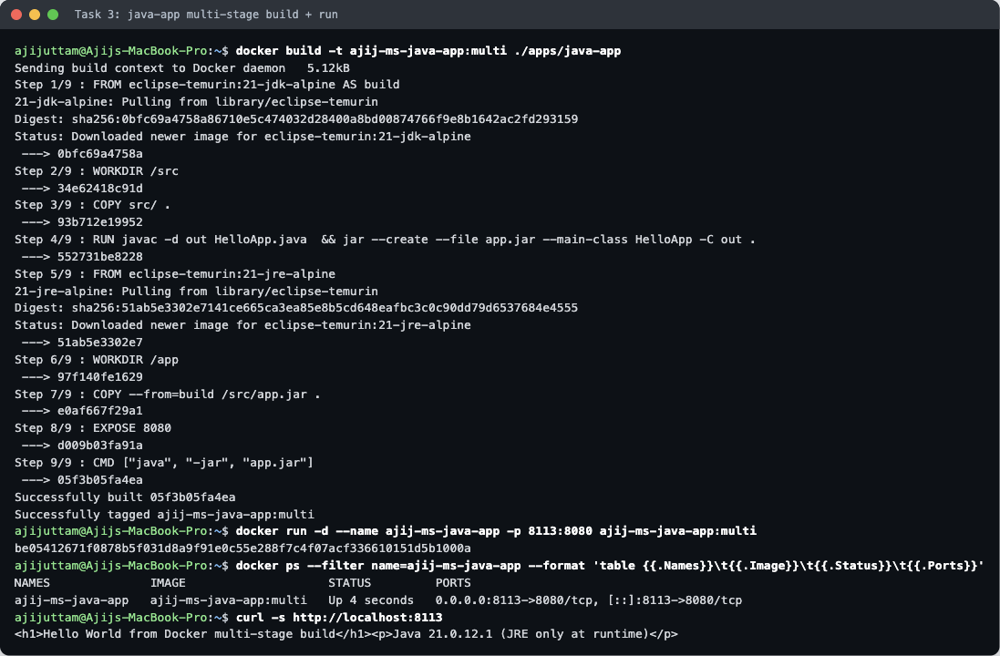
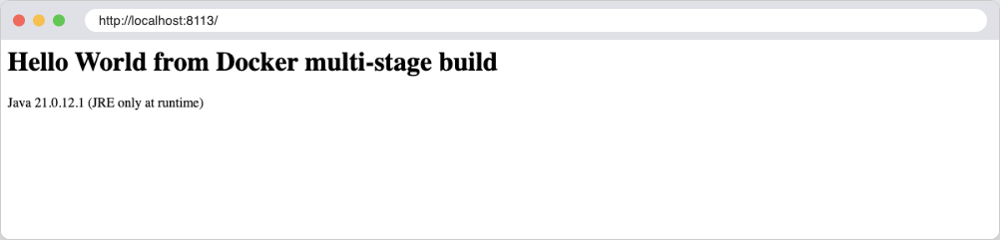

---

## Extra: single-stage vs multi-stage image size

Each app was also built from its `Dockerfile.single`, which uses the full base image (`node:24`, `node:22`, `python:3.12`, `eclipse-temurin:21-jdk`) and keeps everything in one stage. These are the sizes `docker images` reported:

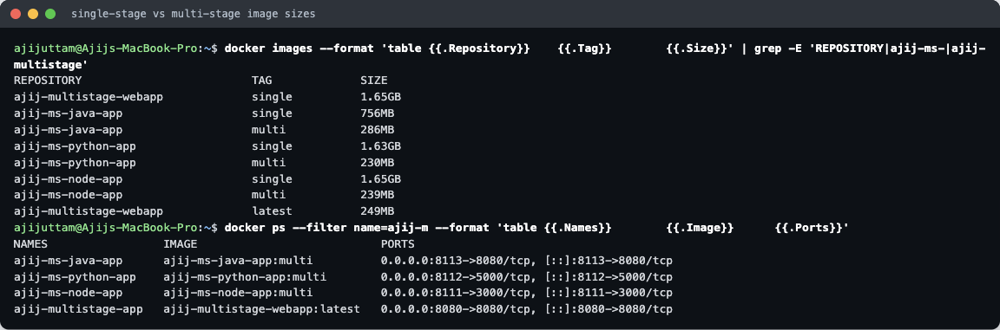

| App | Single-stage | Multi-stage | Smaller by |
|---|---|---|---|
| Instructor's Express app | 1.65 GB | **249 MB** | ~85% |
| Node.js app | 1.65 GB | **239 MB** | ~86% |
| Python app | 1.63 GB | **230 MB** | ~86% |
| Java app | 756 MB | **286 MB** | ~62% |

`docker ps` in the same screenshot shows all four multi-stage containers running together on ports 8080, 8111, 8112 and 8113.

**What the comparison shows:**
- Most of the saving comes from the **runtime base image**. The full `node`/`python` images include compilers, headers and a full Debian userland that the running app never uses. Multi-stage builds let you keep those tools in the build stage and still ship a slim or alpine runtime image.
- In the instructor's Dockerfile both stages are `node:24-alpine`, and `express` is a production dependency, so its two stages contain almost the same files. Compared with a single-stage `node:24-alpine` build, the saving would be small (I did not build that variant, so I have no measured number for it). The 1.65 GB → 249 MB difference above is mostly `node:24` vs `node:24-alpine`.
- For Java the gain is clearest: the runtime needs only a JRE. Removing the compiler and switching to alpine cut the image from 756 MB to 286 MB.
- A smaller runtime image also has fewer packages that can contain vulnerabilities, and it pulls faster on every deploy.

Note on the numbers: Docker 29 here uses the containerd image store, and `docker images` reports its size figure. The same image can show a different size on Docker Desktop or with the older overlay2 store. The single-stage vs multi-stage comparison is fair because both were measured the same way.

All containers and images from this homework were removed afterwards.
