# Docker Fundamentals — Homework

**Name:** Ajij Uttam  **Enrollment No:** 24bcs10103

Six "Hello World" web apps. Each one sits in its own folder with its code and a `Dockerfile`, and each was built, run and opened in a browser.

**Environment:** macOS on Apple Silicon (arm64), Docker Engine 29.5.2 running in a Colima VM. Every base image used has an arm64 variant, so nothing needed emulation. All six were built and started by [`lab/run.sh`](lab/run.sh). The full output for each app is in [`lab/<app>.txt`](lab/). The terminal screenshots leave out the layer-download progress lines; the `.txt` files have everything.

| Folder | Stack | Base image | Container port | Host port | Image size |
|---|---|---|---|---|---|
| [`nodejs-app/`](nodejs-app) | Node.js, built-in `http` module | `node:22-alpine` | 3000 | 8101 | 234 MB |
| [`python-app/`](python-app) | Python 3.12 + Flask | `python:3.12-slim` | 5000 | 8102 | 223 MB |
| [`java-app/`](java-app) | Java 21, JDK's built-in `HttpServer` | `eclipse-temurin:21-jdk` | 8080 | 8103 | 756 MB |
| [`Apache-app/`](Apache-app) | Apache httpd 2.4, static page | `httpd:2.4` | 80 | 8104 | 205 MB |
| [`React-app/`](React-app) | React 19 + Vite, served by Nginx | `node:22-alpine` → `nginx:alpine` | 80 | 8105 | 93.3 MB |
| [`nginx-app/`](nginx-app) | Nginx, static page | `nginx:alpine` | 80 | 8106 | 93 MB |

Every app follows the same pattern:

```bash
docker build -t ajij-<app> ./<folder>              # build the image from the folder's Dockerfile
docker run -d --name ajij-<app> -p <host>:<container> ajij-<app>
docker ps                                           # check it is Up and the port is mapped
curl -s http://localhost:<host>                     # or open it in the browser
```

Note: this Docker install has no `buildx` plugin, so `docker build` printed *"DEPRECATED: The legacy builder is deprecated"* and used the classic builder (the `Step 1/6 …` output). The builds still worked, multi-stage ones included.

---

## 1. Node.js app — `nodejs-app/`

[`server.js`](nodejs-app/server.js) uses only Node's built-in `http` module, so there is nothing to `npm install` and no `node_modules`. The [`Dockerfile`](nodejs-app/Dockerfile) copies the two files into `node:22-alpine` and switches to the image's unprivileged `node` user before starting.

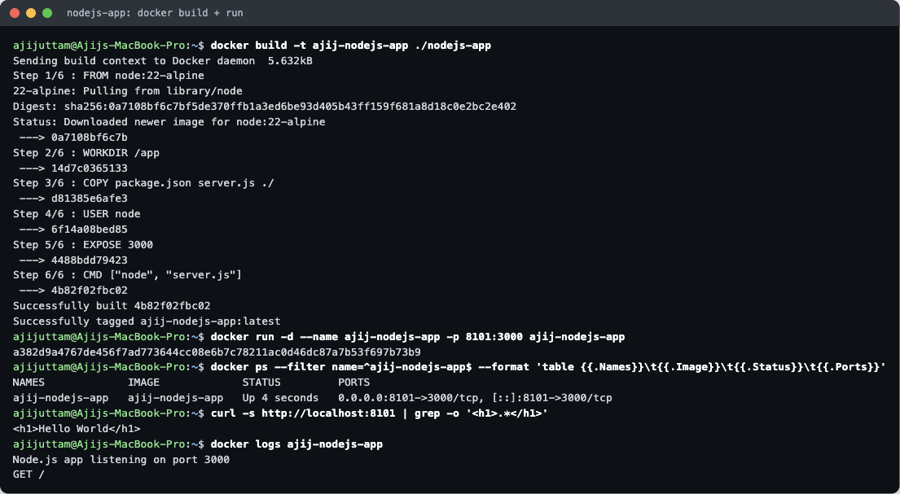
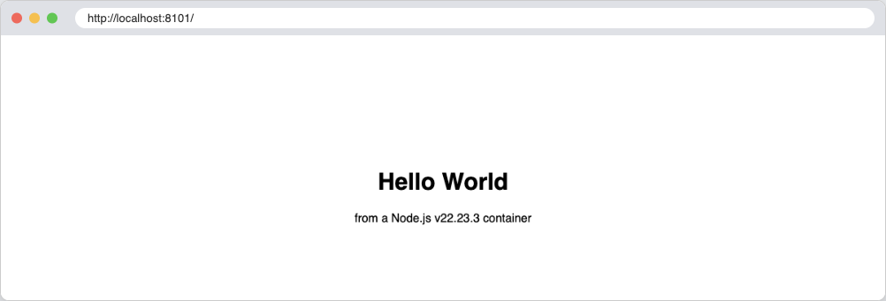

## 2. Python app — `python-app/`

A one-route Flask app ([`app.py`](python-app/app.py)). The [`Dockerfile`](python-app/Dockerfile) copies `requirements.txt` first and runs `pip install` before copying `app.py`. That way, editing the code only rebuilds the last layer and the dependency layer stays cached. It listens on `0.0.0.0`; with `127.0.0.1` the app would only be reachable from inside the container.

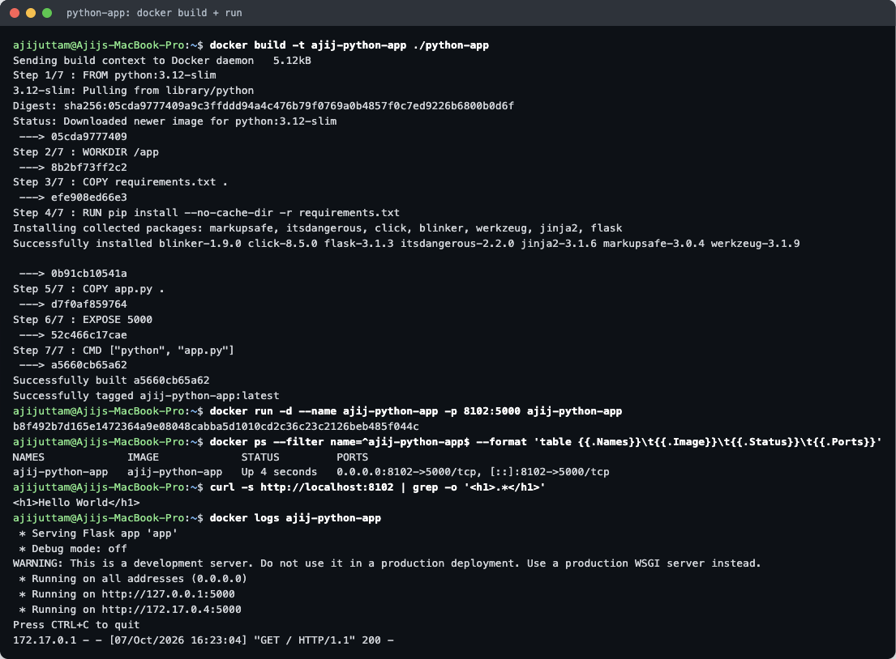
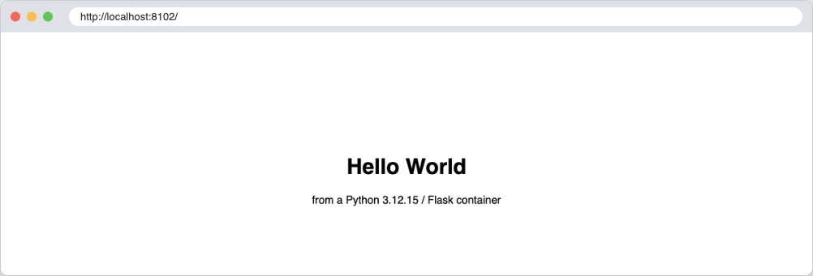

## 3. Java app — `java-app/`

[`HelloWorld.java`](java-app/HelloWorld.java) uses `com.sun.net.httpserver.HttpServer`, which ships with the JDK, so no Maven or Spring is needed. The [`Dockerfile`](java-app/Dockerfile) compiles it with `javac` during the build and runs it with `java HelloWorld`. The image is the largest of the six (**756 MB**) because the whole JDK, compiler included, stays in it. The multi-stage homework (`../DockerFiles_&_Images`) shrinks this to 286 MB.

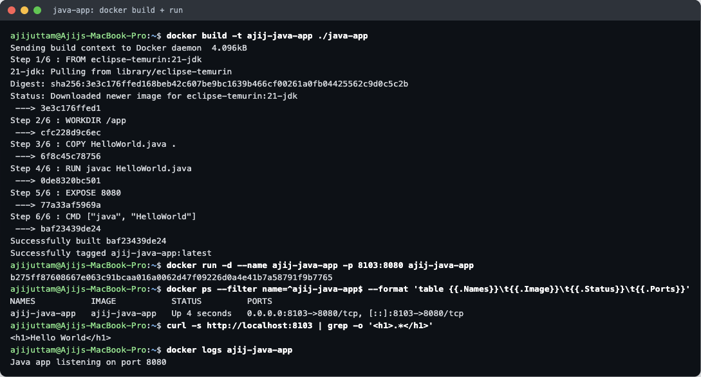
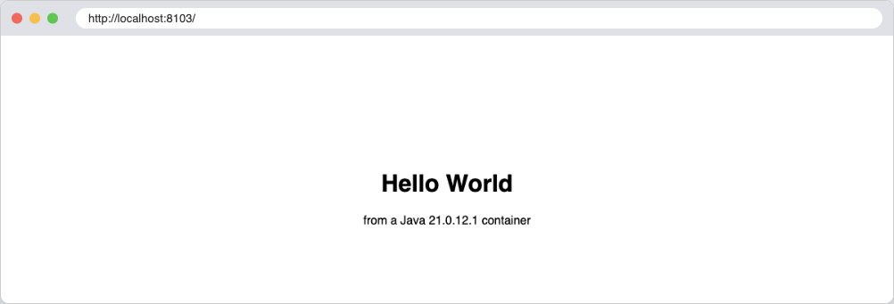

## 4. Apache app — `Apache-app/`

The official `httpd` image serves `/usr/local/apache2/htdocs/`, so the [`Dockerfile`](Apache-app/Dockerfile) only copies [`index.html`](Apache-app/index.html) there. The `AH00558 … Could not reliably determine the server's fully qualified domain name` lines in the log are harmless warnings, because no `ServerName` is set. The access log line `"GET / HTTP/1.1" 200` is the `curl` request.

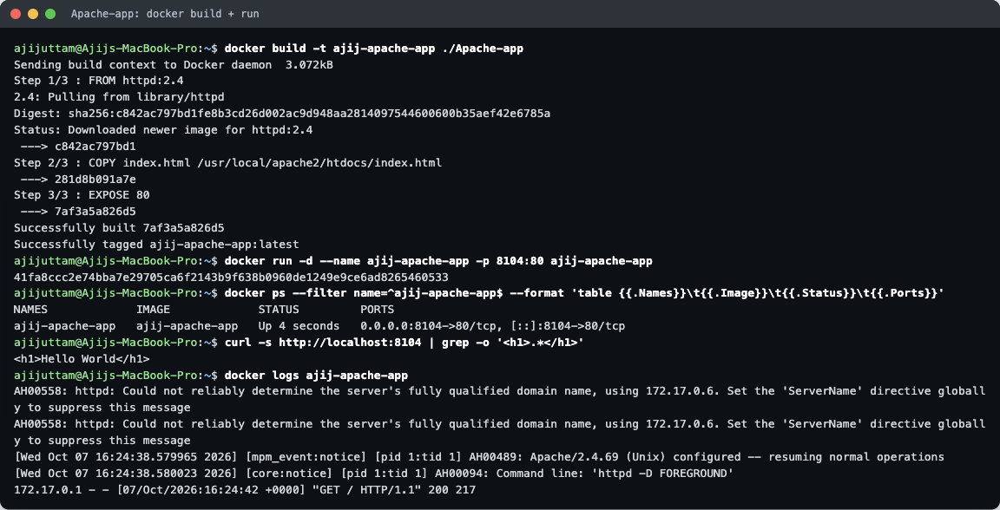


## 5. React app — `React-app/`

A small Vite + React 19 project ([`src/App.jsx`](React-app/src/App.jsx) renders the heading and a click counter). The [`Dockerfile`](React-app/Dockerfile) has two stages:
1. `node:22-alpine` runs `npm install` and `npm run build`, which writes the static bundle to `dist/` (`index-*.js`, 222.81 kB, 69.48 kB gzipped).
2. `nginx:alpine` receives only `dist/`. Node, `node_modules` and the source code do not reach the final image, which is why it is **93.3 MB**, about the same as plain nginx.

`curl` does not find an `<h1>`, because React builds the page in the browser and the HTML only contains an empty `<div id="root"></div>` (shown in the last screenshot below). The browser screenshot shows the rendered page.

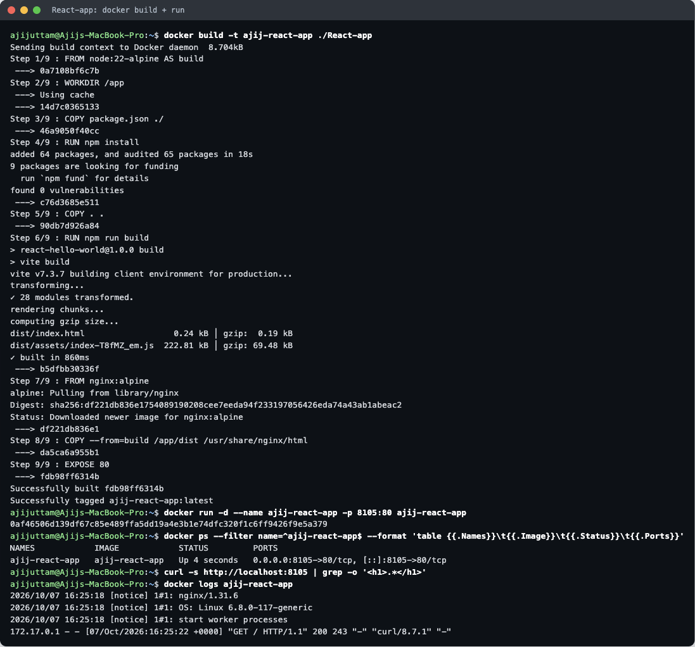


## 6. Nginx app — `nginx-app/`

The [`Dockerfile`](nginx-app/Dockerfile) copies [`index.html`](nginx-app/index.html) over nginx's default page in `/usr/share/nginx/html/`.

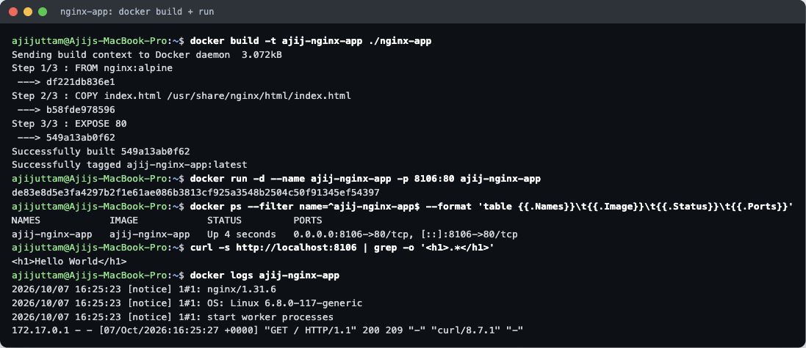
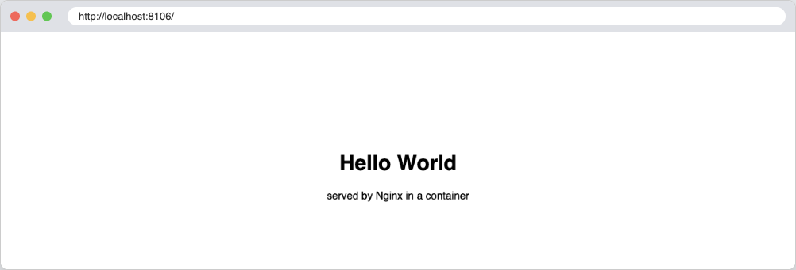

---

## All six running together

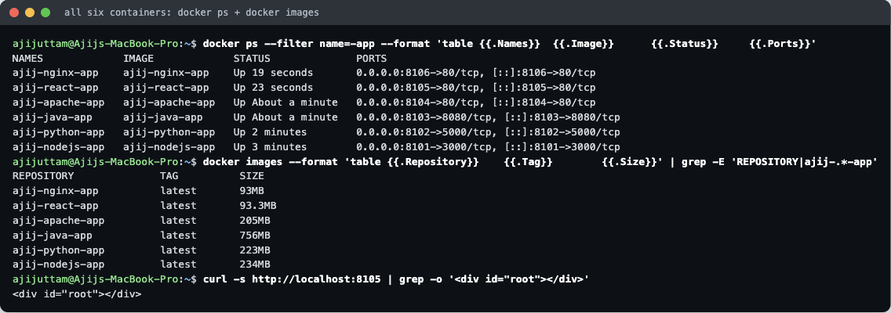

`docker ps` shows the six containers running at the same time, each published on its own host port (`8101`–`8106`). The container ports can repeat (three of them use 80) because every container has its own network namespace. Only the **host** ports have to be unique.

**What the image sizes show:** the base image decides most of the size. The Java image carries a full JDK (756 MB). The two images that end on `nginx:alpine` are the smallest (about 93 MB) even though one of them is a React build, because the build tools stayed in the discarded first stage.

The containers and images were removed after the screenshots (`docker rm -f …`, `docker rmi …`).
