# Docker Networking & Volumes — Homework

**Name:** Ajij Uttam  **Enrollment No:** 24bcs10103

**Environment:** macOS on Apple Silicon (arm64), Docker Engine 29.5.2 in a **Colima** Linux VM (Ubuntu kernel 6.8, aarch64). Images used: `nginx:alpine`, `alpine:3.22`, `mysql:8.4`, `httpd:2.4`. All of them have arm64 builds. Scripts: [`lab/`](lab/). Each `NN-*.sh` has a matching `NN-*.txt` with its real output.

> **Colima note.** On a Mac, Docker does not run on macOS itself. It runs inside a small Linux VM, so the Docker "host" is that VM, not the Mac. This matters for the host network and overlay tasks below.

---

## Task 1 — Frontend, backend and database on three networks

### Design

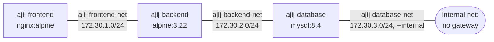

| Container | Image | Networks |
|---|---|---|
| `ajij-frontend` | `nginx:alpine` | `ajij-frontend-net` |
| `ajij-backend` | `alpine:3.22` | **`ajij-frontend-net` + `ajij-backend-net`** (the two-network container) |
| `ajij-database` | `mysql:8.4` | `ajij-backend-net` + `ajij-database-net` |

- The **backend** sits on two networks and is the only container that can reach both the frontend and the database. This is the usual 3-tier layout: the web tier never talks to the database directly.
- With three networks and only the backend allowed to join two, one network would end up with a single container. So the database also joins `ajij-database-net`, an **`--internal`** network: Docker gives it no gateway, so it has no route outside the host. In a real setup, database-only traffic (replicas, backup agents) would go there.
- The MySQL password `labpass` is a throwaway value for this local lab.

```bash
docker network create --subnet 172.30.1.0/24 ajij-frontend-net
docker network create --subnet 172.30.2.0/24 ajij-backend-net
docker network create --subnet 172.30.3.0/24 --internal ajij-database-net
docker run -d --name ajij-frontend --network ajij-frontend-net nginx:alpine
docker run -d --name ajij-backend  --network ajij-frontend-net alpine:3.22 sleep infinity
docker network connect ajij-backend-net ajij-backend            # backend joins a 2nd network
docker run -d --name ajij-database --network ajij-backend-net -e MYSQL_ROOT_PASSWORD=labpass -e MYSQL_DATABASE=school mysql:8.4
docker network connect ajij-database-net ajij-database
```

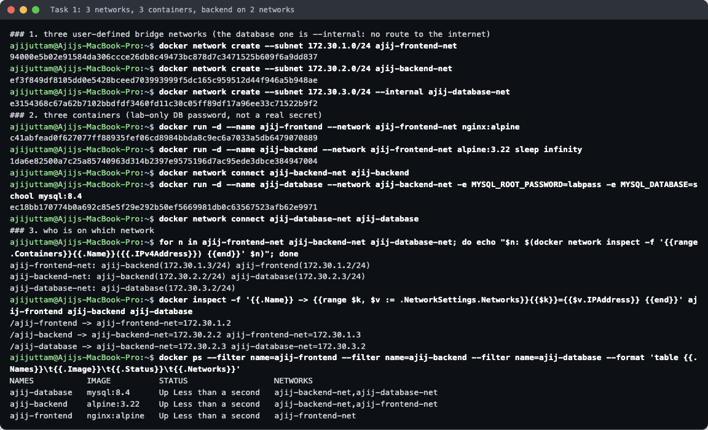

`docker inspect` shows the backend with **two IP addresses**, one on each network: `ajij-backend-net=172.30.2.2 ajij-frontend-net=172.30.1.3`. `docker ps` lists its networks as `ajij-backend-net,ajij-frontend-net`.

### Connectivity checks

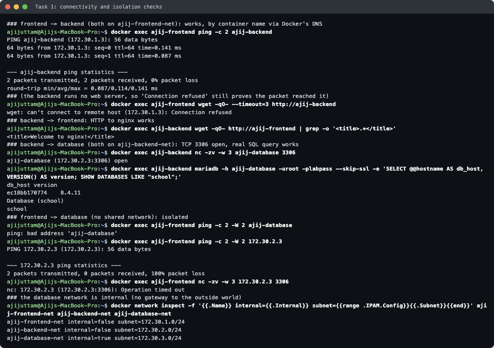

| From → To | Shared network? | Test | Result |
|---|---|---|---|
| frontend → backend | yes (`frontend-net`) | `ping ajij-backend` | ✅ 2/2 replies; the name resolved to `172.30.1.3` |
| frontend → backend | yes | `wget http://ajij-backend` | `Connection refused`, meaning the packet arrived and the backend replied, but nothing listens on port 80 there. This is still connectivity. |
| backend → frontend | yes | `wget http://ajij-frontend` | ✅ `<title>Welcome to nginx!</title>` |
| backend → database | yes (`backend-net`) | `nc -zv ajij-database 3306` | ✅ `open` |
| backend → database | yes | real SQL query with the MySQL client | ✅ `VERSION() = 8.4.11`, database `school` exists |
| frontend → database | **no** | `ping ajij-database` | ❌ `bad address`: Docker's DNS only answers for containers on your own networks |
| frontend → database | **no** | `ping 172.30.2.3` (IP, skipping DNS) | ❌ 100% packet loss |
| frontend → database | **no** | `nc -zv 172.30.2.3 3306` | ❌ `Operation timed out`: Docker's firewall rules drop traffic between different bridge networks |

So isolation does not depend on DNS alone. Even with the database's real IP, the frontend cannot reach it, because traffic between two user-defined bridges is dropped.

**Problem I hit:** the first SQL attempt from the backend failed with
`ERROR 1045 (28000): Plugin caching_sha2_password could not be loaded` ([`lab/02-connectivity-first-try.txt`](lab/02-connectivity-first-try.txt)). MySQL 8.4 uses the `caching_sha2_password` login method by default, and Alpine's `mariadb-client` package does not include that plugin. Installing `mariadb-connector-c` as well, which provides `caching_sha2_password.so`, fixed it.

**Why user-defined networks instead of the default `bridge`:** they come with a built-in DNS server, so containers find each other **by name** (`ajij-backend`). They also isolate groups of containers from each other, and containers can be connected or disconnected while running (`docker network connect`).

---

## Task 2 — Apache2 on the host network

The official Apache image on Docker Hub is `httpd` (Apache HTTP Server 2.4). With Colima, "host network" means the **VM's** network stack, so I first checked that nothing in the VM was using port 80:

```bash
colima ssh -- sudo ss -tlnp 'sport = :80'     # empty → port 80 free
docker run -d --name ajij-apache-host --network host httpd:2.4
colima ssh -- curl -s http://localhost:80     # from inside the Docker host (the VM)
curl -s http://localhost:80                   # from macOS
```

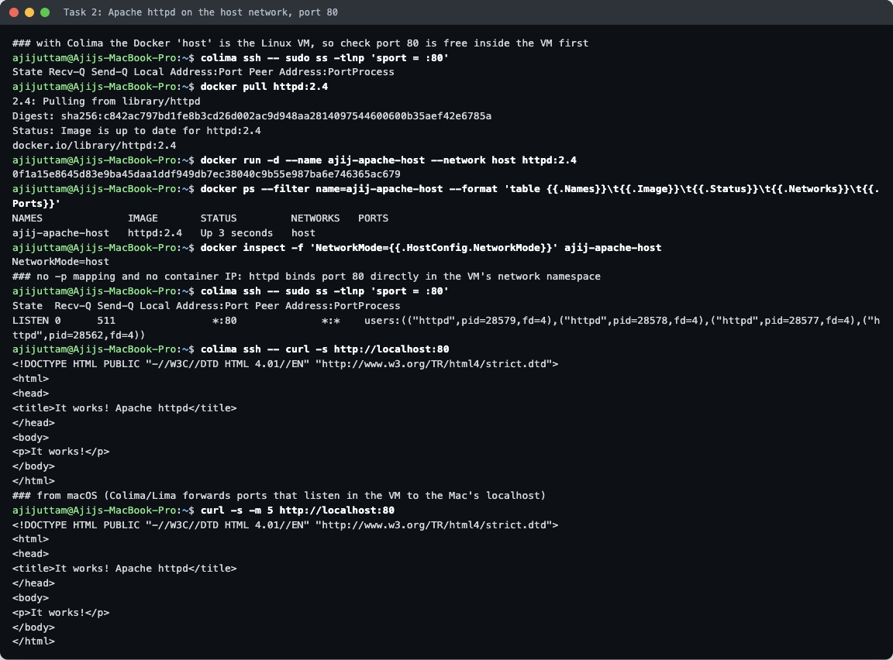

- `docker ps` shows `NETWORKS = host` and an **empty PORTS column**. No `-p` was needed, because the container does not get its own network namespace or IP (`NetworkMode=host`).
- Inside the VM, `ss` shows **`httpd` itself** listening on `*:80`. There is no `docker-proxy` in between, unlike a normal `-p` mapping.
- `curl localhost:80` inside the VM returns Apache's *It works!* page.
- From the Mac: Colima watches for ports that open inside the VM and forwards them to the Mac's `localhost`, so the same page also loads at `http://localhost:80` in the browser:

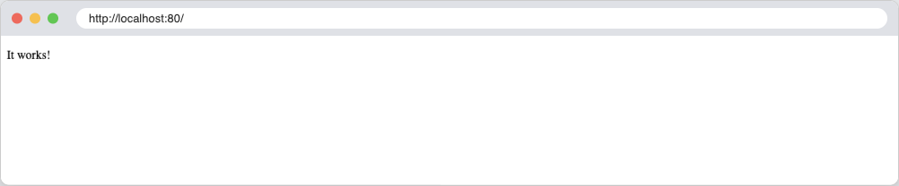

On a normal Linux server, `--network host` puts Apache straight onto the server's real port 80. On a Mac it lands on the VM's port 80, and Colima's port forwarding makes it reachable from the Mac.

Pros: no NAT, slightly faster, and the app sees the real network interfaces. Cons: no isolation, and two containers cannot both use port 80.

---

## Task 3 — Bind mount

```bash
mkdir -p bind-mount-site
echo '<h1>Hello students</h1>' > bind-mount-site/index.html
docker run -d --name ajij-nginx-bind -p 8121:80 \
  -v "$PWD/bind-mount-site":/usr/share/nginx/html:ro nginx:alpine
```

**Before:** the folder on the Mac is mounted over nginx's web root (`bind: …/Docker_Network/bind-mount-site -> /usr/share/nginx/html (rw=false)`). I mounted it read-only (`:ro`) because the container only needs to read the files.

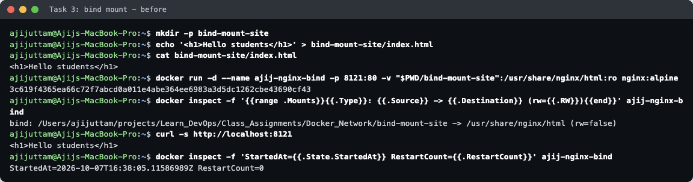
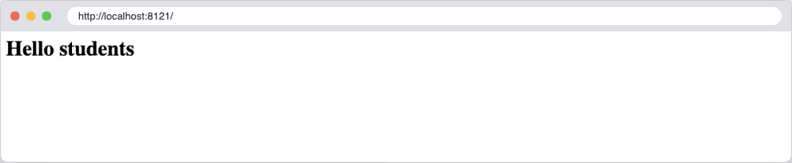

**After:** I edited `index.html` **on the Mac** while the container kept running, then reloaded the page:

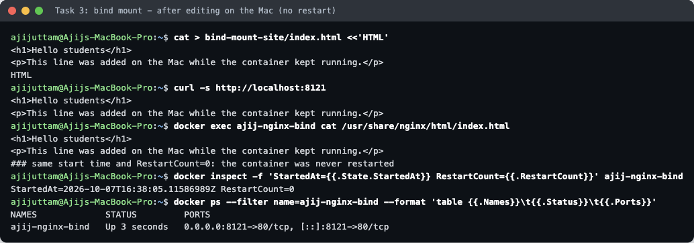
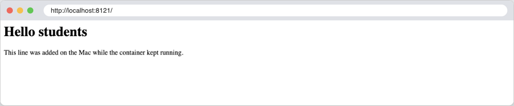

- `curl` and `docker exec … cat` both show the new line straight away.
- `StartedAt=2026-10-07T16:38:05.11586989Z RestartCount=0` is the same before and after, so **the container was never restarted**.
- It works because a bind mount does not copy files into the container. The container sees the Mac's folder directly (Colima shares the home directory with the VM), and nginx reads `index.html` from disk on every request.

The folder is committed as [`bind-mount-site/`](bind-mount-site) and contains the edited version of the file.

Tip: mount the **folder**, not just the file. Many editors save by writing a new file and renaming it over the old one. A single-file bind mount stays attached to the old file, so the container would keep showing the old content.

---

## Task 4 — Overlay networks

### What an overlay network is

A `bridge` network exists on **one** Docker host. An **overlay** network is a single virtual network that spans **many** Docker hosts. Containers on different machines get IPs in the same subnet and reach each other by name, as if they were on one switch.

### How it works across hosts

- **Control plane: Docker Swarm.** Overlay networks need the hosts to be in a swarm (`docker swarm init` on one, `docker swarm join` on the others). Swarm managers store the network definitions in their Raft database and share which container IP lives on which host using a gossip protocol.
- **Data plane: VXLAN.** When a container on host A sends a packet to a container on host B, Docker wraps the original Ethernet frame inside a **UDP packet (port 4789)** with a VXLAN header that carries the network's ID (the *VNI*). Host B unwraps it and delivers it to the right container. The physical network only sees UDP traffic between the two hosts.
- **Ports that must be open between hosts:** TCP 2377 (swarm management), TCP/UDP 7946 (node gossip), UDP 4789 (VXLAN data). Adding `--opt encrypted` encrypts the VXLAN traffic with IPsec.
- **Service discovery and load balancing:** a service name resolves to a **virtual IP** that load-balances across its tasks. `tasks.<service>` returns every task's IP.
- **`ingress` and the routing mesh:** publishing a port (`-p 8131:80`) on a service opens it on **every** node. A request to any node is forwarded over the `ingress` overlay to a healthy task, even one running on a different node.
- **`docker_gwbridge`:** a local bridge on each node that gives overlay containers their outbound internet access.

### Use cases

- Docker Swarm services spread across several machines (web replicas on 3 nodes talking to an API on 2 others).
- Connecting standalone containers on different hosts, using an `--attachable` overlay.
- Multi-host setups that need isolation between apps: each stack gets its own overlay, optionally encrypted.
- Kubernetes uses the same idea (VXLAN overlays in CNI plugins such as Flannel and Calico) to give every pod a routable IP across nodes.

### Single-node demo (run for real)

I have only one Docker host, so this demo shows the overlay mechanics (swarm, VXLAN network, service DNS, VIP load balancing, routing mesh) on one node. Traffic between two machines could not be shown here.

The Docker daemon is shared with other projects' kind/minikube clusters (`k8s-a`, `k8s-b`). So the script first checked that swarm was off and those clusters were running. At the end it removed everything, left the swarm, and checked them again.

```bash
docker swarm init --advertise-addr 192.168.5.1
docker network create -d overlay --attachable --subnet 10.20.0.0/24 ajij-overlay
docker service create --name ajij-web --replicas 2 --network ajij-overlay -p 8131:80 nginx:alpine
docker run --rm --network ajij-overlay alpine:3.22 sh -c 'nslookup ajij-web; nslookup tasks.ajij-web; wget -qO- http://ajij-web'
```

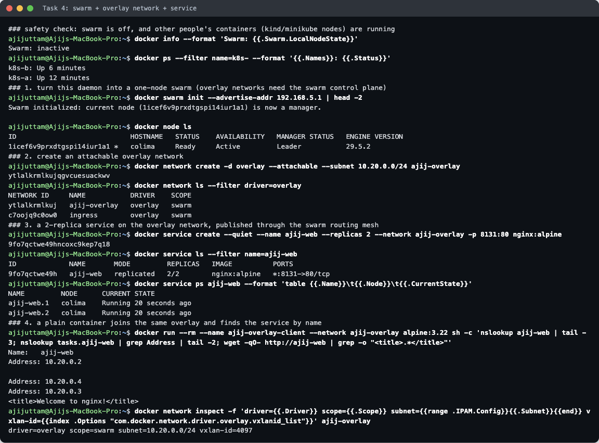

- `docker network ls` shows **`ajij-overlay  overlay  swarm`** next to the automatically created `ingress` overlay.
- `docker network inspect` shows `driver=overlay scope=swarm subnet=10.20.0.0/24 vxlan-id=4097`. 4097 is the VXLAN ID (VNI) that would be stamped on packets going between hosts.
- A plain `docker run` container joined the overlay (allowed because of `--attachable`). There, `ajij-web` resolved to the service's **virtual IP `10.20.0.2`**, `tasks.ajij-web` returned the **two task IPs `10.20.0.3` and `10.20.0.4`**, and `wget http://ajij-web` returned the nginx page.

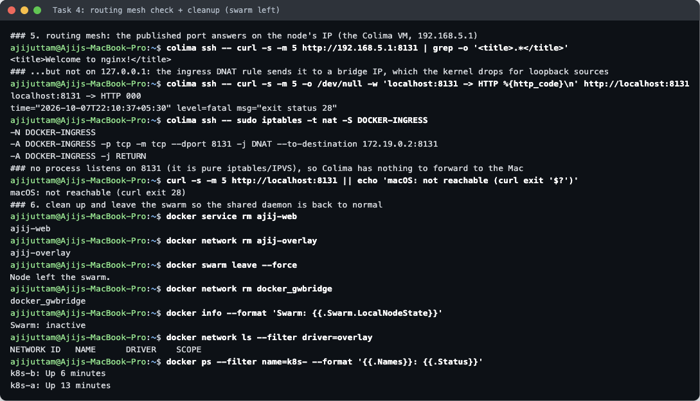

**Routing mesh result (with one problem I hit):**
- `curl http://192.168.5.1:8131` from inside the VM (the node's own IP) → ✅ nginx page, served through the `ingress` overlay.
- `curl http://localhost:8131` inside the VM → ❌ timed out (`HTTP 000`). The rule `DOCKER-INGRESS … DNAT --to-destination 172.19.0.2:8131` sends the packet to the `docker_gwbridge` address, but the packet still has source address `127.0.0.1`. With `net.ipv4.conf.all.route_localnet = 0` (checked in the VM), Linux does not route loopback-source packets out of the loopback interface, so the packet is dropped. My first run only tried `localhost` and failed ([`lab/05-overlay-first-try.txt`](lab/05-overlay-first-try.txt)). Testing the node IP showed the mesh itself works.
- From macOS → ❌ not reachable. The routing mesh is pure iptables/IPVS rules, and no process listens on 8131, so Colima's port forwarder (which forwards listening sockets) has nothing to forward. On a real multi-node swarm you would use any node's IP.

**Cleanup:** `docker service rm`, `docker network rm ajij-overlay`, `docker swarm leave --force`, `docker network rm docker_gwbridge`. Afterwards swarm was `inactive`, no overlay networks were left, and `k8s-a` / `k8s-b` were still `Up`.

---

## Cleanup

All containers (`ajij-frontend`, `ajij-backend`, `ajij-database`, `ajij-apache-host`, `ajij-nginx-bind`) and the three `ajij-*-net` networks were removed after the screenshots, and port 80 in the VM was freed.
