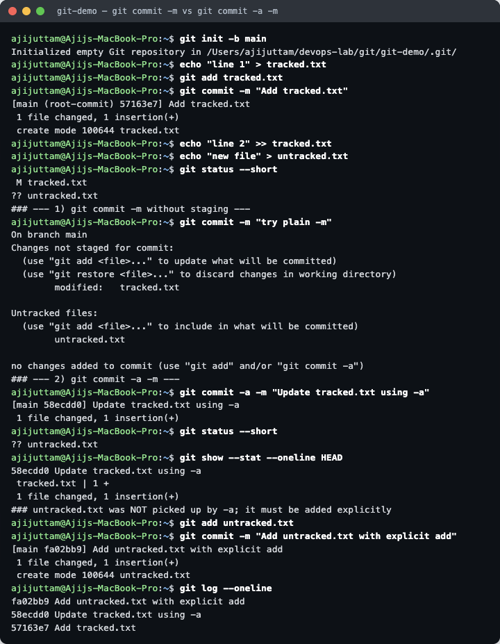
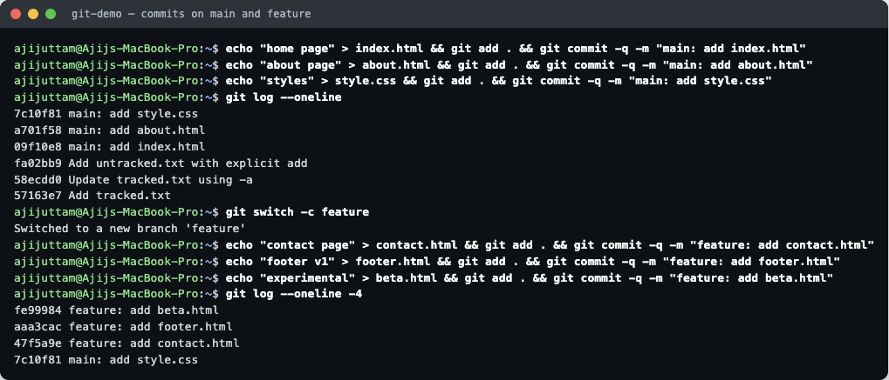
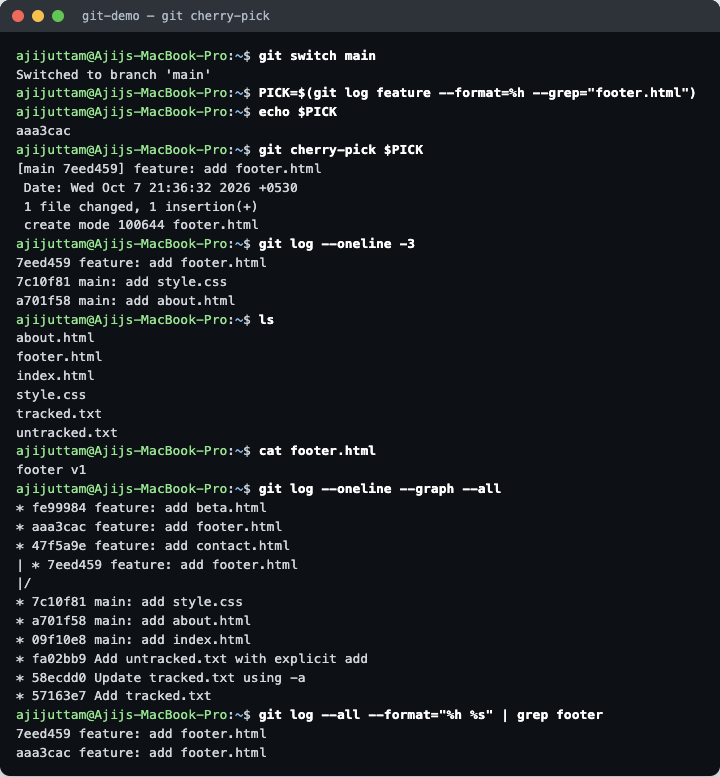

# Git & GitHub — Homework

**Name:** Ajij Uttam  **Enrollment No:** 24bcs10103

Everything below was run in a throwaway repo (`~/devops-lab/git/git-demo`) on macOS, Git `2.55.0`. The script that produced the output is [`lab/run.sh`](lab/run.sh), and the raw transcripts are in [`lab/`](lab/).

---

## Task 1 — `git commit -m` vs `git commit -a -m`

**Setup:** one file (`tracked.txt`) is committed and then modified. A second file (`untracked.txt`) is created but never added. Both kinds of change are present at the same time, so one test shows the difference for each.



<details><summary>Output as text</summary>

```
$ git status --short
 M tracked.txt
?? untracked.txt
$ git commit -m "try plain -m"
...
no changes added to commit (use "git add" and/or "git commit -a")
$ git commit -a -m "Update tracked.txt using -a"
[main 58ecdd0] Update tracked.txt using -a
 1 file changed, 1 insertion(+)
$ git status --short
?? untracked.txt
```
</details>

**What happened**

| Command | What it commits | Result here |
|---|---|---|
| `git commit -m "msg"` | Only what is already in the **staging area** (`git add` first) | Nothing was staged, so Git refused: *no changes added to commit* |
| `git commit -a -m "msg"` | Auto-stages every **modified or deleted tracked** file, then commits | Committed `tracked.txt`, but **left `untracked.txt` alone** |

**Takeaway:** `-a` is a shortcut for `git add -u` followed by `git commit`. It never picks up new files. A new file always needs an explicit `git add` (commit `fa02bb9`).

---

## Task 2 — Git Cherry-Pick

### Step 1: three commits on `main`, a `feature` branch with three more



```
$ git log --oneline -4          # on feature
fe99984 feature: add beta.html
aaa3cac feature: add footer.html     <- the one we want on main
47f5a9e feature: add contact.html
7c10f81 main: add style.css
```

### Step 2: pick only `footer.html` into `main`

The commit hash is found with `git log --grep` instead of being copied by hand. Then `git cherry-pick` runs on `main`.



```
$ git cherry-pick aaa3cac
[main 7eed459] feature: add footer.html
$ ls
about.html  footer.html  index.html  style.css  tracked.txt  untracked.txt
```

### Step 3: verify

- `footer.html` now exists on `main` with content `footer v1`.
- `contact.html` and `beta.html` are **not** on `main`. Only the one commit was applied.
- The graph shows the same change twice under **different hashes**: `aaa3cac` on `feature` and `7eed459` on `main`. Cherry-pick copies a commit's *changes* into a new commit with a new parent. It does not move the original commit.

```
* fe99984 feature: add beta.html
* aaa3cac feature: add footer.html
* 47f5a9e feature: add contact.html
| * 7eed459 feature: add footer.html
|/
* 7c10f81 main: add style.css
```

**When to use it:** to bring one hotfix from a feature or release branch onto `main` without merging the rest of that branch.
