# Helm — Homework

**Name:** Ajij Uttam  **Enrollment No:** 24bcs10103

Session 15: the core Helm commands, a full install → upgrade → bad upgrade → rollback workflow, and the Helm mini project (the "Notes App" chart).

**Environment:** **Helm v4.3.0** against the single-node minikube cluster `k8s-b` (Kubernetes **v1.37.0**). Every Helm command uses `--kube-context k8s-b`, and every kubectl command uses `--context k8s-b`. Helm 4 differs from the Helm 3 commands in the course notes in a few places, which I point out where they came up (`helm list -a` is gone, `--atomic` is now `--rollback-on-failure`, and releases use server-side apply).

**Provided material used** (course repo `Kubernetes/Helm/`):
- `Practise.md` lists the command sequence for each topic, including **`10-mini-project`** (the `notes-chart` "Notes App").
- `07-install-upgrade/app-chart/{Chart.yaml,values.yaml}` is the chart used for the rollback workflow.

The course repo has **no `mini-project/` folder and no templates for `app-chart`**: only `Chart.yaml` and `values.yaml` are there. So I wrote the `app-chart` templates and the whole `notes-chart` myself, following the commands in `Practise.md` (`helm lint/template/install notes-dev`, `get configmaps`, `upgrade -f notes-chart/values-prod.yaml`, upgrade to `broken-tag-does-not-exist`, `rollback notes-dev 2`, uninstall). I also changed `app-chart`'s default tag from `1.24` to `1.27`, so the lab reused the nginx image already cached on the node instead of pulling another one over a slow connection.

**How it was run:** [`lab/run.sh <step>`](lab/run.sh), with each step's output in `lab/<step>.txt`. Terminal screenshots are renderings of those files. Browser screenshots are the real Notes App opened through `kubectl port-forward`.

```
Helm/
├── 01-commands/demo-chart/      # output of `helm create` (committed as generated)
├── 02-rollback/app-chart/       # course Chart.yaml + values.yaml, my templates
├── mini-project/notes-chart/    # my Notes App chart: templates + values.yaml + values-prod.yaml
├── lab/                         # run.sh + transcripts
└── images/
```

**Key ideas.** A **chart** is a package of templated Kubernetes YAML plus default values. A **release** is one installed instance of a chart, with a name. Every install, upgrade or rollback creates a numbered **revision**, which Helm 4 stores as a Secret (`sh.helm.release.v1.<name>.v<N>`) in the release's namespace. Keeping that history is what makes `history` and `rollback` possible.

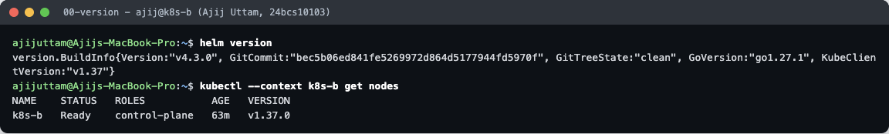

---

## Task 1 — Helm commands

### `helm create`
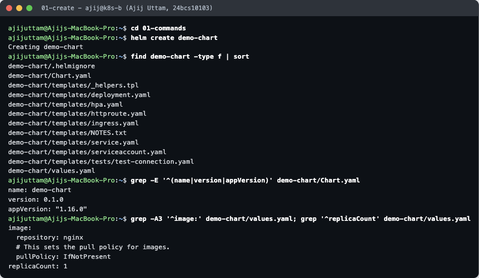

Scaffolds a new chart: `Chart.yaml` (name `demo-chart`, chart `version: 0.1.0`, `appVersion: "1.16.0"`), `values.yaml` (`replicaCount: 1`, `image.repository: nginx`), `templates/` (Deployment, Service, ServiceAccount, Ingress, **HTTPRoute** (Gateway API), HPA, `NOTES.txt`, `_helpers.tpl` for named templates) and `templates/tests/test-connection.yaml` (a Pod that `helm test` runs). The `version` field is the chart's own version. `appVersion` is the version of the app it deploys, and it is used as the image tag when `image.tag` is empty.

### `helm lint` / `helm template` (checks before installing)
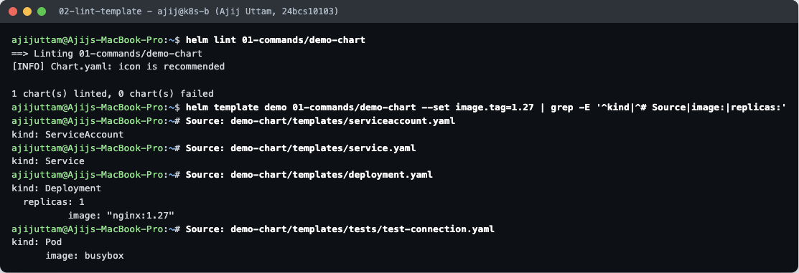

`lint` checks the chart structure and syntax (`1 chart(s) linted, 0 chart(s) failed`; the `icon is recommended` line is only INFO). `template` renders the YAML locally **without touching the cluster**. With `--set image.tag=1.27` the Deployment renders `image: "nginx:1.27"`. I used this override everywhere, because the scaffold's default would be `nginx:1.16.0`.

### `helm repo`
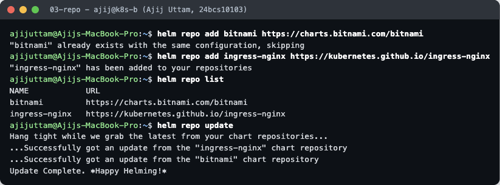

`repo add` registers a chart repository under a local name (`bitnami`, `ingress-nginx`), `repo list` shows them, and `repo update` downloads each repo's `index.yaml` so search results are current. `repo remove` (in the uninstall step below) removes one.

### `helm search`
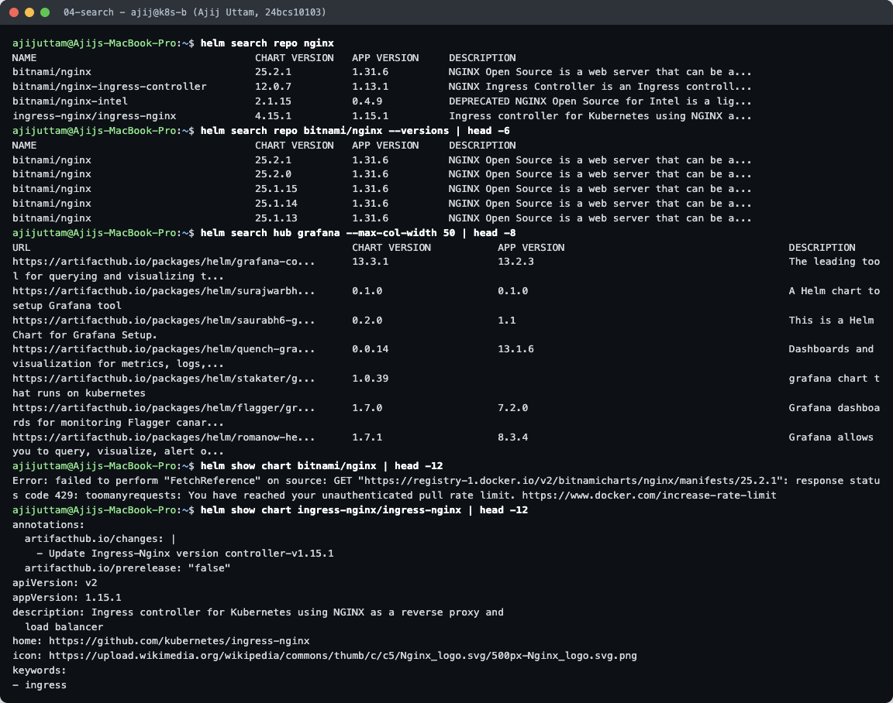

- `search repo nginx` searches the repos I added: `bitnami/nginx 25.2.1` (app `1.31.6`), `ingress-nginx/ingress-nginx 4.15.1`, and more.
- `--versions` lists every chart version.
- `search hub grafana` searches **Artifact Hub**, the public index of all repos, without adding anything.
- `helm show chart bitnami/nginx` **failed** with `429 toomanyrequests: You have reached your unauthenticated pull rate limit`. Bitnami now serves its charts as OCI artifacts from Docker Hub, and my IP had hit Docker Hub's anonymous limit during the Kubernetes labs. `helm show chart ingress-nginx/ingress-nginx`, served from GitHub Pages, worked.

### `helm install`
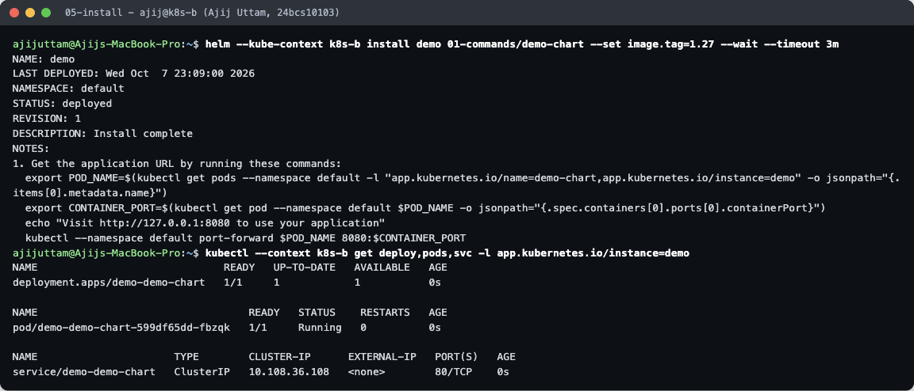

`helm install demo 01-commands/demo-chart --set image.tag=1.27 --wait` rendered the templates, applied them, waited for the Deployment to be ready, and recorded **REVISION 1** with `STATUS: deployed`. It then printed the chart's `NOTES.txt`. Objects are named `<release>-<chart>` (`demo-demo-chart`).

### `helm list`
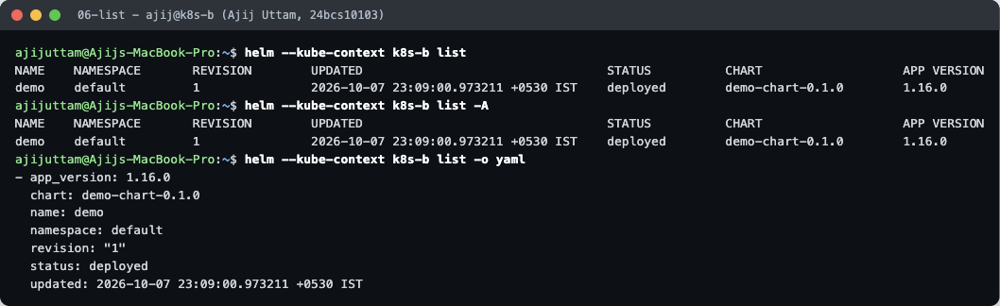

Lists releases in the current namespace (`-A` for all namespaces), with revision, status, chart version and app version. `-o yaml` gives machine-readable output. In Helm 4, `--all`/`-a` no longer exists. My first attempt failed with `Error: unknown flag: --all` (re-run and kept in [`lab/06b-list-all-helm4.txt`](lab/06b-list-all-helm4.txt)). According to `helm list --help`, plain `helm list` now shows releases in **any** status by default, and `--deployed`, `--failed`, `--pending`, `--superseded` or `--uninstalled` narrow it down.

### `helm status`
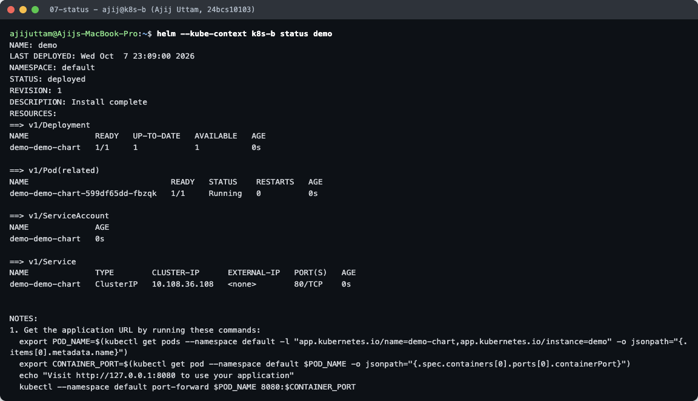

Shows one release's current revision, status and description, plus a live **RESOURCES** view (ServiceAccount, Service, Deployment `1/1`, and the Pod) and the NOTES.

### `helm get`
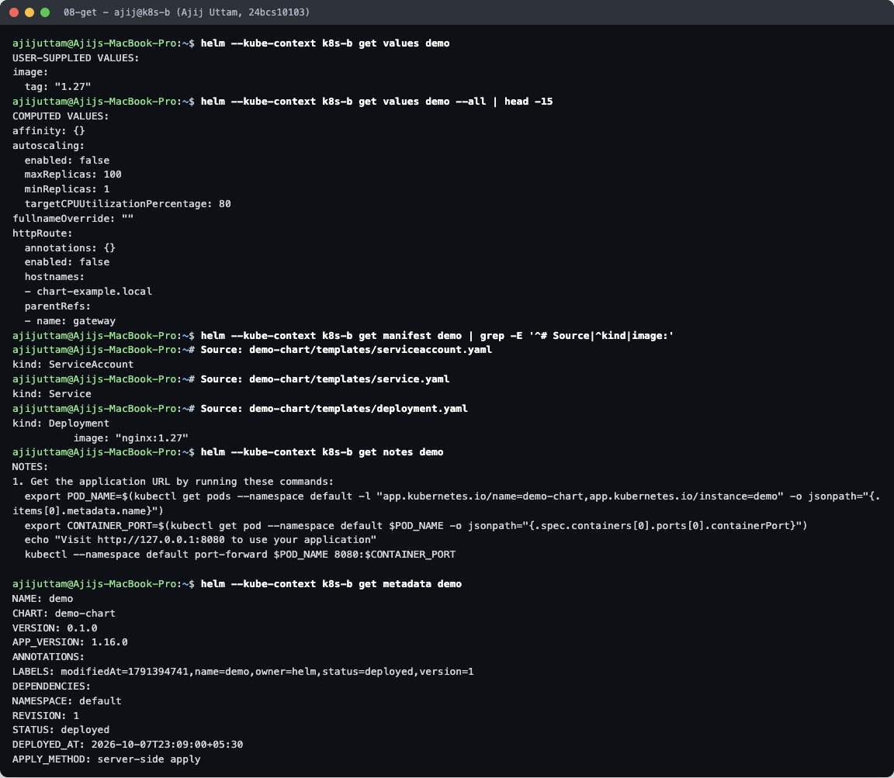

Reads back what Helm stored for a release:
- `get values`: only the user-supplied overrides (`image.tag: "1.27"`). `--all` adds the computed defaults.
- `get manifest`: the exact YAML that was applied.
- `get notes`: the rendered NOTES.txt.
- `get metadata`: chart, version, revision, deploy time and `APPLY_METHOD: server-side apply` (Helm 4 uses Kubernetes server-side apply).

### `helm upgrade`
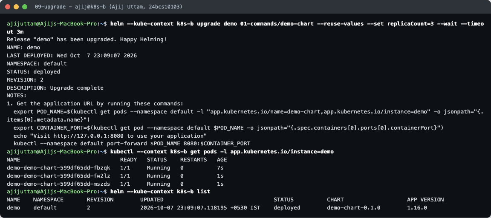

`helm upgrade demo … --reuse-values --set replicaCount=3` created **REVISION 2**, and the Deployment went to 3 Pods. `--reuse-values` keeps the earlier `image.tag=1.27`. Without it, giving any `--set` makes Helm start again from the chart defaults.

### `helm history`
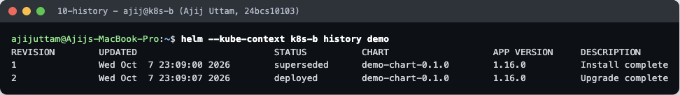

Every revision with its status: revision 1 `superseded`, revision 2 `deployed`.

### `helm rollback`
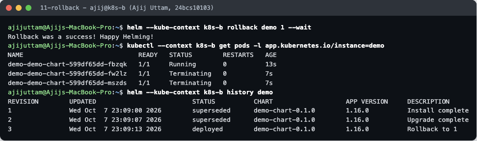

`helm rollback demo 1` re-applied revision 1's manifests: 2 of the 3 Pods were `Terminating`, back to 1 replica. Note that the rollback is recorded as a **new revision 3** ("Rollback to 1"). History is never rewritten.

### `helm uninstall` (and `repo remove`)
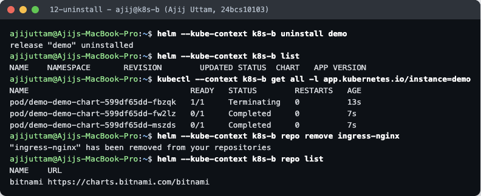

`helm uninstall demo` deleted every object of the release and its history: `helm list` is empty, and the Pods were already `Terminating`/`Completed`. I then removed the `ingress-nginx` repo.

---

## Task 2 — Rollback workflow

Chart: [`02-rollback/app-chart`](02-rollback/app-chart) (course `Chart.yaml`/`values.yaml`; templates [`deployment.yaml`](02-rollback/app-chart/templates/deployment.yaml) and [`service.yaml`](02-rollback/app-chart/templates/service.yaml) are mine, and the Deployment has a readinessProbe on `/`).

```
Install (rev 1) → Upgrade (rev 2) → Verify → Upgrade again, bad tag (rev 3) → Verify → Rollback to 2 (rev 4) → Verify
```

### Install → verify (revision 1)
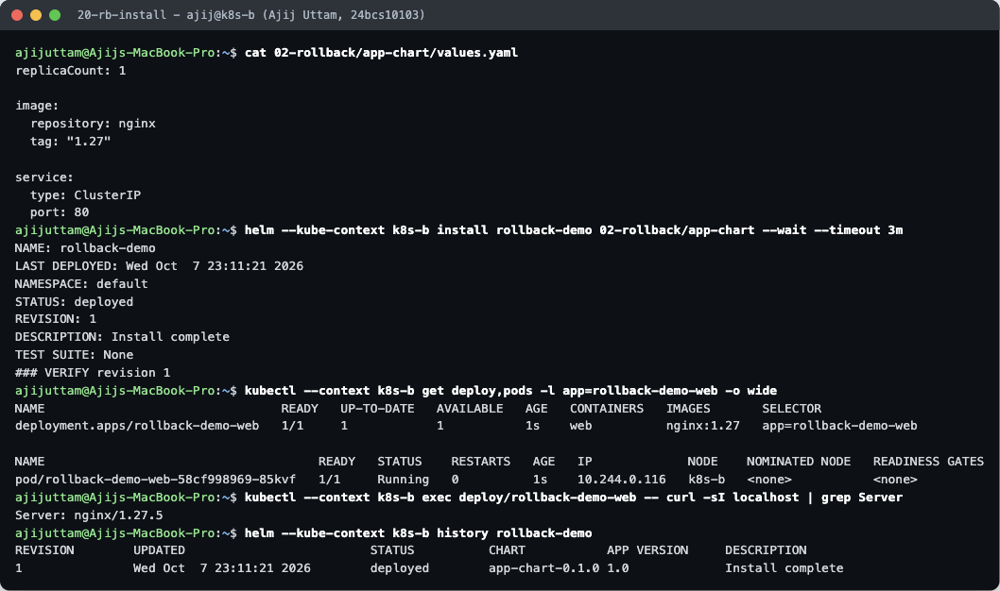

1 Pod running `nginx:1.27`. Inside it, `curl -sI localhost` → `Server: nginx/1.27.5`. History has 1 revision.

### Upgrade → verify (revision 2)
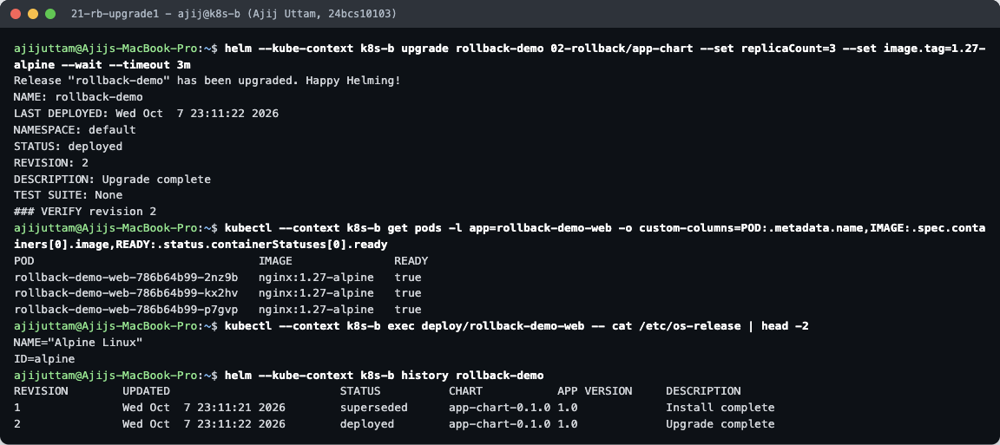

`--set replicaCount=3 --set image.tag=1.27-alpine --wait`: all 3 Pods run `nginx:1.27-alpine`, and `/etc/os-release` inside a Pod says `Alpine Linux`. History: rev 1 superseded, rev 2 deployed.

### Upgrade again with a bad tag → verify (revision 3)
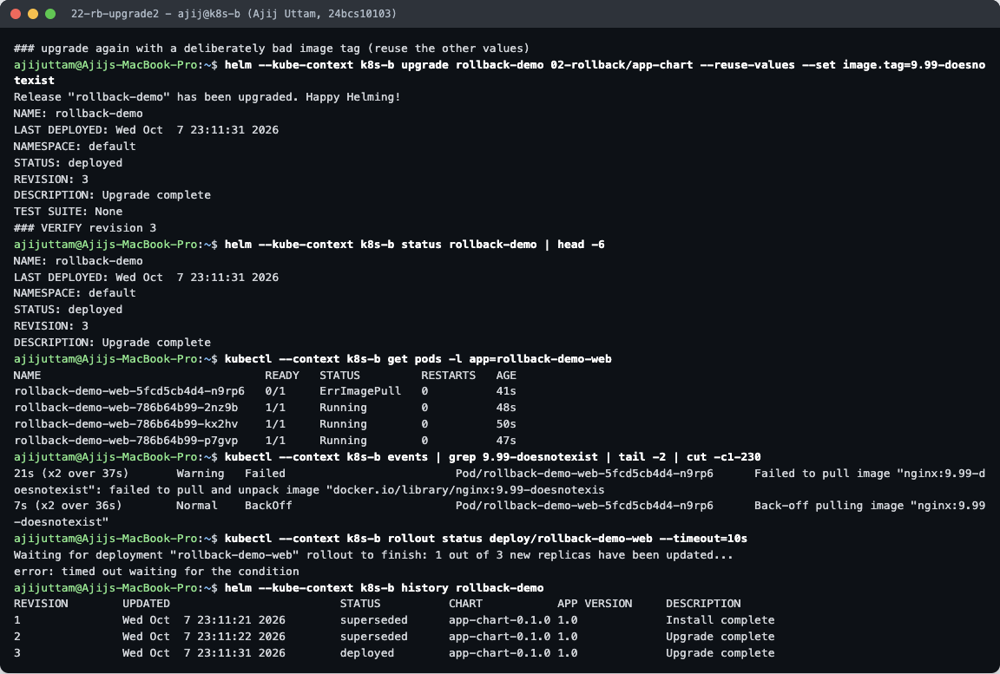

`--reuse-values --set image.tag=9.99-doesnotexist` (no `--wait`):
- **Helm reported success**: `STATUS: deployed`, `REVISION: 3`, `Upgrade complete`. Without `--wait`, Helm only checks that the API server **accepted** the objects. It does not check that the Pods came up.
- The cluster tells the truth: 1 new Pod in `ErrImagePull` (`Failed to pull image "nginx:9.99-doesnotexist"`), while the 3 old alpine Pods **kept running**. The Deployment's rolling update (maxUnavailable 25% of 3 rounds down to 0) never removes an old Pod until a new one is Ready, and the readinessProbe never passes. So the app stayed up.
- `kubectl rollout status` → `1 out of 3 new replicas have been updated … timed out`.

### Rollback → verify (revision 4)
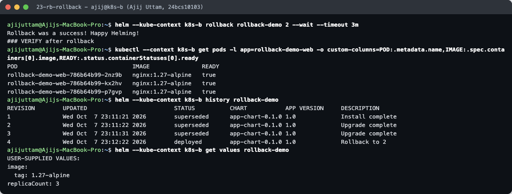

`helm rollback rollback-demo 2 --wait` → all 3 Pods `nginx:1.27-alpine`, READY `true`, and the broken Pod is gone. History now shows rev 3 `superseded` and **rev 4 `deployed`, "Rollback to 2"**. `helm get values` confirms the values are revision 2's (`tag: 1.27-alpine`, `replicaCount: 3`).

### Bonus: automatic rollback
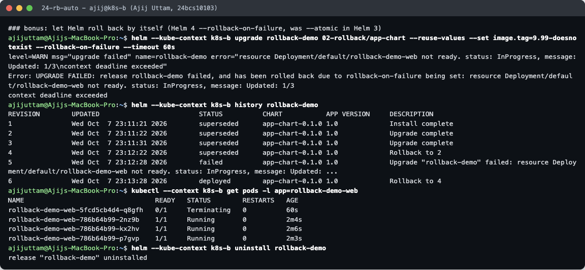

The same bad upgrade with `--rollback-on-failure --timeout 60s` (Helm 4's name for Helm 3's `--atomic`, which also turns on `--wait`): Helm waited 60 s, saw `Deployment … not ready … Updated: 1/3`, and **rolled back by itself**: `UPGRADE FAILED: release rollback-demo failed, and has been rolled back`. History: rev 5 `failed`, rev 6 `deployed` "Rollback to 4". In a CI/CD pipeline this is the safe default, because a bad release never stays live. Finally I uninstalled the release.

---

## Task 3 — Mini project: Notes App chart

Chart source: **[`mini-project/notes-chart/`](mini-project/notes-chart/)** (mine, following the `10-mini-project` steps in the course's `Practise.md`).

| File | Purpose |
|---|---|
| [`Chart.yaml`](mini-project/notes-chart/Chart.yaml) | chart `notes-chart` 0.1.0, appVersion `1.27` |
| [`values.yaml`](mini-project/notes-chart/values.yaml) | **dev** defaults: 1 replica, nginx `1.27`, small requests/limits, title "Ajij's Notes", blue banner, 3 notes |
| [`values-prod.yaml`](mini-project/notes-chart/values-prod.yaml) | **prod** overrides only: 3 replicas, bigger resources, "(PRODUCTION)" title, red banner, 4 notes |
| [`templates/_helpers.tpl`](mini-project/notes-chart/templates/_helpers.tpl) | named templates: `notes.fullname`, common `notes.labels`, and `notes.selectorLabels` (kept stable so upgrades never change the Deployment selector) |
| [`templates/configmap.yaml`](mini-project/notes-chart/templates/configmap.yaml) | renders the HTML page: `{{ .Values.app.title }}`, `{{ range .Values.app.notes }}`, `{{ len … }}`, plus `.Release.Name/.Revision` and `.Chart` info |
| [`templates/deployment.yaml`](mini-project/notes-chart/templates/deployment.yaml) | nginx serving the ConfigMap at `/usr/share/nginx/html`, readiness/liveness probes, `toYaml .Values.resources \| nindent`, and a `checksum/html` annotation (sha256 of the rendered ConfigMap) so a content change rolls the Pods |
| [`templates/service.yaml`](mini-project/notes-chart/templates/service.yaml) | ClusterIP Service on the named port `http` |
| [`templates/NOTES.txt`](mini-project/notes-chart/templates/NOTES.txt) | post-install instructions (port-forward command) |

### Lint and template
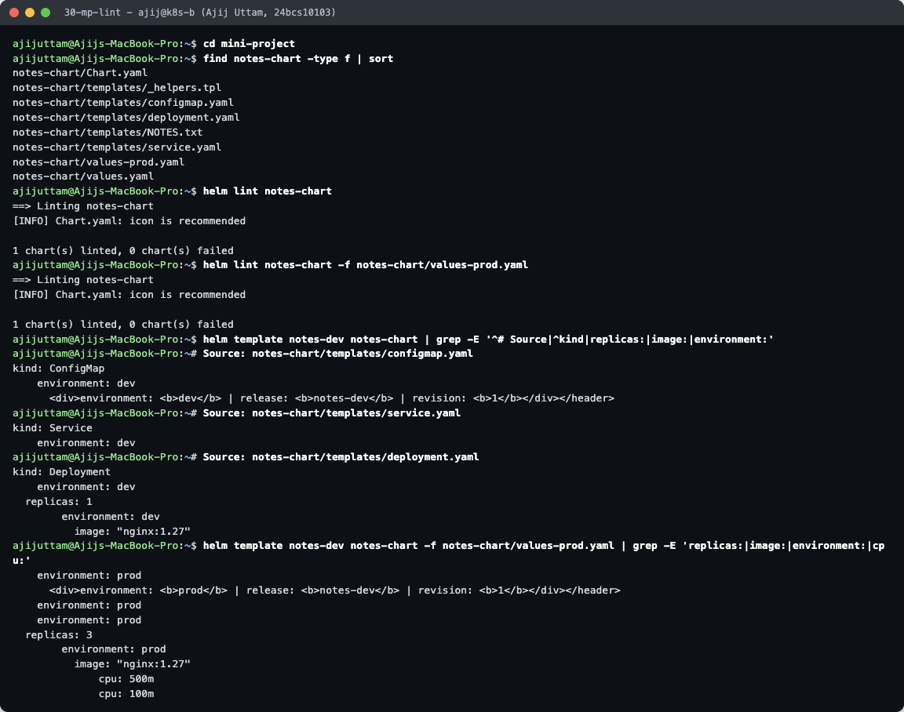

Both value sets lint cleanly. `helm template` shows the difference without installing: dev → `replicas: 1`, `environment: dev`, while `-f values-prod.yaml` → `replicas: 3`, `environment: prod`, CPU `100m`/`500m`. `values-prod.yaml` only contains what differs. Everything else (image, service, probes) comes from `values.yaml`, which keeps environments from drifting apart.

### Install (revision 1, dev)
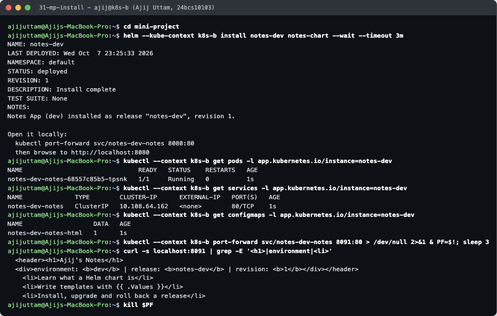
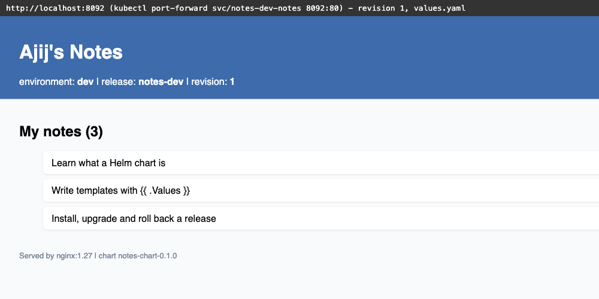

`helm install notes-dev notes-chart --wait`: 1 Pod, the Service `notes-dev-notes`, and the ConfigMap `notes-dev-notes-html`. The page (via port-forward) shows the blue dev banner, `environment: dev | release: notes-dev | revision: 1`, and 3 notes.

### Upgrade with values-prod.yaml (revision 2)
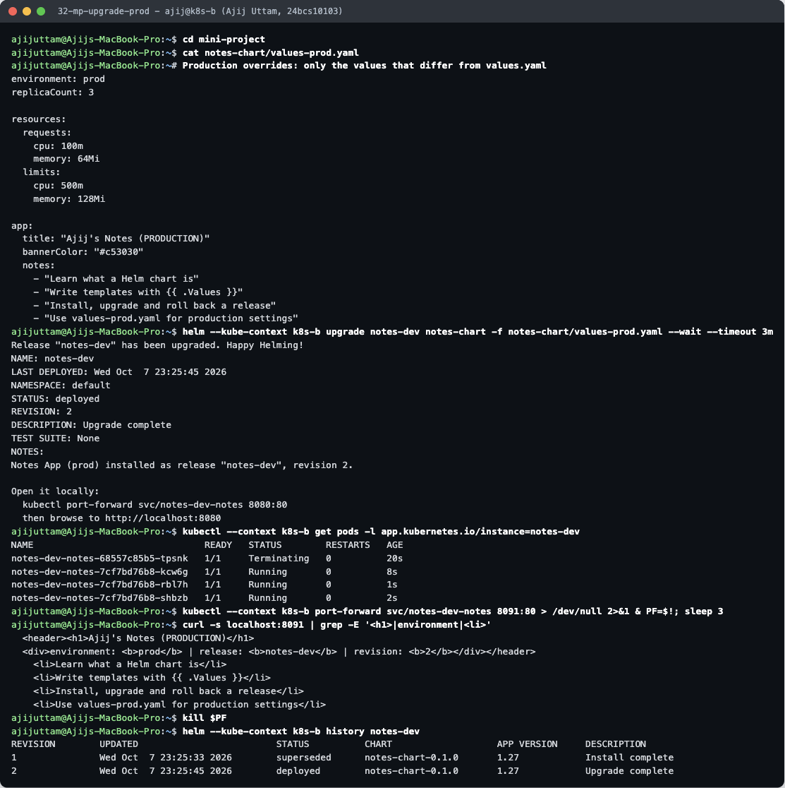
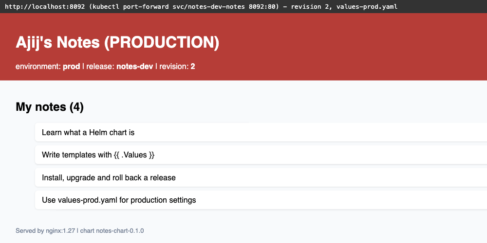

`helm upgrade notes-dev notes-chart -f notes-chart/values-prod.yaml --wait`: 3 new Pods (a new ReplicaSet, because the checksum annotation and resources changed) and the old one terminating. The page now has the red **PRODUCTION** banner, `revision: 2`, and 4 notes.

### Upgrade with a broken image (revision 3)
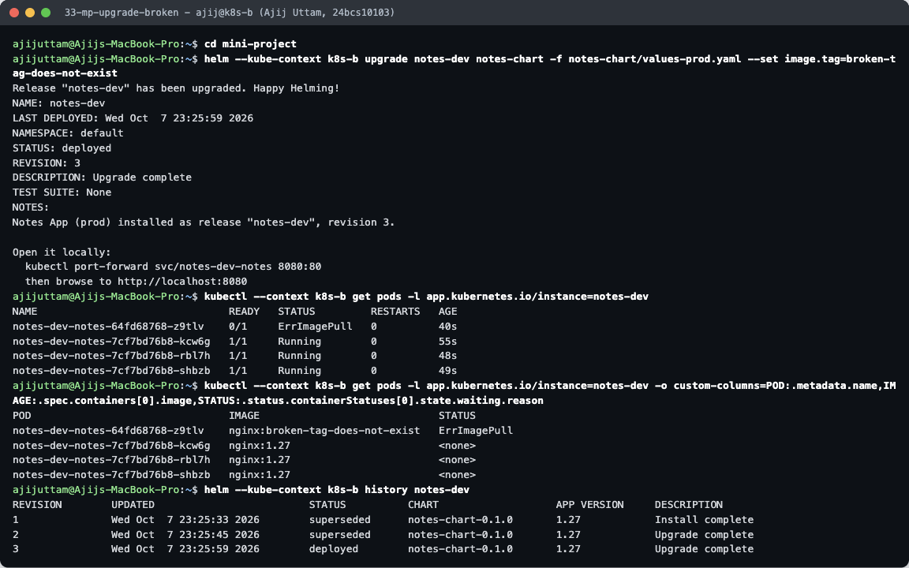

`helm upgrade … -f notes-chart/values-prod.yaml --set image.tag=broken-tag-does-not-exist`. I kept `-f values-prod.yaml` on purpose: with only `--set`, Helm would also fall back to the dev defaults, mixing two changes into one bad release. Helm again said `deployed`, revision 3. The new Pod went to `ErrImagePull` on `nginx:broken-tag-does-not-exist`, while the 3 revision-2 Pods kept serving.

### Rollback to revision 2 (revision 4)
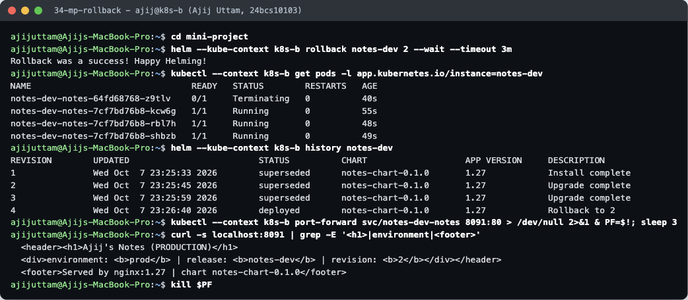
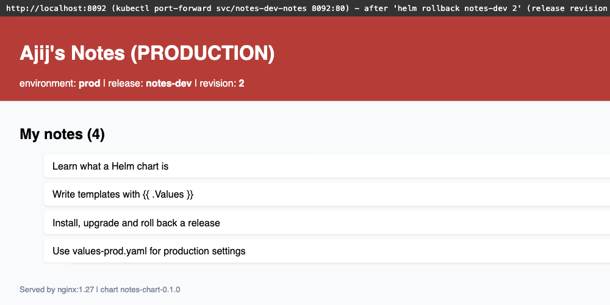

`helm rollback notes-dev 2 --wait`: the broken Pod was removed, and history shows `4 deployed  Rollback to 2`. One detail: the page says **`revision: 2`** even though the release is now at revision 4. A rollback **re-applies revision 2's stored manifests exactly**, and the page text was rendered when revision 2 was created. It does not re-render the templates.

### Uninstall
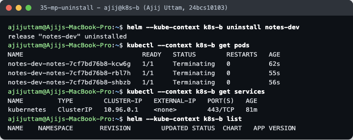

`helm uninstall notes-dev`: Pods `Terminating`, only the `kubernetes` Service left, and `helm list` empty.

**Deliverables:** Helm chart, `values.yaml`, `values-prod.yaml` and templates in [`mini-project/notes-chart/`](mini-project/notes-chart/). Installation, upgrade and rollback are shown above, with output in [`lab/`](lab/).
