# Kubernetes Fundamentals — Homework

**Name:** Ajij Uttam  **Enrollment No:** 24bcs10103

**Environment:** macOS (Apple Silicon, arm64), Docker via Colima, **minikube v1.39.0** with the Docker driver, **Kubernetes v1.37.0** (containerd 2.3.4), kubectl v1.37.1. The cluster is a minikube profile called `k8s-a`. Every command is in [`lab/run.sh`](lab/run.sh) (run as `lab/run.sh <step>`), and the raw output of each step is in [`lab/`](lab/).

> **Why `kubectl` has no `--context` flag in the transcripts:** several minikube clusters were running on this machine at the same time. To make sure every command hit my cluster, the script exports `KUBECONFIG` pointing at a file that contains **only** the `k8s-a` context (made with `kubectl config view --minify --flatten --context k8s-a`).

---

## Task 1 — Install and configure Minikube

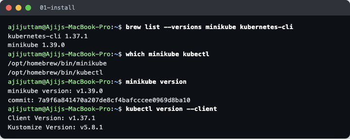

minikube and kubectl are installed through Homebrew (`brew install minikube kubernetes-cli`). They were already on this machine, so the screenshot shows `brew list` confirming the versions instead of a fresh install. `kubectl version --client` only reads the local binary, so it works before any cluster exists.

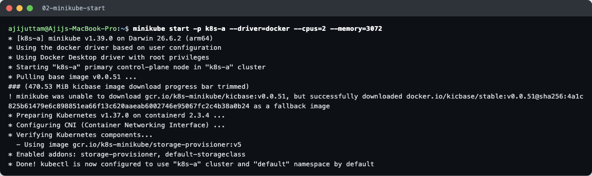

```bash
minikube start -p k8s-a --driver=docker --cpus=2 --memory=3072
```

- `-p k8s-a` creates a named **profile** (a separate cluster), so it does not clash with other clusters.
- `--driver=docker` runs the whole "node" as one Docker container (`kicbase` image). No VM is needed.
- The `gcr.io` base image could not be downloaded, so minikube **fell back to the Docker Hub copy** (`docker.io/kicbase/stable:v0.0.51`) and continued. The warning line shows this.
- minikube picked **containerd** as the container runtime and configured a CNI (kindnet) for pod networking.

## Task 2 — Verify cluster status

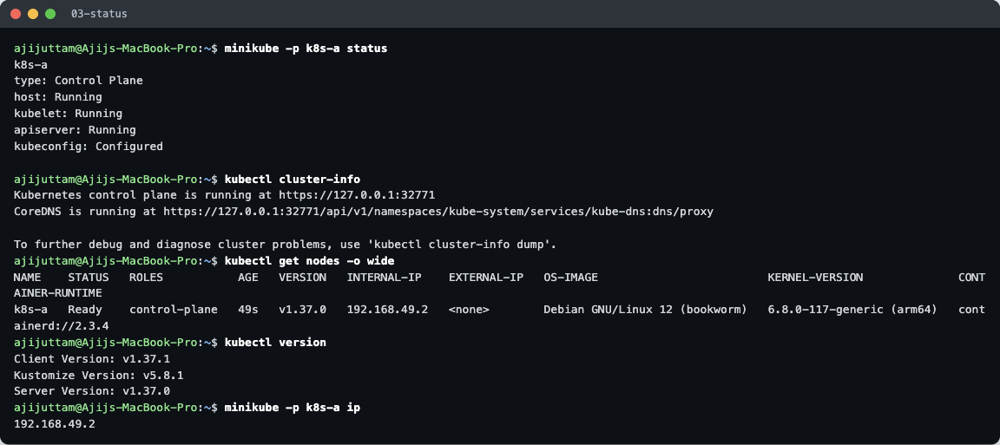

| Command | What it showed |
|---|---|
| `minikube status` | host, kubelet and apiserver all `Running`, kubeconfig `Configured` |
| `kubectl cluster-info` | API server at `https://127.0.0.1:32771` (a port forwarded from the node container) and the CoreDNS proxy URL |
| `kubectl get nodes -o wide` | One node `k8s-a`, role `control-plane`, internal IP `192.168.49.2`, Debian 12, arm64 kernel, `containerd://2.3.4` |
| `kubectl version` | client v1.37.1, server v1.37.0 (one minor version of skew is allowed) |

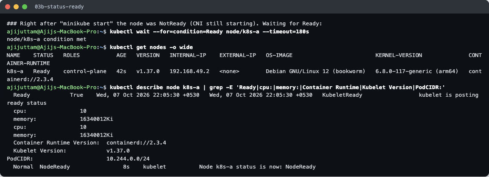

On my very first status check (that capture was overwritten when I re-ran the step, so the screenshot above is the re-run), a few seconds after `minikube start`, the node was **`NotReady`** with the message `container runtime network not ready ... cni plugin not initialized`. A node only becomes Ready once the CNI plugin is up. `kubectl wait --for=condition=Ready node/k8s-a` returned within seconds and the node then reported `KubeletReady` and PodCIDR `10.244.0.0/24`. The node reports **10 CPUs / 16 GB**. That is the Colima VM's total capacity. `--cpus=2 --memory=3072` limits the container through cgroups, but the kubelet still sees the host's numbers.

## Task 3 — Explore Kubernetes architecture

### Control plane, seen live

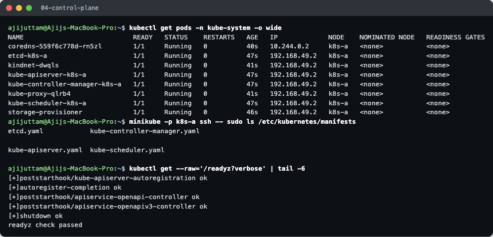

`kubectl get pods -n kube-system` shows each architecture component as a real pod:

| Pod | Component | Job |
|---|---|---|
| `kube-apiserver-k8s-a` | API server | The front door. Every `kubectl` command, controller and kubelet talks only to it. It validates objects and stores them in etcd. |
| `etcd-k8s-a` | etcd | A key-value database that holds the **whole cluster state** (desired and current). |
| `kube-scheduler-k8s-a` | Scheduler | Watches for pods with no node and picks a node for each one (based on resources, taints, affinity). |
| `kube-controller-manager-k8s-a` | Controller manager | Runs the control loops (Deployment, ReplicaSet, Node, Endpoints, …). Each loop compares desired and actual state and fixes the difference. |
| `coredns-…` | Cluster DNS (add-on) | Resolves Service names such as `my-svc.default.svc.cluster.local`. |

The four control-plane pods are **static pods**: the kubelet starts them straight from the YAML files in `/etc/kubernetes/manifests` (listed with `minikube ssh`), not through the scheduler. That is why their names end with the node name. `GET /readyz?verbose` asks the API server for its own health checks. All passed (`readyz check passed`).

### Node components

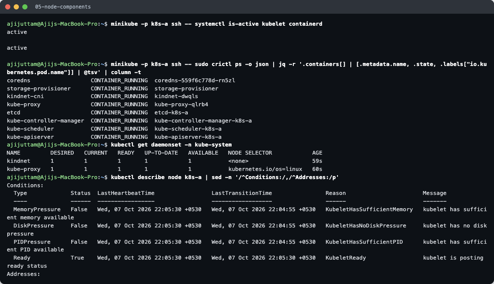

- **kubelet** and **containerd** run as **systemd services** on the node (`active`), not as pods. The kubelet is the node agent: it gets pod specs from the API server and asks the container runtime to run them.
- `crictl ps` talks directly to containerd (through the CRI) and lists the real containers on the node. Every pod from the previous screenshot is there.
- **kube-proxy** (writes iptables rules that make Service IPs work) and **kindnet** (the CNI that gives pods their IPs) are **DaemonSets**, so every node gets one copy.
- The node's **Conditions** (MemoryPressure, DiskPressure, PIDPressure all `False`, Ready `True`) are what the kubelet reports to the control plane every few seconds.

### Short architecture notes

```
            kubectl / CI / controllers
                      │  (HTTPS, REST)
   ┌──────────────── CONTROL PLANE ────────────────┐
   │  kube-apiserver ◄──► etcd (cluster state)      │
   │      ▲      ▲                                  │
   │ scheduler  controller-manager                  │
   └──────┼─────────────────────────────────────────┘
          │ watch / report status
   ┌──────┴──────────── WORKER NODE ───────────────┐
   │ kubelet ──CRI──► containerd ──► containers     │
   │ kube-proxy (Service rules)   CNI (pod network) │
   └────────────────────────────────────────────────┘
```

1. Kubernetes is **declarative**: you store the *desired state* (e.g. "3 replicas of nginx") in the API server. Controllers keep working to make the actual state match it.
2. **Only the API server talks to etcd.** All other components watch the API server for changes.
3. Creating a Deployment works like this: the API server stores it → the Deployment controller creates a ReplicaSet → the ReplicaSet controller creates Pods → the scheduler assigns each Pod to a node → that node's kubelet tells containerd to pull the image and start the container → kube-proxy/CNI make it reachable.
4. In minikube one node plays both roles (control plane + worker). In production the control plane runs on separate (often 3, for HA) machines.

## Task 4 — Basic objects and commands

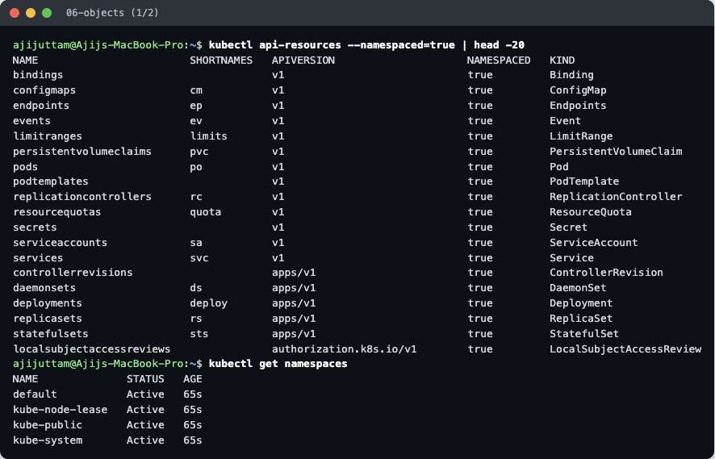
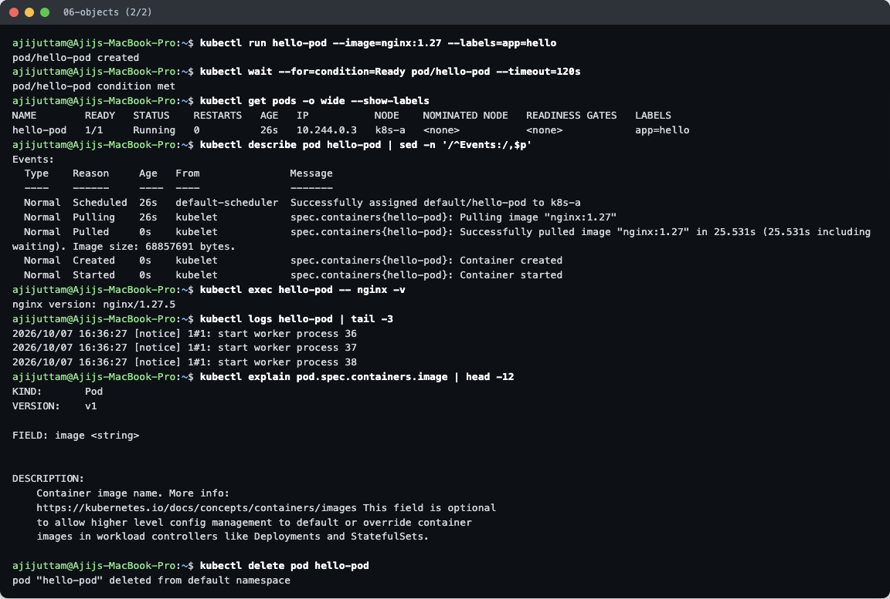

| Command | Purpose |
|---|---|
| `kubectl api-resources` | Lists every object type the cluster knows, with short names (`po`, `svc`, `deploy`, `rs`, `cm`) and API group |
| `kubectl get namespaces` | Namespaces split one cluster into virtual clusters. `default`, `kube-system`, `kube-public` and `kube-node-lease` exist from the start |
| `kubectl run hello-pod --image=nginx:1.27` | Creates a single **Pod**, the smallest deployable unit (one or more containers sharing an IP) |
| `kubectl get pods -o wide --show-labels` | Shows status, pod IP (`10.244.0.3`), node and labels |
| `kubectl describe pod` | Full details. The **Events** show the life of the pod: Scheduled → Pulling (25.5 s) → Pulled → Created → Started |
| `kubectl exec` / `kubectl logs` | Run a command inside the container / read its stdout |
| `kubectl explain pod.spec.containers.image` | Built-in docs for any field, straight from the API schema |
| `kubectl delete pod` | Deletes it. A bare pod is **not recreated**, because no controller owns it |

Core objects in one line each: **Pod** = running containers; **ReplicaSet** = keeps N identical pods alive; **Deployment** = manages ReplicaSets to give rolling updates and rollbacks; **Service** = a stable IP/DNS name that load-balances to pods chosen by labels; **Namespace** = a scope for names and quotas; **ConfigMap/Secret** = configuration injected into pods.

## Task 5 — Kubernetes Basics tutorial (hands-on)

I followed the official *Learn Kubernetes Basics* modules with the tutorial's own images. These images are **amd64-only**. My node is arm64, but the Colima VM has `qemu-x86_64` registered in binfmt_misc, so they ran under emulation (`uname -m` inside the pod prints `x86_64`). The cost is a slower start, which mattered below.

### Module 2 — Create a Deployment

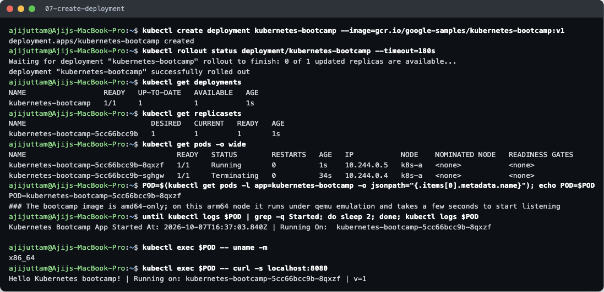

`kubectl create deployment` created a **Deployment → ReplicaSet (`…-5cc66bcc9b`) → Pod** chain. The hash in the ReplicaSet and pod names comes from the pod template. The app's log line and an in-pod `curl localhost:8080` show it is serving `v=1`.

### Module 3/4 — Expose the app with a Service

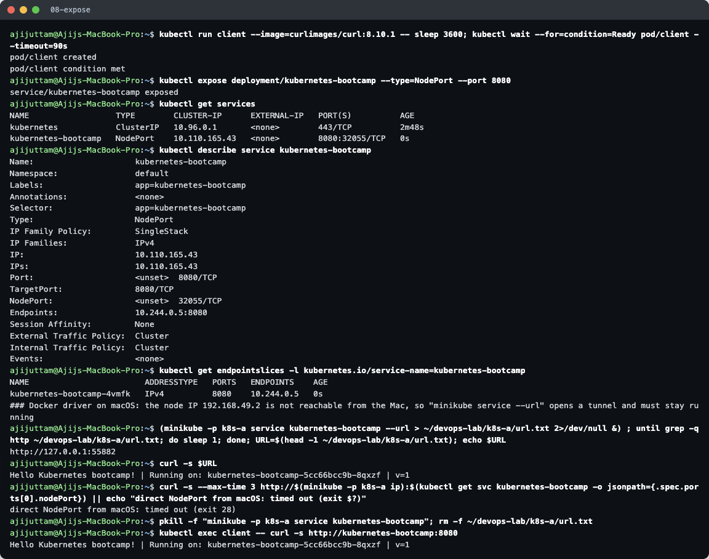

- `kubectl expose --type=NodePort --port 8080` created Service `kubernetes-bootcamp` with ClusterIP `10.110.165.43` and NodePort `32055`. Its selector `app=kubernetes-bootcamp` matches the pods. The **EndpointSlice** lists the pod IP that traffic is sent to.
- **From the Mac:** with the Docker driver on macOS, the node IP `192.168.49.2` is inside Docker's network and is not routable from the host. Calling `http://192.168.49.2:32055` directly timed out (curl exit 28). `minikube service kubernetes-bootcamp --url` opens a tunnel to `127.0.0.1:<random port>`, and curl through it returned `Hello Kubernetes bootcamp!`.
- **From inside the cluster:** a `curlimages/curl` client pod reached the app by Service **DNS name** (`http://kubernetes-bootcamp:8080`).

### Module 5 — Scale the app

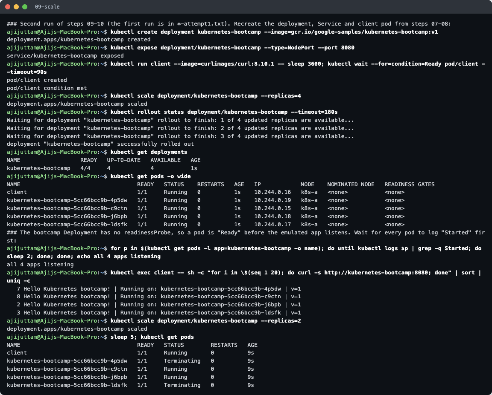

Scaling to 4 replicas just changes the ReplicaSet's desired count, and 3 new pods were created in about a second. 20 requests through the Service were spread over **all 4 pods (7 / 8 / 2 / 3)**. kube-proxy in iptables mode picks a backend **at random** for each new connection, not strictly round-robin, so the split is uneven. Scaling back to 2 put two pods into `Terminating`.

> **What went wrong the first time** ([`lab/09-scale-attempt1.txt`](lab/09-scale-attempt1.txt)): I sent curls right after scaling and got only one pod's answer, then `curl` **exit code 7 (connection refused)**. The bootcamp Deployment has **no readinessProbe**, so Kubernetes marked the new pods Ready and added them to the Service as soon as the container started. The emulated Node.js app was not listening yet. For the second run I waited until each pod logged `Started` before testing. In a real app, a readinessProbe solves this.

### Module 6 — Rolling update and rollback

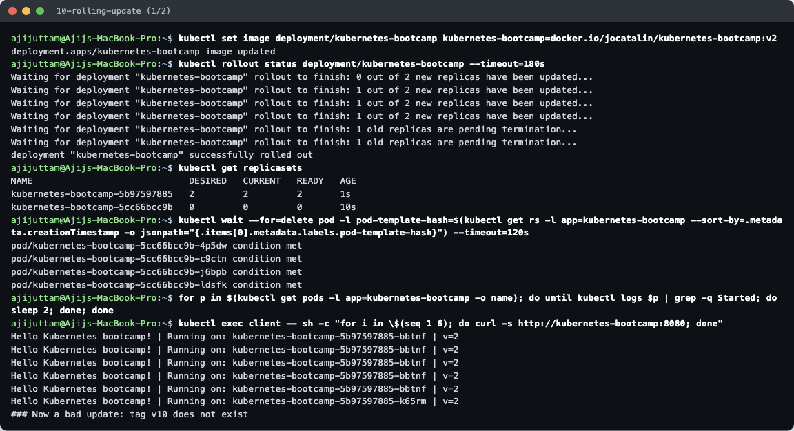
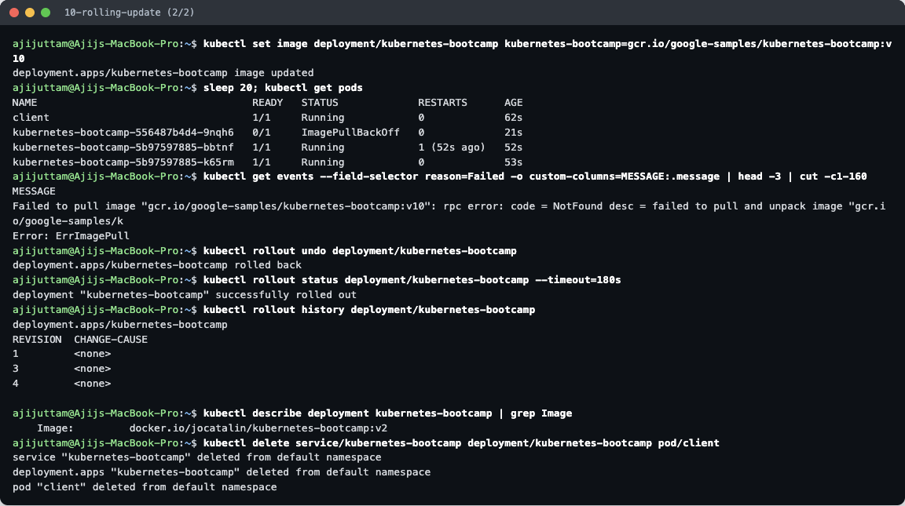

1. `kubectl set image … jocatalin/kubernetes-bootcamp:v2` started a **rolling update**. `rollout status` shows new pods being added while old ones are removed (default `maxSurge 25%`, `maxUnavailable 25%`). A **new ReplicaSet `…-5b97597885`** scaled to 2 while the old one went to 0. The old ReplicaSet is **kept** (with 0 replicas) so a rollback is possible.
2. After the old pods were gone, every response said **`v=2`**.
3. A bad update to tag `v10` (it does not exist) produced a pod stuck in **`ImagePullBackOff`**. The event says `NotFound … failed to pull`. The rollout **stopped there**: the two v2 pods kept serving, because the Deployment never removes old pods until new ones are available.
4. `kubectl rollout undo` went back to the previous revision. The image is `…:v2` again. `rollout history` shows revisions 1, 3 and 4: undo re-uses revision 2's template under a new number, 4.

Side note: one v2 pod shows `RESTARTS 1`. Its first start crashed under emulation and the kubelet restarted it automatically. This is the Pod `restartPolicy: Always` behaviour at work.

Everything was deleted at the end of the step (`kubectl delete service/… deployment/… pod/client`).
