# Kubernetes Ingress, ConfigMaps & Secrets — Homework

**Name:** Ajij Uttam  **Enrollment No:** 24bcs10103

**Environment:** minikube v1.39.0 (Docker driver, profile `k8s-a`) on macOS arm64, **Kubernetes v1.37.0**, minikube `ingress` addon = **ingress-nginx controller v1.15.1**, gitleaks 8.30.1. `kubectl` uses a kubeconfig that contains only this cluster.

**Provided material used:** the instructor's `Learn_DEVOPS/Kubernetes/Ingress,ConfigMap&Secret/04-full-demo` ("Yatri" app). [`ingress/backend.yaml`](ingress/backend.yaml), [`ingress/frontend.yaml`](ingress/frontend.yaml) and [`ingress/ingress.yaml`](ingress/ingress.yaml) are its files (I only added a comment to `ingress.yaml`). [`configmap/configmap.yaml`](configmap/configmap.yaml) and [`secret/secret.yaml`](secret/secret.yaml) keep its names and keys so the backend can use them, but I added a file-style key and **replaced the password with an obviously fake one**. The pods, [`ingress/ingress-hosts.yaml`](ingress/ingress-hosts.yaml) and the troubleshooting scenario are mine.

Scripts: [`lab/run.sh`](lab/run.sh) (Tasks 1–3) and [`lab/troubleshoot.sh`](lab/troubleshoot.sh) (Task 5). Raw output: [`lab/`](lab/).

| Deliverable | File |
|---|---|
| ConfigMap YAML | [`configmap/configmap.yaml`](configmap/configmap.yaml), [`configmap/pod.yaml`](configmap/pod.yaml) |
| Secret YAML | [`secret/secret.yaml`](secret/secret.yaml) (fake values), [`secret/pod.yaml`](secret/pod.yaml) |
| Ingress YAML | [`ingress/ingress.yaml`](ingress/ingress.yaml) (path routing), [`ingress/ingress-hosts.yaml`](ingress/ingress-hosts.yaml) (host routing) |
| Ingress vs Ingress Controller | [`ingress-vs-controller/README.md`](ingress-vs-controller/README.md) |
| Troubleshooting documentation | [`troubleshooting/README.md`](troubleshooting/README.md), with [`broken/`](troubleshooting/broken/app.yaml) and [`fixed/`](troubleshooting/fixed/app.yaml) manifests |

---

## Task 1 — ConfigMap

**Create the ConfigMap and store values**

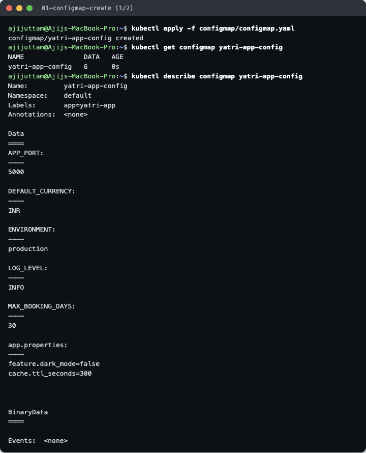
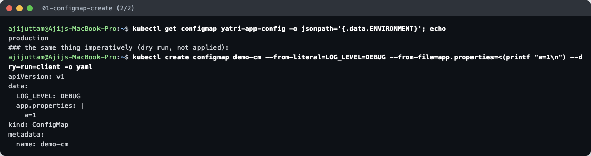

`yatri-app-config` holds **6 keys**: five env-style values (`ENVIRONMENT=production`, `LOG_LEVEL=INFO`, …) and one file-style key `app.properties` (multi-line). `describe` shows them in plain text, and `-o jsonpath='{.data.ENVIRONMENT}'` reads a single key. `kubectl create configmap … --dry-run=client -o yaml` shows how to build the same thing from literals and files without writing YAML.

**Inject it into a Pod and verify inside the container**

[`configmap/pod.yaml`](configmap/pod.yaml) uses all three ways to consume a ConfigMap:

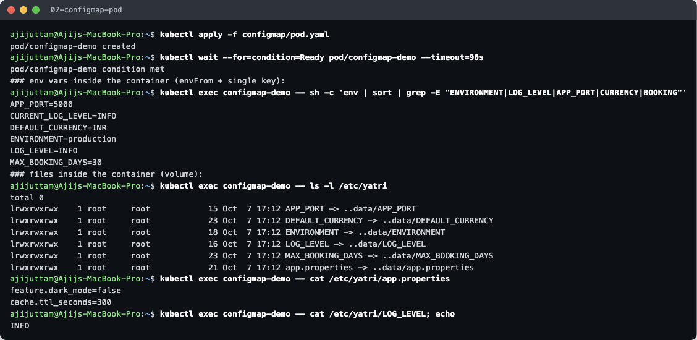

| Method | In the YAML | Seen inside the container |
|---|---|---|
| All keys as env vars | `envFrom.configMapRef` | `APP_PORT=5000`, `ENVIRONMENT=production`, `LOG_LEVEL=INFO`, … |
| One key, renamed | `env.valueFrom.configMapKeyRef` | `CURRENT_LOG_LEVEL=INFO` |
| As files | `volumes.configMap` → `/etc/yatri` | one file per key. `cat /etc/yatri/app.properties` prints the two property lines |

The mounted files are **symlinks into `..data/`**. The kubelet writes a new `..data` directory and switches the link atomically, so apps never read a half-updated file.

**Updating a ConfigMap: env vs volume**

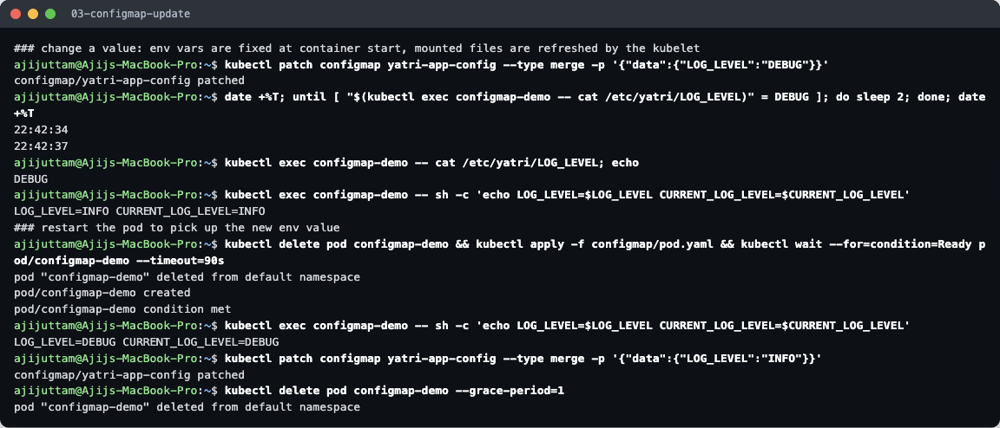

After `kubectl patch … LOG_LEVEL=DEBUG`:
- The **mounted file** changed to `DEBUG` by itself, **3 s later** (22:42:34 → 22:42:37). The kubelet syncs ConfigMap volumes periodically. The delay can be up to about a minute.
- The **env vars stayed `INFO`**. Environment variables are copied into the process only when the container starts.
- After recreating the pod, both showed `DEBUG`. In a Deployment you would run `kubectl rollout restart`. Then I set it back to `INFO`.

## Task 2 — Secret

**Create the Secret and store sensitive values**

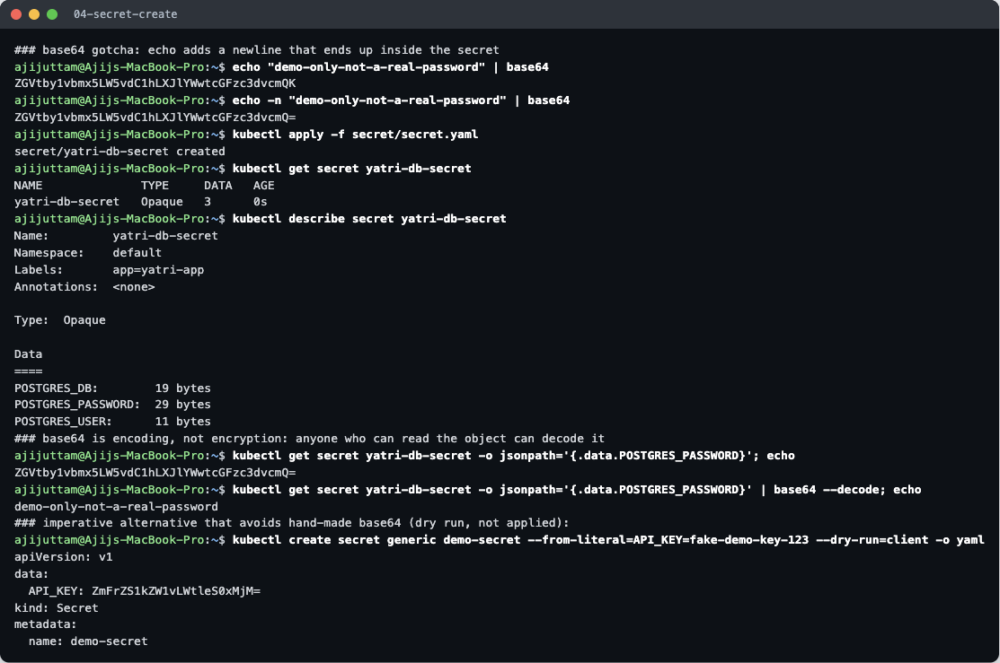

- **The `echo` gotcha:** `echo "…" | base64` ends in `…cmQK`. That `K` is an encoded **newline**, which would become part of the password. `echo -n` gives the correct `…cmQ=`.
- `describe secret` hides the values and shows only sizes (`POSTGRES_PASSWORD: 29 bytes`).
- But **base64 is encoding, not encryption**: `kubectl get secret -o jsonpath='{.data.POSTGRES_PASSWORD}' | base64 --decode` printed `demo-only-not-a-real-password`. Anyone allowed to `get` the Secret can read it.
- `kubectl create secret generic --from-literal … --dry-run=client -o yaml` does the base64 for you (no newline mistakes). Alternatively, `stringData:` in YAML takes plain text (used in the troubleshooting scenario).

**Inject into a Pod and verify inside the container**

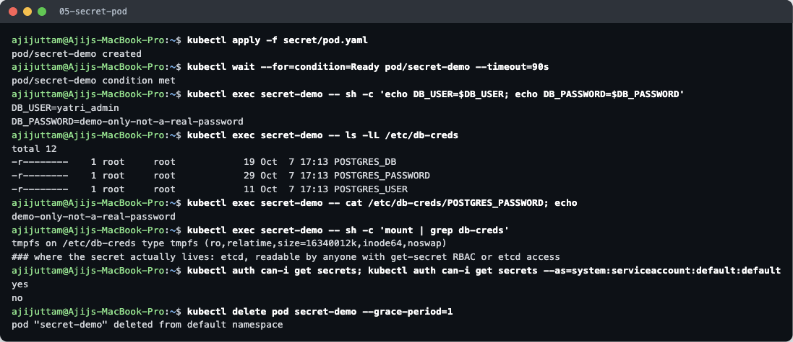

- Env vars via `secretKeyRef`: `DB_USER=yatri_admin`, `DB_PASSWORD=demo-only-not-a-real-password`.
- Volume: files `/etc/db-creds/POSTGRES_*` with mode **`-r--------` (0400)** from `defaultMode`, on a **`tmpfs`** mount. Secret volumes live in node RAM and are never written to the node's disk.
- `kubectl auth can-i get secrets` → `yes` for me (cluster admin) but **`no` for the pod's `default` ServiceAccount**. RBAC is what actually protects Secrets inside the cluster.
- Env vars are easier to leak (crash dumps, `env` in debug logs, child processes). Mounted files are generally safer and also update without a restart.

### Why Secrets should not be committed directly to Git

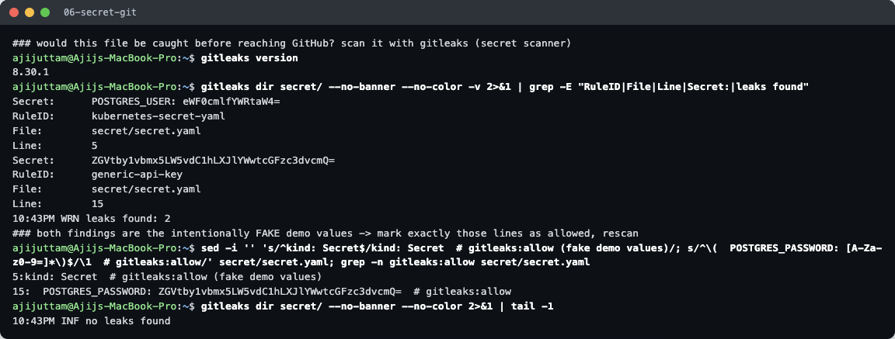

1. **Base64 is reversible.** A Secret YAML in Git is the password in plain text, one `base64 -d` away (shown above).
2. **Git never forgets.** Deleting the file in a later commit leaves it in history, in every clone and fork, and in CI caches. Once pushed, the only real fix is to **rotate** the credential.
3. **Too many readers.** Everyone with repo access (and every tool or integration connected to it) can read production credentials, which bypasses the cluster's RBAC.
4. **Bots scan public repos within minutes** for keys and passwords.
5. **No audit trail or rotation.** Secret managers log who read what and can rotate automatically. Git can't.

**Scanner demo:** `gitleaks dir secret/` flagged my own [`secret.yaml`](secret/secret.yaml) with **2 findings**: `kubernetes-secret-yaml` (line 5) and `generic-api-key` (line 15, the base64 password). The values are deliberately fake, so I marked exactly those two lines with `# gitleaks:allow` and the rescan said `no leaks found`. That way a pre-commit hook or CI scan stays useful for real leaks.

**What to do instead:** commit only a template or `--dry-run` command and create the real Secret at deploy time from CI secrets. Or use **Sealed Secrets** (encrypted YAML that only the cluster can decrypt), **SOPS** + age/KMS, or the **External Secrets Operator** pulling from AWS Secrets Manager / Vault. Also enable etcd encryption at rest, and add `*.env` / `*secret*.yaml` patterns to `.gitignore`.

## Task 3 — Ingress

**Ingress controller.** `minikube addons enable ingress` installed ingress-nginx (`registry.k8s.io/ingress-nginx/controller:v1.15.1`) in namespace `ingress-nginx`, exposed as a **NodePort** Service, and registered IngressClass **`nginx` (default)**:

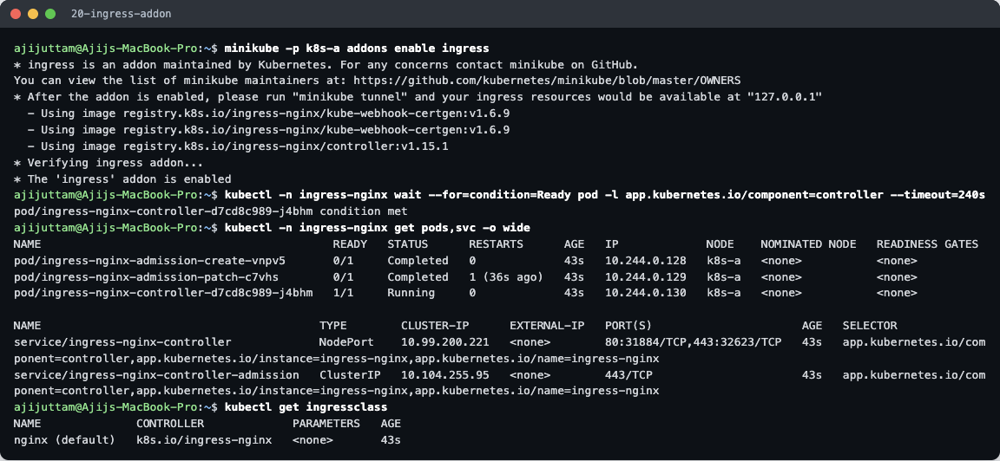

**Deploy the application and Services**

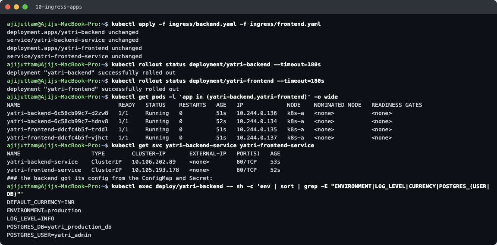

The Yatri backend (Python, port 5000, 2 replicas) and frontend (nginx, 2 replicas), each behind a **ClusterIP** Service on port 80. The backend reads the **ConfigMap and Secret from Tasks 1–2** (`ENVIRONMENT=production`, `POSTGRES_USER=yatri_admin`, …). ClusterIP Services can't be reached from outside, which is exactly what the Ingress is for. (This screenshot is a re-run, so `apply` says `unchanged`. The first run created them.)

**Configure the Ingress**

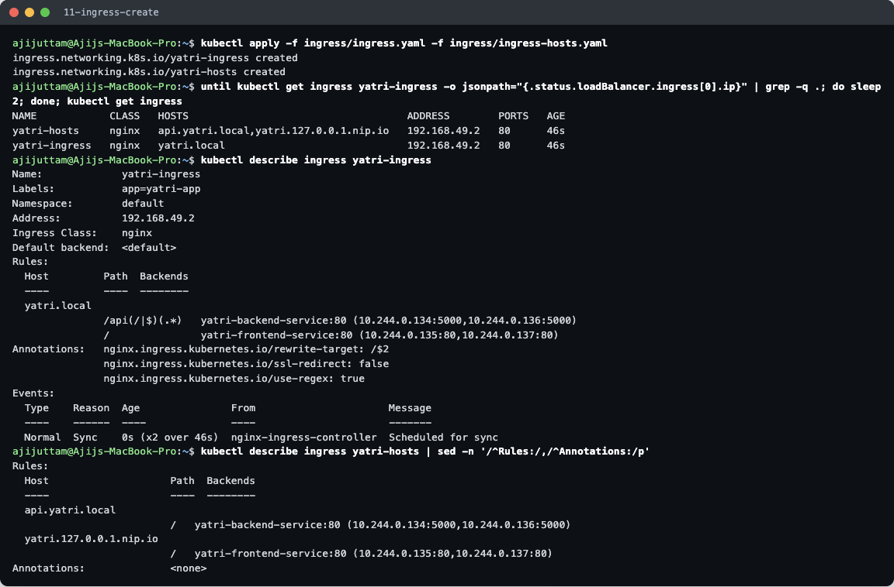

Two Ingress objects, both handled by the same controller:

| Ingress | Rule | Backend |
|---|---|---|
| `yatri-ingress` ([file](ingress/ingress.yaml)) | host `yatri.local`, path `/api(/\|$)(.*)` (regex, rewrite `/$2` strips `/api`) | `yatri-backend-service:80` → pods `:5000` |
| | host `yatri.local`, path `/` | `yatri-frontend-service:80` |
| `yatri-hosts` ([file](ingress/ingress-hosts.yaml)) | host `api.yatri.local`, path `/` | backend |
| | host `yatri.127.0.0.1.nip.io`, path `/` | frontend (for the browser test) |

The `ADDRESS` became `192.168.49.2` (the node) once the controller picked them up. `describe` lists the **actual pod endpoints** for each rule.

**Access the application through the Ingress and verify routing**

From macOS the node IP is not routable (Docker driver), so I **port-forwarded the controller's Service** to `127.0.0.1:18081` and set the `Host` header with curl. This avoids `sudo` and editing `/etc/hosts`.

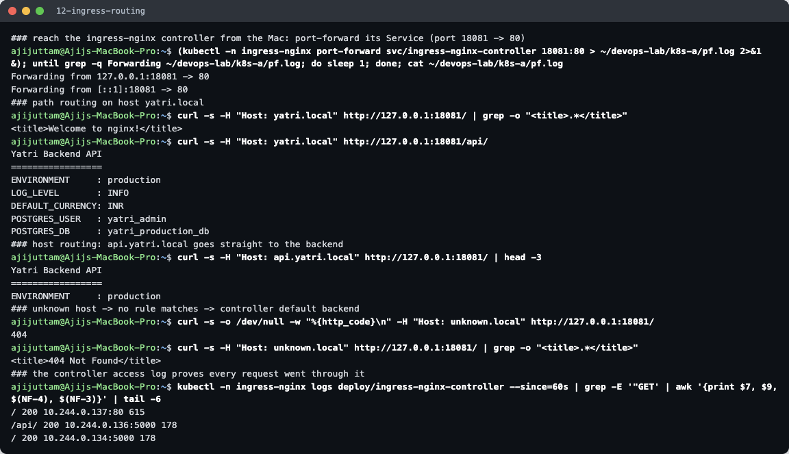

| Request (all to `127.0.0.1:18081`) | Answer | Routed by |
|---|---|---|
| `Host: yatri.local`, `/` | `<title>Welcome to nginx!</title>` (frontend) | path `/` |
| `Host: yatri.local`, `/api/` | `Yatri Backend API … ENVIRONMENT: production …` | path `/api` + rewrite |
| `Host: api.yatri.local`, `/` | `Yatri Backend API …` | **host** rule |
| `Host: unknown.local`, `/` | **404** `404 Not Found` | no rule matched → controller's default backend |

The controller's access log shows each request with the **upstream pod it chose** (`10.244.0.137:80` frontend, `10.244.0.136:5000` / `.134:5000` backend). The controller sends traffic **straight to pod IPs** taken from the endpoints, not through the Service's ClusterIP.

**In a browser** (`http://yatri.127.0.0.1.nip.io:18081/`; nip.io resolves to 127.0.0.1, so the browser sends the right Host header):

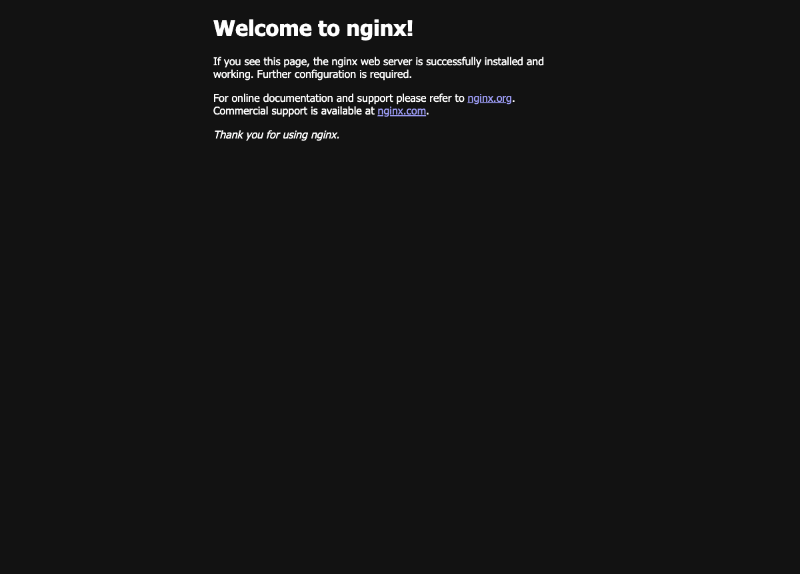

The same port with plain `http://127.0.0.1:18081/` (Host `127.0.0.1` matches no rule) gives the controller's 404 page:

**What the controller made of it:**

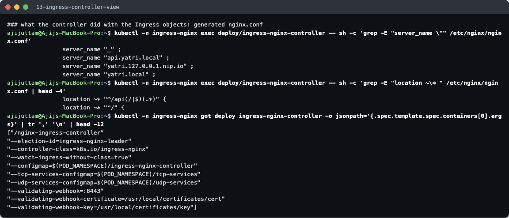

Inside the controller pod, `/etc/nginx/nginx.conf` now has a `server` block for each host (`api.yatri.local`, `yatri.127.0.0.1.nip.io`, `yatri.local`, plus `_` as the catch-all), and the regex `location ~* "^/api(/|$)(.*)"`. The Ingress YAML was translated into nginx config. The controller's args show it watches IngressClass `k8s.io/ingress-nginx`.

## Task 4 — Ingress vs Ingress Controller

See **[`ingress-vs-controller/README.md`](ingress-vs-controller/README.md)**.

## Task 5 — Troubleshooting

The instructor's session-12 lab guide refers to a `troubleshooting/` folder, but **that folder is not in the course repository**. So I built a realistic broken deployment myself ([`troubleshooting/broken/app.yaml`](troubleshooting/broken/app.yaml)) with three faults across the layers covered in this session: Secret → Pod → Service → Ingress. Full walk-through: **[`troubleshooting/README.md`](troubleshooting/README.md)**.

**Before:** `curl -H "Host: orders.local"` → **HTTP 503**, pods in `CreateContainerConfigError`:

**After** three fixes (Secret key name, Ingress backend Service name, Service `targetPort`): **HTTP 200** `orders API OK | env=staging | db_user=orders_app | password set=True`, and `kubectl diff -f fixed/app.yaml` reports no differences:

---

Cleanup: all demo objects, the `troubleshoot` namespace and the port-forward were removed at the end, and the minikube profile `k8s-a` was deleted.
