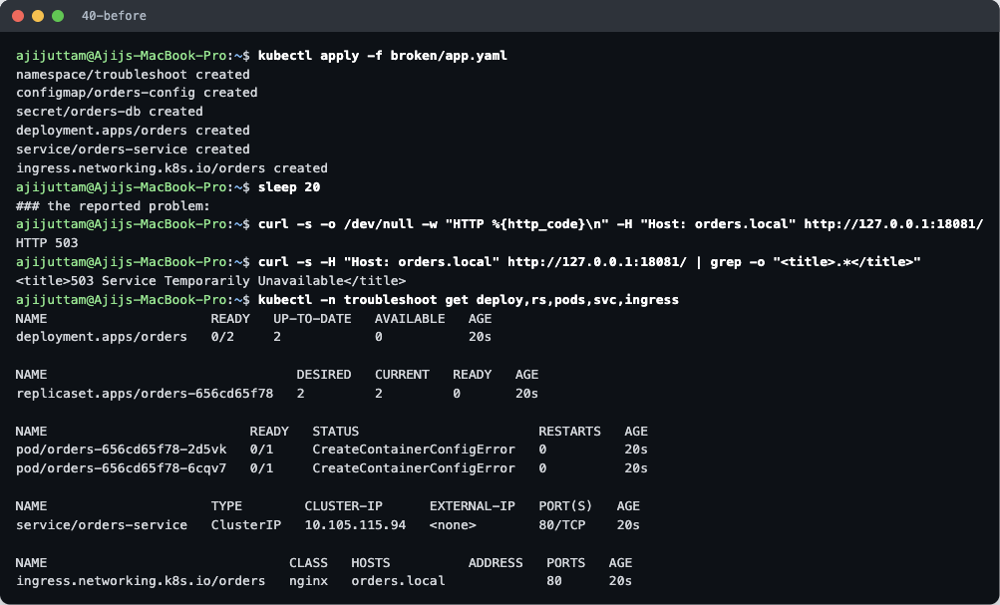
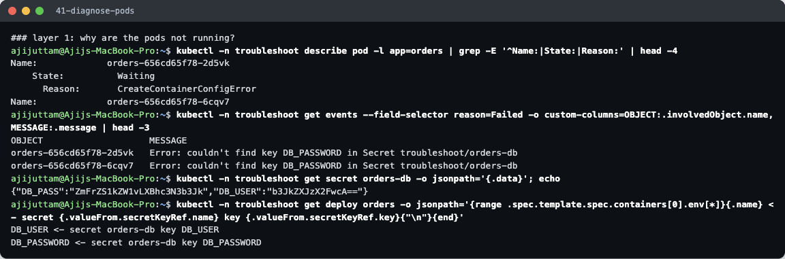
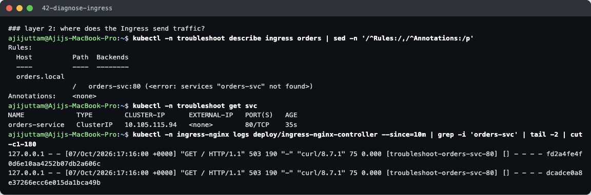
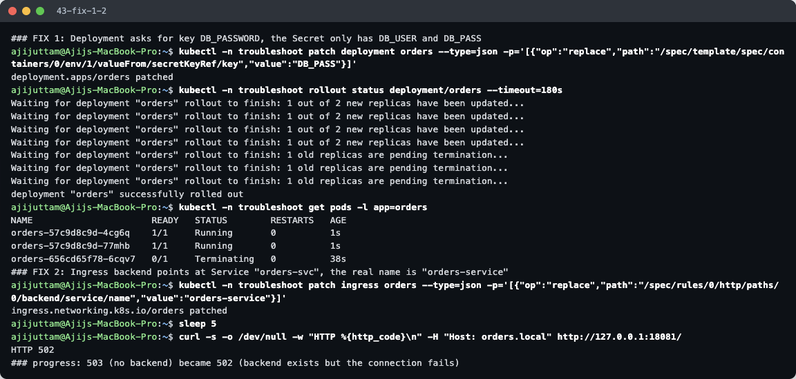
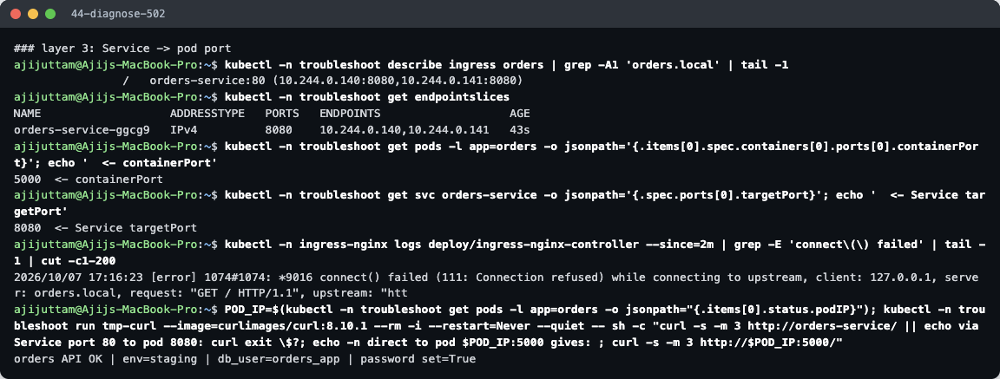
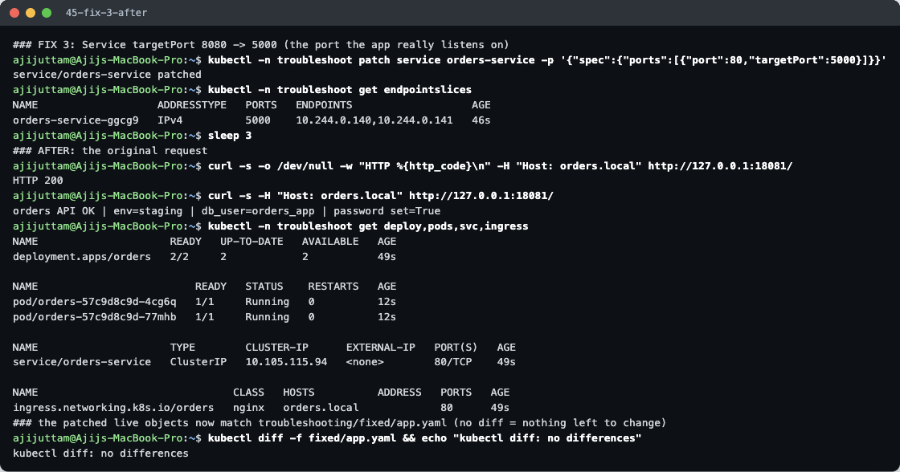

# Troubleshooting: "the orders API behind Ingress doesn't work"

**Name:** Ajij Uttam  **Enrollment No:** 24bcs10103

> **Note on the source:** the instructor's lab guide (`Ingress,ConfigMap&Secret/lab.md`) points to a `troubleshooting/` folder for this session, but that folder is **not in the course repo**. I therefore wrote this scenario myself. [`broken/app.yaml`](broken/app.yaml) contains three bugs I have seen in real deployments. [`fixed/app.yaml`](fixed/app.yaml) is the corrected version, with each change marked `FIX`.

Script: [`../lab/troubleshoot.sh`](../lab/troubleshoot.sh). Output: [`../lab/40…45-*.txt`](../lab/). The Ingress controller is reached through `kubectl port-forward` on `127.0.0.1:18081` (see the main README, Task 3).

## 1. Identify the problem (before)

`kubectl apply -f broken/app.yaml` succeeded: every object was created without errors. The YAML is *valid*, just *wrong*. But:

- `curl -H "Host: orders.local" http://127.0.0.1:18081/` → **HTTP 503 Service Temporarily Unavailable**
- Deployment `0/2` ready, both pods **`CreateContainerConfigError`**
- Ingress `orders` has **no ADDRESS**

I worked through it layer by layer, from the pods outward.

## 2–3. Troubleshooting commands and root causes

### Layer 1 — Pods (`CreateContainerConfigError`)

| Command | Finding |
|---|---|
| `describe pod` | `State: Waiting, Reason: CreateContainerConfigError`: the image is fine, but the container's *config* (env/volumes) can't be built |
| `get events --field-selector reason=Failed` | **`couldn't find key DB_PASSWORD in Secret troubleshoot/orders-db`** |
| `get secret orders-db -o jsonpath='{.data}'` | the Secret has keys **`DB_PASS`** and `DB_USER` |
| env refs in the Deployment | `DB_PASSWORD <- secret orders-db key DB_PASSWORD` |

**Root cause 1:** the Deployment references a Secret key that doesn't exist (`DB_PASSWORD` vs `DB_PASS`). The kubelet refuses to start a container whose required env source is missing.

### Layer 2 — Ingress → Service (HTTP 503)

| Command | Finding |
|---|---|
| `describe ingress orders` | backend **`orders-svc:80 (<error: services "orders-svc" not found>)`** |
| `get svc` | the Service is actually called **`orders-service`** |
| controller access log | requests went to upstream `[troubleshoot-orders-svc-80]` with **503** and **no upstream address** (`[] - - -`) |

**Root cause 2:** the Ingress points at a Service name that doesn't exist. ingress-nginx returns **503** when a rule has no usable backends.

## 4. Fix 1 and 2, then a new error

- **FIX 1:** patched the Deployment's `secretKeyRef.key` to `DB_PASS` → new ReplicaSet, both pods `1/1 Running`.
- **FIX 2:** patched the Ingress backend to `orders-service`.
- The request now returns **HTTP 502 Bad Gateway**. That counts as progress: **503 = the controller has nowhere to send traffic**, **502 = it found a backend but the connection to it failed**.

### Layer 3 — Service → Pod port (HTTP 502)

| Command | Finding |
|---|---|
| `describe ingress` | backends now resolve: `10.244.0.140:8080, 10.244.0.141:8080` |
| EndpointSlice | port **8080** |
| pod `containerPort` | **5000** |
| Service `targetPort` | **8080** |
| controller error log | **`connect() failed (111: Connection refused) while connecting to upstream`** |
| curl straight to `podIP:5000` from a temporary pod | `orders API OK …`: the app itself is healthy |

**Root cause 3:** the Service's `targetPort` (8080) doesn't match the port the app listens on (5000). Connections reach the pod but nothing is listening on 8080, so the connection is refused (502). (The temporary pod was meant to print a `curl exit` line for the Service request too. That line is missing from the output, most likely the known `kubectl run -i` attach race where the first output line is lost. The controller log above already shows the connection refused.)

## 5. Fix 3 and after

- **FIX 3:** `targetPort: 5000`. The EndpointSlice port changed to 5000 immediately.
- **After:** `HTTP 200`, body `orders API OK | env=staging | db_user=orders_app | password set=True`. That proves the ConfigMap (`env=staging`) and both Secret keys are now injected.
- `kubectl diff -f fixed/app.yaml` → **no differences**: the three live patches are exactly the changes saved in [`fixed/app.yaml`](fixed/app.yaml), so the fix is captured in a file, not only in the cluster.

## Summary

| # | Symptom | Where to look | Root cause | Fix |
|---|---|---|---|---|
| 1 | Pods `CreateContainerConfigError` | `describe pod` / events | Secret key `DB_PASSWORD` doesn't exist (`DB_PASS`) | correct `secretKeyRef.key` |
| 2 | HTTP **503** | `describe ingress` | backend Service `orders-svc` not found | point the Ingress at `orders-service` |
| 3 | HTTP **502** | EndpointSlice port vs `containerPort`, controller error log | Service `targetPort 8080`, app listens on `5000` | `targetPort: 5000` |

**Lessons:** `kubectl apply` succeeding means nothing about wiring. Check that the **names** (Secret keys, Service names) and **ports** (`containerPort` = `targetPort`) match from Ingress to Service to Pod. And read the HTTP code: 503 means "no backend", 502 means "backend unreachable or refused".
