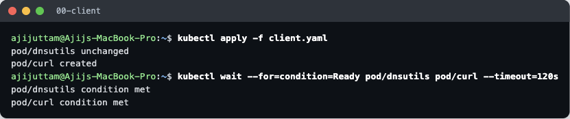
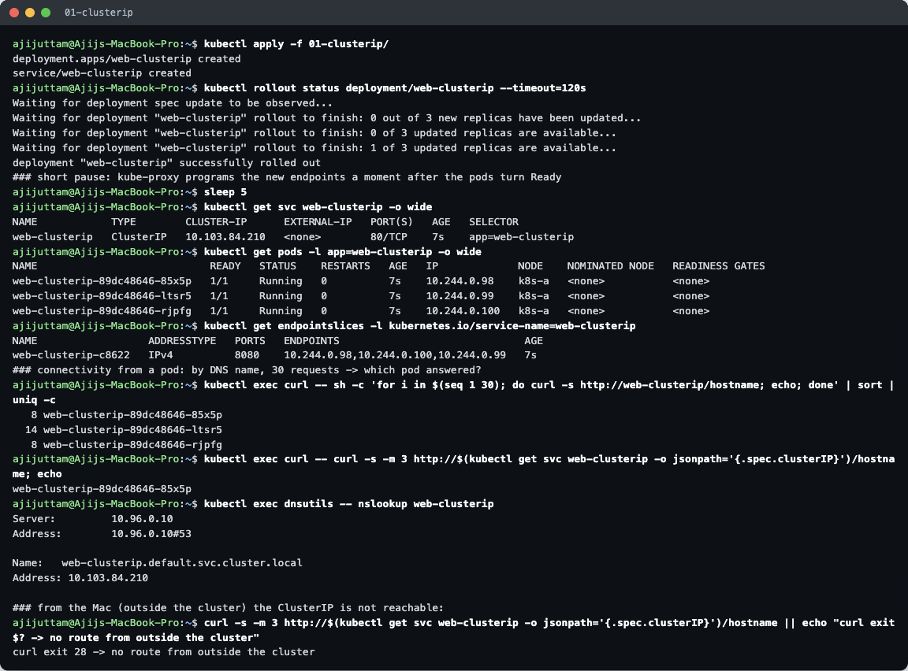
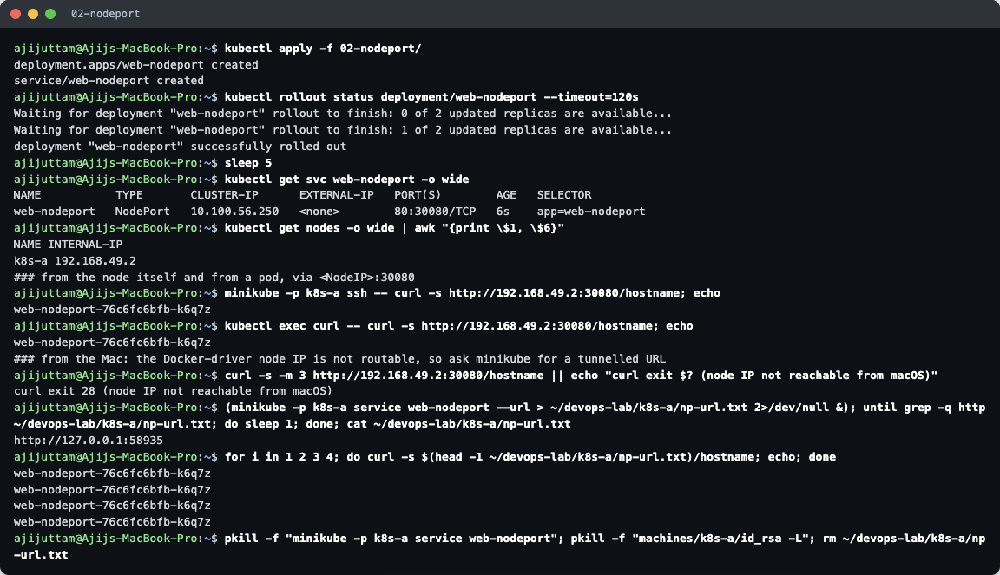
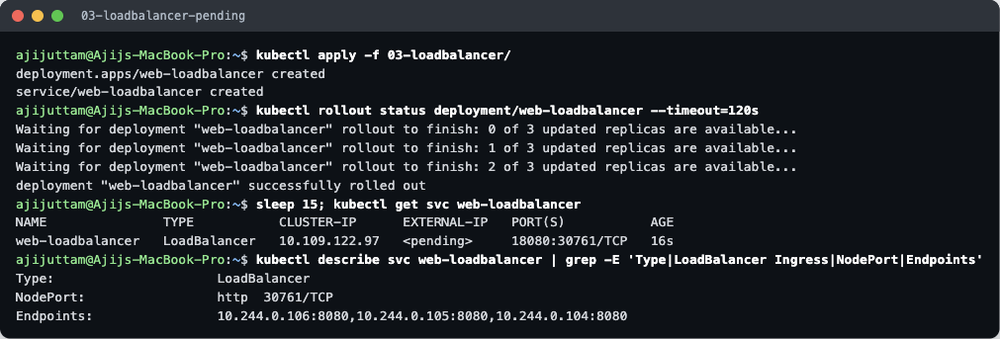
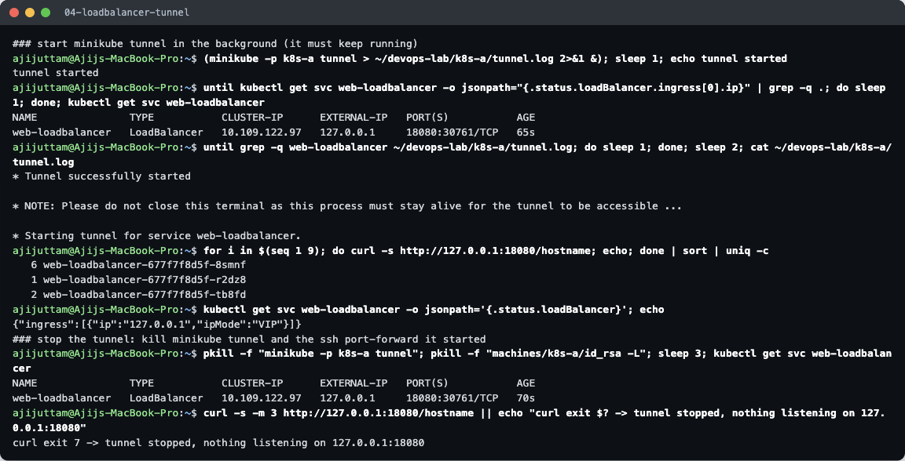
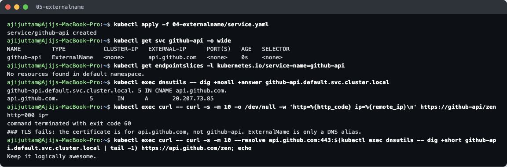
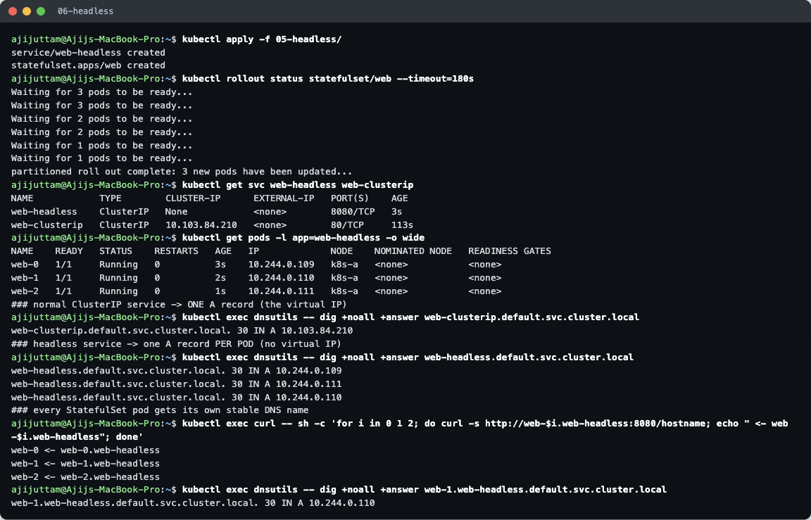

# Kubernetes Networking & Services — Homework

**Name:** Ajij Uttam  **Enrollment No:** 24bcs10103

**Environment:** minikube v1.39.0 (Docker driver, profile `k8s-a`) on macOS arm64, **Kubernetes v1.37.0**, CoreDNS v1.14.6, kindnet CNI, kube-proxy in iptables mode. `kubectl` uses a kubeconfig that contains only this cluster.

| Deliverable | Where |
|---|---|
| Service YAML files | [`services/`](services/): one folder per type (`app.yaml` + `service.yaml`), plus [`client.yaml`](services/client.yaml) |
| Task 2 comparison docs | [`object-comparison/README.md`](object-comparison/README.md) |
| Task 3 FQDN | [`fqdn/README.md`](fqdn/README.md) |
| Task 4 CoreDNS | [`coredns/README.md`](coredns/README.md) |
| Scripts / raw output | [`lab/services.sh`](lab/services.sh), [`lab/dns.sh`](lab/dns.sh), [`lab/*.txt`](lab/) |

The folder layout follows the instructor's `Learn_DEVOPS/Kubernetes/Kubernetes_Services` (`01-clusterip` … `05-headless`), and the ExternalName target `api.github.com` comes from there. I changed the app image: the instructor's YAMLs use plain nginx, which returns the same page from every pod. I used **`agnhost netexec`** (a small test server from the Kubernetes project, on `registry.k8s.io`), whose `/hostname` endpoint returns the **pod name**, so you can see which pod answered each request. It also avoids the Docker Hub rate limit I hit in the previous homework.

Test clients ([`services/client.yaml`](services/client.yaml)): `dnsutils` (has `dig`/`nslookup`, the image used in the Kubernetes DNS-debugging docs) and `curl`.

---

## Task 1 — The five Service types

### 1. ClusterIP

[`services/01-clusterip/`](services/01-clusterip/): 3 replicas, Service `port: 80 → targetPort: 8080`.

- **Verify:** the Service got the virtual IP `10.103.84.210`. The EndpointSlice lists the **3 pod IPs on port 8080**. The Service port (80) and the container port (8080) are different. `targetPort` does that mapping.
- **Connectivity:** 30 requests from the `curl` pod to `http://web-clusterip/hostname` were spread over **all 3 pods (8 / 14 / 8)**. Requests to the raw ClusterIP also work. `nslookup` resolves the short name to the full name `web-clusterip.default.svc.cluster.local`.
- **From the Mac:** `curl` to the ClusterIP timed out (exit 28). A ClusterIP only exists inside the cluster's iptables rules. That is the point of this type: it is for **internal** service-to-service traffic.
- *Issue I hit:* in the first run, 6 of 12 requests came back **empty**, because I sent them the moment the rollout finished. A pod becomes Ready slightly before kube-proxy has written the new iptables rules. The script now waits 5 s after the rollout.

### 2. NodePort

[`services/02-nodeport/`](services/02-nodeport/): fixed `nodePort: 30080`.

- `PORT(S) 80:30080/TCP`: the Service has a ClusterIP **and** port 30080 is open on **every node** (node IP `192.168.49.2`).
- `curl http://192.168.49.2:30080` worked **from inside the node** (`minikube ssh`) and **from a pod**.
- **From the Mac it timed out.** With the Docker driver on macOS, `192.168.49.2` lives in Docker's network inside the Colima VM and cannot be routed from the host. On a cloud VM or a Linux host, `<NodeIP>:30080` would work directly. `minikube service web-nodeport --url` opens an SSH tunnel to `127.0.0.1:58935`, and requests through it reached the pods.
- NodePorts must be in `30000–32767`. They are simple, but clients have to know a node IP, and it is a high, odd port.

### 3. LoadBalancer

[`services/03-loadbalancer/`](services/03-loadbalancer/): port **18080** (a high port, so `minikube tunnel` can listen on the Mac without `sudo`, and it does not clash with anything else on my machine).

**Without a load-balancer provider, EXTERNAL-IP stays `<pending>`:**

The Service still got a ClusterIP and a NodePort (`30761`): a LoadBalancer Service is built on top of the other two types. In a cloud, the cloud-controller-manager would now create an AWS/GCP/Azure load balancer and write its address into `status.loadBalancer`. minikube has no cloud, so **nothing fills it in and it stays `<pending>` forever.**

**Resolved with `minikube tunnel` (run in the background):**

- `minikube -p k8s-a tunnel` acts as the "cloud": within about a second the Service showed **`EXTERNAL-IP 127.0.0.1`** (`status.loadBalancer.ingress[0].ip`). The tunnel log says `Starting tunnel for service web-loadbalancer`. It needed no password because the port is above 1024.
- From the Mac, `curl http://127.0.0.1:18080/hostname` × 9 reached **all 3 pods**.
- After I stopped the tunnel, curl got `connection refused` (exit 7). Note that `EXTERNAL-IP` still said `127.0.0.1`: killing the tunnel does not clear the status field.
- *Gotcha:* the first time I stopped it with only `pkill -f "minikube … tunnel"`, the curl **still worked**. minikube had started `ssh -L` child processes that kept forwarding the port. I had to kill those too (`pkill -f "machines/k8s-a/id_rsa -L"`). The script now does both.

### 4. ExternalName

[`services/04-externalname/service.yaml`](services/04-externalname/service.yaml): `externalName: api.github.com`, no selector.

- `CLUSTER-IP <none>`, `EXTERNAL-IP api.github.com`, **no EndpointSlice**. There are no pods and kube-proxy does nothing for it.
- `dig github-api.default.svc.cluster.local` returns a **CNAME → `api.github.com`**, then GitHub's A record. ExternalName is **purely DNS**.
- `curl https://github-api/zen` failed with **exit 60 (TLS certificate problem)**. The client connects to GitHub, but asks for host `github-api`, and GitHub's certificate is only valid for `api.github.com`. Calling the IP that the alias resolved to, under the right hostname (`--resolve api.github.com:443:<ip>`), returned GitHub's zen message (`Keep it logically awesome.`).
- **Use:** give an external dependency (managed DB, SaaS API) a stable in-cluster name, so you can later replace it with an in-cluster Service without changing app config. It works best with protocols that don't check the hostname (DB drivers, plain TCP). For HTTPS, the app must still send the real host name.

### 5. Headless

[`services/05-headless/`](services/05-headless/): `clusterIP: None` + a 3-replica StatefulSet with `serviceName: web-headless`.

- `CLUSTER-IP None`: no virtual IP and no kube-proxy load balancing.
- DNS shows the difference clearly. The normal Service returns **one A record (the VIP)**. The headless Service returns **three A records, the pod IPs themselves**. The client (or its driver) picks one.
- Each StatefulSet pod gets its **own DNS name**, `web-N.web-headless`. A request to each name reached exactly that pod (`web-0`, `web-1`, `web-2`).
- **Use:** databases and clustered systems (Kafka, Cassandra, MongoDB replica sets, Elasticsearch) where clients must reach a *specific* member (e.g. the primary), and peers find each other by stable names.

### Summary

| Type | Virtual IP | Reachable from | How the address is provided | Typical use |
|---|---|---|---|---|
| ClusterIP | yes | inside cluster only | kube-proxy iptables (random pick) | internal APIs, DBs |
| NodePort | yes | `<any NodeIP>:30000-32767` | ClusterIP + port on every node | dev/test, behind an external LB |
| LoadBalancer | yes | external IP | NodePort + cloud LB (`minikube tunnel` here) | public services in a cloud |
| ExternalName | no | inside cluster (DNS) | CoreDNS CNAME | alias for external services |
| Headless | **no** | inside cluster | DNS returns pod IPs directly | StatefulSets, client-side balancing |

---

## Tasks 2–4

- **[Task 2 — Kubernetes object comparison](object-comparison/README.md):** Deployment vs ReplicaSet, Deployment vs DaemonSet vs StatefulSet, ReplicaSet vs Service, each backed by a live demo on this cluster.
- **[Task 3 — FQDN](fqdn/README.md):** real `nslookup`/`dig` output from a pod: search domains, namespaces, SRV, pod and reverse records.
- **[Task 4 — CoreDNS](coredns/README.md):** the real Corefile from this cluster, query logs that show the search-path expansion, and a break-and-fix DNS troubleshooting demo.

Resources left at the end of this homework were deleted (`kubectl delete -f services/…`, namespace `team-b`) before the next homework.
