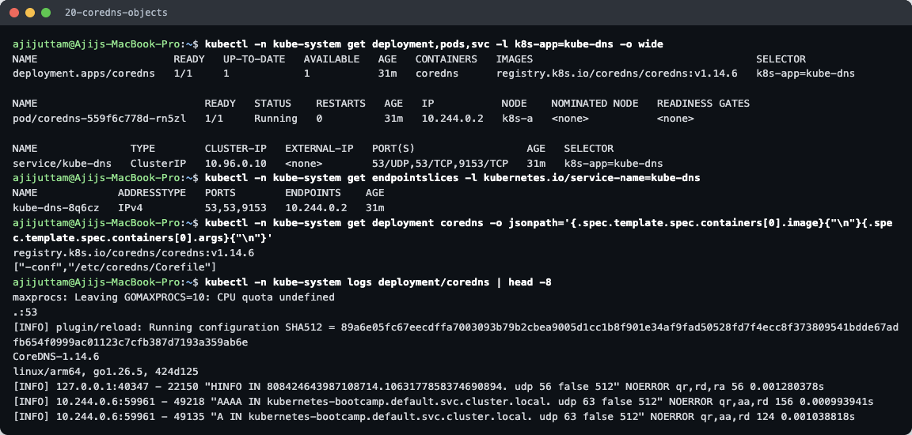
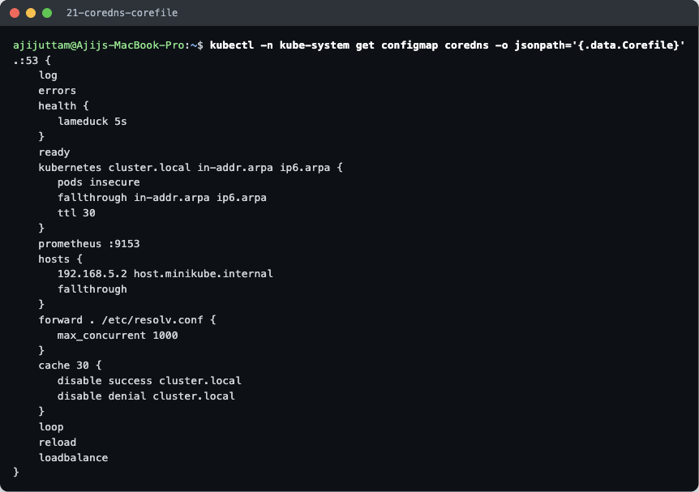
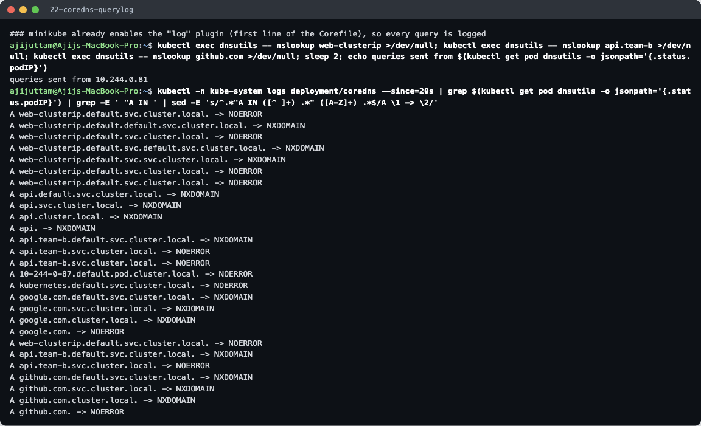
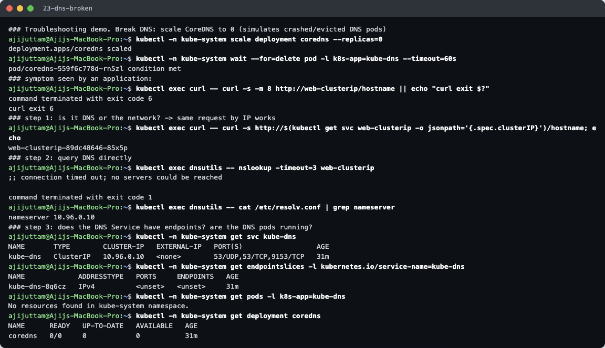
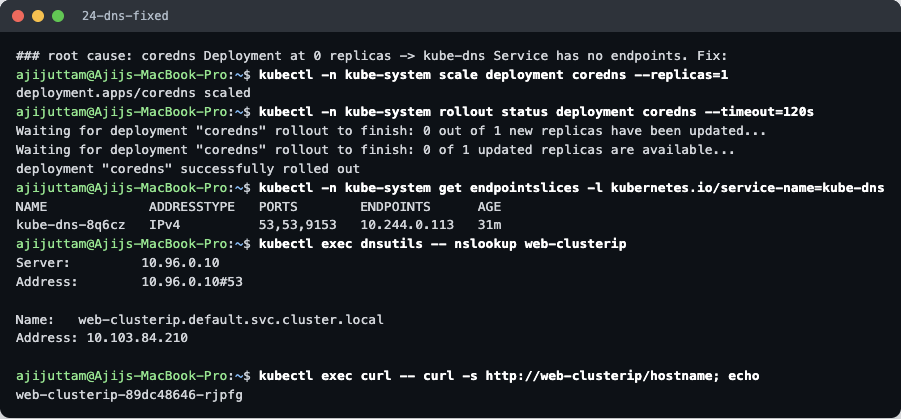

# CoreDNS

**Name:** Ajij Uttam  **Enrollment No:** 24bcs10103

Everything below comes from my minikube cluster (`k8s-a`, Kubernetes v1.37.0). Commands: [`../lab/dns.sh`](../lab/dns.sh) steps `20–24`. Raw output: [`../lab/20…24-*.txt`](../lab/).

---

## What is CoreDNS?

CoreDNS is a small DNS server written in Go and a CNCF graduated project. It is built from **plugins**: each line in its config file (the *Corefile*) turns on one plugin, such as `kubernetes`, `forward`, `cache` or `log`. Since Kubernetes 1.13 it has been the **default cluster DNS**, replacing `kube-dns` (dnsmasq + skydns). For compatibility the Service is still called **`kube-dns`** and the pods keep the label `k8s-app=kube-dns`.



On my cluster:
- **Deployment** `coredns` in `kube-system`: 1 replica (real clusters usually run 2+), image `registry.k8s.io/coredns/coredns:v1.14.6`, started with `-conf /etc/coredns/Corefile`.
- **Service** `kube-dns`, ClusterIP **`10.96.0.10`**, ports `53/UDP`, `53/TCP` (DNS) and `9153/TCP` (Prometheus metrics). This is the `nameserver` in every pod's `/etc/resolv.conf`.
- **EndpointSlice**: the CoreDNS pod `10.244.0.2`.
- The logs show the version (`CoreDNS-1.14.6 linux/arm64`) and, because logging is on, real queries from earlier homework (e.g. `kubernetes-bootcamp.default.svc.cluster.local`).

## Why Kubernetes uses CoreDNS

- **Service discovery by name.** Pod and Service IPs change all the time, and DNS lets apps use stable names instead.
- **Built for Kubernetes.** The `kubernetes` plugin watches the API server directly, so records appear and disappear the moment Services/endpoints change. No zone files to maintain.
- **Flexible and small.** Plugins make it easy to add stub domains, rewrites, custom hosts, or forward to company DNS, all in one readable file. It is a single small Go binary.
- **Observable.** Prometheus metrics on `:9153`, plus `health`/`ready` endpoints for the kubelet's probes.

## CoreDNS configuration (the real Corefile)



Stored in ConfigMap `kube-system/coredns`, mounted into the pod at `/etc/coredns/Corefile`:

```
.:53 {
    log
    errors
    health {
       lameduck 5s
    }
    ready
    kubernetes cluster.local in-addr.arpa ip6.arpa {
       pods insecure
       fallthrough in-addr.arpa ip6.arpa
       ttl 30
    }
    prometheus :9153
    hosts {
       192.168.5.2 host.minikube.internal
       fallthrough
    }
    forward . /etc/resolv.conf {
       max_concurrent 1000
    }
    cache 30 {
       disable success cluster.local
       disable denial cluster.local
    }
    loop
    reload
    loadbalance
}
```

| Line | Meaning |
|---|---|
| `.:53` | One server block for **all zones** (`.`) on port 53 |
| `log` | Log every query. minikube adds this line; kubeadm clusters do not log queries by default |
| `errors` | Log errors to stdout |
| `health { lameduck 5s }` | `:8080/health` for the liveness probe. On shutdown it keeps answering for 5 s so in-flight queries finish |
| `ready` | `:8181/ready` for the readiness probe (all plugins loaded) |
| `kubernetes cluster.local in-addr.arpa ip6.arpa` | **The core plugin.** Answers for `cluster.local` and for reverse lookups (PTR), using Services/EndpointSlices it watches through the API |
| `pods insecure` | Enables `a-b-c-d.<ns>.pod.cluster.local` records (without checking that such a pod exists) |
| `fallthrough in-addr.arpa ip6.arpa` | A reverse lookup it can't answer goes on to the next plugin instead of returning NXDOMAIN |
| `ttl 30` | Records are cacheable for 30 s (the `30` in every `dig` answer) |
| `prometheus :9153` | Metrics endpoint |
| `hosts { 192.168.5.2 host.minikube.internal }` | minikube-specific static entry so pods can reach the host machine |
| `forward . /etc/resolv.conf` | **Everything else** (google.com, github.com) goes to the node's upstream resolvers |
| `cache 30 { disable … cluster.local }` | Cache external answers for 30 s, but not cluster answers (in this minikube version) so Service changes show up immediately |
| `loop` | Detects forwarding loops (e.g. upstream pointing back at CoreDNS) and stops the server instead of looping forever |
| `reload` | Re-reads the Corefile automatically when the ConfigMap changes (no restart needed) |
| `loadbalance` | Shuffles the order of A records in each answer (round-robin DNS) |

## How Service discovery works

1. You create a Service. The API server stores it, and the EndpointSlice controller lists the ready pods behind it.
2. CoreDNS's `kubernetes` plugin keeps a **watch** on Services and EndpointSlices, so its in-memory view updates within moments.
3. A pod asks `web-clusterip`. The kubelet configured that pod's `resolv.conf` to use `10.96.0.10` and the search domains.
4. CoreDNS answers: the **ClusterIP** for a normal Service, the **pod IPs** for a headless one, a **CNAME** for ExternalName, and SRV records for named ports.
5. The app connects to the IP, and kube-proxy takes over from there.

## How DNS queries are resolved (seen in the query log)

Because `log` is on, I could see *exactly* what the resolver in the pod sent:



The screenshot lists every A query from the `dnsutils` pod in the last ~20 s. That includes the FQDN homework queries run just before and the three lookups in this step (the last 7 lines). The lines show:

| Query typed in the pod | What reached CoreDNS (in order) |
|---|---|
| `web-clusterip` | `web-clusterip.default.svc.cluster.local.` → **NOERROR** (1st try) |
| `web-clusterip.default` | `…default.default.svc.cluster.local.` → NXDOMAIN, then `web-clusterip.default.svc.cluster.local.` → **NOERROR** |
| `api` (wrong namespace) | `api.default.svc…`, `api.svc.cluster.local.`, `api.cluster.local.`, `api.` → **all NXDOMAIN** |
| `api.team-b` | `api.team-b.default.svc…` → NXDOMAIN, then `api.team-b.svc.cluster.local.` → **NOERROR** |
| `github.com` | `github.com.default.svc…` → `github.com.svc…` → `github.com.cluster.local.` → NXDOMAIN ×3, then `github.com.` → **NOERROR** (forwarded upstream) |

So resolution for a name works like this:
1. **Search-path expansion (`ndots:5`)** in the pod's resolver. A name with fewer than 5 dots is tried with each search domain first. That costs **3 wasted queries for every external lookup** (`github.com`). Fixes: write external names with a trailing dot (`github.com.`), lower `ndots` in the pod's `dnsConfig`, or rely on caching.
2. CoreDNS gets the query and runs the plugin chain. `cluster.local` names are answered by `kubernetes`. Others go through `hosts` → `cache` → `forward` (upstream).
3. The answer comes back with TTL 30 and the app connects.

## How to troubleshoot DNS issues

**Checklist** (from simple to deep):

| # | Check | Command |
|---|---|---|
| 1 | Is it DNS at all? Try the IP directly | `curl http://<ClusterIP>` |
| 2 | Does the name resolve from a pod? | `kubectl exec dnsutils -- nslookup <svc>` |
| 3 | Is the pod using the right nameserver/search? | `kubectl exec <pod> -- cat /etc/resolv.conf` |
| 4 | Are the DNS pods running? | `kubectl -n kube-system get pods -l k8s-app=kube-dns` |
| 5 | Does the DNS Service have endpoints? | `kubectl -n kube-system get endpointslices -l kubernetes.io/service-name=kube-dns` |
| 6 | Errors in CoreDNS? | `kubectl -n kube-system logs -l k8s-app=kube-dns` |
| 7 | Config OK? | `kubectl -n kube-system get cm coredns -o yaml` |
| 8 | Wrong name? | Short name used across namespaces → `NXDOMAIN`. Use `<svc>.<ns>` |
| 9 | Does the Service exist / have endpoints? | `kubectl get svc,endpointslices` (DNS works, but connections fail if there are no endpoints) |
| 10 | Upstream/external names fail? | Check the `forward` target, `loop` plugin errors, and NetworkPolicies blocking UDP/TCP 53 |

### Demo: break DNS, diagnose, fix

I simulated a common outage (CoreDNS pods gone: crashed, evicted, or someone scaled them down) with `kubectl -n kube-system scale deployment coredns --replicas=0`.

**Before (broken):**



| Step | Observation | Conclusion |
|---|---|---|
| Symptom | `curl http://web-clusterip/hostname` → **exit 6** (could not resolve host) | name lookup fails |
| Same request by ClusterIP | works, answered by `web-clusterip-…-85x5p` | network, Service and pods are fine. **It's DNS** |
| `nslookup -timeout=3 web-clusterip` | **`connection timed out; no servers could be reached`** | not NXDOMAIN: nobody is answering at all |
| `resolv.conf` | `nameserver 10.96.0.10`, correct | pod config is fine |
| `kube-dns` Service | exists, `10.96.0.10` | Service is fine… |
| its EndpointSlice | **`ENDPOINTS <unset>`** | …but nothing is behind it |
| CoreDNS pods / Deployment | `No resources found` / **`0/0`** | **root cause: CoreDNS scaled to 0** |

Telling **timeout** apart from **NXDOMAIN** is the key step. A timeout means the DNS server is unreachable (pods down, no endpoints, NetworkPolicy, kube-proxy problem). NXDOMAIN means the server answered but the *name* is wrong (namespace, typo, Service missing).

**After (fixed):**



`kubectl -n kube-system scale deployment coredns --replicas=1` → rollout complete → the EndpointSlice again lists the new CoreDNS pod (`10.244.0.113`) → `nslookup web-clusterip` returns `10.103.84.210` → `curl http://web-clusterip/hostname` works again.

**Prevention:** run ≥ 2 CoreDNS replicas with a PodDisruptionBudget and anti-affinity (kubeadm's default is 2), alert on the `kube-dns` Service having no endpoints, and consider NodeLocal DNSCache so every node keeps a local cache.
