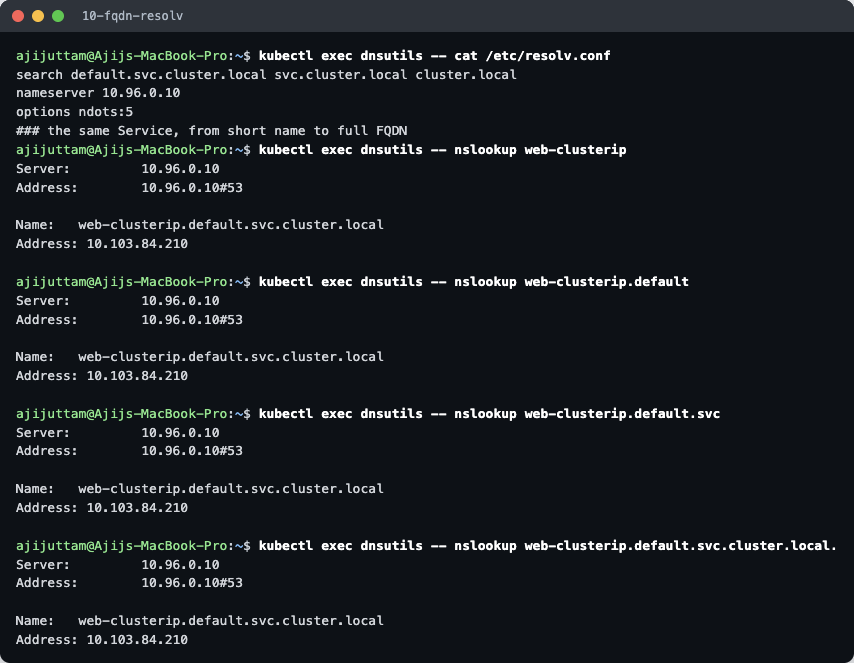
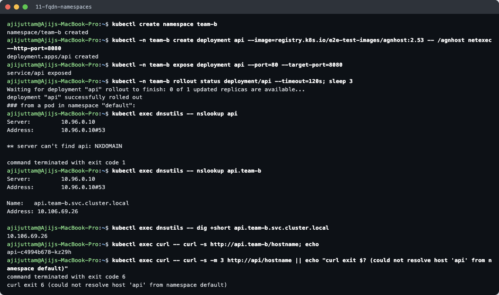
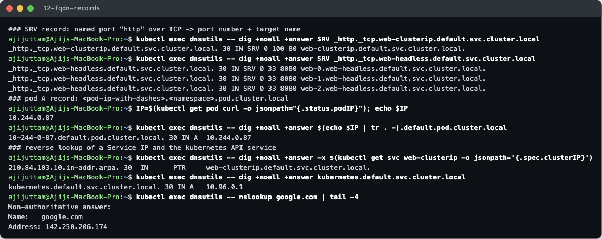

# FQDN in Kubernetes

**Name:** Ajij Uttam  **Enrollment No:** 24bcs10103

All output below is real. It was run from the `dnsutils` and `curl` pods in namespace `default` on my minikube cluster (`k8s-a`, Kubernetes v1.37.0, CoreDNS v1.14.6). Commands: [`../lab/dns.sh`](../lab/dns.sh) steps `10–12`. Raw output: [`../lab/10-fqdn-resolv.txt`](../lab/10-fqdn-resolv.txt), [`11`](../lab/11-fqdn-namespaces.txt), [`12`](../lab/12-fqdn-records.txt).

---

## What is an FQDN?

A **Fully Qualified Domain Name** is a host's complete name, from the host label all the way up to the DNS root, for example `www.github.com.`. It is unambiguous: it resolves the same way no matter where you ask from, because nothing is appended to it. The trailing dot stands for the root and makes a name "absolute". A **short / relative** name like `web-clusterip` is only completed into an FQDN by the resolver, using the **search domains** in `/etc/resolv.conf`.

## Kubernetes Service DNS

Every Service gets a DNS record automatically. **CoreDNS** watches the API server and answers for the cluster domain (`cluster.local` by default). No one creates these records by hand. The record exists as long as the Service exists, and it points to:

- the **ClusterIP** for normal Services (one A record),
- the **pod IPs** for headless Services (one A record per ready pod),
- a **CNAME** for ExternalName Services.

## Naming convention

```
<service>.<namespace>.svc.<cluster-domain>
web-clusterip.default.svc.cluster.local
```

| Object | DNS name pattern | Real example from this cluster |
|---|---|---|
| Service (A) | `<svc>.<ns>.svc.cluster.local` | `web-clusterip.default.svc.cluster.local → 10.103.84.210` |
| Headless Service (A, one per pod) | `<svc>.<ns>.svc.cluster.local` | `web-headless.default.svc.cluster.local → .109, .110, .111` |
| StatefulSet pod via headless svc | `<pod>.<svc>.<ns>.svc.cluster.local` | `web-1.web-headless.default.svc.cluster.local → 10.244.0.110` |
| Named port (SRV) | `_<port-name>._<proto>.<svc>.<ns>.svc.cluster.local` | `_http._tcp.web-clusterip.default.svc.cluster.local → 0 100 80 web-clusterip…` |
| Pod (A) | `<ip-with-dashes>.<ns>.pod.cluster.local` | `10-244-0-87.default.pod.cluster.local → 10.244.0.87` |
| ExternalName (CNAME) | `<svc>.<ns>.svc.cluster.local` | `github-api.default.svc.cluster.local → api.github.com.` |
| API server | `kubernetes.default.svc.cluster.local` | `→ 10.96.0.1` |

## How a pod resolves names: `/etc/resolv.conf`



```
search default.svc.cluster.local svc.cluster.local cluster.local
nameserver 10.96.0.10
options ndots:5
```

- **`nameserver 10.96.0.10`** is the ClusterIP of the `kube-dns` Service, which is backed by the CoreDNS pod. The kubelet writes this file into every pod.
- **`search`** starts with *the pod's own namespace* (`default.svc.cluster.local`). That is why a bare Service name works inside the same namespace.
- **`ndots:5`**: a name with fewer than 5 dots is first tried with each search domain appended, and only then as-is.

All four forms resolved to the **same FQDN and IP** (`web-clusterip.default.svc.cluster.local → 10.103.84.210`):

| What I typed | How it was completed |
|---|---|
| `web-clusterip` | + `default.svc.cluster.local` (1st search domain) |
| `web-clusterip.default` | + `svc.cluster.local` (2nd search domain) |
| `web-clusterip.default.svc` | + `cluster.local` (3rd search domain) |
| `web-clusterip.default.svc.cluster.local.` | absolute (trailing dot), sent as-is |

The CoreDNS query log in [`../coredns/README.md`](../coredns/README.md#how-dns-queries-are-resolved-seen-in-the-query-log) shows the exact sequence of queries these lookups produce.

## Namespace-based DNS

I created namespace `team-b` with a Service `api` and resolved it from a pod in `default`:



| From namespace `default` | Result |
|---|---|
| `nslookup api` | **`NXDOMAIN`**: the search list tries `api.default.svc.cluster.local`, but `api` lives in `team-b` |
| `nslookup api.team-b` | works: `api.team-b.svc.cluster.local → 10.106.69.26` |
| `curl http://api.team-b/hostname` | works: answered by pod `api-c4994b678-kz29h` |
| `curl http://api/hostname` | fails: `curl exit 6`: could not resolve host |

**Rule:** the short name works only **within the same namespace**. To reach another namespace, add at least `.<namespace>`. In configs it's safest to use the full `<svc>.<ns>.svc.cluster.local`. The same Service name can exist in many namespaces (`api.team-a`, `api.team-b`) without clashing. Namespaces are separate DNS zones.

## Pod-to-Service communication

```
curl pod ──"web-clusterip"──► resolver (search list) ──► CoreDNS 10.96.0.10
        ◄── A 10.103.84.210 ──────────────────────────────┘
curl pod ──TCP 10.103.84.210:80──► kube-proxy iptables DNAT ──► pod 10.244.0.x:8080
```

1. The app uses a name. The resolver adds the search domains and asks CoreDNS.
2. CoreDNS answers with the **ClusterIP**, built from Service objects it watches through the API.
3. The connection to the ClusterIP is DNATed by kube-proxy's rules to one ready pod (see [object comparison §3](../object-comparison/README.md#3-replicaset-vs-service)).

Because apps use the **name** and DNS returns the **stable ClusterIP**, the app never needs to know pod IPs.

## More record types



- **SRV** `_http._tcp.web-clusterip…` → `0 100 80 web-clusterip.default.svc.cluster.local.` This tells a client **the port number** of the port named `http`. For the headless Service, the SRV query returns one entry per pod (`web-0/1/2…:8080`, weight 33 each).
- **Pod record:** `10-244-0-87.default.pod.cluster.local → 10.244.0.87` (enabled by `pods insecure` in the Corefile).
- **Reverse (PTR):** `10.103.84.210 → web-clusterip.default.svc.cluster.local.`
- **External name:** `google.com` resolved too. CoreDNS forwards anything outside `cluster.local` to the node's upstream resolver.

## Examples of Kubernetes FQDNs

```
kubernetes.default.svc.cluster.local                  # the API server, from any pod
kube-dns.kube-system.svc.cluster.local                # cluster DNS itself
web-clusterip.default.svc.cluster.local               # my ClusterIP service
api.team-b.svc.cluster.local                          # service in another namespace
web-0.web-headless.default.svc.cluster.local          # one StatefulSet pod
_http._tcp.web-clusterip.default.svc.cluster.local    # SRV record for a named port
10-244-0-87.default.pod.cluster.local                 # a pod by IP
postgres-0.postgres.database.svc.cluster.local        # typical DB primary (pattern)
```
