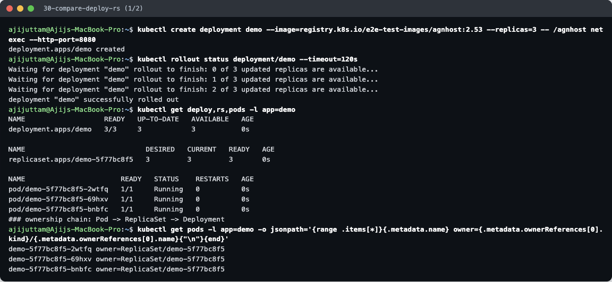
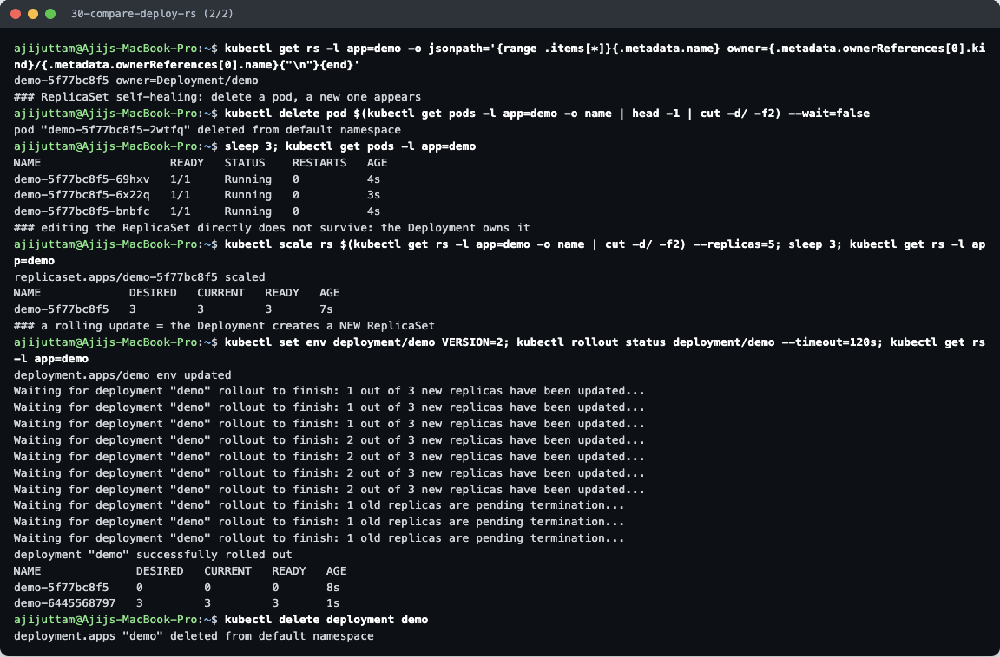
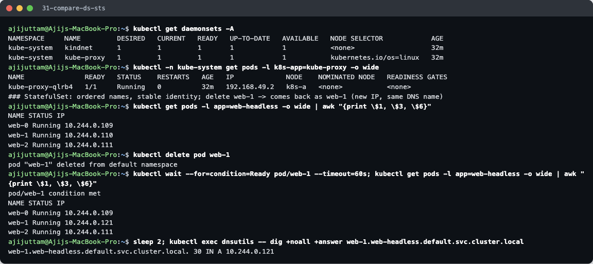
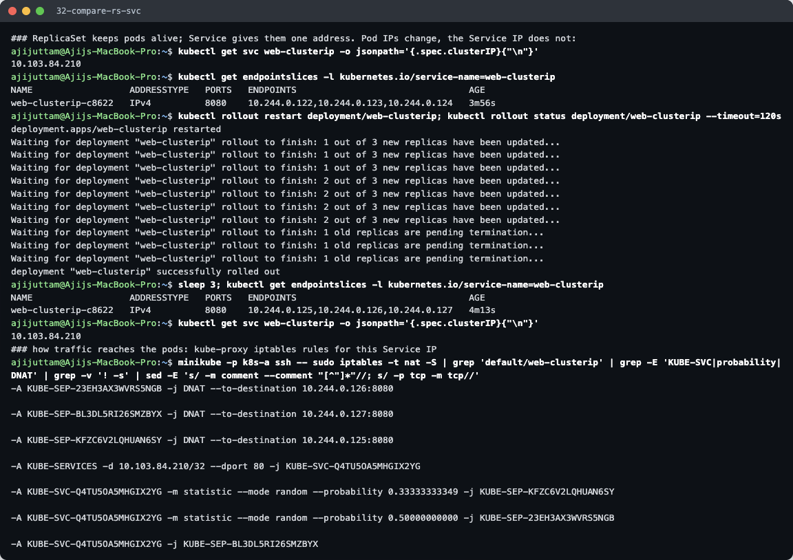

# Kubernetes Object Comparison

**Name:** Ajij Uttam  **Enrollment No:** 24bcs10103

Each comparison is backed by a short live demo on my minikube cluster (`k8s-a`, Kubernetes v1.37.0). Commands: [`../lab/dns.sh`](../lab/dns.sh) steps `30–32`. Raw output: [`../lab/30-compare-deploy-rs.txt`](../lab/30-compare-deploy-rs.txt), [`31`](../lab/31-compare-ds-sts.txt), [`32`](../lab/32-compare-rs-svc.txt).

---

## 1. Deployment vs ReplicaSet

| | ReplicaSet | Deployment |
|---|---|---|
| **Purpose** | Keep exactly **N identical pods** running at all times | Manage an application's **versions** over time: rollouts, rollbacks, scaling |
| **Pod management** | Creates/deletes pods directly to match `replicas`, using a label selector | Never touches pods directly. It creates and scales **ReplicaSets**, and they manage the pods |
| **Scaling** | `kubectl scale rs` works, but if a Deployment owns the RS the change is reverted | `kubectl scale deployment` (or HPA). The Deployment passes the count down to its current RS |
| **Rolling updates** | **None.** Changing the pod template does not touch existing pods | Built in: a template change creates a **new RS** and shifts pods from old to new (`maxSurge`/`maxUnavailable`), keeps old RSs for `rollout undo`, and records revisions |
| **Use directly?** | Almost never | Yes, the standard way to run stateless apps |

**Relationship:** Deployment → owns → ReplicaSet(s) → owns → Pods. Each pod-template version gets its own RS, named `<deployment>-<pod-template-hash>`.




What the demo proves:
1. **Ownership chain:** each pod's `ownerReferences` points to `ReplicaSet/demo-5f77bc8f5`, and that RS's owner is `Deployment/demo`.
2. **ReplicaSet self-healing:** I deleted pod `…-2wtfq`, and 3 s later a replacement `…-6x22q` was running. The count went back to 3.
3. **The Deployment is in charge:** `kubectl scale rs … --replicas=5` was accepted, but 3 s later the RS was back at **DESIRED 3**. The Deployment controller reset it to match its own spec.
4. **Rolling update = new RS:** `kubectl set env deployment/demo VERSION=2` created RS `demo-6445568797` (3 pods), and the old `demo-5f77bc8f5` went to 0 (kept for rollback).

---

## 2. Deployment vs DaemonSet vs StatefulSet

| | Deployment | DaemonSet | StatefulSet |
|---|---|---|---|
| **Use case** | Stateless apps where any pod can serve any request (web, APIs, workers) | **One pod per node** for node-level agents | Stateful apps that need a stable identity and their own storage |
| **Pod creation** | All in parallel, random names (`web-89dc48646-x7k2p`) | One per matching node, created automatically when a node joins | **In order**, `web-0` → `web-1` → `web-2` (each waits for the previous one to be Ready). Deleted in reverse |
| **Scaling** | `replicas: N`, any order | Not by count: it follows the **number of nodes** (limit with `nodeSelector`/taints) | `replicas: N`. Scales up/down one ordinal at a time, highest ordinal removed first |
| **Networking** | Pods are interchangeable behind a normal **ClusterIP Service** | Often `hostNetwork`/`hostPort` to see the node's traffic; usually no Service | Needs a **headless Service**: every pod gets a stable DNS name `web-0.web-headless.<ns>.svc.cluster.local` |
| **Storage** | Shared volume or none. All replicas would share one PVC | Usually `hostPath` (node logs, `/var/lib/...`) | `volumeClaimTemplates`: **one PVC per pod** (`data-web-0`…), which stays with that pod across restarts and rescheduling |
| **Identity on restart** | New name, new IP | New name, same node | **Same name, same DNS, same PVC**, new IP |
| **Examples** | nginx, REST APIs, frontends | kube-proxy, kindnet/Calico/Cilium, Fluent Bit, node-exporter, Datadog agent | PostgreSQL, MySQL, MongoDB, Kafka, ZooKeeper, Elasticsearch, Redis cluster |



What the demo proves:
- **DaemonSet:** the cluster already runs two. `kube-proxy` (with `NODE SELECTOR kubernetes.io/os=linux`) and `kindnet` each show `DESIRED 1`, because there is 1 node. A second node would automatically get a second kube-proxy pod.
- **StatefulSet identity:** I deleted `web-1` (IP `10.244.0.110`). It came back with the **same name `web-1`** and a **new IP `10.244.0.121`**, and `web-1.web-headless…` **resolved to the new IP right away**. Clients that use the DNS name never notice. A Deployment pod would have come back with a random new name.

(Deployments are demonstrated in section 1. The StatefulSet itself was created in [Task 1 §5 of the main README](../README.md#5-headless).)

---

## 3. ReplicaSet vs Service

They solve two different problems and are linked only by **labels**:

| | ReplicaSet | Service |
|---|---|---|
| **Responsibility** | *How many* pods exist. Creates pods from a template and replaces dead ones | *How to reach* the pods. One stable virtual IP + DNS name that load-balances across healthy pods |
| **Selects pods by** | label selector (pods it **owns**) | label selector (pods it **routes to**; it owns nothing) |
| **Creates** | Pods | EndpointSlices (the list of ready pod IP:port pairs) |
| **Without the other** | Pods run, but clients must find their changing IPs themselves | A Service with no matching pods has no endpoints, so connections fail |

**Why a Service is required:** pods are disposable. Every reschedule, crash, scale-down or rolling update gives a pod a **new IP**. Hard-coding pod IPs would break all the time, and you would also lose load balancing and the "send only to Ready pods" behaviour. The Service gives clients one address that never changes while the pods behind it come and go.



What the demo proves (`kubectl rollout restart deployment/web-clusterip`):
- Pod IPs **before:** `10.244.0.122, .123, .124` → **after:** `.125, .126, .127`. Every pod was replaced.
- Service IP **before and after:** `10.103.84.210`. It did not change, so clients were not affected.

**How traffic reaches pods** (the iptables rules kube-proxy wrote on the node, shown at the end of the screenshot):

```
client → web-clusterip (DNS, CoreDNS) → 10.103.84.210:80
  KUBE-SERVICES  -d 10.103.84.210/32 --dport 80        -j KUBE-SVC-Q4TU5…
  KUBE-SVC-Q4TU5… --probability 0.333 → KUBE-SEP-…KFZC  (DNAT → 10.244.0.125:8080)
                  --probability 0.500 → KUBE-SEP-…23EH  (DNAT → 10.244.0.126:8080)
                  (remaining)         → KUBE-SEP-…BL3D  (DNAT → 10.244.0.127:8080)
```

1. The app resolves the Service name through CoreDNS and gets the ClusterIP.
2. The packet to `ClusterIP:80` matches the `KUBE-SERVICES` rule in the node's kernel. No proxy process is in the data path.
3. The `KUBE-SVC` chain picks an endpoint **at random**: 1/3 to the first, then 1/2 of the remaining 2/3, then the rest. That gives each pod 1/3.
4. The `KUBE-SEP` rule **DNATs** the packet to `podIP:targetPort` (8080), and the CNI network delivers it to the pod.
5. When pods change, the EndpointSlice controller updates the endpoints and kube-proxy rewrites these rules. The ReplicaSet decides *which pods exist*. The Service/kube-proxy decides *where packets go*.
