# Kubernetes Pods, ReplicaSets & Deployments — Homework

**Name:** Ajij Uttam  **Enrollment No:** 24bcs10103

**Environment:** minikube v1.39.0 (Docker driver, profile `k8s-a`) on macOS arm64, **Kubernetes v1.37.0**, kubectl v1.37.1. `kubectl` uses a kubeconfig that contains only this cluster (see [`../Kubernetes_Fundamentals`](../Kubernetes_Fundamentals/README.md)).

**Provided material used:** the YAML files in [`deployment-strategies/`](deployment-strategies/) and [`pod-lifecycle/`](pod-lifecycle/) are the instructor's files from `Learn_DEVOPS/Kubernetes/Kubernetes_Objects/` (`01-rolling-update`, `02-blue-green`, `03-canary`, `04-recreate`, `pod-lifecycle`), used unchanged. The scripts are mine: [`lab/strategies.sh`](lab/strategies.sh) and [`lab/lifecycle.sh`](lab/lifecycle.sh). Raw output is in [`lab/`](lab/).

All traffic tests use a long-running client pod (`kubectl run client --image=curlimages/curl:8.10.1 -- sleep 36000`) that calls each Service by its DNS name from inside the cluster.

To see the order of events, I ran `kubectl get pods -w` **in the background with a timestamp on every line** while the update ran. The "observed" screenshots print only the lines where a pod changed state (`TERMINATING` means the pod has a `deletionTimestamp`).

---

## Task 1 — Deployment strategies

### 1. Rolling Update

| File | Key setting |
|---|---|
| [`deployment-v1.yaml`](deployment-strategies/01-rolling-update/deployment-v1.yaml) | 4 replicas, `nginx:1.24-alpine`, page says `VERSION: v1`, readinessProbe on `/` |
| [`deployment-v2.yaml`](deployment-strategies/01-rolling-update/deployment-v2.yaml) | same, but `nginx:1.25-alpine` and `VERSION: v2` |
| strategy | `RollingUpdate`, `maxSurge: 1`, `maxUnavailable: 0` |

**Create and configure:**

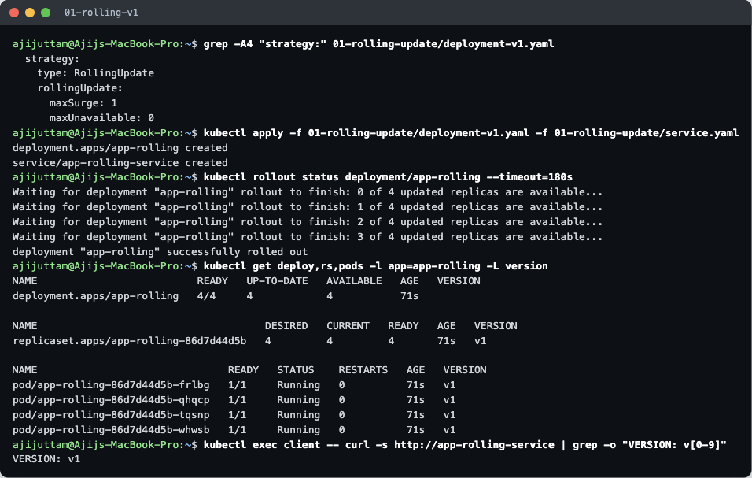

4 v1 pods, all from one ReplicaSet (`app-rolling-86d7d44d5b`), and the Service returns `VERSION: v1`.

**Perform the update** (with a background curl loop: 150 requests, one every 0.3 s):

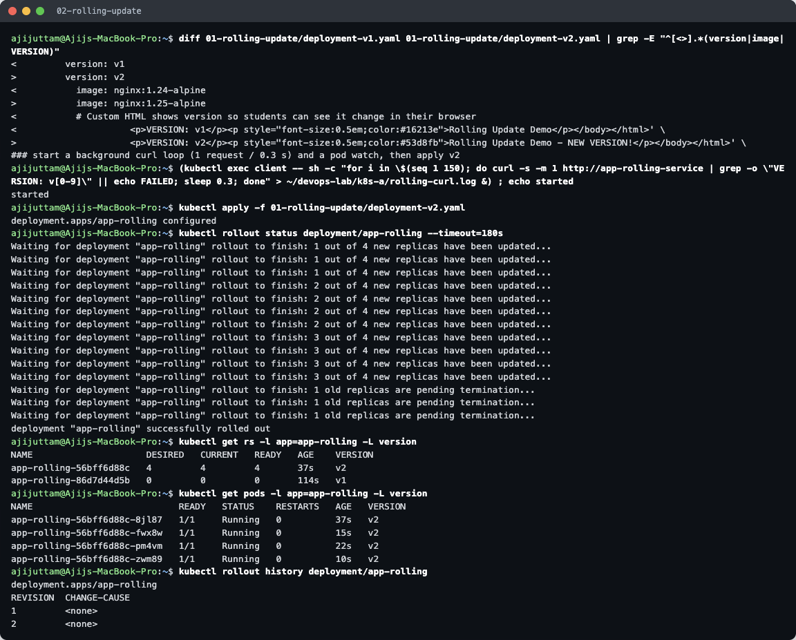

After `kubectl apply -f deployment-v2.yaml` a **second ReplicaSet** (`…-56bff6d88c`, v2) was created and scaled up while the old one scaled down to 0. The old ReplicaSet is kept so `kubectl rollout undo` can use it. `rollout history` now shows revisions 1 and 2.

**Verify old and new pods:**

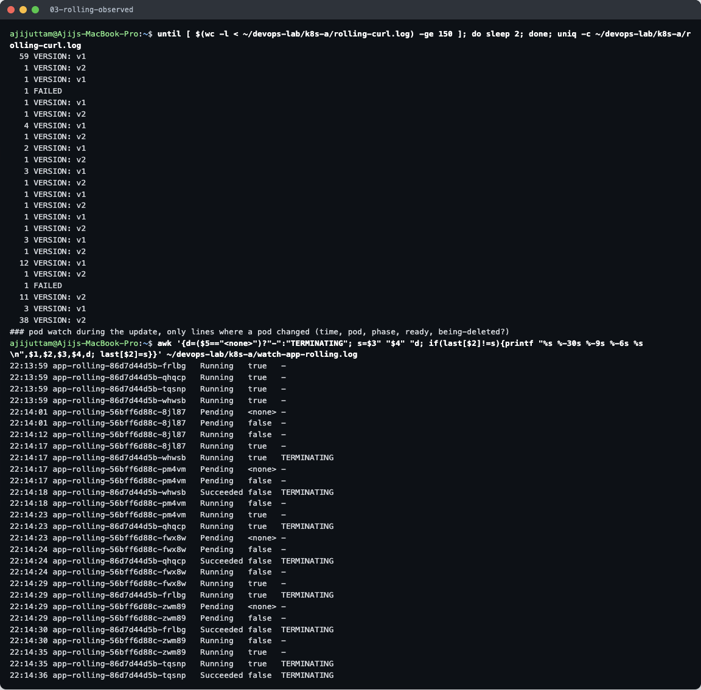

- The pod timeline shows the strategy exactly: **one new pod is created (surge +1) → it becomes `Ready` → only then one old pod is terminated → repeat.** With `maxUnavailable: 0` there were never fewer than 4 ready pods. The whole update took about 35 s (22:14:01 → 22:14:36).
- The curl log shows **v1 and v2 answering side by side** during the update (`v1, v2, v1, v1…`), then only v2. Mixed versions during the update are the main thing to keep in mind with rolling updates: both versions must be compatible (same API, same DB schema).
- **2 of the 150 requests failed** (`FAILED`), even with `maxUnavailable: 0`. The cause is a race: when a pod is deleted, the kubelet sends SIGTERM to nginx while kube-proxy is *at the same time* removing the pod from the Service rules. For a short moment, traffic can still be sent to a pod that has already stopped. The usual fix is a `preStop` hook such as `sleep 5` (so the pod keeps serving until it has been removed from the endpoints), plus graceful shutdown in the app.

### 2. Blue-Green Deployment

Two full Deployments run at the same time, `app-blue` (v1, `slot: blue`) and `app-green` (v2, `slot: green`). **One Service** decides which one is live through its selector.

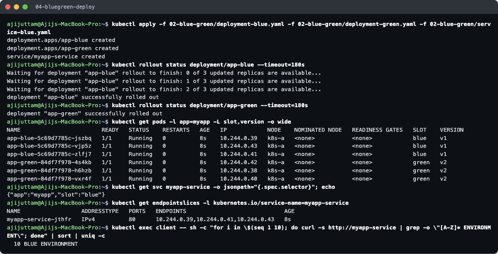

- 3 blue and 3 green pods are running. The Service selector is `{"app":"myapp","slot":"blue"}`, so its EndpointSlice holds **only the 3 blue pod IPs** (`.32 .33 .34`).
- 10 of 10 requests → `BLUE ENVIRONMENT`. Green is deployed and can be tested, but gets no user traffic.

**Switch traffic and verify the active version:**

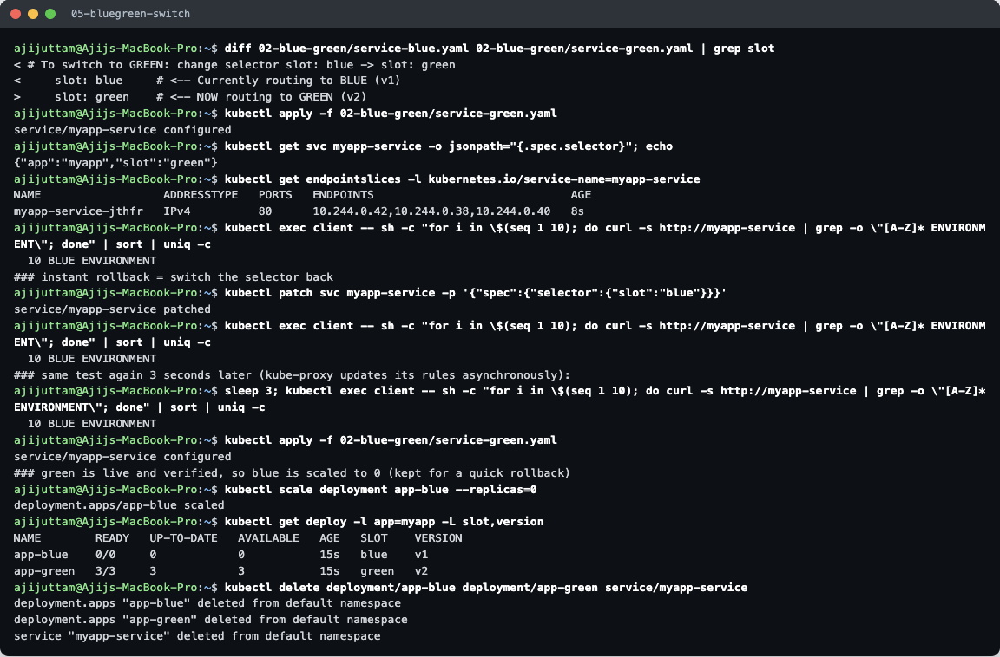

- Applying `service-green.yaml` changes only one line (`slot: blue` → `slot: green`). The EndpointSlice immediately changed to the **green pod IPs** (`.35 .36 .37`) and 10 of 10 requests returned `GREEN ENVIRONMENT`. All traffic moved at once. No pods were restarted.
- **Rollback** is the same switch in reverse (`kubectl patch svc … slot: blue`), and the next requests were all BLUE. Then I switched to green again and scaled blue to 0. Keeping the blue Deployment object (at 0 replicas) lets you bring it back quickly.
- In an earlier run of the same step, the requests sent *right after* the patch still went to the old colour. kube-proxy updates the iptables rules asynchronously, so the switch is "instant" only to within about a second. That is why the script checks again 3 seconds later. (I re-ran the step afterwards and did not keep that first transcript, so there is no screenshot of it.)
- Cost: you need **twice the pods** for the length of the switch.

### 3. Canary Deployment

`app-stable` (9 replicas, v1) and `app-canary` (1 replica, v2) both carry `app: myapp-canary`. The Service selects **only that shared label**, so it balances across all 10 pods. Plain Kubernetes has no traffic weights: **the split comes from the ratio of pod counts.**

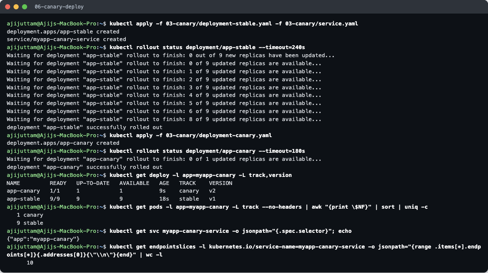

9 stable + 1 canary pods, selector `{"app":"myapp-canary"}`, and **10 endpoints** behind the Service.

**Route a small percentage to the canary, measured with 100 requests:**

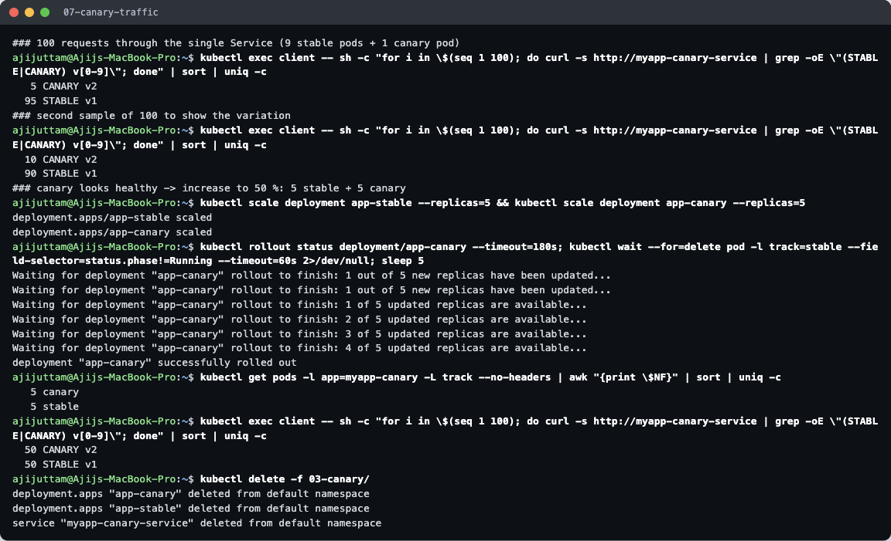

| Pods (stable : canary) | Expected canary share | Measured (100 requests) |
|---|---|---|
| 9 : 1 | 10 % | **5 %**, then **10 %** in a second sample |
| 5 : 5 | 50 % | **50 %** |

kube-proxy picks a backend **at random** for each connection, so with only 100 requests the split moves around the expected value (5 % and 10 % for the same 9:1 setup). To promote the canary I scaled to 5:5 and got exactly 50/50. For precise percentages that do not depend on pod counts, you need an Ingress controller with weights (e.g. the NGINX `canary-weight` annotation), a service mesh, or Argo Rollouts.

### 4. Recreate Deployment

[`deployment-v1.yaml`](deployment-strategies/04-recreate/deployment-v1.yaml) / [`v2`](deployment-strategies/04-recreate/deployment-v2.yaml): 3 replicas, `strategy: type: Recreate`. I updated v1 → v2 while a curl loop ran every 0.5 s and the pod watch recorded the timeline.

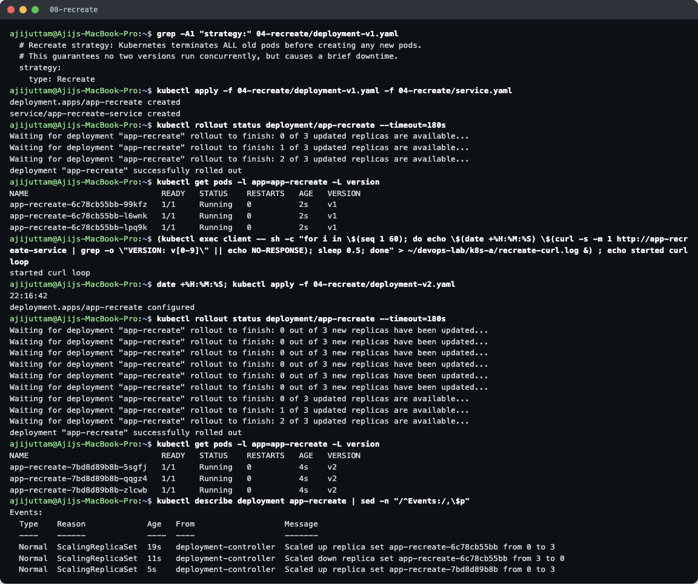

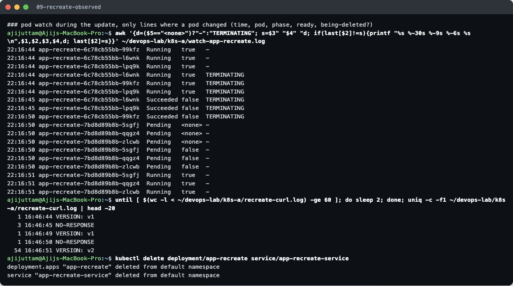

**Old pods are terminated before new pods are created:**

- `22:16:44`: **all three** v1 pods were marked `TERMINATING` at the same moment.
- `22:16:45`–`22:16:50`: the v1 pods stopped. The last one took ~6 s to shut down.
- `22:16:50`: **only after the last v1 pod was gone** were the three v2 pods created (`Pending`). They were Running and Ready at `22:16:51`.
- The Deployment events say the same thing: `Scaled down replica set …6c78cb55bb from 3 to 0`, *then* `Scaled up replica set …7bd8d89b8b from 0 to 3`. A RollingUpdate would show the scale-ups and scale-downs interleaved.
- The curl log (times are UTC inside the pod) shows the **downtime**: `NO-RESPONSE` from 16:46:45 to 16:46:50 (one v1 answer in between came from the pod that was still shutting down), then only `VERSION: v2`. Only one version ever served at a time.

Recreate is the right choice when two versions **must not run together**, for example a DB schema migration that is not backward compatible, or an app holding a single-writer lock. The price is a short outage.

### Strategy summary

| | Rolling Update | Blue-Green | Canary | Recreate |
|---|---|---|---|---|
| Downtime | none (2/150 requests failed due to an endpoint race) | none | none | **yes** (~5 s here) |
| Versions live together | yes, during the rollout | no (switch at once) | yes, on purpose | never |
| Extra resources | +`maxSurge` pods | **2×** | a few canary pods | none |
| Rollback | `rollout undo` (gradual) | flip the selector back (instant) | scale canary to 0 | redeploy old version (downtime again) |
| How in K8s | built-in strategy | 2 Deployments + Service selector | 2 Deployments, shared label | built-in strategy |

---

## Task 2 — Pod lifecycle

**Phases vs. STATUS:** a pod's official **phase** is only one of `Pending`, `Running`, `Succeeded`, `Failed`, `Unknown`. The STATUS column in `kubectl get pods` is more detailed and often shows the *container* state reason instead (`ContainerCreating`, `Completed`, `Error`, `CrashLoopBackOff`, `ImagePullBackOff`, `Terminating`, `Init:0/1`). So for each file I printed `phase` and the container `state` from the API (via jsonpath) next to the normal `get`/`describe` output.

> **Real problem hit along the way:** the first run of `03-succeeded.yaml` went to **`ImagePullBackOff`** instead of running ([`lab/lc-03-succeeded-attempt1-429.txt`](lab/lc-03-succeeded-attempt1-429.txt)). The message was `429 Too Many Requests` from `registry-1.docker.io`: Docker Hub's anonymous pull limit, because several clusters on this machine share one public IP. I pulled the identical image from Google's Docker Hub mirror inside the node and tagged it `busybox:1.36`, so the instructor's YAML could stay unchanged:
>
> 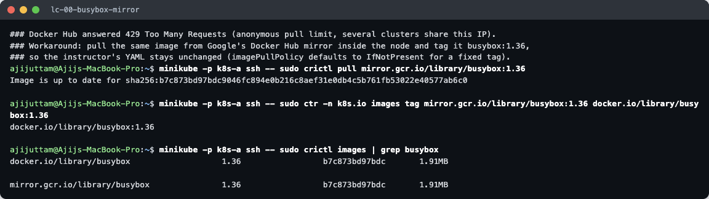

### 01 — Running
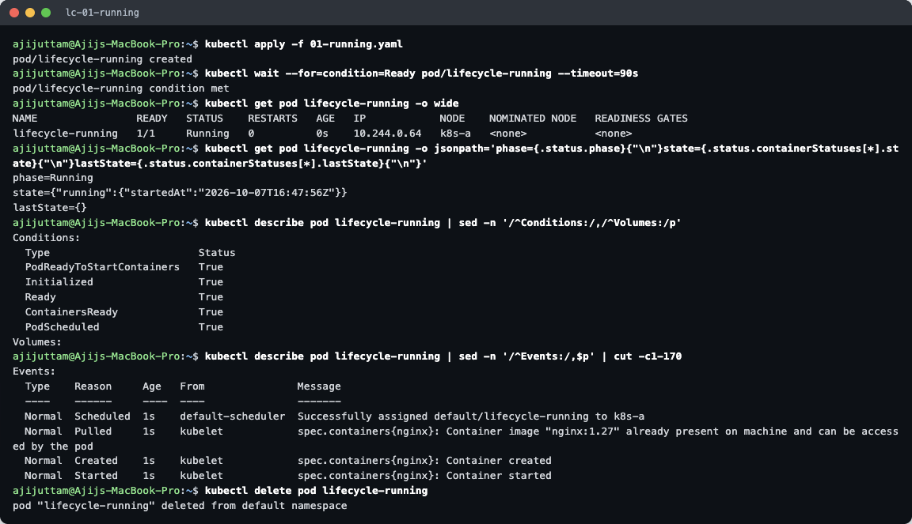

The pod went Scheduled → Pulled → Created → Started in about a second (nginx was already cached on the node). Phase `Running`, container state `running`, and all five pod **conditions** are `True`: `PodScheduled → Initialized → PodReadyToStartContainers → ContainersReady → Ready`. These conditions are the step-by-step checklist a pod passes through on the way to Running.

### 02 — Pending
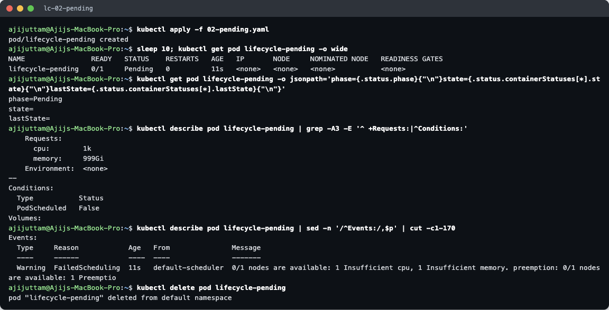

The pod requests `cpu: 1000` (shown as `1k`) and `memory: 999Gi`. No node can fit that, so the scheduler event says `0/1 nodes are available: 1 Insufficient cpu, 1 Insufficient memory`. Preemption cannot help either. The pod stays **`Pending`** with `PodScheduled=False`, and there is no container state at all because nothing was ever created. Pending can also mean "scheduled but still pulling images". The `PodScheduled` condition tells the two apart.

### 03 — Succeeded
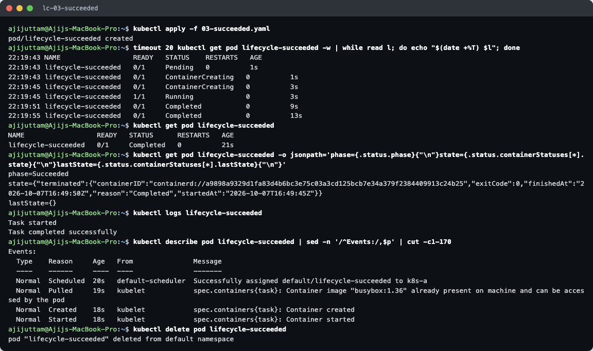

`restartPolicy: Never` with a script that ends in `exit 0`. Timeline: `ContainerCreating` → `Running` (22:19:45) → `Completed` 6 s later (sleep 5). Phase **`Succeeded`**, container `terminated` with `exitCode: 0, reason: Completed`. Logs show both messages. This is how Jobs and batch tasks end.

### 04 — Failed
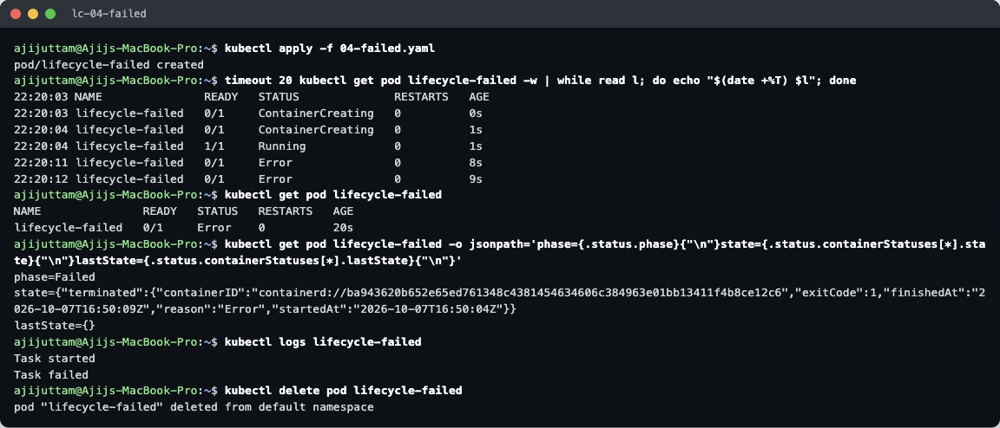

The same script but `exit 1`. STATUS `Error`, phase **`Failed`**, `exitCode: 1`. Because `restartPolicy: Never`, the kubelet leaves it in that state, and the logs (`Task failed`) are still readable for debugging.

### 05 — CrashLoopBackOff
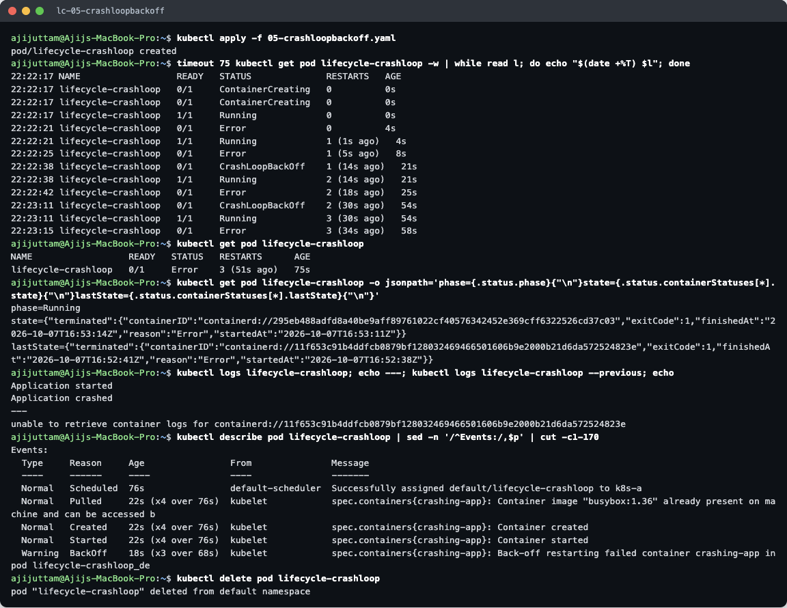

The same failing command, but with the default `restartPolicy: Always`, so the kubelet keeps restarting it. From the timeline:

| Crash | Waited before restart |
|---|---|
| 1st (22:22:21) | ~0 s |
| 2nd (22:22:25) | ~13 s (`CrashLoopBackOff` shown while waiting) |
| 3rd (22:22:42) | ~29 s |

The wait grows **exponentially** (10 s, 20 s, 40 s … capped at 5 min). That is the "back-off" in CrashLoopBackOff. Note that the **phase stays `Running`**: CrashLoopBackOff is a container *waiting reason*, not a phase. `state` shows the latest crash (`exitCode 1`) and `lastState` shows the one before. `kubectl logs` printed the crashed container's output. `--previous` failed here because the current container is itself already terminated, and the kubelet had removed the older one. The `BackOff` warning event appears `x3`.

### 06 — ImagePullBackOff
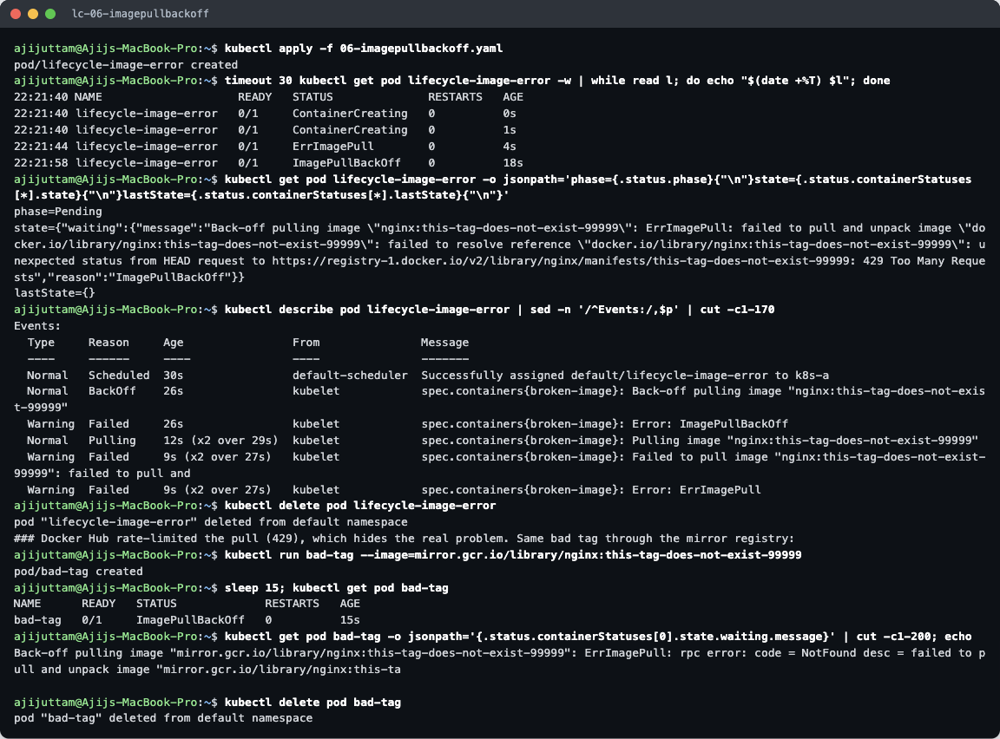

`nginx:this-tag-does-not-exist-99999`: `ContainerCreating` → **`ErrImagePull`** (first failure) → **`ImagePullBackOff`** (the kubelet waits longer before each retry). The phase is `Pending` because the container never started. On this run Docker Hub again answered **429**, which hides the real cause. So I ran the same tag through `mirror.gcr.io`, and that returned the real error: **`code = NotFound`**. Lesson: always read the *message* in `describe`/events. The same STATUS can come from a typo in the tag, a missing image, a private registry without `imagePullSecrets`, or rate limiting.

### 07 — Readiness probe
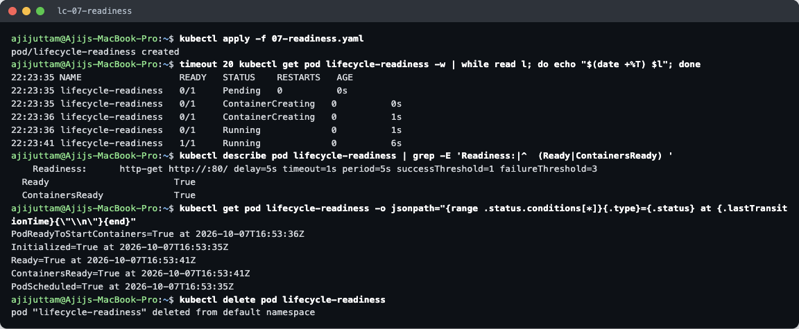

The container is `Running` at 22:23:36 but **`0/1` Ready** until 22:23:41. The readinessProbe (`http-get :80/`, `delay=5s`) has to pass first. The condition timestamps confirm `Ready=True` arrived 5 s after `Initialized`. While not ready, the pod is **left out of Service endpoints**. That is exactly what the Kubernetes Basics bootcamp app was missing in the previous homework.

### 08 — Liveness probe
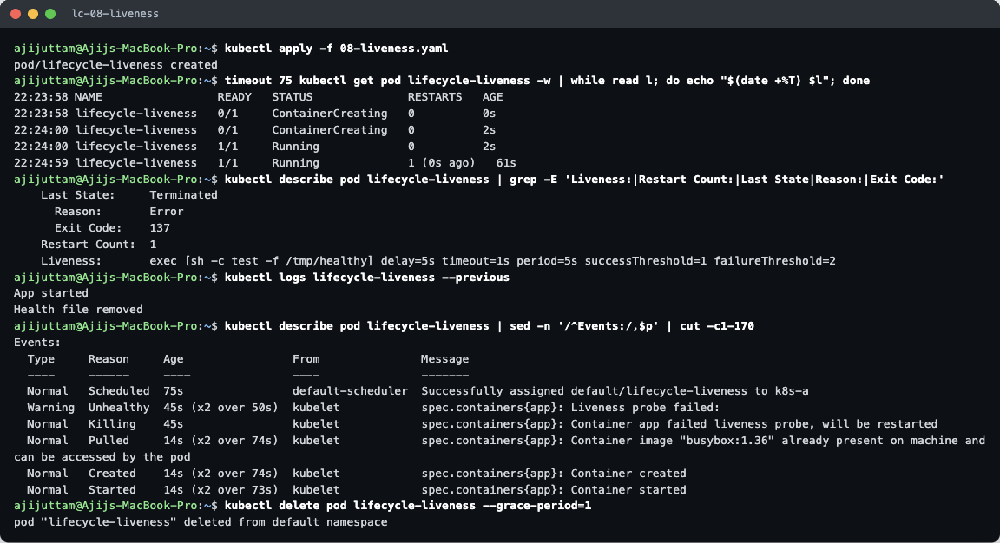

The app deletes `/tmp/healthy` after 20 s. The probe (`test -f /tmp/healthy`, every 5 s, `failureThreshold=2`) then failed twice (`Unhealthy x2`), and the kubelet logged **`Container app failed liveness probe, will be restarted`**. The restart (RESTARTS 1) only shows up at 22:24:59, about **30 s after** the kill decision. `sh` as PID 1 ignores SIGTERM, so the kubelet waited the default 30 s grace period and then sent SIGKILL: **`Exit Code: 137`** (128 + 9). `logs --previous` shows the old container's last words, `Health file removed`. Liveness = "restart me if I'm stuck".

### 09 — Startup probe
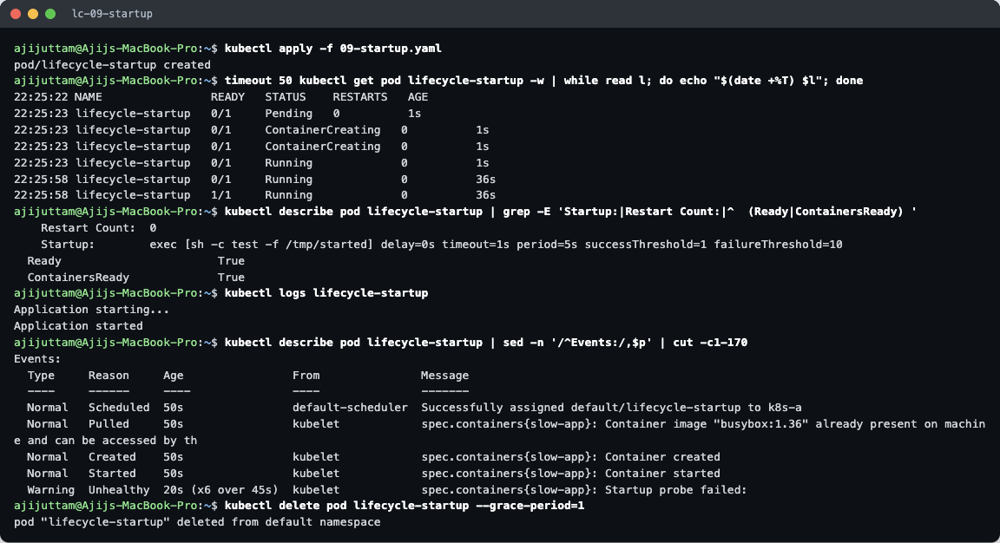

The app needs 30 s before it creates `/tmp/started`. The startupProbe allows `10 × 5 s = 50 s`. The events show `Startup probe failed` **6 times**, yet `Restart Count: 0`. While a startup probe is running, liveness/readiness are paused and failures below the threshold do not kill the container. It became `1/1 Ready` at 36 s. Without it, a liveness probe would keep killing slow-starting apps (JVMs, apps that run migrations on start).

### 10 — Init container
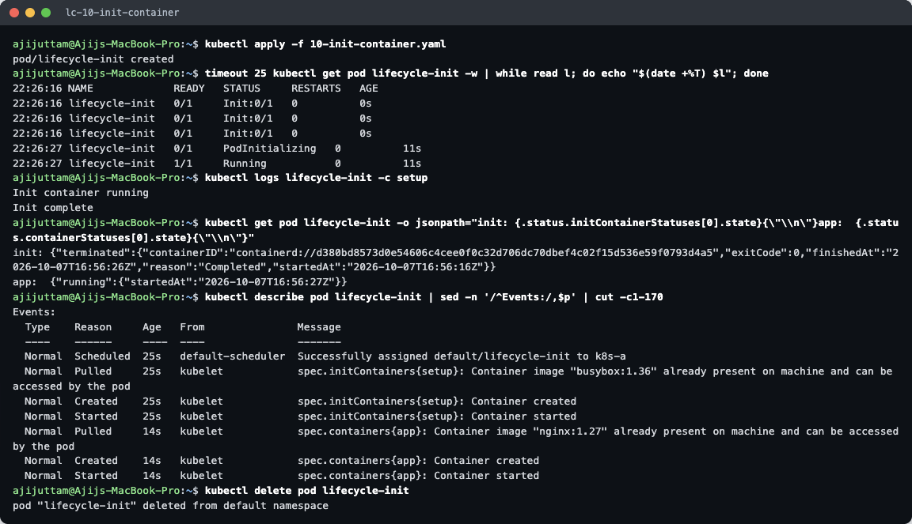

STATUS `Init:0/1` for ~11 s while the `setup` init container ran (`sleep 10`), then `PodInitializing`, then `Running`. The events show `spec.initContainers{setup}` started first, and the `nginx` app container was only pulled/started **after** setup ended with `exitCode 0, reason Completed`. Init containers run **in order, to completion, before** any app container. They are used for waiting on dependencies, migrations, or fetching config.

### 11 — Multi-container pod (sidecar)
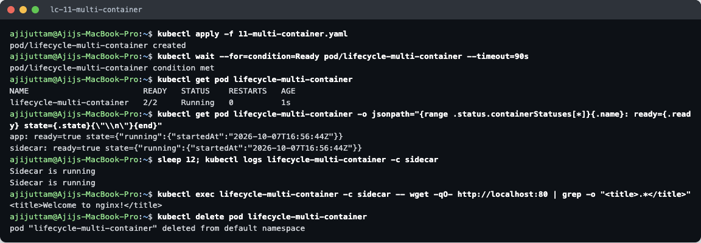

`READY 2/2`: both `app` (nginx) and `sidecar` (busybox loop) are running. `kubectl logs -c sidecar` picks one container. The interesting part: from **inside the sidecar**, `wget http://localhost:80` reached **nginx in the other container**. Containers in a pod share one network namespace (one IP, one `localhost`). That is what makes sidecars (log shippers, proxies) work.

### 12 — Graceful termination
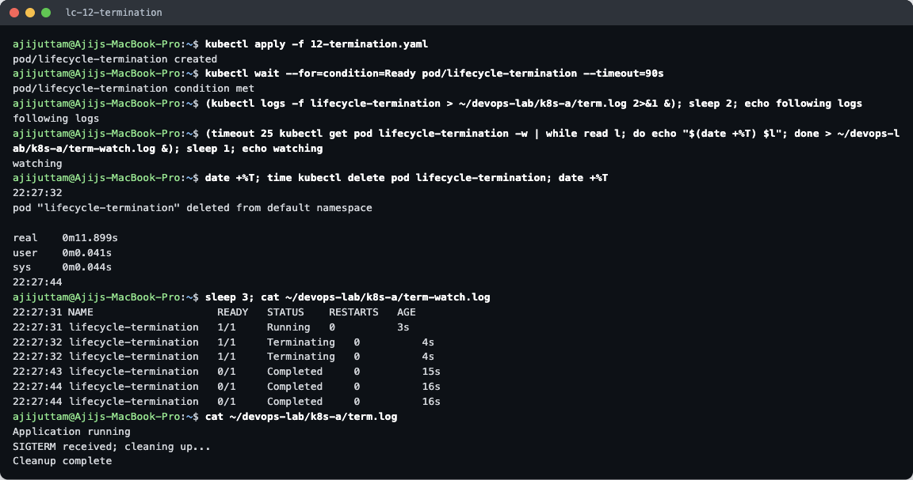

The app traps SIGTERM, "cleans up" for 10 s, then exits 0 (`terminationGracePeriodSeconds: 20`).

- `kubectl delete` at 22:27:32 → status `Terminating` immediately → `Completed` at 22:27:43. The delete command took **11.9 s**: about the 10 s cleanup, well under the 20 s limit, so no SIGKILL was needed.
- The followed log shows the sequence: `SIGTERM received; cleaning up...` → `Cleanup complete`.

Kubernetes shutdown works like this: remove the pod from endpoints + run the preStop hook → send SIGTERM → wait up to `terminationGracePeriodSeconds` → SIGKILL. The liveness example (exit 137) is what happens when an app ignores SIGTERM.

---

All lifecycle pods were deleted after each step, and each strategy's Deployments/Services were deleted before the next one began.
