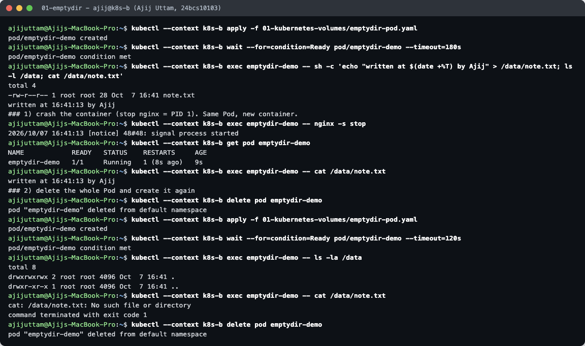
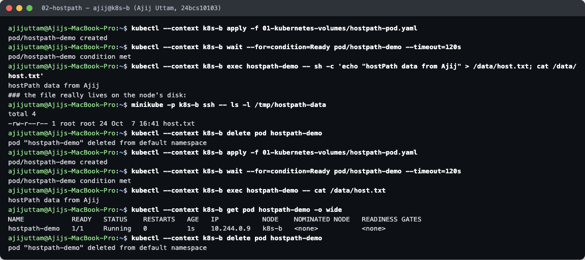
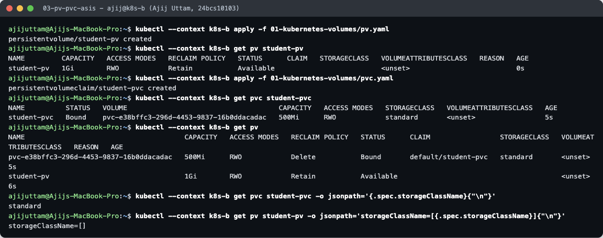
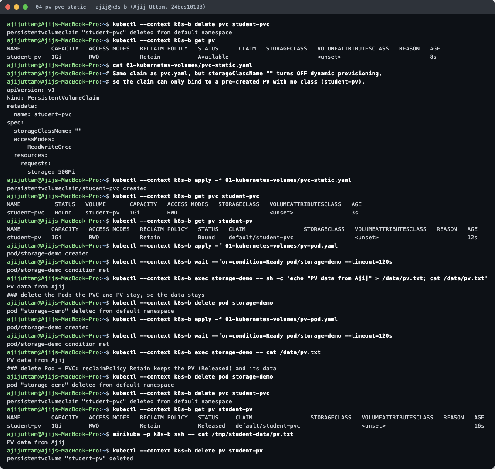
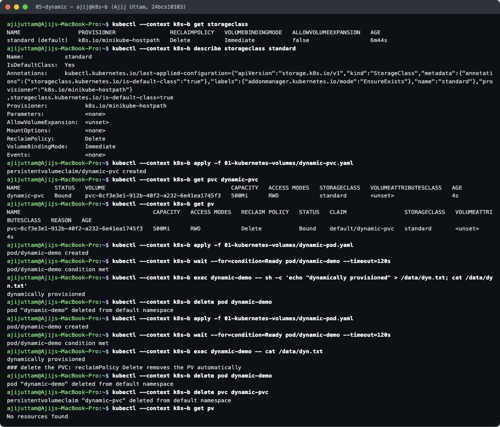
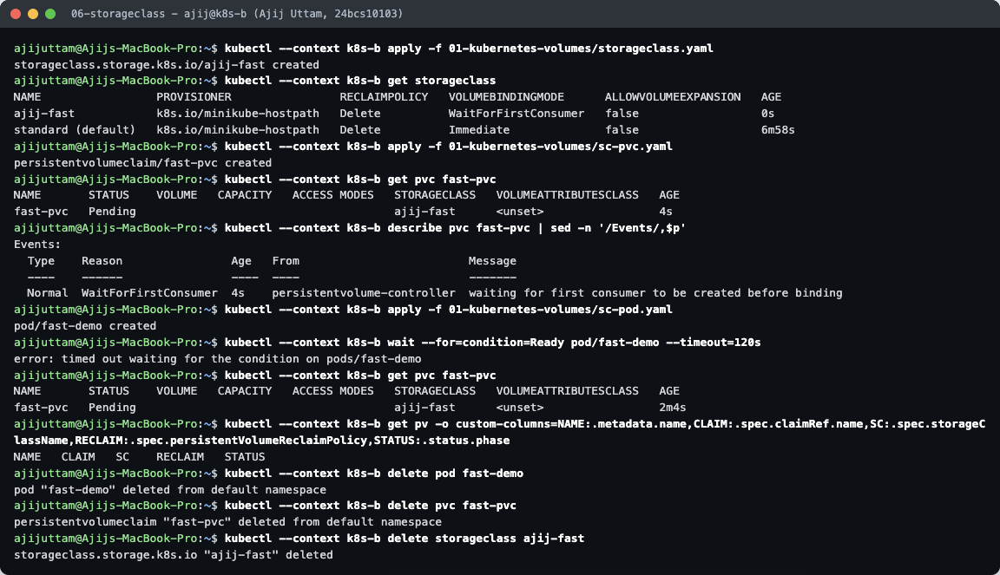
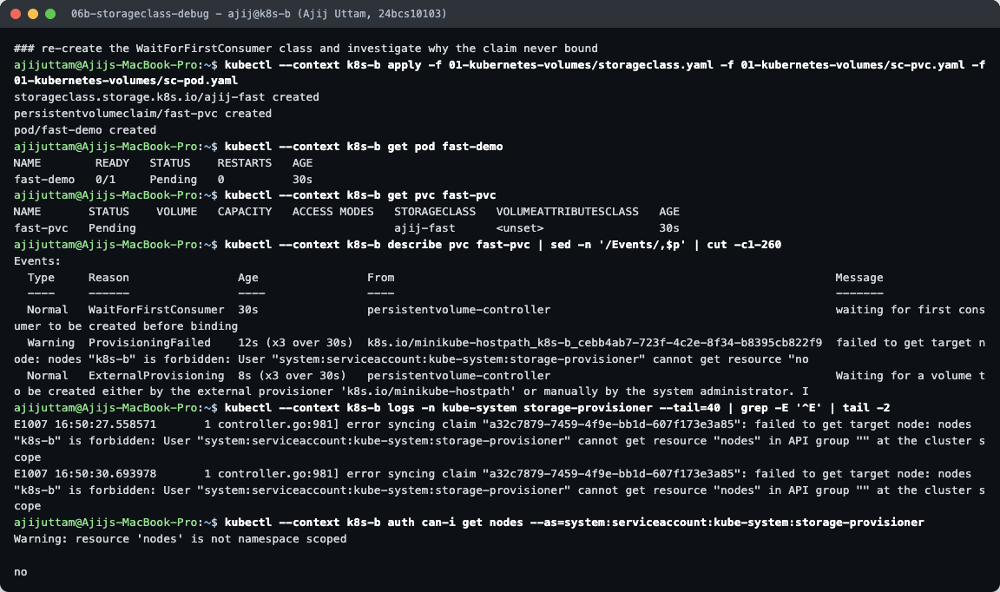
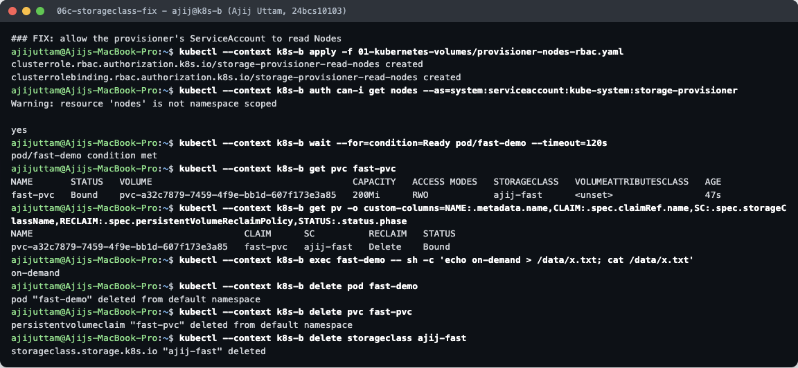

# Kubernetes Volumes — What I Learned

**Name:** Ajij Uttam  **Enrollment No:** 24bcs10103

Everything below was run on a single-node minikube cluster (`minikube -p k8s-b`, Kubernetes **v1.37.0**, containerd runtime). The YAML files in this folder come from the course material (`Kubernetes/Kubernetes_Volumes/01-volumes`, `02-persistent-storage`, `03-storageclass`), plus a few files I added (`pvc-static.yaml`, `dynamic-pod.yaml`, `storageclass.yaml`, `sc-pvc.yaml`, `sc-pod.yaml`, `provisioner-nodes-rbac.yaml`). Commands are in [`../lab/run.sh`](../lab/run.sh) (steps `01`–`06c`), and raw output is in [`../lab/`](../lab/).

## The problem volumes solve

A container's filesystem is thrown away with the container. If nginx crashes and the kubelet starts a new container, anything the old one wrote to its own filesystem is gone. A **volume** is a directory that is mounted into the container but lives *outside* it, so its lifetime can be longer than the container's.

How long the data survives depends on the volume type:

| Type | Where the data lives | Survives container restart | Survives Pod deletion | Survives node loss |
|---|---|---|---|---|
| `emptyDir` | a scratch dir created for the Pod on the node | yes | **no** | no |
| `hostPath` | a fixed path on the node's disk | yes | yes, if the new Pod lands on the **same node** | no |
| PV + PVC | a PersistentVolume (disk, NFS, cloud volume, …) | yes | **yes** | depends on the backend (a cloud disk: yes) |

---

## 1. `emptyDir`



`emptyDir` is created empty when the Pod is scheduled and deleted when the Pod is removed. Containers in the same Pod can all mount it, which makes it the usual way for a sidecar and the main app to share files (logs, a cache, a rendered config).

What the demo shows ([`emptydir-pod.yaml`](emptydir-pod.yaml), transcript [`01-emptydir.txt`](../lab/01-emptydir.txt)):
1. I wrote `/data/note.txt` (`written at 16:41:13 by Ajij`).
2. I stopped nginx (PID 1) with `nginx -s stop`. The container exited and the kubelet restarted it: `RESTARTS 1 (8s ago)`. The file was **still there**, because the Pod (and its emptyDir) never went away. Only the container was replaced.
3. I deleted the Pod and created it again. `/data` was **empty** and `cat` failed with `No such file or directory`. A new Pod gets a new emptyDir.

Use it for: scratch space, caches, files shared between containers of one Pod. Never for data you need to keep.

## 2. `hostPath`



`hostPath` mounts a directory of the **node** into the Pod. [`hostpath-pod.yaml`](hostpath-pod.yaml) mounts `/tmp/hostpath-data` (`type: DirectoryOrCreate` creates it if it is missing).

- I wrote `/data/host.txt` from the Pod, then `minikube ssh -- ls -l /tmp/hostpath-data` showed the same file **on the node itself**.
- After deleting and recreating the Pod, the file was still there.

Why this is not "real" persistence: the data is tied to one machine. On a multi-node cluster the new Pod can be scheduled on a different node and see an empty directory. It is also a security risk, because a Pod can read or write the node's files. It is fine for node agents (log collectors reading `/var/log`) and for single-node labs like this one.

## 3. PersistentVolume (PV) and PersistentVolumeClaim (PVC)



Kubernetes splits storage into two objects:
- **PersistentVolume (PV)**: a piece of storage that exists in the cluster, with a size, access modes and a **reclaim policy**. An admin creates it, or a provisioner creates it automatically. [`pv.yaml`](pv.yaml) is a 1 Gi hostPath-backed PV with `persistentVolumeReclaimPolicy: Retain`.
- **PersistentVolumeClaim (PVC)**: a *request* for storage made by an application ("I need 500Mi, ReadWriteOnce"). The Pod refers only to the claim (`persistentVolumeClaim.claimName`). It never needs to know which disk is behind it.

Kubernetes **binds** a PVC to a PV that satisfies it. Access modes: `ReadWriteOnce` (RWO, one node can mount read-write), `ReadOnlyMany` (ROX), `ReadWriteMany` (RWX, many nodes, needs e.g. NFS), `ReadWriteOncePod`.

**Something I did not expect.** Applying the course's `pv.yaml` and then `pvc.yaml` did **not** bind the claim to `student-pv`. The output shows `student-pvc  Bound  pvc-e38bffc3-…  standard` while `student-pv` stayed `Available`:
- The PVC has no `storageClassName`, so the **DefaultStorageClass** admission controller filled in the cluster default, `standard`.
- `student-pv` has no class (`storageClassName=[]`). A claim only binds to a PV with the **same** class, so the two could not match.
- Instead, the `standard` class provisioned a brand-new 500Mi PV for the claim. That is dynamic provisioning, see section 5.



**Fix:** [`pvc-static.yaml`](pvc-static.yaml) sets `storageClassName: ""`. An empty string means "no class, do not provision dynamically", so the claim can only bind to a pre-created PV with no class. Now `student-pvc` is `Bound` to `student-pv` (and gets the full `1Gi`, since a claim takes the whole PV). Then:
- I wrote `/data/pv.txt` from Pod `storage-demo`, deleted the Pod, recreated it, and the file was **still there**.
- I deleted the Pod **and** the PVC. Because the reclaim policy is `Retain`, the PV moved to `Released` instead of being deleted, and the data was still on the node (`minikube ssh -- cat /tmp/student-data/pv.txt` → `PV data from Ajij`). A `Released` PV is not reused automatically: an admin must clean it up or delete it, which I then did.

Reclaim policies: **Retain** (keep the volume and its data for manual recovery), **Delete** (delete the volume when the claim is deleted, the default for dynamically provisioned volumes). `Recycle` is deprecated.

## 4. StorageClass



A **StorageClass** describes a *kind* of storage and **which provisioner creates it**: for example AWS EBS `gp3`, a GCE persistent disk, or minikube's hostpath. `kubectl get storageclass` shows minikube's default:

```
standard (default)   k8s.io/minikube-hostpath   Delete   Immediate   false
```

- **PROVISIONER** is the controller that creates the actual volume.
- **RECLAIMPOLICY** is copied into every PV the class creates (here `Delete`).
- **VOLUMEBINDINGMODE**: `Immediate` creates the volume as soon as the PVC exists. `WaitForFirstConsumer` waits until a Pod using the claim is scheduled, so the volume is created in that Pod's zone/node.
- `(default)` is set by the annotation `storageclass.kubernetes.io/is-default-class=true`. A PVC with no class gets this one, which is exactly what happened in section 3.

I also wrote my own class, [`storageclass.yaml`](storageclass.yaml) (`ajij-fast`, `WaitForFirstConsumer`), and a claim for it, [`sc-pvc.yaml`](sc-pvc.yaml):



- Before any Pod used it, the claim was `Pending` with the event `WaitForFirstConsumer … waiting for first consumer to be created before binding`. That is the expected behaviour.
- **But after I created the Pod, it still stayed Pending** (`wait` timed out after 120 s). See [`06-storageclass.txt`](../lab/06-storageclass.txt).



Investigating ([`06b-storageclass-debug.txt`](../lab/06b-storageclass-debug.txt)):
- The PVC events and the provisioner logs both said: `failed to get target node: nodes "k8s-b" is forbidden: User "system:serviceaccount:kube-system:storage-provisioner" cannot get resource "nodes"`.
- `kubectl auth can-i get nodes --as=system:serviceaccount:kube-system:storage-provisioner` → `no`.
- **Root cause:** with `WaitForFirstConsumer`, the scheduler writes the chosen node into the PVC annotation `volume.kubernetes.io/selected-node: k8s-b`. The provisioner must then read that Node object, but minikube's storage-provisioner ServiceAccount has no RBAC permission to read Nodes. With `Immediate` binding it never needs to, so the default class works.



**Fix:** [`provisioner-nodes-rbac.yaml`](provisioner-nodes-rbac.yaml), a ClusterRole with `get/list/watch` on `nodes` bound to that ServiceAccount. After applying it, `auth can-i` said `yes`, the provisioner retried, the claim became `Bound` to a new `ajij-fast` PV, and the Pod started and could write to `/data` ([`06c-storageclass-fix.txt`](../lab/06c-storageclass-fix.txt)).

## 5. Dynamic provisioning

Dynamic provisioning means **nobody creates PVs by hand**. The application creates a PVC naming a StorageClass, and that class's provisioner creates a matching PV and binds it automatically. Demo ([`dynamic-pvc.yaml`](dynamic-pvc.yaml) from the course + [`dynamic-pod.yaml`](dynamic-pod.yaml), transcript [`05-dynamic.txt`](../lab/05-dynamic.txt)):

1. `kubectl get pv` was empty. I applied `dynamic-pvc` (500Mi, class `standard`).
2. Within 4 s the claim was `Bound` to `pvc-8cf3e3e1-…`, a PV the provisioner had just created, with `RECLAIM POLICY Delete`.
3. I wrote `/data/dyn.txt`, deleted and recreated the Pod, and the data was still there.
4. Deleting the **PVC** deleted the PV too (`kubectl get pv` → `No resources found`), because the class's reclaim policy is `Delete`.

Static vs dynamic in one line: with **static** provisioning an admin creates PVs in advance and claims bind to them (section 3). With **dynamic** provisioning the PV is created on demand from a StorageClass (this section). Real clusters almost always use dynamic provisioning (EBS, GCE PD, Azure Disk, Longhorn, …).

## Summary

```
Pod ──mounts──▶ PVC ──bound to──▶ PV ──backed by──▶ real storage
                 │                  ▲
                 └─ storageClassName └── created by the StorageClass's provisioner (dynamic)
                                         or by an admin (static)
```

- `emptyDir`: Pod-lifetime scratch space. Survives container restarts, not Pod deletion.
- `hostPath`: node-lifetime. Survives Pod deletion only on the same node. Avoid it for apps.
- PV/PVC: storage whose lifetime is independent of Pods. The reclaim policy decides what happens when the claim is deleted.
- StorageClass + dynamic provisioning: PVs created on demand. Watch out for the default class silently taking over claims that have no class.
