# Kubernetes Storage, HPA & Probes — Homework

**Name:** Ajij Uttam  **Enrollment No:** 24bcs10103

Session 13: volumes and persistent storage, the Horizontal Pod Autoscaler, and liveness/readiness/startup probes, plus the Session 13 mini project.

**Environment:** a single-node minikube cluster on macOS (Apple Silicon) using the Docker driver on Colima:
`minikube start -p k8s-b --driver=docker --cpus=2 --memory=3072` and `minikube -p k8s-b addons enable metrics-server`. Kubernetes **v1.37.0** (containerd 2.3.4), kubectl v1.37.1, minikube v1.39.0, metrics-server v0.9.0. Every `kubectl` command uses `--context k8s-b`, so it only ever touches this cluster.

**Provided material used:** all the YAML here comes from the course repo, `Kubernetes/Kubernetes_Volumes/`:
- `01-volumes`, `02-persistent-storage`, `03-storageclass` → [`01-kubernetes-volumes/`](01-kubernetes-volumes/)
- `04-hpa/hpa.yaml` (the "hpa.yml" in the assignment) + `deployment.yaml` + `service.yaml` → [`02-hpa/`](02-hpa/)
- `05-probes` → [`03-probes/`](03-probes/)
- `mini-project/` (the Session 13 mini project) → [`mini-project/`](mini-project/)

Files I wrote myself are marked "(mine)" below.

**How it was run:** [`lab/run.sh <step>`](lab/run.sh) runs one step and writes its transcript to `lab/<step>.txt`. Each screenshot below is a rendering of one of those transcripts. Lines starting with `###` are my comments, and `[hh:mm:ss]` is the local time a line was captured.

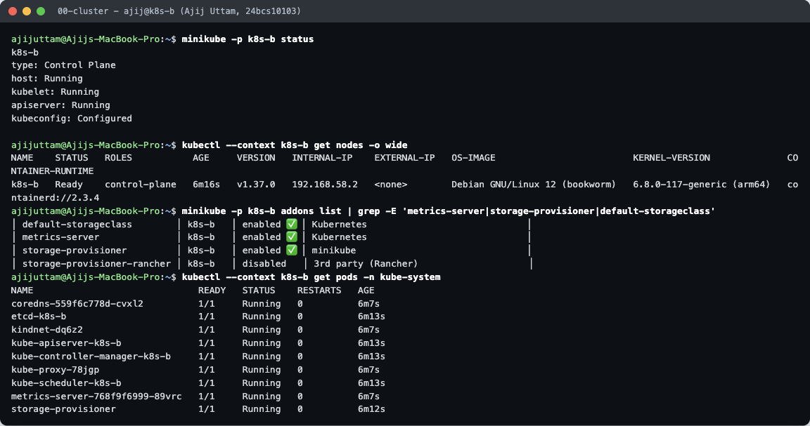

---

## Task 1 — Kubernetes Volumes

The full write-up is in **[`01-kubernetes-volumes/README.md`](01-kubernetes-volumes/README.md)**. It covers emptyDir, hostPath, PersistentVolume, PersistentVolumeClaim, StorageClass and dynamic provisioning, each with a demo showing whether data survives a container restart and a Pod deletion. Short version:

| Demo | Result |
|---|---|
| emptyDir: container restarted | file **survived** (same Pod) |
| emptyDir: Pod deleted and recreated | file **gone** |
| hostPath: Pod deleted and recreated | file **survived** (same node), and visible on the node via `minikube ssh` |
| course `pv.yaml` + `pvc.yaml` | the PVC did **not** bind to `student-pv`. The default StorageClass `standard` was filled in, so a new PV was provisioned. Fixed with `storageClassName: ""` |
| static PV/PVC: Pod deleted | file **survived**. After deleting the PVC, the PV was `Released` (Retain) and the data was still on disk |
| dynamic PVC (`standard`) | PV created automatically in < 4 s and **deleted** with the PVC (reclaim `Delete`) |
| my `WaitForFirstConsumer` StorageClass | stuck `Pending`. Root cause: the minikube provisioner had no RBAC permission to read Nodes. Fixed with a ClusterRole, after which it bound |

---

## Task 2 — HPA hands-on

Files: [`02-hpa/deployment.yaml`](02-hpa/deployment.yaml), [`02-hpa/service.yaml`](02-hpa/service.yaml), [`02-hpa/hpa.yml`](02-hpa/hpa.yml) (provided), [`02-hpa/load-generator.yaml`](02-hpa/load-generator.yaml) (mine, the course's `kubectl run load-generator …` busybox loop written as YAML).

How the HPA decides: every 15 s it reads each Pod's CPU usage from metrics-server, divides by the Pod's CPU **request** (`100m`), and averages over the Pods. If that average is above the target (`averageUtilization: 50`), it computes `desired = ceil(current × currentUtilization / 50)`, clamped to `minReplicas: 1` … `maxReplicas: 5`. That is why the Deployment **must** set `resources.requests.cpu`. Without it the HPA cannot compute a percentage.

### 1. Deploy the application
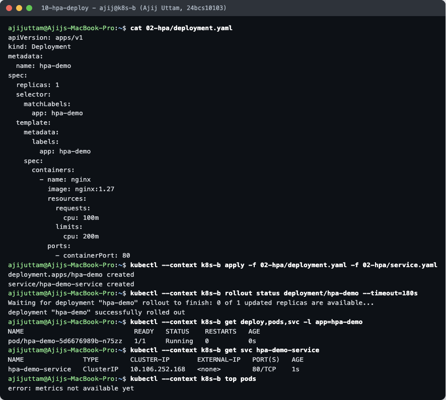

`hpa-demo` (nginx 1.27, request `100m`, limit `200m`) and the ClusterIP Service `hpa-demo-service` came up. `kubectl top pods` returned `error: metrics not available yet`, because metrics-server needs one scrape cycle after a Pod starts before it has numbers.

### 2–3. Configure and verify the HPA
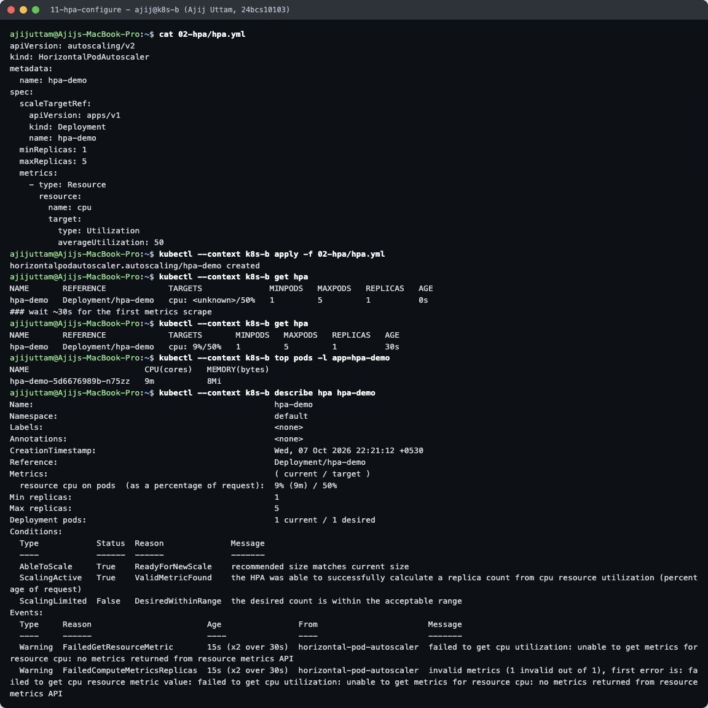

Right after `kubectl apply -f hpa.yml`, TARGETS was `cpu: <unknown>/50%`, and `describe` showed `FailedGetResourceMetric … no metrics returned from resource metrics API`. 30 s later it was `cpu: 9%/50%` (`9m` of `100m`). The conditions `AbleToScale=True` and `ScalingActive=True (ValidMetricFound)` confirm the HPA is working.

### 4–7. Load generator → CPU utilisation → Pod scaling

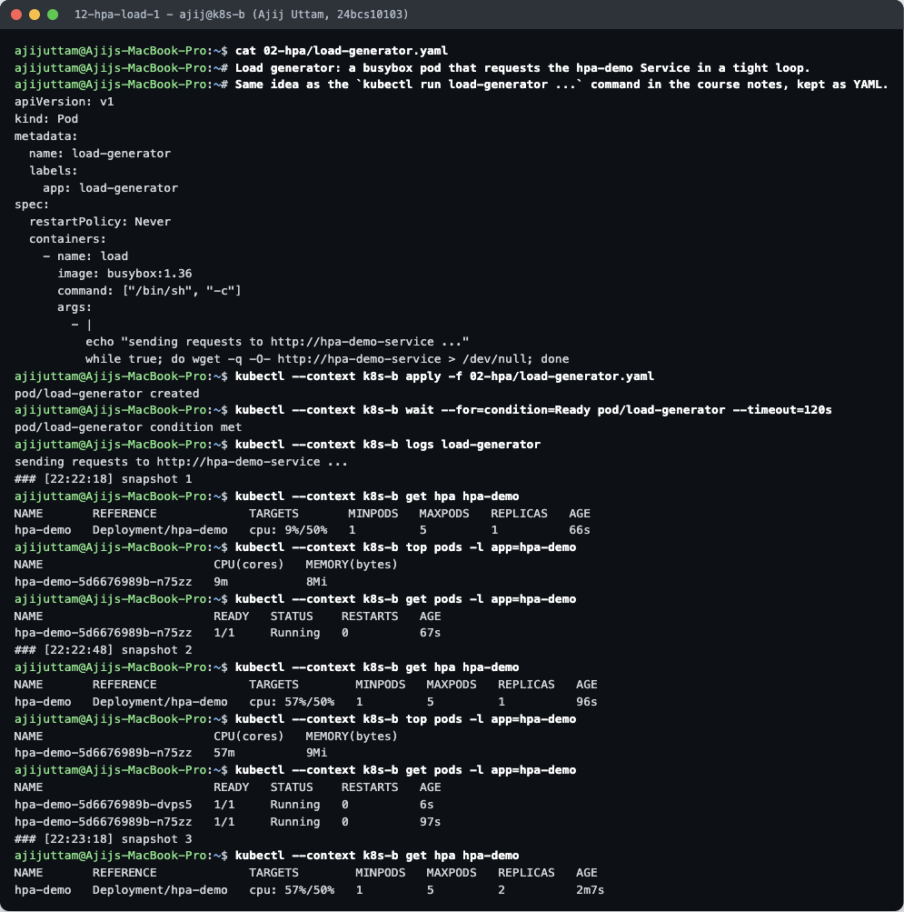
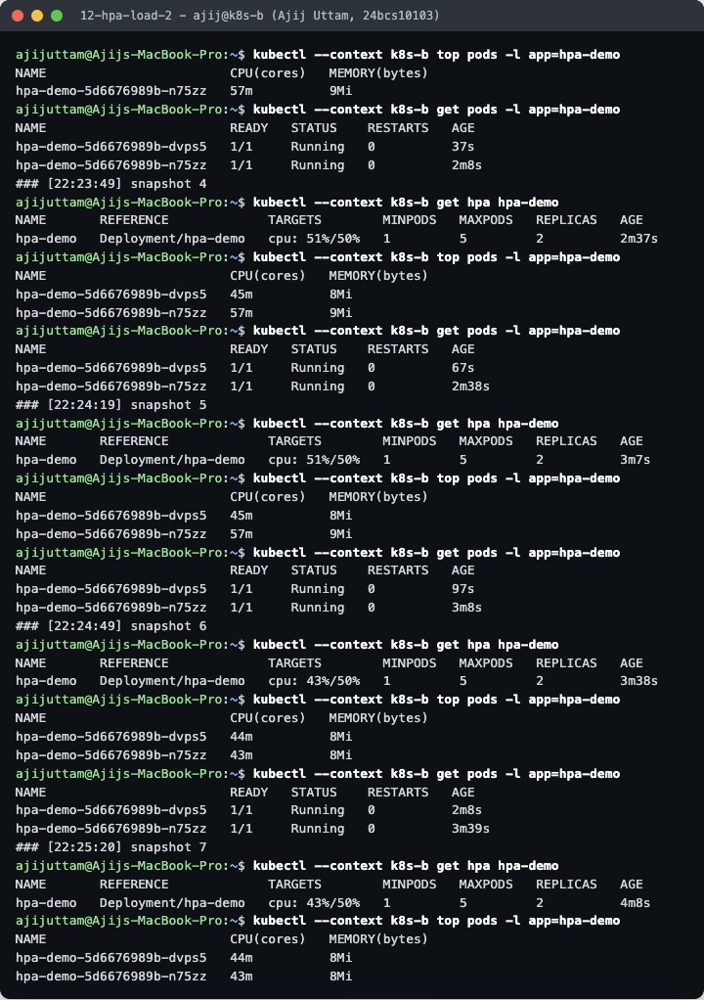
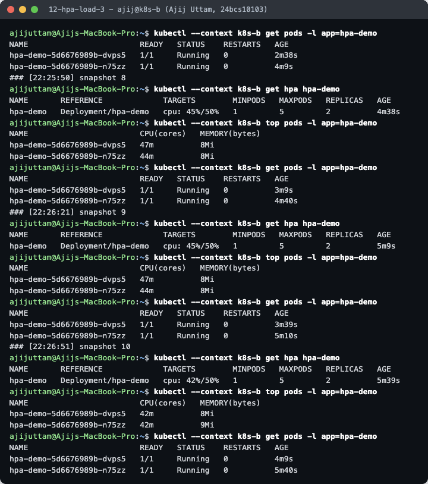

One load generator, with snapshots every 30 s ([`12-hpa-load.txt`](lab/12-hpa-load.txt)):

| time | CPU (avg / target) | replicas | what happened |
|---|---|---|---|
| 22:22:18 | 9% / 50% | 1 | generator just started, metrics not refreshed yet |
| 22:22:48 | **57%** / 50% | 1 → 2 | the single Pod used `57m`, above target, so the HPA scaled to `ceil(1 × 57/50) = 2` |
| 22:23:49 | 51% | 2 | the new Pod took part of the traffic (`45m` + `57m`) |
| 22:24:49 – 22:26:51 | 42–45% | 2 | settled **below** the target, so no further scaling |

### 5. Increase the load
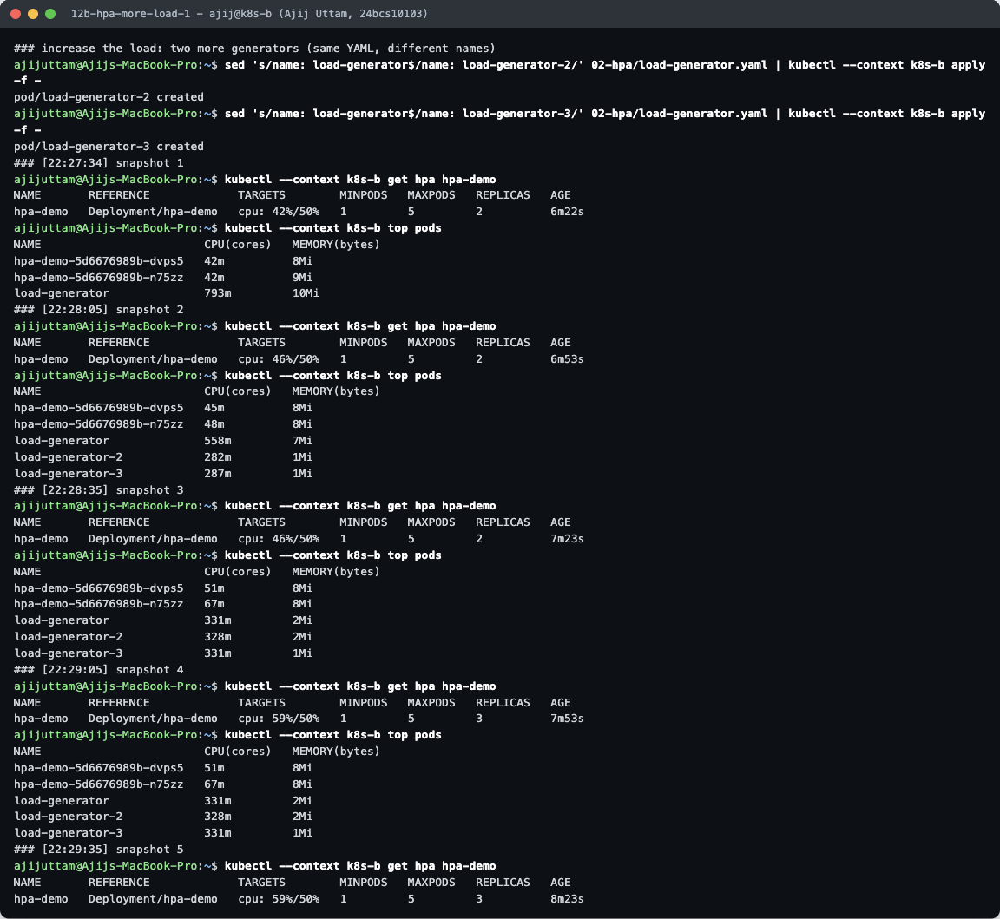
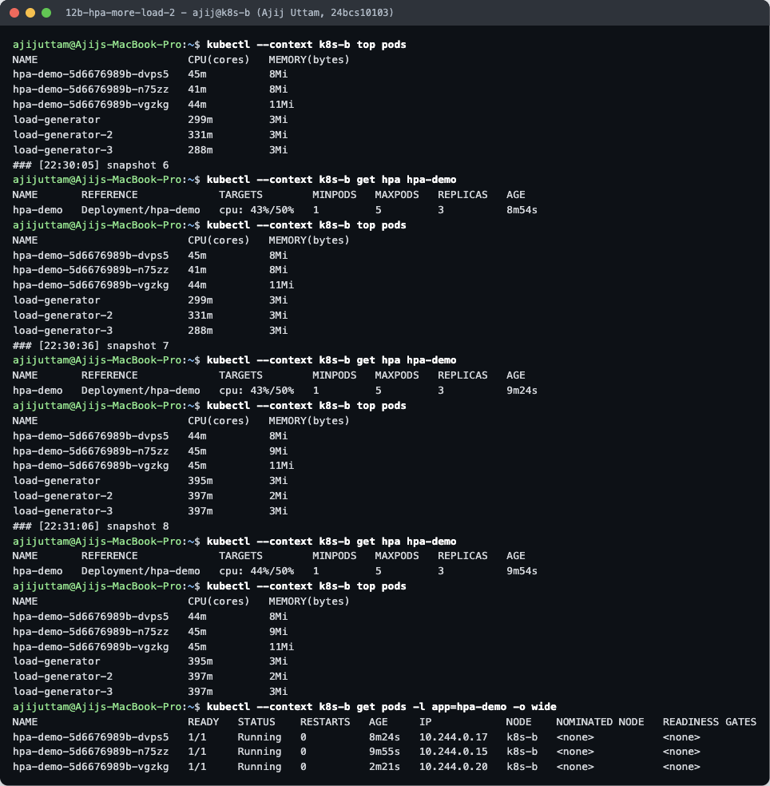

I started two more generators (`load-generator-2`, `-3`). The average climbed to **59%** at 22:29:05, and the HPA scaled to **3** replicas (`ceil(2 × 59/50) = 3`). With 3 Pods it settled at ~43–44%, below target, so it stayed at 3.

**Why it never reached 5:** `kubectl top pods` shows each busybox generator using **300–800m CPU** while each nginx Pod used only ~45m. The node has only 2 CPUs for everything. The *client side* was the bottleneck: busybox `wget` forks a process per request, which costs far more CPU than nginx needs to serve a tiny static page. A real load test would use a more efficient client (e.g. `hey`/`ab`) or a CPU-heavy app.

### `kubectl get hpa -w` over time
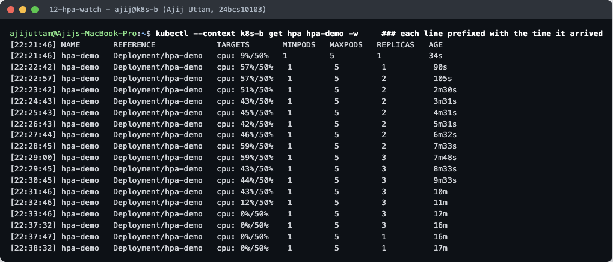

The `-w` watch ran in the background for the whole experiment, with each line timestamped as it arrived ([`12-hpa-watch.txt`](lab/12-hpa-watch.txt)): `1 → 2` at **22:22:57**, `2 → 3` at **22:29:00**, and `3 → 1` at **22:37:47**.

### `kubectl describe hpa` under load
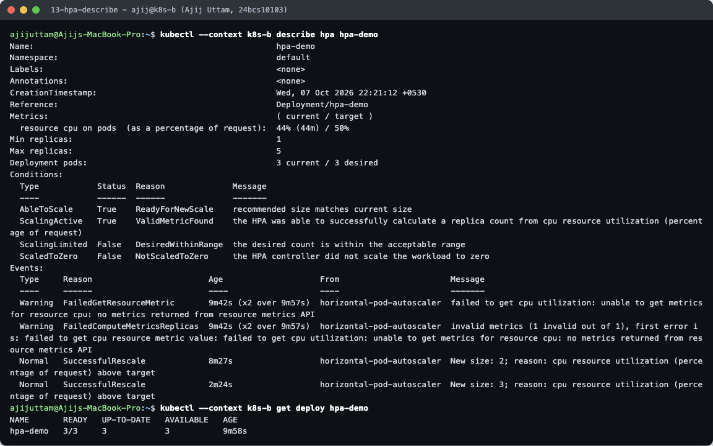

The Events section gives the HPA's reasoning: `New size: 2; reason: cpu resource utilization (percentage of request) above target`, then `New size: 3; …`. The two early `FailedGetResourceMetric` warnings are from the first 30 s, before metrics existed.

### Scale-down after the load stops
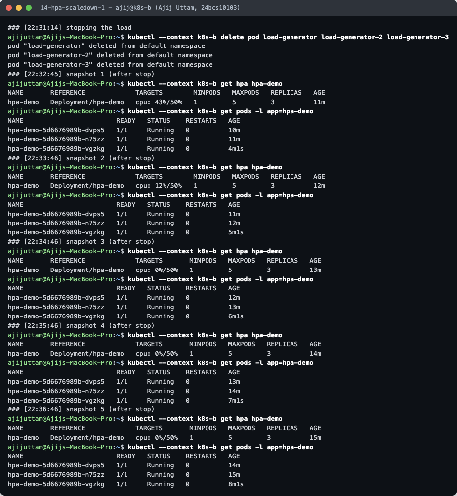
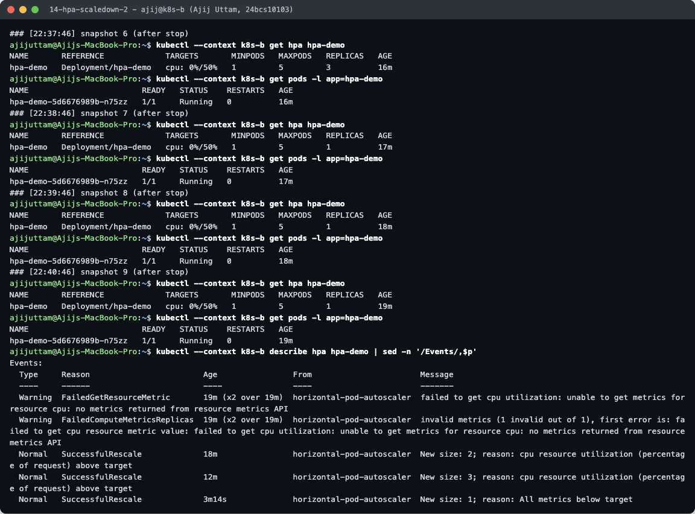

I deleted all three generators at **22:31:14** (the delete command returns only once the Pods are gone, and the first snapshot came a minute later). CPU dropped to `0%` within ~2 minutes (22:34:46), but the replica count stayed at **3** until **22:37:47**, about **6.5 minutes** after the load stopped. Then it went straight to **1** (`New size: 1; reason: All metrics below target`).

The reason is the HPA's default **scale-down stabilization window of 300 s**: before shrinking, the HPA takes the *highest* recommendation from the last 5 minutes. This prevents "flapping" (scaling down and immediately back up) when load is bursty. Scale-up has no such window, which is why it reacted within ~15–30 s.

**Deliverables for Task 2:** HPA YAML [`02-hpa/hpa.yml`](02-hpa/hpa.yml), load generator [`02-hpa/load-generator.yaml`](02-hpa/load-generator.yaml), output in [`lab/10…14-*.txt`](lab/), and the screenshots above.

---

## Probes (course folder `05-probes`)

| Probe | Question it answers | On failure |
|---|---|---|
| **startupProbe** | Has the app finished starting? | Container is restarted. Liveness/readiness are **not run** until it passes once |
| **readinessProbe** | Can this Pod take traffic right now? | Pod is removed from the Service endpoints (`READY 0/1`). **Not** restarted |
| **livenessProbe** | Is the process still healthy? | kubelet **kills and restarts** the container |

### Liveness: failing → restarting → fixed
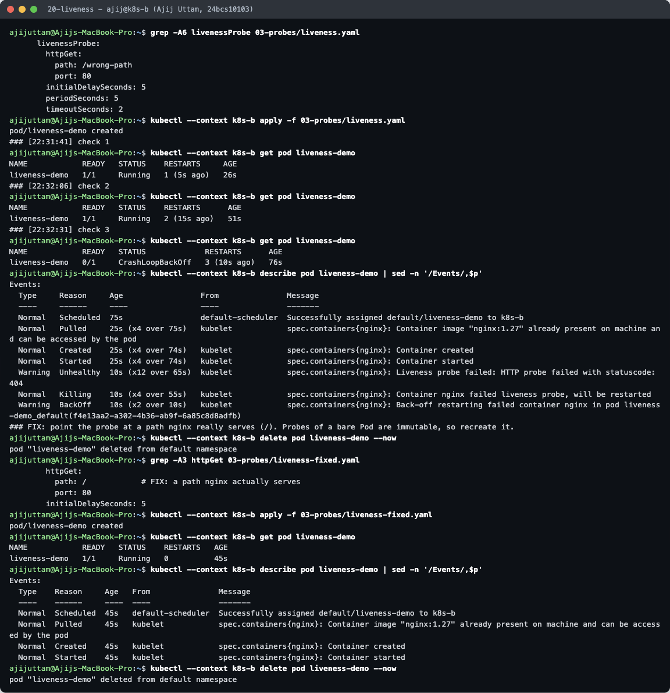

The course's [`liveness.yaml`](03-probes/liveness.yaml) probes `/wrong-path`, which returns 404. Every ~15 s (3 failures × 5 s) the kubelet logged `Liveness probe failed: HTTP probe failed with statuscode: 404` and then `Container nginx failed liveness probe, will be restarted`. RESTARTS went 1 → 2 → 3, then the status became **CrashLoopBackOff**, because the kubelet waits longer between each restart. The container itself was fine; only the probe was wrong. Probes in a Pod spec cannot be edited, so I recreated the Pod from [`liveness-fixed.yaml`](03-probes/liveness-fixed.yaml) (mine, path `/`). It stayed `1/1 Running`, `0` restarts, with no Unhealthy events.

### Readiness: not ready → recovered → not ready again (never restarted)
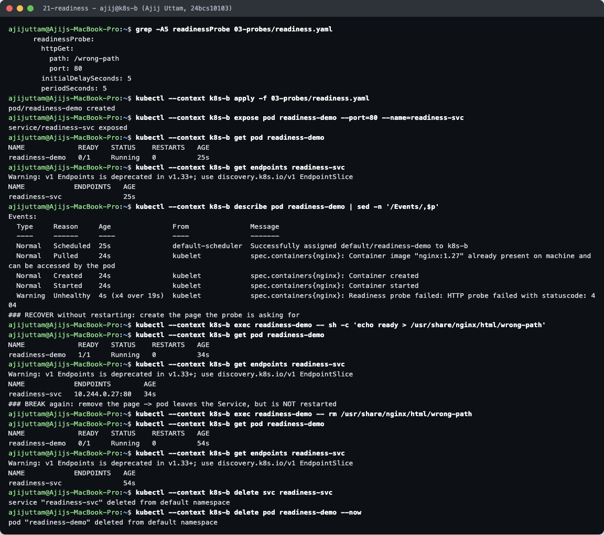

[`readiness.yaml`](03-probes/readiness.yaml) also probes `/wrong-path`. I exposed the Pod as `readiness-svc` to watch its endpoints:
- At first the Pod was `0/1 Running` with **0 restarts**, and the Service had **no endpoints**.
- **Recovery:** I created the missing file with `exec … echo ready > /usr/share/nginx/html/wrong-path`. Within 8 s the Pod was `1/1` and `10.244.0.23:80` was added to the endpoints.
- **Breaking it again:** I deleted the file. After ~20 s the Pod was back to `0/1` with empty endpoints, still with **0 restarts**. Readiness only controls traffic. It never restarts anything.

### Startup: too short a budget → restart loop → fixed
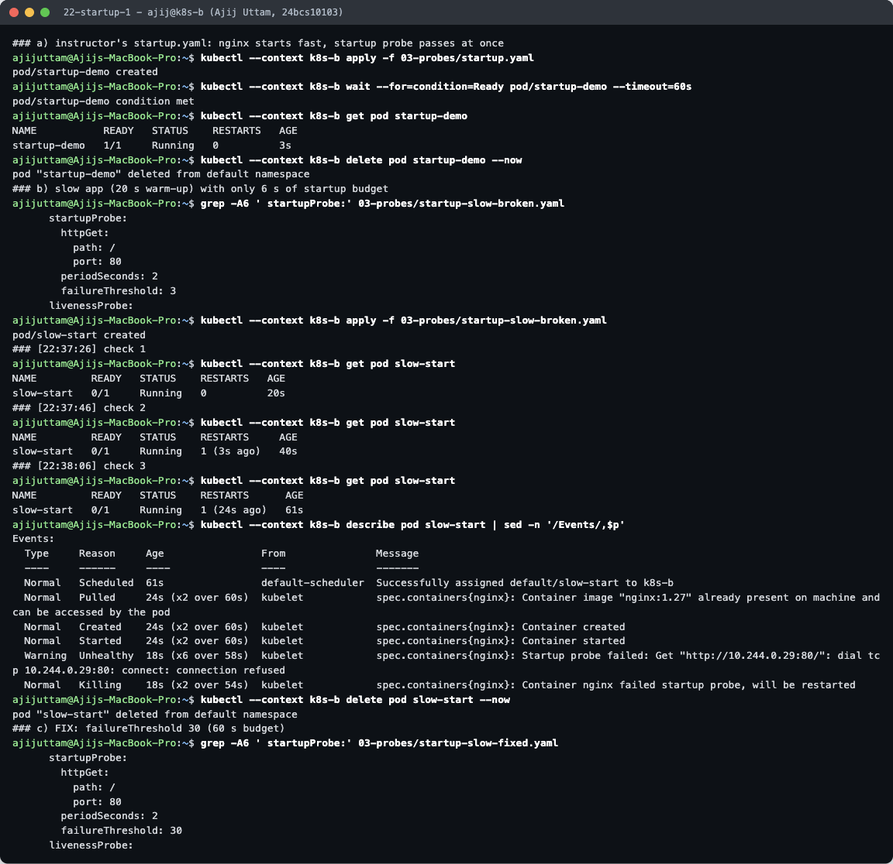
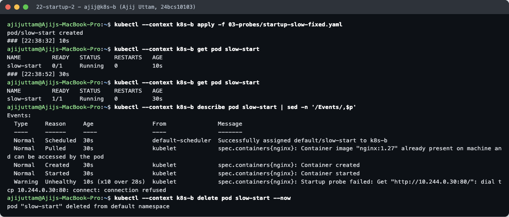

- a) The course's [`startup.yaml`](03-probes/startup.yaml): nginx starts instantly, so the startup probe passes and the Pod is Ready in ~3 s.
- b) [`startup-slow-broken.yaml`](03-probes/startup-slow-broken.yaml) (mine): the container sleeps **20 s** before starting nginx, a stand-in for a slow app like a JVM warming up. The startupProbe allows only `3 × 2 s = 6 s`, so the kubelet logged `Startup probe failed … connection refused` and `Container nginx failed startup probe, will be restarted`. The app could never finish starting.
- c) [`startup-slow-fixed.yaml`](03-probes/startup-slow-fixed.yaml) raises `failureThreshold` to 30 (60 s budget). At 10 s the Pod was `0/1`, and at 30 s it was `1/1 Running` with **0 restarts**. This is exactly what startupProbe is for: give a slow app time to start **without** making the livenessProbe itself slow.

---

## Task 3 — Mini project: production-ready web app (Session 13)

Course files, used unchanged: [`namespace.yaml`](mini-project/namespace.yaml), [`pvc.yaml`](mini-project/pvc.yaml) (500Mi RWO), [`deployment.yaml`](mini-project/deployment.yaml) (2 replicas, `Recreate` strategy, requests/limits, startup + readiness + liveness probes, PVC mounted at `/data`), [`service.yaml`](mini-project/service.yaml) and [`hpa.yaml`](mini-project/hpa.yaml) (min 2, max 5, 50% CPU).

### 5.1–5.4 Deploy
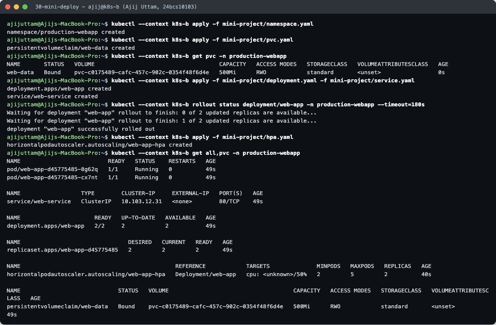

The PVC was `Bound` to a dynamically provisioned 500Mi volume (StorageClass `standard`), both Pods were `1/1 Running`, and the HPA showed `<unknown>/50%` for its first scrape.

### Verification task 1: storage persistence
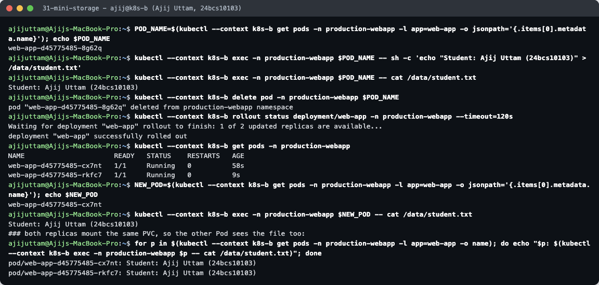

I wrote `Student: Ajij Uttam (24bcs10103)` to `/data/student.txt` from Pod `…8g62q`, then deleted that Pod. Notes on the output:
- `items[0]` after the deletion happened to be the *surviving* Pod `…cx7nt`, not the new one. The loop at the end checks **both** Pods, including the replacement `…rkfc7`, and each prints the file.
- Both replicas mount the **same** RWO PVC. This works here because ReadWriteOnce means "one **node**", and minikube has only one node. On a multi-node cluster a second replica on another node could not mount it.

### Verification task 2: Service
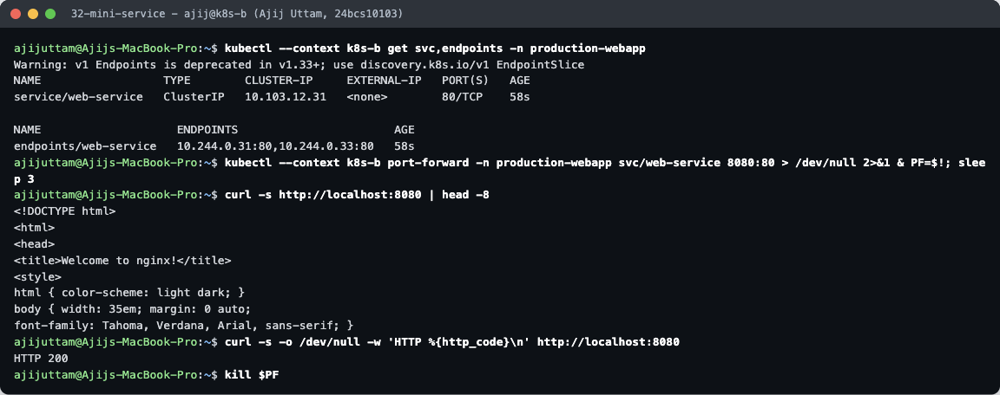

Endpoints listed both Pod IPs. Through `kubectl port-forward … 8080:80`, curl got `HTTP 200` and the nginx welcome page (also opened in a browser).

### Verification task 3: HPA elastic scaling
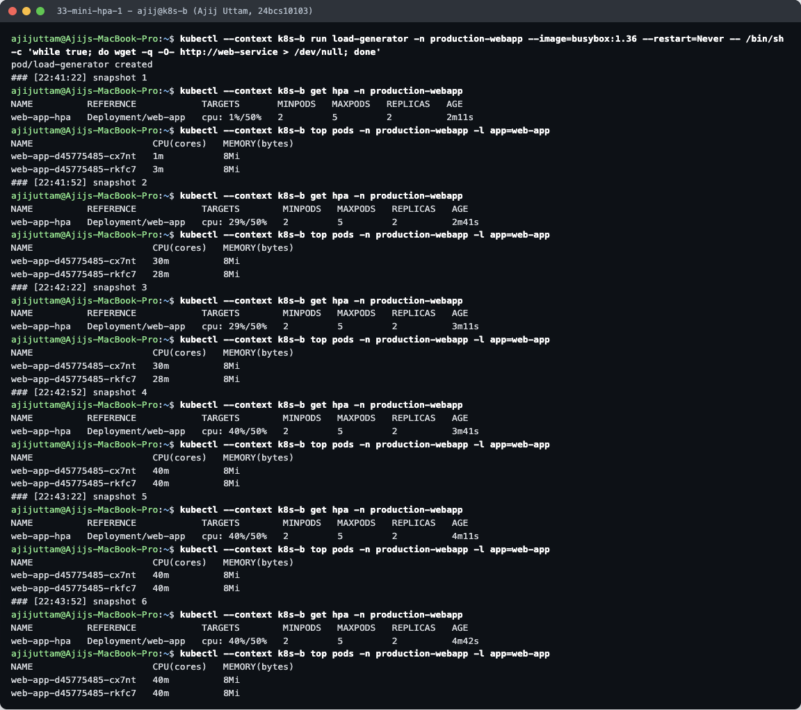
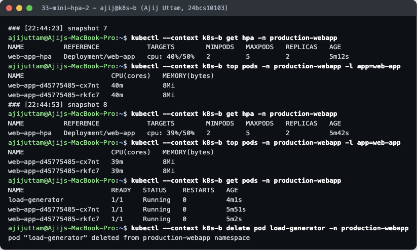

With the course's `kubectl run load-generator …` command, average CPU across the 2 Pods rose to **39–40%** and stayed there for 4 minutes. That is below the 50% target, so the HPA correctly did **not** scale. One busybox client cannot push two nginx Pods past 50% (same client bottleneck as in Task 2). This is real output, not the "110% → 5 replicas" example in the course README.

**Bonus challenge 1 (target tuning):**
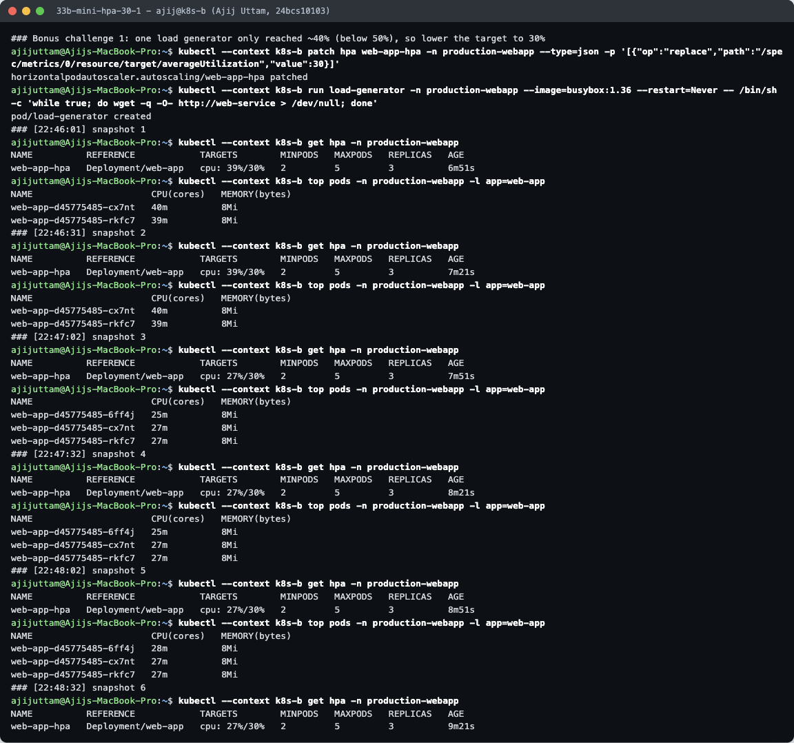
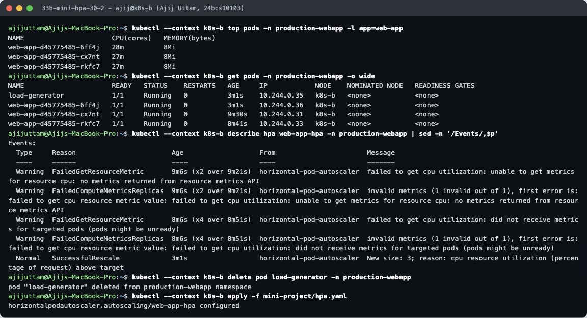

I patched the HPA target to **30%** and restarted the load. Now 39% > 30%, so the HPA scaled **2 → 3** (`ceil(2 × 39/30) = 3`). The load spread out to ~27%/30% and it stayed at 3. Afterwards I re-applied the original `hpa.yaml` (50%).

### Probe diagnostics: self-healing (fail → recover without human help)
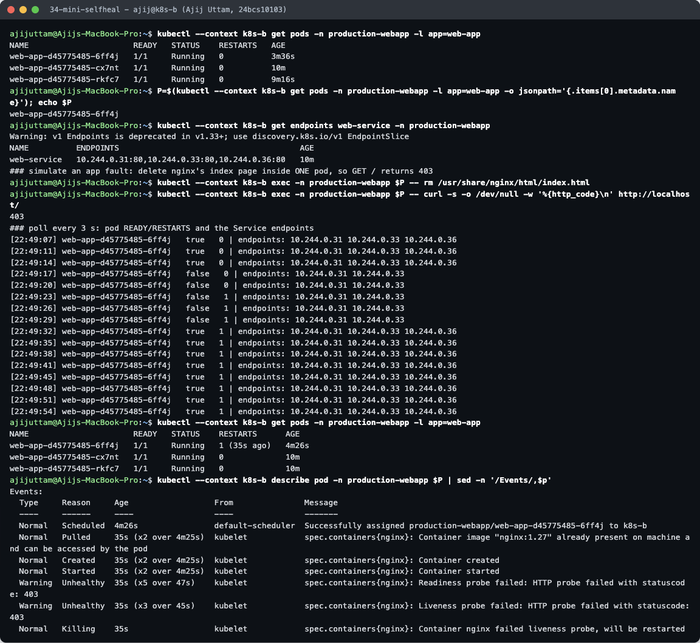

I simulated a fault inside **one** Pod by deleting nginx's `index.html`, so `GET /` returned **403**. I then polled every 3 s:

| time | READY | restarts | Service endpoints | why |
|---|---|---|---|---|
| 22:49:07 – :14 | true | 0 | 3 IPs | probes not failed enough times yet |
| **22:49:17** | **false** | 0 | **2 IPs** (`.36` removed) | readiness failed twice (`failureThreshold: 2`), so the Pod was taken out of the Service |
| **22:49:23** | false | **1** | 2 IPs | liveness failed 3 times, so the kubelet restarted the container |
| **22:49:32** | **true** | 1 | **3 IPs** | the new container starts from the image, which still has `index.html`, so the probes pass and it is back in the Service |

The events confirm it: `Readiness probe failed … 403`, `Liveness probe failed … 403`, `Container nginx failed liveness probe, will be restarted`. Users never hit the broken Pod: readiness removed it from the Service ~10 s after the fault, and liveness repaired it ~15 s later. (The data in `/data` is on the PVC, so a restart would not have lost it either.)

### Bonus challenge 2: readiness gating
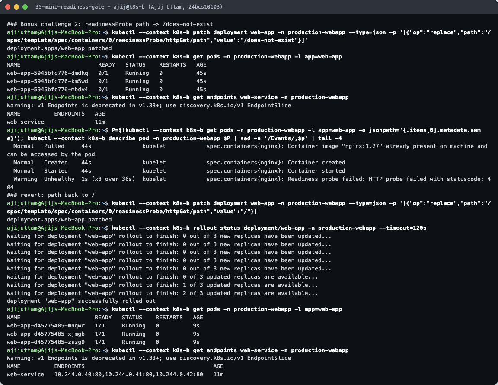

`kubectl patch` changed the readinessProbe path to `/does-not-exist`. Because the strategy is `Recreate`, all 3 Pods were replaced, and the new ones were `0/1 Running` with **empty** endpoints. The app ran fine, but the Service had nowhere to send traffic. Reverting the path brought all 3 back to `1/1` with 3 endpoints. Note that the revert produced the original ReplicaSet hash (`d45775485`) again, because the Pod template was identical to the original.

### Bonus challenge 3: liveness restart loop
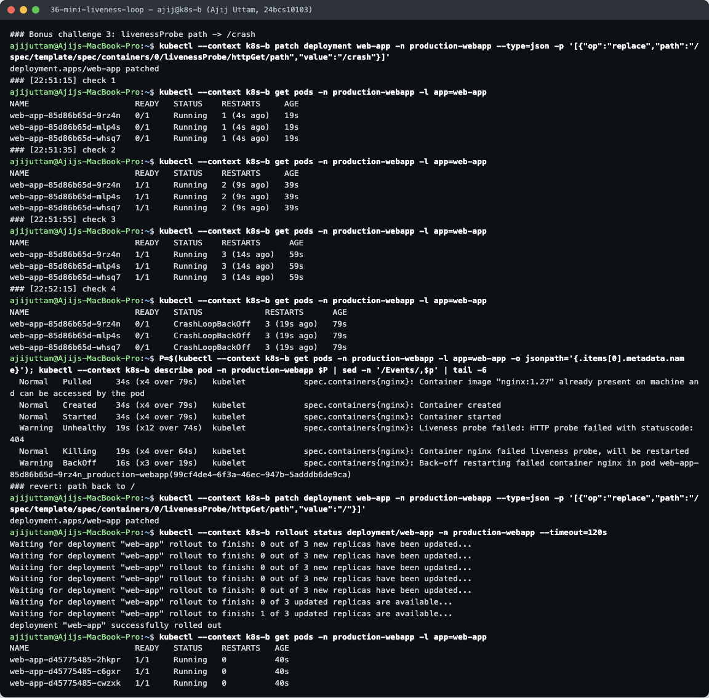

With livenessProbe → `/crash`, RESTARTS went 1 → 2 → 3 at roughly 20 s intervals, and then all Pods were in **CrashLoopBackOff** (`Back-off restarting failed container`). Reverting the path fixed it (0 restarts).

### Final state
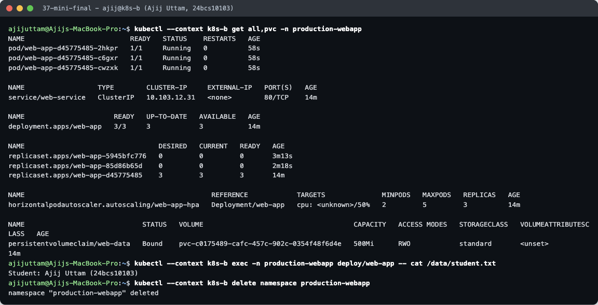

After all those restarts and two full re-creations of every Pod, `/data/student.txt` still contained `Student: Ajij Uttam (24bcs10103)`, which is the whole point of the PVC. I then deleted the namespace.

### Mini-project troubleshooting notes (what I actually hit)
- **HPA `<unknown>/50%`** for the first ~30 s after creating the HPA: metrics-server had not scraped the new Pods yet. It resolved itself.
- **HPA did not scale at 50%** with one load generator: the load generator, not nginx, was the CPU bottleneck. Lowering the target (bonus 1) or adding generators made it scale.
- **PVC binding surprises** are covered in the volumes README (default StorageClass, and the provisioner RBAC issue with `WaitForFirstConsumer`).

---

## Cleanup
Every demo deletes its own objects at the end (see the last lines of each transcript). The `production-webapp` namespace was deleted, and the `k8s-b` minikube profile was deleted at the end of the whole lab.
