# Kubernetes Troubleshooting — Homework

**Name:** Ajij Uttam  **Enrollment No:** 24bcs10103

Session 14: the core `kubectl` debugging commands, nine common failures each broken on purpose and then fixed, and the troubleshooting mini project.

**Environment:** single-node minikube cluster `k8s-b` (Kubernetes **v1.37.0**, containerd 2.3.4, kubectl v1.37.1, metrics-server addon enabled) on macOS/Colima. Every command uses `--context k8s-b`.

**Provided material used** (course repo `Kubernetes/Kubernetes_Debugging/`):
- `01-kubectl-get/pod.yaml` → [`01-commands/get-pod.yaml`](01-commands/get-pod.yaml)
- `03-kubectl-logs/pod.yaml` → [`01-commands/logs-pod.yaml`](01-commands/logs-pod.yaml)
- `06-crashloopbackoff`, `07-imagepullbackoff`, `08-pending-pods` → [`02-issues/01…`](02-issues/), [`02…`](02-issues/02-imagepullbackoff/), [`04…`](02-issues/04-pending/)
- `09-service-dns-troubleshooting/{deployment,service,dns-test-pod}.yaml` → [`02-issues/06-service-connectivity/`](02-issues/06-service-connectivity/) and [`02-issues/07-dns/`](02-issues/07-dns/)
- **`mini-project/`** (the troubleshooting mini project) → [`mini-project/`](mini-project/)

The course had no files for ErrImagePull (as a separate case), ContainerCreating, Pod networking or configuration errors, so I wrote those scenarios myself (`03-errimagepull`, `05-containercreating`, `08-pod-networking`, `09-configuration`, plus the CPU-request Pending case). The course's `dns-test-pod.yaml` uses `registry.k8s.io/e2e-test-images/dnsutils:1.3`, **which no longer exists** (see the DNS section). I switched to `jessie-dnsutils:1.7`.

**How it was run:** [`lab/run.sh <step>`](lab/run.sh). Each step writes `lab/<step>.txt`, and the screenshots are renderings of those files. `###` lines are my comments.

---

## Task 1 — Troubleshooting commands

Test Pods: `get-demo` (nginx) and `logs-demo` (busybox that prints startup lines, then "Application is healthy" every 5 s).
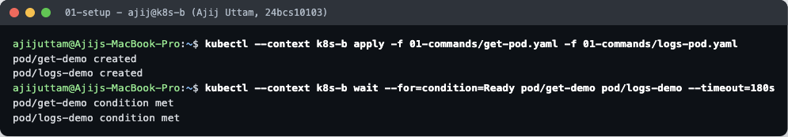

### `kubectl get`
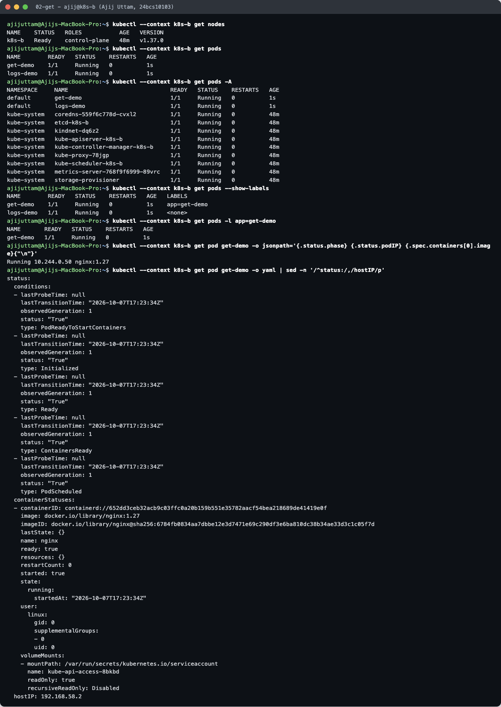

Lists objects with a one-line summary each: READY containers, STATUS (phase or the current waiting reason), RESTARTS and AGE. It is always the first command, because it tells you *which* object is unhealthy. Variations used:
- `-A` for all namespaces (shows the control plane: etcd, apiserver, scheduler, controller-manager, coredns, kube-proxy, kindnet CNI, metrics-server, storage-provisioner).
- `--show-labels` and `-l app=get-demo` to filter by label. Note that `logs-demo` has `<none>`.
- `-o jsonpath` to pull single fields (`Running 10.244.0.50 nginx:1.27`).
- `-o yaml` for the full object. The `status:` block shows the conditions (`PodScheduled`, `Initialized`, `ContainersReady`, `Ready`), the exact `imageID` digest that was pulled, and `hostIP`.

### `kubectl get -o wide`
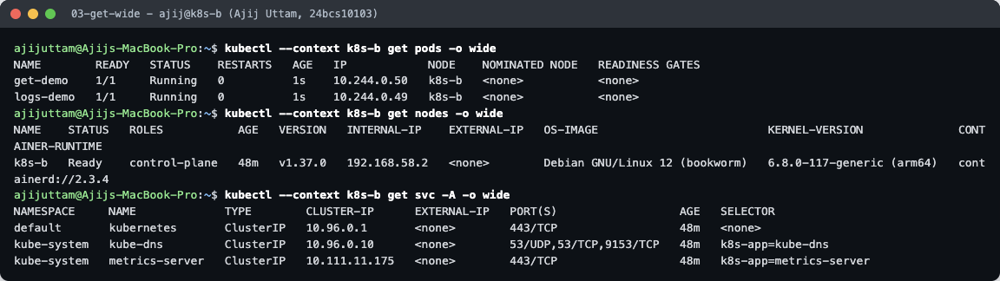

Adds the columns you need for networking problems: Pod **IP** and **NODE** (`10.244.0.50` on `k8s-b`), the node's INTERNAL-IP / OS / kernel / runtime (`containerd://2.3.4`), and for Services the **SELECTOR** column. The selector column is very handy for spotting selector mismatches (see the mini project).

### `kubectl describe`
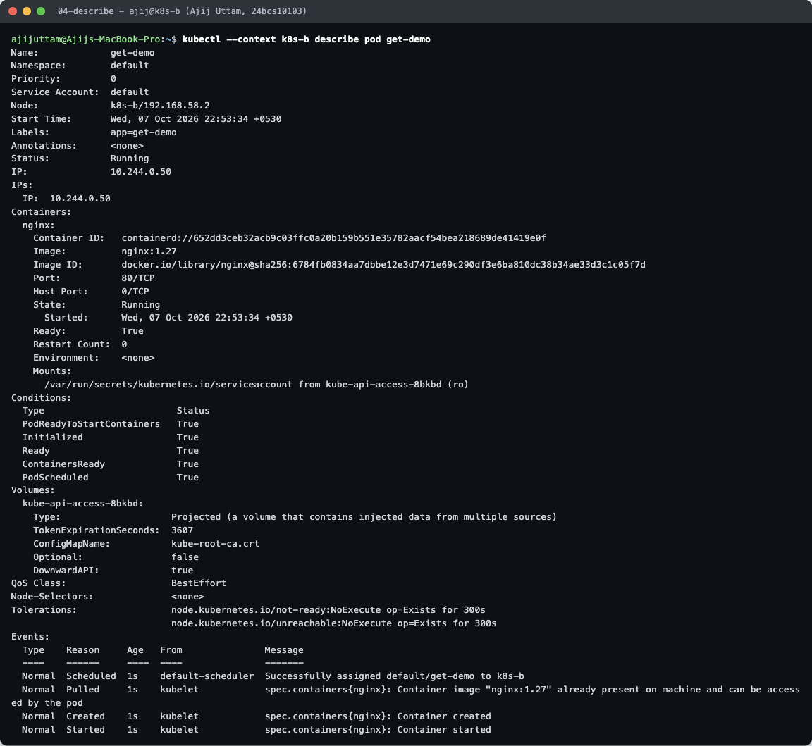

The human-readable full story of one object: node, IP, container state, restart count, mounts, conditions, QoS class (`BestEffort`, because no requests/limits), tolerations, and, most importantly, the **Events** at the bottom (Scheduled → Pulled → Created → Started). Almost every problem in Task 2 was diagnosed from describe's Events.

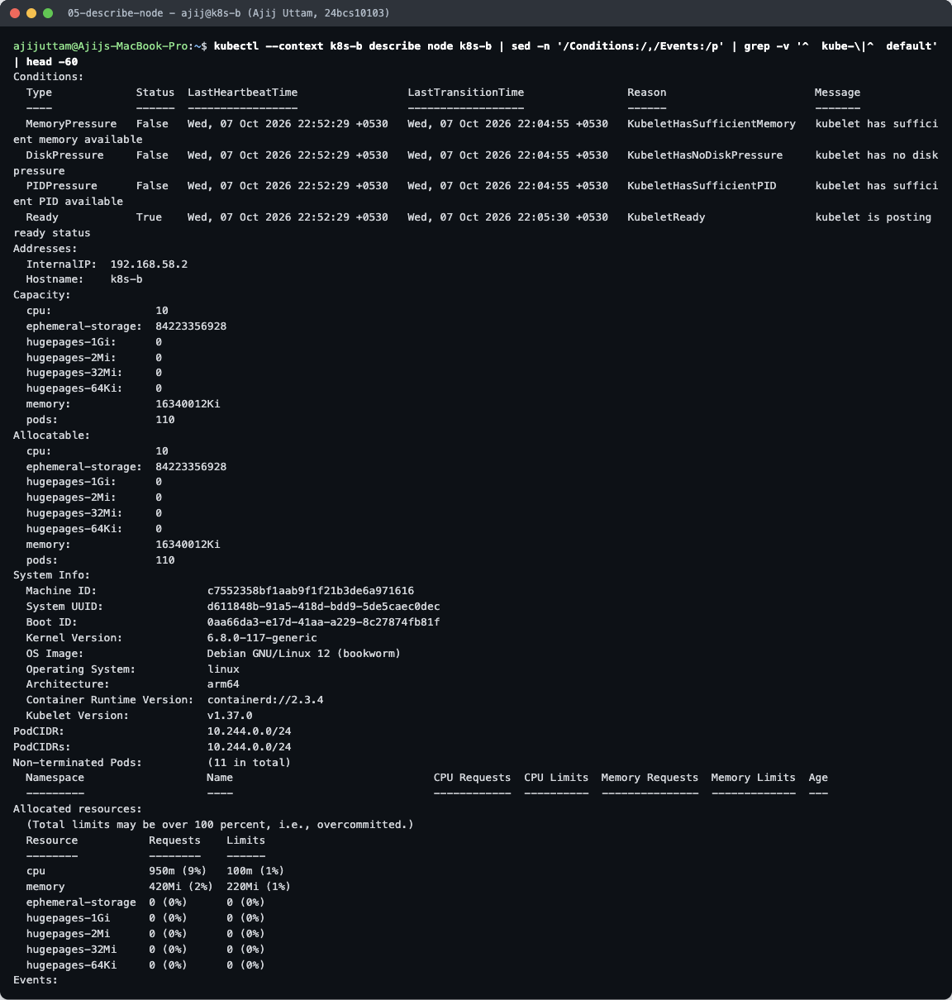

`describe node` shows node conditions (Memory/Disk/PIDPressure, Ready), capacity vs allocatable, and "Allocated resources" (`cpu 950m (9%)` of requests). This is the view you check for Pending Pods. Note `cpu: 10`: minikube's `--cpus=2` is enforced as a Docker cgroup limit, but the node *advertises* the Colima VM's 10 CPUs to the scheduler.

### `kubectl logs`
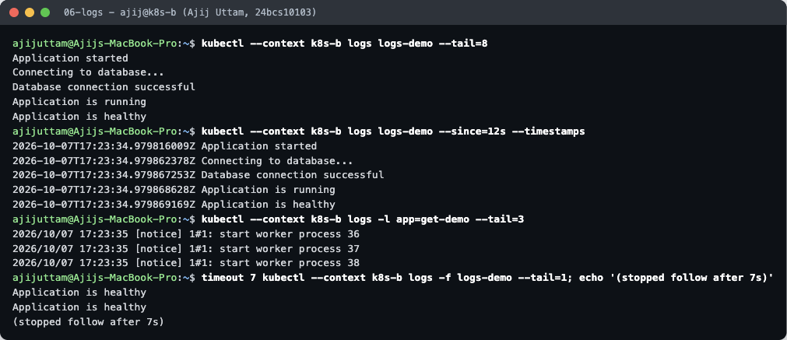

Prints the container's stdout/stderr. Options used: `--tail=8`, `--since=12s --timestamps`, `-l app=get-demo` (logs from every Pod with that label), and `-f` to follow (I stopped it after 7 s with `timeout`). `--previous` shows the *last crashed* container's logs and is demonstrated in the CrashLoopBackOff case below.

### `kubectl exec`
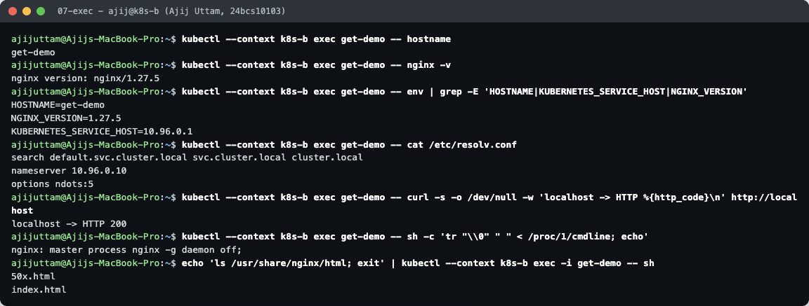

Runs a command inside a running container: `hostname`, `nginx -v` (`1.27.5`), env vars injected by Kubernetes (`KUBERNETES_SERVICE_HOST=10.96.0.1`), `/etc/resolv.conf` (nameserver `10.96.0.10` = CoreDNS, `search default.svc.cluster.local …`, `ndots:5`), a local `curl` (`HTTP 200`), PID 1's command line (`nginx: master process nginx -g daemon off;`), and a piped interactive shell via `exec -i … sh`. It is the tool for checking the app from *inside* its own network namespace.

### `kubectl events`
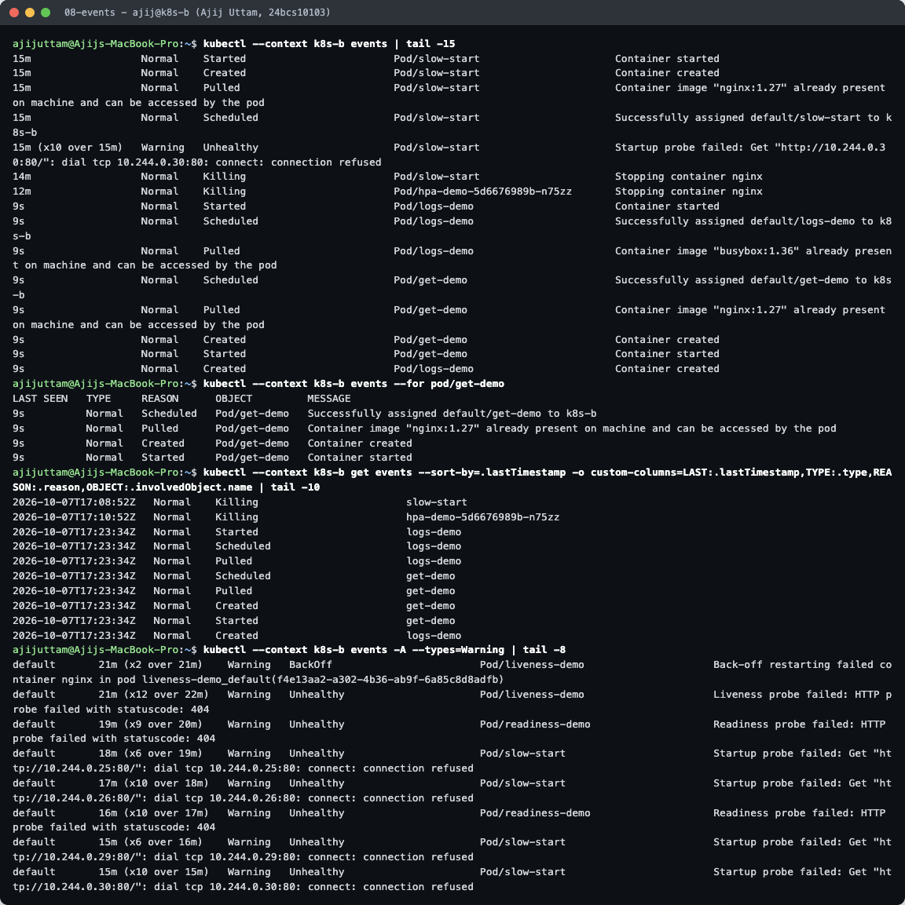

`kubectl events` (the newer, dedicated command) lists cluster events newest-last. `--for pod/get-demo` narrows it to one object, and `--types=Warning -A` shows only the problems in every namespace. The warnings it surfaced were left over from the probe demos in my Session 13 lab, which shows that events stay around for a while (default TTL 1 h) and are useful *after* the fact. `kubectl get events --sort-by=.lastTimestamp -o custom-columns=…` is the older equivalent.

### `kubectl explain`
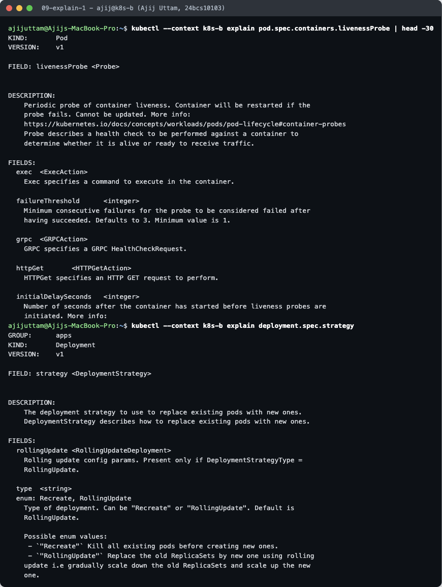
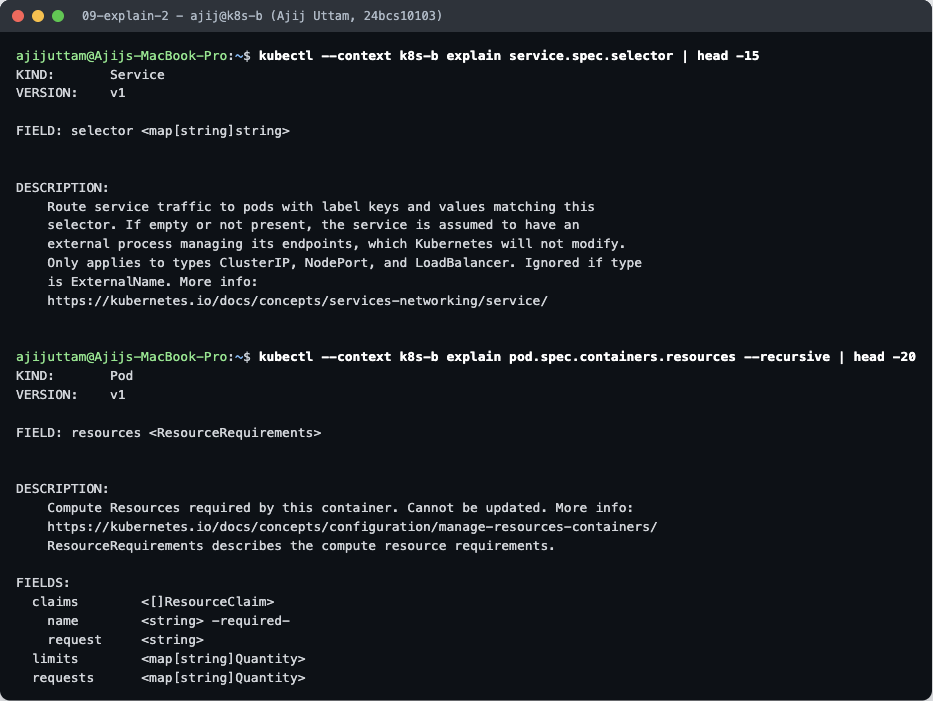

Built-in API documentation, read from the cluster's own schema, so it matches the exact server version. I used it for `pod.spec.containers.livenessProbe` (`failureThreshold … Defaults to 3`), `deployment.spec.strategy` (enum `Recreate | RollingUpdate`), `service.spec.selector` and `--recursive` for the resources tree. It answers "what is the right field name / default?" without leaving the terminal.

### `kubectl top`
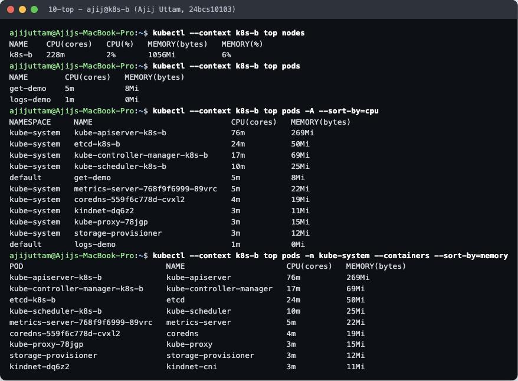

CPU/memory usage from metrics-server: `top nodes` (`228m`, `1056Mi`), `top pods`, `-A --sort-by=cpu` (kube-apiserver is the heaviest at `76m`/`269Mi`) and `--containers --sort-by=memory`. My first run, right after creating the Pods, returned `error: metrics not available yet`, because metrics-server scrapes about every 60 s and had no sample for brand-new Pods. A rerun 90 s later worked. The screenshot is from the rerun, and the first attempt is the same error shown in the Session 13 HPA transcript.

---

## Task 2 — Troubleshooting common issues

For each case: **1 Identify → 2 Investigate → 3 Root cause → 4 Fix → 5 Verify**. Each case has a *before* and an *after* screenshot.

### 1. CrashLoopBackOff
Files: [`broken-pod.yaml`](02-issues/01-crashloopbackoff/broken-pod.yaml) / [`fixed-pod.yaml`](02-issues/01-crashloopbackoff/fixed-pod.yaml) (course)

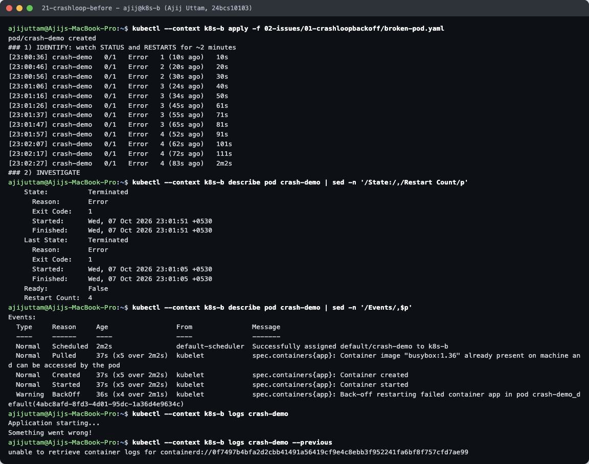

1. **Identify:** polling `get pod` every 10 s, RESTARTS climbed 1 → 2 → 3 → 4, with growing gaps (10 s, 20 s, 40 s…). On this v1.37 cluster the STATUS column showed `Error` (the last exit) at every sample, while the Events show the kubelet in `BackOff`. The probe demo in Session 13 *did* display `CrashLoopBackOff` in the STATUS column. Either way, the signature of a crash loop is **"restarts keep increasing, with back-off in the Events"**.
2. **Investigate:** `describe` → `State: Terminated, Reason: Error, Exit Code: 1`, Started and Finished at the **same second**. `kubectl logs crash-demo` printed `Application starting... / Something went wrong!`. `logs --previous` returned `unable to retrieve container logs`, because the runtime had already cleaned up that older container. The current terminated container's logs gave the same information.
3. **Root cause:** the container's command ends with `exit 1`. The process exits immediately, and with `restartPolicy: Always` the kubelet keeps restarting it, doubling the delay each time (capped at 5 min).
4. **Fix:** the command must run a long-lived process (`sleep 3600` in the fixed file, the real server in a real app).

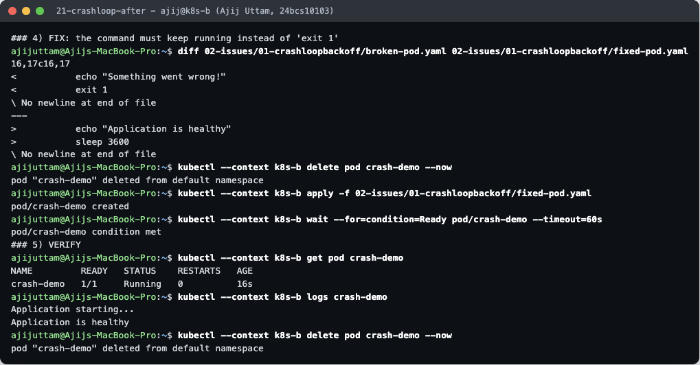

5. **Verify:** `1/1 Running`, `0` restarts after 15 s, and the logs show `Application is healthy`.

### 2. ImagePullBackOff
Files: [`broken-pod.yaml`](02-issues/02-imagepullbackoff/broken-pod.yaml) / [`fixed-pod.yaml`](02-issues/02-imagepullbackoff/fixed-pod.yaml) (course)

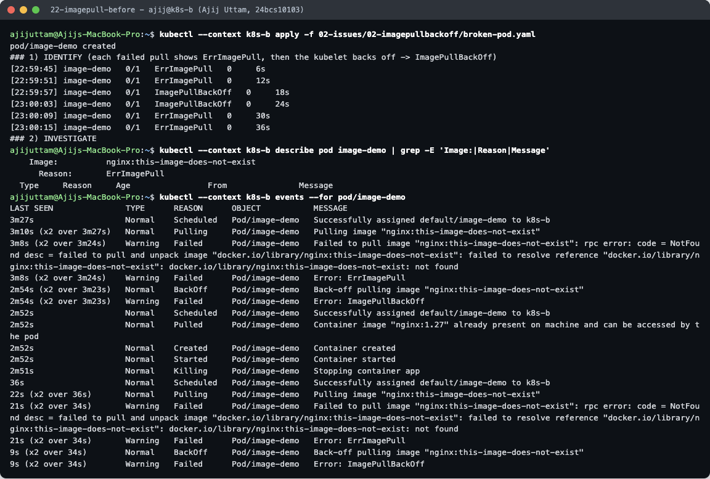

1. **Identify:** STATUS alternated `ErrImagePull` → `ImagePullBackOff` → `ErrImagePull`, and READY stayed `0/1`.
2. **Investigate:** `describe` showed `Image: nginx:this-image-does-not-exist`. `kubectl events --for pod/image-demo` showed `Failed to pull image … docker.io/library/nginx:this-image-does-not-exist: not found`, then `Back-off pulling image`.
3. **Root cause:** the **tag** doesn't exist in the `nginx` repository. The repository is fine, the tag is not.
4. **Fix:** use a real tag (`nginx:1.27`). The image field of a bare Pod is mutable, but I deleted and recreated it so I would start clean.

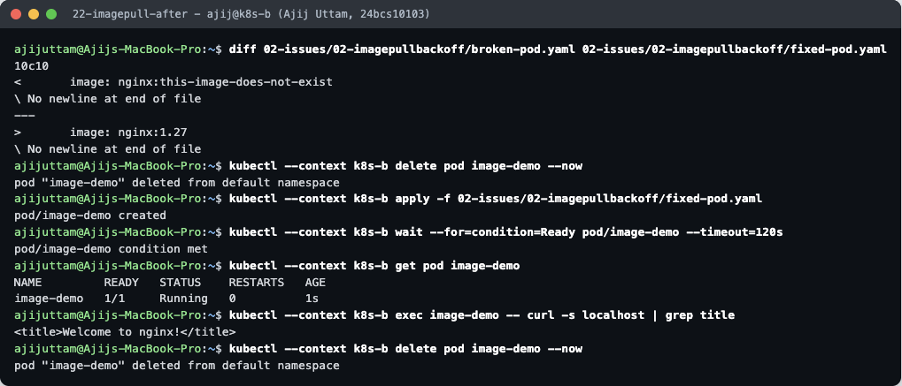

5. **Verify:** Ready immediately (the image was already cached), and curl inside returned `<title>Welcome to nginx!</title>`.

### 3. ErrImagePull
File: [`03-errimagepull/broken-pod.yaml`](02-issues/03-errimagepull/broken-pod.yaml) (mine)

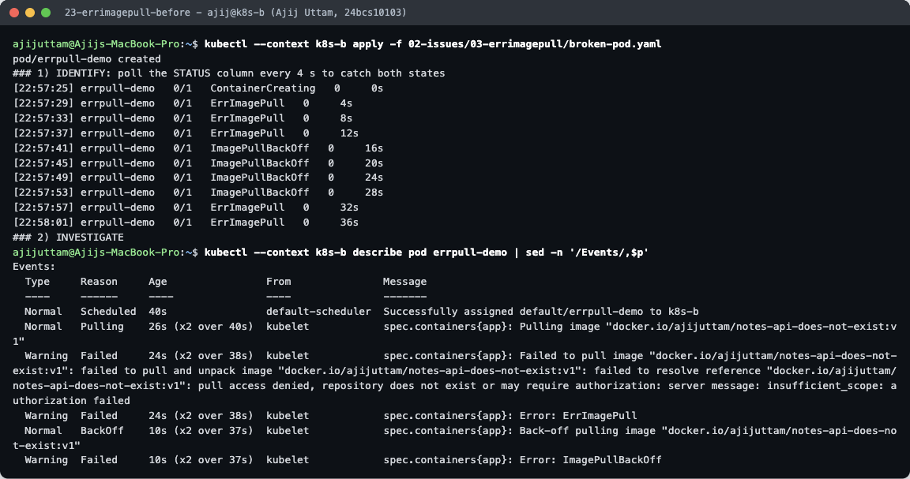

**ErrImagePull vs ImagePullBackOff:** `ErrImagePull` is the status **right after a pull attempt fails**. `ImagePullBackOff` is the status **while the kubelet waits** before trying again (10 s, 20 s, 40 s … up to 5 min). Polling every 4 s shows the cycle: `ContainerCreating` (0 s) → `ErrImagePull` (4–12 s) → `ImagePullBackOff` (16–28 s) → `ErrImagePull` again (32 s, the next attempt). They are the same problem seen at different moments.

This case uses a different root cause from case 2: the **repository** `docker.io/ajijuttam/notes-api-does-not-exist` does not exist, so the registry answered `pull access denied, repository does not exist or may require authorization: … insufficient_scope`. The same message appears for a **private** image pulled without credentials. The fix there would be an `imagePullSecret`. Here the fix is the correct image name.

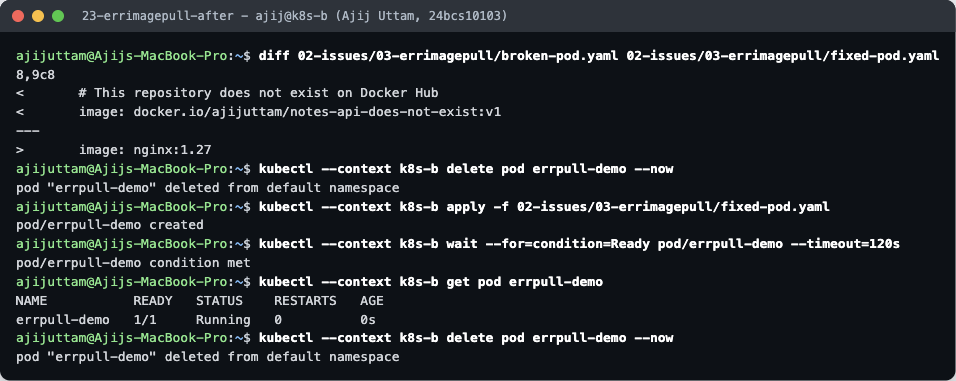

Common ErrImagePull causes: a typo in the image or tag, a private registry without `imagePullSecrets`, no network/DNS from the node to the registry, wrong CPU architecture, or a registry **rate limit** (I hit Docker Hub's `429 Too Many Requests` later, in the mini project).

### 4. Pending
Files: course [`broken-pod.yaml`](02-issues/04-pending/broken-pod.yaml) (nodeSelector) + my [`broken-pod-cpu.yaml`](02-issues/04-pending/broken-pod-cpu.yaml) (resources)

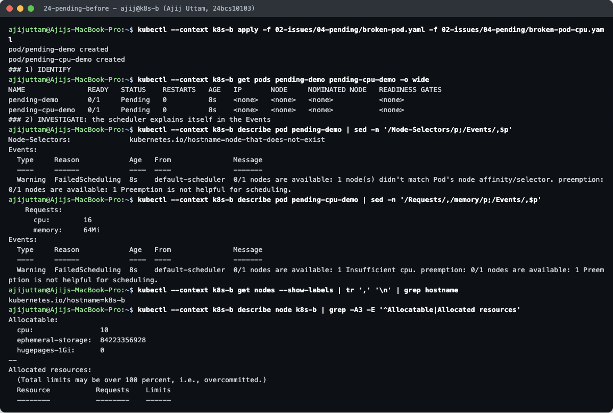

1. **Identify:** both Pods `Pending`, with **no IP and no NODE** in `-o wide`. They were never scheduled.
2. **Investigate:** Pending means the **scheduler** could not place the Pod, and it explains why in `FailedScheduling` events:
   - `pending-demo`: `0/1 nodes are available: 1 node(s) didn't match Pod's node affinity/selector`. Its `nodeSelector` wants `kubernetes.io/hostname=node-that-does-not-exist`, but the only node is labelled `kubernetes.io/hostname=k8s-b`.
   - `pending-cpu-demo`: `0/1 nodes are available: 1 Insufficient cpu`. It requests `cpu: 16` while the node's Allocatable is `cpu: 10`.
   - `Preemption is not helpful`: evicting lower-priority Pods would not free enough room either.
3. **Root causes:** an impossible placement constraint, and a resource request larger than any node.
4. **Fix:** remove the bogus nodeSelector, and request a realistic `100m` CPU.

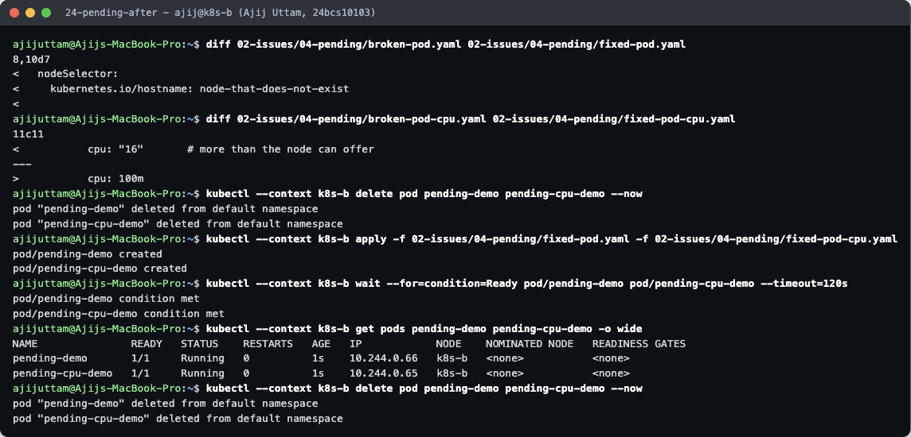

5. **Verify:** both `Running` with IPs on node `k8s-b`. Other Pending causes I know of: an unbound PVC, taints without tolerations, and the cluster simply being full.

### 5. ContainerCreating (stuck)
Files: [`broken-pod.yaml`](02-issues/05-containercreating/broken-pod.yaml), [`configmap.yaml`](02-issues/05-containercreating/configmap.yaml) (mine)

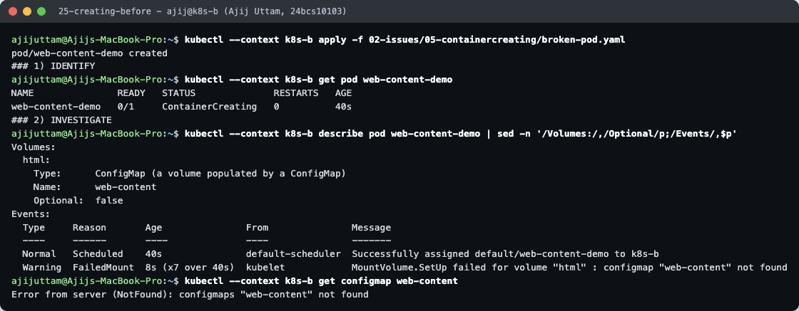

1. **Identify:** after 40 s, still `0/1 ContainerCreating`. The Pod *was* scheduled, but the container never started.
2. **Investigate:** `describe` → `Warning FailedMount … MountVolume.SetUp failed for volume "html" : configmap "web-content" not found` (x7). The Volumes section shows `ConfigMap web-content, Optional: false`, and `kubectl get configmap web-content` → `NotFound`.
3. **Root cause:** the kubelet must mount every volume **before** it can start the container, and the Pod mounts a ConfigMap that was never created. (Other ContainerCreating causes: a missing Secret, a PVC that cannot attach, CNI failing to assign an IP, or just a slow image pull.)
4. **Fix:** create the ConfigMap. No change to the Pod was needed.

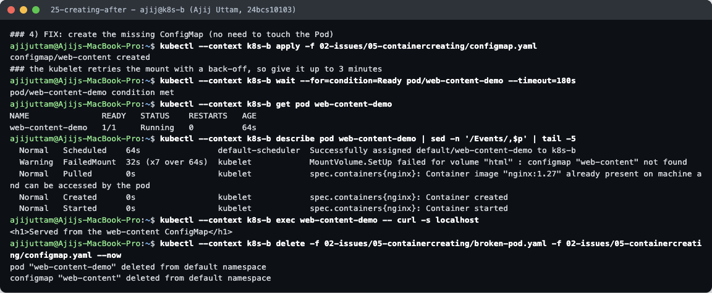

5. **Verify:** the kubelet retried the mount (it uses back-off, so it took ~30 s), then `Pulled/Created/Started`, `1/1 Running`, and `curl` returned the HTML from the ConfigMap: `<h1>Served from the web-content ConfigMap</h1>`.

### 6. Service connectivity
Files: course [`deployment.yaml`](02-issues/06-service-connectivity/deployment.yaml) + [`service.yaml`](02-issues/06-service-connectivity/service.yaml), my [`broken-service.yaml`](02-issues/06-service-connectivity/broken-service.yaml)

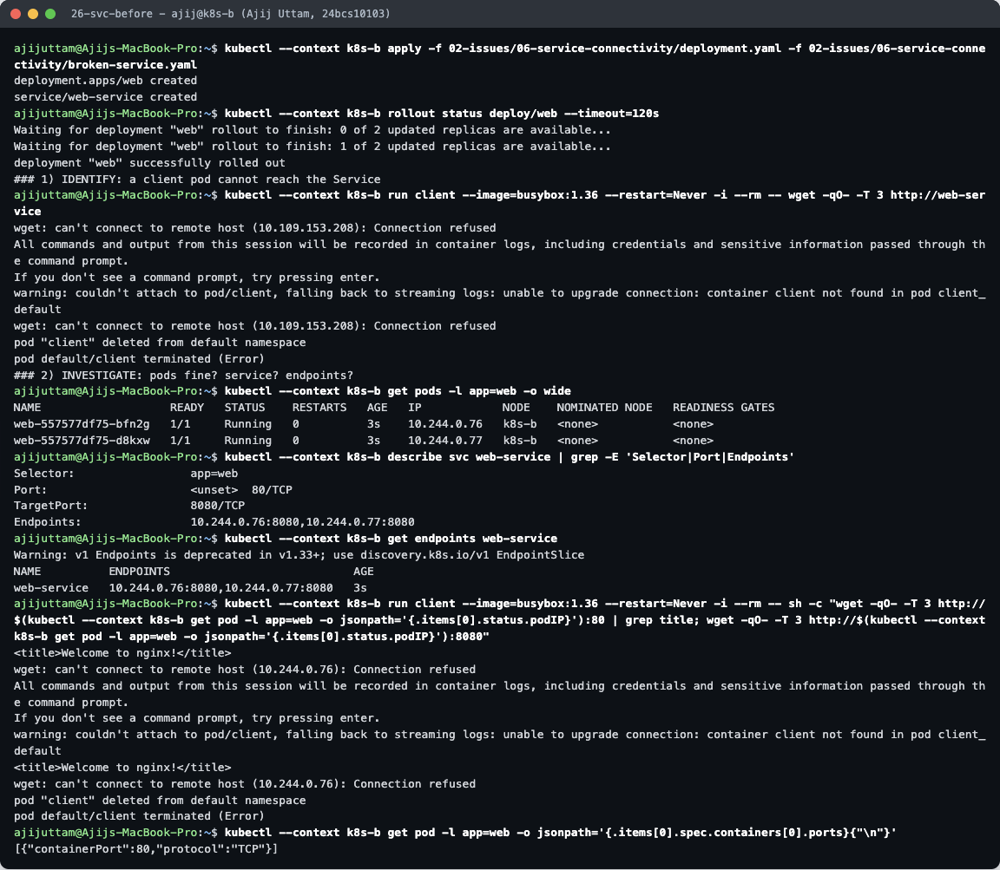

1. **Identify:** from a busybox client Pod, `wget http://web-service` → `can't connect to remote host (10.101.114.147): Connection refused`. DNS worked (the name resolved to the ClusterIP), but the connection failed.
2. **Investigate:** going down the chain one layer at a time:
   - Pods `1/1 Running`, so the app is up.
   - `describe svc`: `Selector app=web` (matches), `TargetPort: 8080/TCP`, `Endpoints: 10.244.0.69:8080,10.244.0.68:8080`. The endpoints are **not empty**, so the selector is fine, but they point at **port 8080**.
   - Hitting a Pod IP directly: `:80` → `<title>Welcome to nginx!</title>`, `:8080` → `Connection refused`.
   - The container declares `containerPort: 80`.
3. **Root cause:** the Service's `targetPort` (8080) doesn't match the port the container listens on (80). kube-proxy forwarded correctly, but to a port where nothing was listening.
4. **Fix:** `targetPort: 80` (the course's `service.yaml`).

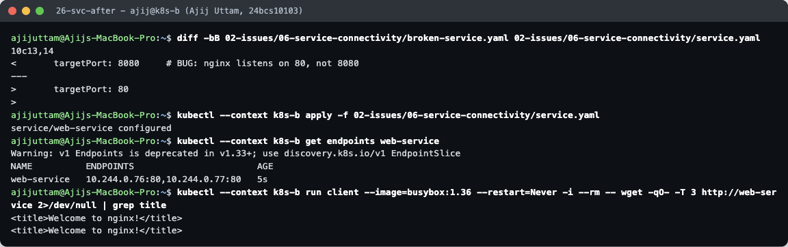

5. **Verify:** endpoints now `…:80`, and the client gets the nginx page through `http://web-service`. (A selector mismatch, the *other* classic Service bug, gives **empty** endpoints instead. That one is in the mini project.)

### 7. DNS
Files: my [`broken-dns-pod.yaml`](02-issues/07-dns/broken-dns-pod.yaml), course [`dns-test-pod.yaml`](02-issues/07-dns/dns-test-pod.yaml) (image tag updated; the untouched course file is kept as [`dns-test-pod-orig.yaml`](02-issues/07-dns/dns-test-pod-orig.yaml))

First, the course's own test Pod failed:
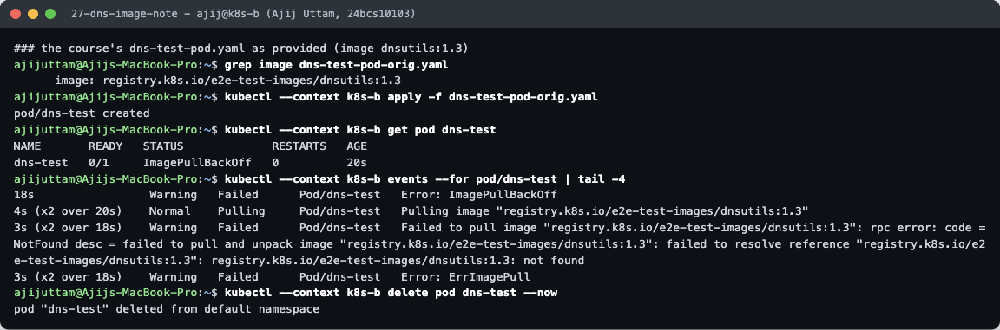

`registry.k8s.io/e2e-test-images/dnsutils:1.3` → `ImagePullBackOff` / `ErrImagePull`, `…dnsutils:1.3: not found`. The tag no longer exists in the registry. I used `registry.k8s.io/e2e-test-images/jessie-dnsutils:1.7` instead, which has `nslookup` and `dig`.

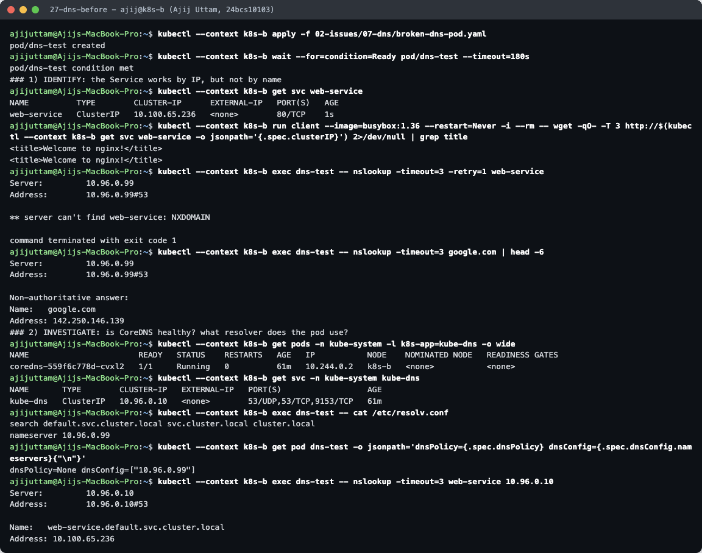

1. **Identify:** the Service works **by IP** (`wget http://10.109.153.208` → nginx title), but `nslookup web-service` → `** server can't find web-service: NXDOMAIN`. The odd part: `nslookup google.com` from the same Pod **worked**.
2. **Investigate:**
   - CoreDNS Pod `Running`, `kube-dns` Service at `10.96.0.10`. Cluster DNS is healthy.
   - The Pod's `/etc/resolv.conf` → `nameserver 10.96.0.99`, not `10.96.0.10`.
   - `dnsPolicy=None`, `dnsConfig.nameservers=["10.96.0.99"]`.
   - Asking CoreDNS directly, `nslookup web-service 10.96.0.10`, → `web-service.default.svc.cluster.local → 10.109.153.208`. Correct.
3. **Root cause:** the Pod was configured with `dnsPolicy: None` and a hard-coded nameserver that is **not the cluster DNS**. Queries never reached CoreDNS, so nothing could resolve `*.cluster.local` names. Public names still resolved because, in this Colima/minikube setup, DNS packets to an arbitrary IP are answered by the VM's upstream resolver, which knows `google.com` but not cluster names. That makes the bug sneaky: "internet DNS works, but Service names don't" is the clue that the Pod isn't using CoreDNS.
4. **Fix:** remove the `dnsPolicy`/`dnsConfig` override (the default `ClusterFirst` points the Pod at CoreDNS).

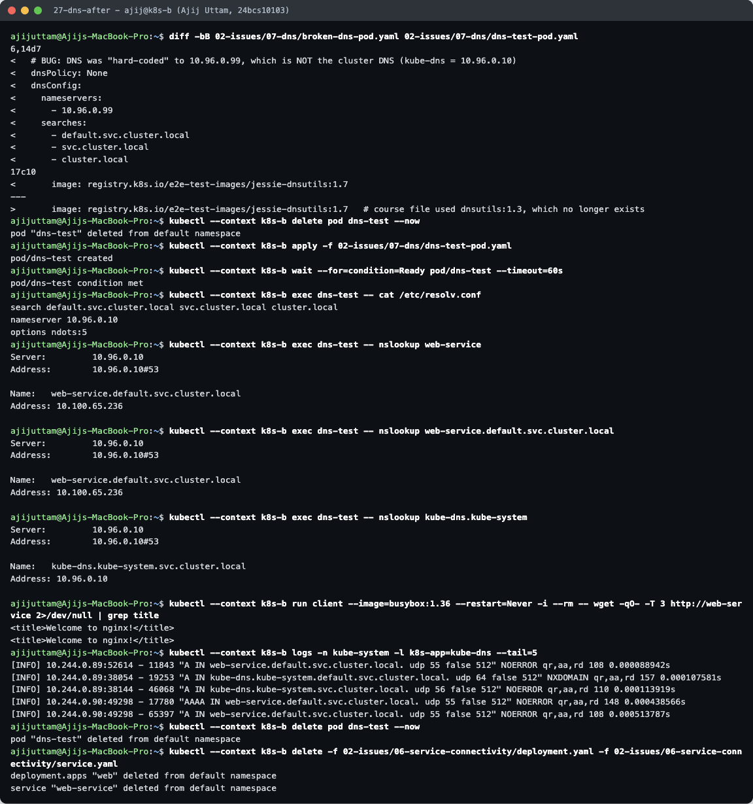

5. **Verify:** `resolv.conf` → `nameserver 10.96.0.10`, `options ndots:5`. `web-service`, `web-service.default.svc.cluster.local` and `kube-dns.kube-system` all resolve, and a client reaches `http://web-service`. The CoreDNS logs show the **search-path expansion**: `web-service.default.svc.cluster.local.svc.cluster.local` → NXDOMAIN, `….cluster.local.cluster.local` → NXDOMAIN, then `web-service.default.svc.cluster.local` → NOERROR. That is `ndots:5` at work: a name with fewer than 5 dots is tried with each search suffix first.

### 8. Pod networking
Files: [`broken-app.yaml`](02-issues/08-pod-networking/broken-app.yaml), [`fixed-app.yaml`](02-issues/08-pod-networking/fixed-app.yaml), [`client.yaml`](02-issues/08-pod-networking/client.yaml) (mine)

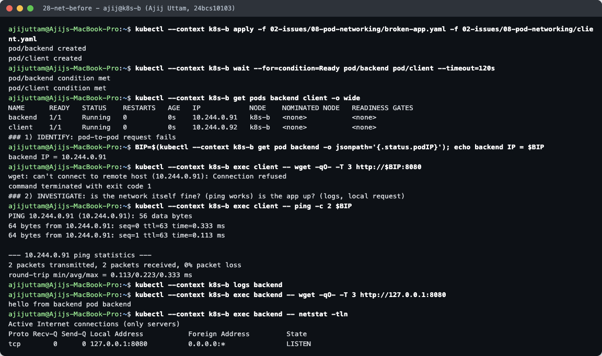

1. **Identify:** Pod-to-Pod `wget http://10.244.0.91:8080` from `client` → `Connection refused`.
2. **Investigate:** is it the network or the app?
   - `ping` from client to backend: `2 packets transmitted, 2 received, 0% packet loss`. The CNI (kindnet) routes packets between Pods fine.
   - Inside the backend, `wget http://127.0.0.1:8080` → `hello from backend pod backend`. The app works.
   - `netstat -tln` → `127.0.0.1:8080 LISTEN`.
3. **Root cause:** the server is bound to the **loopback** interface only, so it accepts connections from inside its own Pod and nothing else. Every Pod has its own network namespace, and `127.0.0.1` in the client Pod is the client itself. (This is a very common bug with dev servers that default to `localhost`, e.g. Flask, Vite, `rails s`.)
4. **Fix:** bind to `0.0.0.0:8080`.

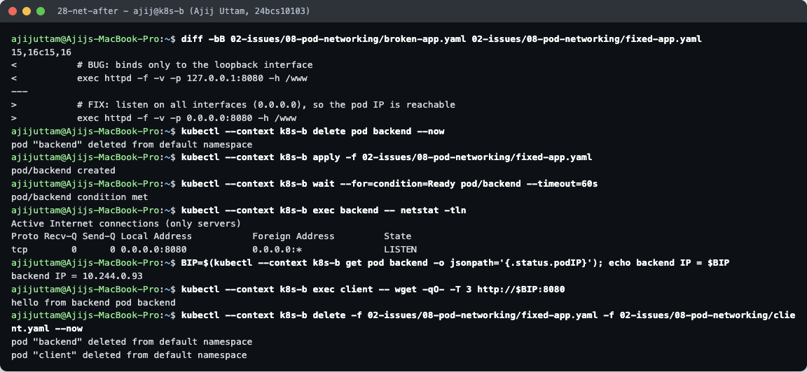

5. **Verify:** `netstat` → `0.0.0.0:8080 LISTEN`, and the client gets `hello from backend pod backend` from the new Pod IP `10.244.0.93`. (On a cluster whose CNI enforces NetworkPolicy, a deny policy would be the other usual suspect. minikube's default kindnet CNI does not enforce policies, so I tested the binding problem instead.)

### 9. Configuration issues
Files: [`configmap.yaml`](02-issues/09-configuration/configmap.yaml), [`broken-deployment.yaml`](02-issues/09-configuration/broken-deployment.yaml), [`fixed-deployment.yaml`](02-issues/09-configuration/fixed-deployment.yaml) (mine)

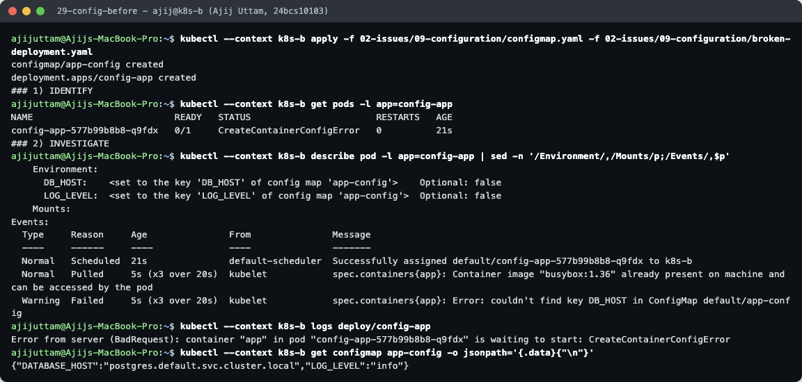

1. **Identify:** `0/1 CreateContainerConfigError`.
2. **Investigate:** `describe` → `Error: couldn't find key DB_HOST in ConfigMap default/app-config`. `kubectl logs` can't help (`container "app" … is waiting to start: CreateContainerConfigError`), because the container was never created. `get configmap -o jsonpath='{.data}'` → keys `DATABASE_HOST` and `LOG_LEVEL`.
3. **Root cause:** the Deployment's `configMapKeyRef.key: DB_HOST` doesn't match the ConfigMap's key `DATABASE_HOST`. The kubelet refuses to start a container with a missing required env source.
4. **Fix:** `key: DATABASE_HOST` (alternatively, rename the key in the ConfigMap).

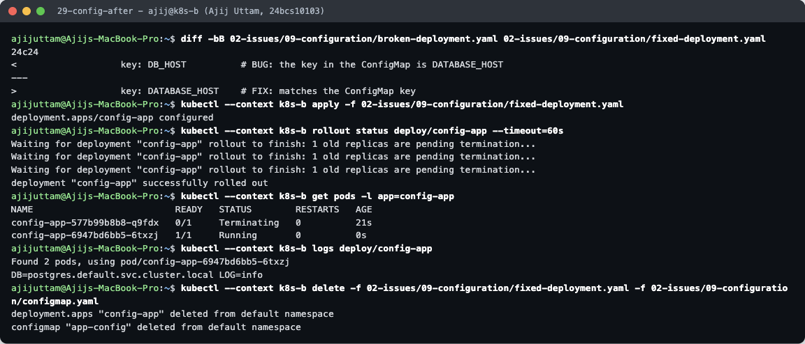

5. **Verify:** the rollout completed, the new Pod is `1/1 Running`, and its log prints `DB=postgres.default.svc.cluster.local LOG=info`.

### Summary of Task 2

| Issue | Symptom in `get` | Where the answer was | Root cause | Fix |
|---|---|---|---|---|
| CrashLoopBackOff | restarts climbing, `Error`/`CrashLoopBackOff` | `describe` (Exit Code 1) + `logs` | process exits | keep a long-running process |
| ImagePullBackOff | `ImagePullBackOff` | events: `… not found` | bad tag | real tag |
| ErrImagePull | `ErrImagePull` ↔ `ImagePullBackOff` | events: `pull access denied` | repo doesn't exist / private | correct image (or imagePullSecret) |
| Pending | `Pending`, no node | events: `FailedScheduling` | bad nodeSelector / CPU 16 > 10 | remove selector / sane request |
| ContainerCreating | stuck `ContainerCreating` | events: `FailedMount … not found` | missing ConfigMap | create it |
| Service | `Connection refused` via Service | `describe svc` TargetPort + endpoint ports | targetPort 8080 ≠ 80 | targetPort 80 |
| DNS | `NXDOMAIN` for Service names | `/etc/resolv.conf`, pod `dnsPolicy` | `dnsPolicy: None` + wrong nameserver | default `ClusterFirst` |
| Pod networking | Pod-IP `Connection refused`, ping OK | `exec netstat -tln` | bound to 127.0.0.1 | bind 0.0.0.0 |
| Configuration | `CreateContainerConfigError` | `describe` events | wrong ConfigMap key | correct key |

---

## Task 3 — Mini project: Kubernetes Troubleshooting Challenge

Course files: [`deployment.yaml`](mini-project/deployment.yaml) (`troubleshooting-app`, 2 × nginx), [`service.yaml`](mini-project/service.yaml), [`broken-pod.yaml`](mini-project/broken-pod.yaml). My fixes: [`service-fixed.yaml`](mini-project/service-fixed.yaml), [`fixed-pod.yaml`](mini-project/fixed-pod.yaml).

**Problem statement:** a simple nginx app runs as a Deployment behind a Service. The team reports that it is not reachable through the Service, and a separately created Pod won't start. Find and fix both, following GET → DESCRIBE → EVENTS → LOGS → EXEC → TEST → FIX → VERIFY.

### Steps 1–2: deploy and check the application
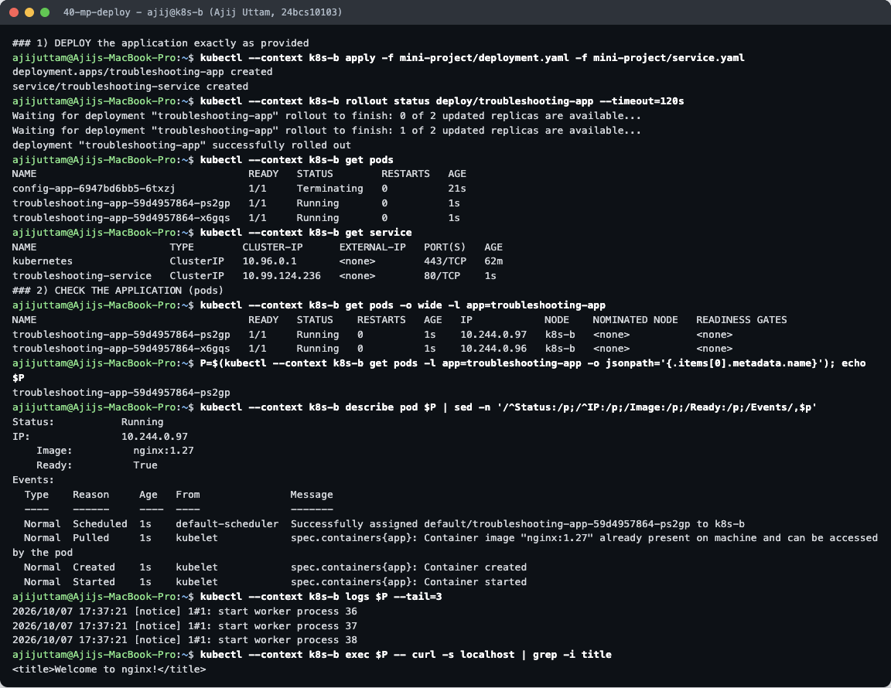

I deployed exactly as provided. Both Pods were `1/1 Running`, `describe` showed `Ready: True` with clean events, the logs showed nginx worker processes starting, and `exec … curl localhost` returned `<title>Welcome to nginx!</title>`. **The Pods are healthy.**

### Steps 3–4 and 8–9: the Service problem
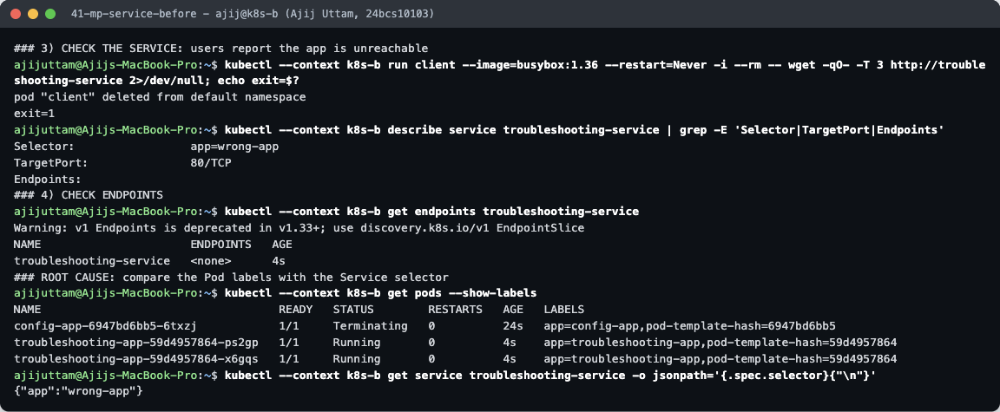

- **Investigation:** a client `wget http://troubleshooting-service` failed (exit 1). `describe service` → `Selector: app=wrong-app`, `Endpoints:` (empty). `get endpoints` → `<none>`.
- **Root cause:** `get pods --show-labels` shows the Pods are labelled `app=troubleshooting-app`, but the Service selects `app=wrong-app`. No Pod matches, so the Service has no endpoints and nothing to send traffic to. The course's `service.yaml` already *contains* the wrong selector (the README's step 8 describes introducing it), so the very first deployment showed the bug.

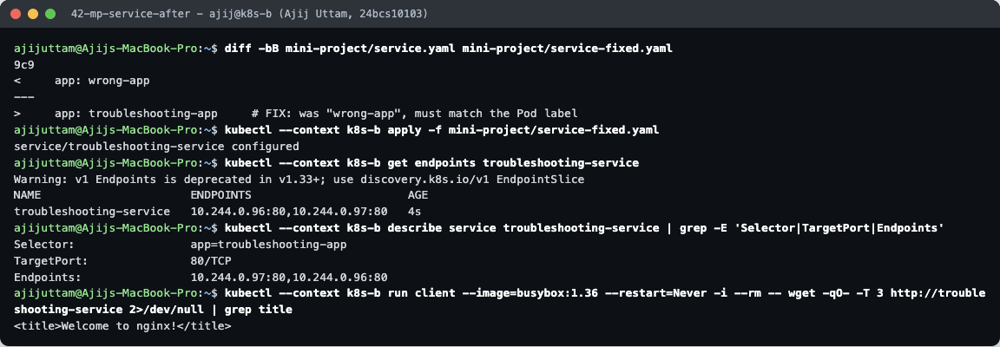

- **Fix:** selector `app: troubleshooting-app` ([`service-fixed.yaml`](mini-project/service-fixed.yaml)).
- **Verify:** endpoints `10.244.0.96:80,10.244.0.97:80`, and the client gets the nginx page through the Service.

### Steps 5–7: the broken Pod
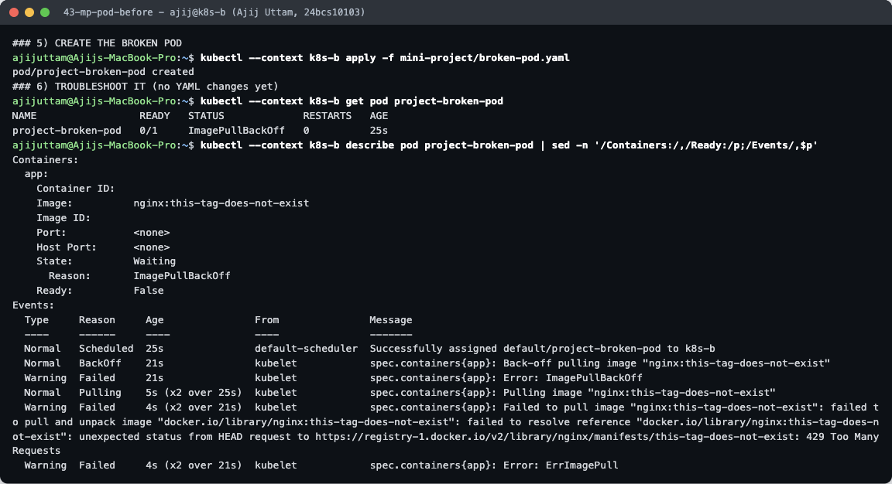

Following the rule "do **not** change the YAML first", I only ran `get` and `describe`:

- **Q1. What is the Pod status?** `ImagePullBackOff` (0/1 READY, alternating with `ErrImagePull`).
- **Q2. What is the actual error?** `Failed to pull image "nginx:this-tag-does-not-exist": … unexpected status from HEAD request to https://registry-1.docker.io/v2/library/nginx/manifests/this-tag-does-not-exist: 429 Too Many Requests`. Docker Hub's **anonymous pull rate limit** answered before it could say "not found". My lab had made many pulls by then. The same kind of tag returned `not found` earlier (Task 2, case 2). So there were two separate problems: the tag is wrong, **and** the node was being rate-limited.
- **Q3. Which command helped?** `kubectl describe pod project-broken-pod`, in the **Events** section. (`kubectl events --for pod/…` shows the same.)
- **Q4. What is wrong with the image?** The tag `this-tag-does-not-exist` doesn't exist in the `nginx` repository. The repository name is fine.
- **Q5. How would you fix it?** Use a real tag, e.g. `nginx:1.27`. For the 429 part: log in / use an `imagePullSecret` (authenticated users get a higher limit), use a registry mirror, or rely on an already-cached image with `imagePullPolicy: IfNotPresent`.

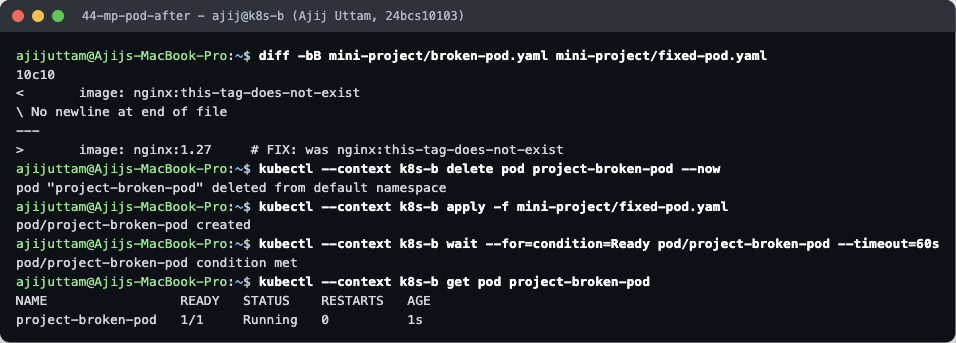

**Verify:** with `nginx:1.27` (already cached on the node, so the rate limit didn't matter), the Pod was `1/1 Running` in 1 s.

### Final state
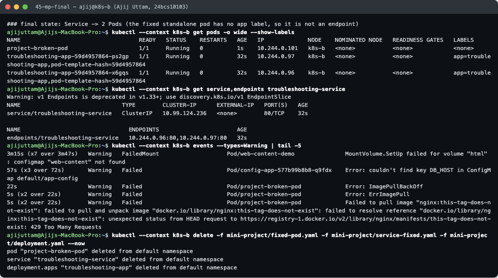

The Service routes to the 2 Deployment Pods. The fixed standalone Pod has **no labels**, so it is (correctly) not an endpoint. Afterwards everything was deleted.

### Troubleshooting table

| Problem | What I saw | Command I used | Root cause | Fix |
|---|---|---|---|---|
| **Broken Pod** | `0/1 ImagePullBackOff` / `ErrImagePull` | `kubectl get pod`, `kubectl describe pod` (Events) | image `nginx:this-tag-does-not-exist`, plus Docker Hub 429 rate limit | `image: nginx:1.27` |
| **Service Problem** | `wget` to the Service fails, `Endpoints: <none>` | `kubectl describe service`, `kubectl get endpoints`, `kubectl get pods --show-labels` | selector `app=wrong-app` ≠ Pod label `app=troubleshooting-app` | selector `app: troubleshooting-app` |
| **Image Problem** | `Failed to pull image … not found` / `429 Too Many Requests` | `kubectl events --for pod/…` | tag doesn't exist / anonymous pull limit | correct tag; authenticate or mirror the registry |

### README questions (in my own words)

1. **What does `kubectl get` tell us?** A one-line status summary of objects: is it there, how many containers are ready, what phase or waiting reason it is in, how often it restarted, and how old it is. It tells you *what* is wrong, not *why*.
2. **`get` vs `describe`?** `get` is a summary of many objects. `describe` is the detailed story of one object, including configuration, state history, conditions and, above all, the **Events** that explain *why*.
3. **Why `kubectl logs`?** To see what the application itself printed (errors, stack traces, startup messages). It only works once a container has started. `--previous` shows the last crashed instance.
4. **When `kubectl exec`?** When the Pod is running but behaving wrongly and I need to check from *inside*: config files, env vars, `/etc/resolv.conf`, which ports are listening (`netstat`), or whether `localhost` answers when the Service doesn't.
5. **`CrashLoopBackOff`?** The container keeps starting and exiting (or getting killed). The kubelet restarts it with an increasing delay (10 s → 20 s → … → 5 min) to avoid a hot loop.
6. **`ImagePullBackOff`?** The kubelet failed to pull the image (`ErrImagePull`) and is now waiting before the next attempt. Causes: wrong name or tag, private registry without credentials, rate limits, no network.
7. **Why can a Pod remain `Pending`?** The scheduler can't find a node for it: not enough CPU/memory, nodeSelector/affinity matching no node, taints without tolerations, or an unbound PVC.
8. **Why can a Service have no endpoints?** Its selector matches no Pods (label typo or mismatch, or wrong namespace), or the matching Pods are not **Ready** (failing readiness probes).
9. **Selector ↔ labels?** A Service doesn't point at Pods by name. It continuously selects every Ready Pod whose labels match `spec.selector` and puts their IPs (with `targetPort`) into its endpoints. If labels and selector disagree, the Service is empty.
10. **What is Kubernetes DNS?** CoreDNS, running in `kube-system` behind the `kube-dns` Service (`10.96.0.10` here). Every Pod with `dnsPolicy: ClusterFirst` uses it, so `<service>.<namespace>.svc.cluster.local` (or just `<service>` within the same namespace, thanks to the search list) resolves to the Service's ClusterIP.
