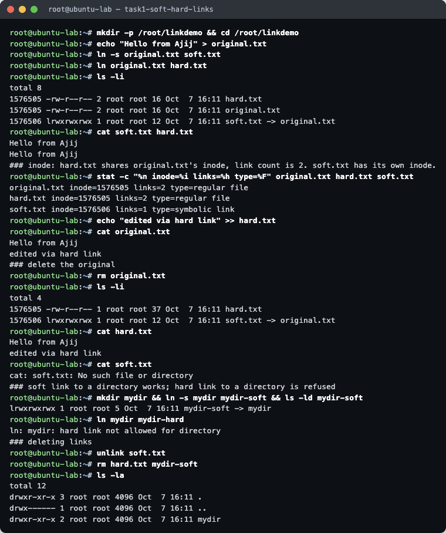
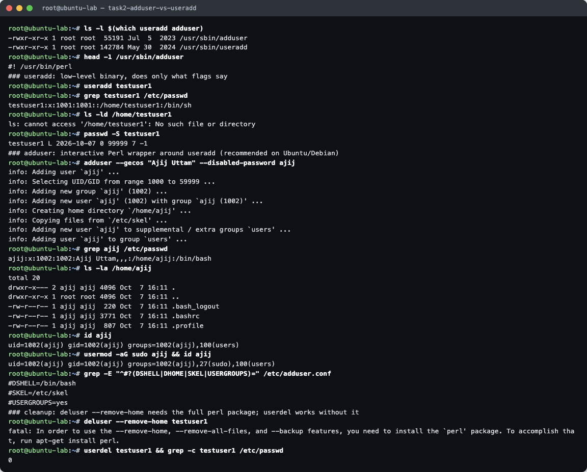
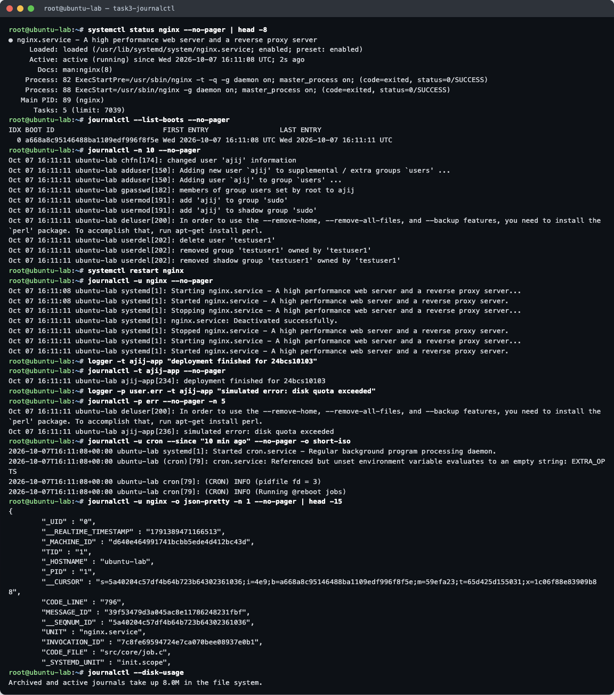
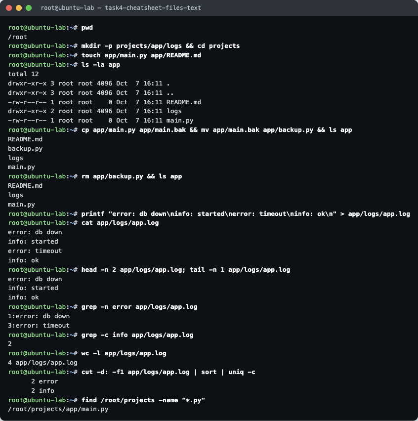
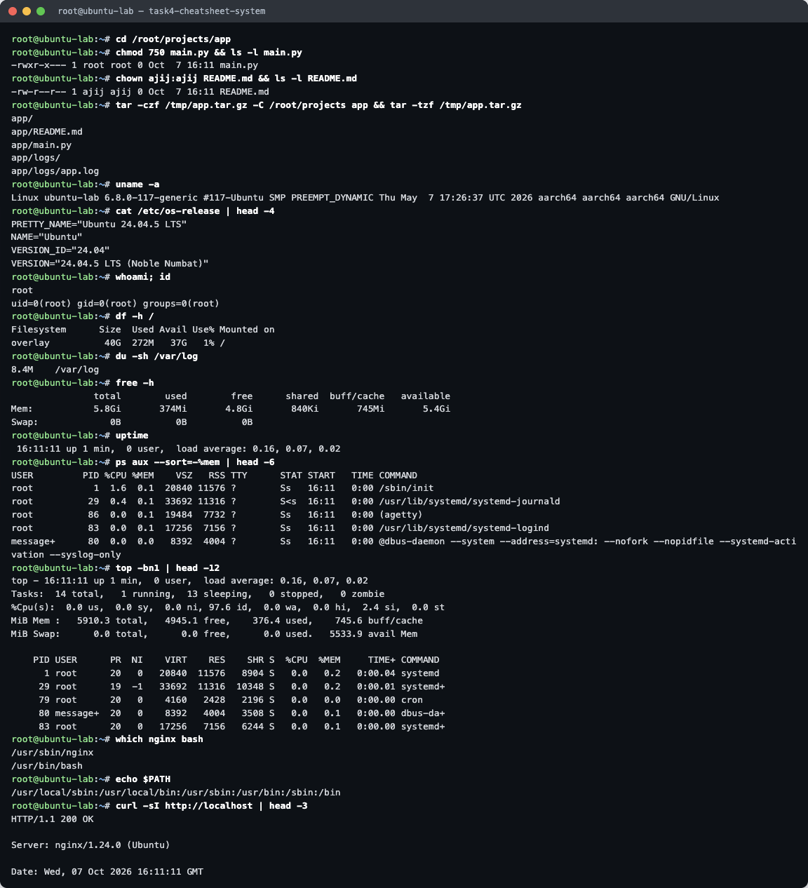

# Linux Fundamentals — Homework

**Name:** Ajij Uttam  **Enrollment No:** 24bcs10103

**Environment:** Ubuntu 24.04.5 LTS in Docker (Colima on macOS, arm64), with **systemd running as PID 1**. That makes `systemctl` and `journalctl` behave like they do on a real server. The image is [`lab/Dockerfile`](lab/Dockerfile). Every command comes from [`lab/run.sh`](lab/run.sh), and the raw output is in [`lab/`](lab/).

```bash
docker build -t ajij-ubuntu-lab lab/
docker run -d --name ubuntu-lab --hostname ubuntu-lab --privileged --cgroupns=host \
  -v /sys/fs/cgroup:/sys/fs/cgroup:rw --tmpfs /run --tmpfs /run/lock ajij-ubuntu-lab
docker exec -i ubuntu-lab bash -s links < lab/run.sh
```

---

## Task 1 — Soft Link & Hard Link



```
# ln -s original.txt soft.txt      # soft (symbolic) link
# ln original.txt hard.txt         # hard link
# ls -li
1576505 -rw-r--r-- 2 root root 16 Oct  7 16:11 hard.txt
1576505 -rw-r--r-- 2 root root 16 Oct  7 16:11 original.txt
1576506 lrwxrwxrwx 1 root root 12 Oct  7 16:11 soft.txt -> original.txt
```

**What the output proves**

- `hard.txt` and `original.txt` have the **same inode (1576505)** and a link count of **2**. They are two names for the same data on disk.
- `soft.txt` has its **own inode (1576506)** and type `l`. It is a small file that stores the *path* `original.txt` (12 bytes = length of that name).
- Text appended through `hard.txt` showed up when reading `original.txt`, because it is the same file.
- After `rm original.txt`, `hard.txt` still printed the content (link count dropped to 1). `soft.txt` failed with *No such file or directory*, because it is now a **dangling link** to a path that no longer exists.
- `ln -s mydir mydir-soft` worked. `ln mydir mydir-hard` was refused: *hard link not allowed for directory*.

| | Soft link (`ln -s`) | Hard link (`ln`) |
|---|---|---|
| Inode | New inode | Same inode as target |
| Points to | A path name | The data (inode) itself |
| Original deleted | Breaks (dangling) | Still works |
| Directories | Allowed | Not allowed |
| Across filesystems | Allowed | Not allowed (inodes are per-filesystem) |
| Delete it | `rm` or `unlink` | `rm` or `unlink` (data is freed when the count hits 0) |

**Interview one-liner:** a hard link is another *name* for the same inode. A soft link is a separate file containing a *path*. Delete the original and the hard link survives, but the soft link breaks.

---

## Task 2 — `adduser` vs `useradd`



```
# useradd testuser1
# grep testuser1 /etc/passwd
testuser1:x:1001:1001::/home/testuser1:/bin/sh
# ls -ld /home/testuser1
ls: cannot access '/home/testuser1': No such file or directory

# adduser --gecos "Ajij Uttam" --disabled-password ajij
info: Adding new group `ajij' (1002) ...
info: Creating home directory `/home/ajij' ...
info: Copying files from `/etc/skel' ...
# grep ajij /etc/passwd
ajij:x:1002:1002:Ajij Uttam,,,:/home/ajij:/bin/bash
```

| | `useradd` | `adduser` |
|---|---|---|
| What it is | Low-level compiled binary (shadow-utils), on every distro | Perl script (`#! /usr/bin/perl`) on Debian/Ubuntu that calls `useradd` |
| Home directory | **Not created** unless you pass `-m` | Created and filled from `/etc/skel` (`.bashrc`, `.profile`) |
| Shell | `/bin/sh` (default from `/etc/default/useradd`) | `/bin/bash` |
| Password / full name | Not asked, so the account stays locked (`passwd -S` → `L`) | Asked interactively (skipped here with `--disabled-password`, `--gecos`) |
| Best for | Scripts and other distros where exact flags matter | **Recommended on Ubuntu** for creating users by hand |

**Preferred on Ubuntu:** `adduser`. It applies sensible defaults (home dir, skeleton files, bash, own group, `users` group) in one command. With `useradd` the same result needs `useradd -m -s /bin/bash -c "..." user && passwd user`.

Test user `ajij` was created with `adduser` and then given sudo with `usermod -aG sudo ajij`.

**Something I hit:** `deluser --remove-home testuser1` failed because the slim Ubuntu image lacks the full `perl` package. `userdel testuser1` (the low-level counterpart) worked.

---

## Task 3 — `journalctl`

`journalctl` reads the **systemd journal**: one indexed log store for the kernel, systemd itself, every service, and anything sent via `logger`/syslog. It replaces grepping through many files under `/var/log`.



| Command | What it showed |
|---|---|
| `journalctl -n 10` | Last 10 entries, which here included the `useradd`/`adduser`/`usermod` events from Task 2 |
| `journalctl --list-boots` | One boot (the container's systemd start) |
| `journalctl -u nginx` | Logs for one **service**: the start at boot, then stop → start after `systemctl restart nginx` |
| `journalctl -t ajij-app` | Entries by tag: `deployment finished for 24bcs10103`, written with `logger -t ajij-app` |
| `journalctl -p err` | Only priority *error* and worse: the `deluser` failure and the simulated error |
| `journalctl -u cron --since "10 min ago" -o short-iso` | Time filter and ISO timestamps for the cron service |
| `journalctl -u nginx -o json-pretty -n 1` | The structured fields behind each line (`_BOOT_ID`, `SYSLOG_IDENTIFIER`, `JOB_RESULT`…) |
| `journalctl --disk-usage` | Space used by the journal |

Other useful flags: `-f` (follow live, like `tail -f`), `-b` (current boot only), `-k` (kernel messages), `-r` (newest first), `--vacuum-size=100M` (shrink the journal).

---

## Task 4 — Linux Command Cheat Sheet (practised)





| Category | Commands | Purpose |
|---|---|---|
| Navigation | `pwd`, `cd`, `ls -la` | Where am I, move, list (incl. hidden and permissions) |
| Files & dirs | `mkdir -p`, `touch`, `cp`, `mv`, `rm` | Create / copy / rename or move / delete |
| Viewing | `cat`, `head -n`, `tail -n` | Whole file, first N lines, last N lines |
| Searching | `grep -n`, `grep -c`, `find -name` | Match lines (with line numbers or counts), find files by name |
| Text processing | `wc -l`, `cut -d: -f1`, `sort`, `uniq -c` | Count lines, take a field, sort, count duplicates. The pipeline counted 2 `error` and 2 `info` lines |
| Permissions | `chmod 750`, `chown user:group` | rwx for owner, r-x for group, nothing for others; change owner |
| Archives | `tar -czf` / `tar -tzf` | Create / list a gzip tarball |
| System info | `uname -a`, `/etc/os-release`, `whoami`, `id`, `uptime` | Kernel, distro, current user, uptime and load |
| Resources | `df -h`, `du -sh`, `free -h` | Disk free per filesystem, size of a directory, memory |
| Processes | `ps aux --sort=-%mem`, `top -bn1` | Process list sorted by memory, one batch snapshot of `top` |
| Misc | `which`, `echo $PATH`, `curl -sI` | Where a binary lives, the search path, HTTP headers (nginx answered `200 OK`) |
