# Monitoring, Observability & GitOps — Homework

**Name:** Ajij Uttam  **Enrollment No:** 24bcs10103

**Environment:** a single-node **minikube** cluster (`-p obs`, Docker driver on Colima, 3 CPU / 4 GB, Kubernetes **v1.37.0**, metrics-server enabled) on macOS arm64. Everything below was run for real. The scripts are in [`lab/`](lab/) and the raw output of each step is next to them as `*.txt`. Terminal screenshots were rendered from those transcripts, and the browser screenshots are of the real Prometheus, Grafana, Alertmanager, Jaeger and Argo CD UIs, reached through `kubectl port-forward` ([`lab/port-forwards.sh`](lab/port-forwards.sh)).

| Tool | Version |
|---|---|
| minikube / Kubernetes | v1.39.0 / v1.37.0 (kubectl v1.37.1) |
| kube-prometheus-stack (Helm) | chart 92.1.0: Prometheus v3.15.0, Alertmanager v0.34.1, Grafana 13.2.3 |
| Jaeger | v2.22.0 (all-in-one, in-memory) |
| Argo CD | v3.5.4 (server and CLI) |
| Helm / git | v4.3.0 / 2.55.0 |

**Course material used:** the instructor's `Monitoring-Observability-Gitops/` folders. `03-prometheus` and `04-grafana` gave the Prometheus and Grafana basics (scrape, `up`, PromQL). `07-argocd` gave the Argo CD install command, the `Application` layout with `automated: {prune, selfHeal}` and `CreateNamespace=true`, and the "apply the Application once, then only use Git" idea. `08-mini-project` gave the namespace/deployment/service repo layout, the 2 → 3 replica change, and the self-heal test. I changed two things on purpose: the course pushes to GitHub, but here the Git remote is a **Git server running inside the cluster** (no GitHub at all), and I pinned Argo CD to v3.5.4 instead of `stable`.

## Contents

| Path | What it is |
|---|---|
| [`app/`](app/) | `shop-app`: a small Python web service (standard library only) with `/metrics`, JSON logs, OTLP traces, health endpoints and fault-injection knobs |
| [`manifests/monitoring/`](manifests/monitoring/) | Helm values for kube-prometheus-stack, app Deployments/Services/ServiceMonitor, **PrometheusRule** alerts, Grafana dashboard ConfigMap, load generator |
| [`manifests/observability/jaeger.yaml`](manifests/observability/jaeger.yaml) | Jaeger v2 for traces |
| [`git-server/`](git-server/) | My in-cluster Git server image (alpine + lighttpd + `git-http-backend`) and its Deployment/Service/PVC |
| [`gitops-repo/`](gitops-repo/) | Final contents of the GitOps repo that Argo CD watched |
| [`manifests/gitops/application.yaml`](manifests/gitops/application.yaml) | The Argo CD `Application` (applied once, kept outside the watched path) |
| [`lab/`](lab/) | Step scripts (`00`…`12`), the helper `lib.sh`, and every transcript |

---

## Setup problems I hit (and fixed)

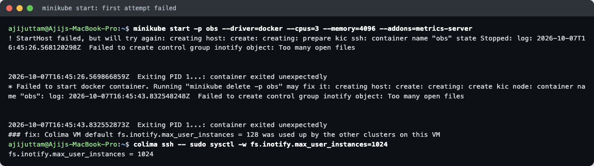

1. **`minikube start` failed twice:** `Failed to create control group inotify object: Too many open files`. The Colima VM had `fs.inotify.max_user_instances = 128`, and the other clusters already on the VM had used them all up. Raising it with `colima ssh -- sudo sysctl -w fs.inotify.max_user_instances=1024` fixed it, and the third start worked ([`00-cluster.txt`](lab/00-cluster.txt)).
2. **Docker Hub rate limit:** `minikube image build` failed with `429 Too Many Requests` when pulling `python:3.12-alpine` ([`02-deploy-app-first-attempt.txt`](lab/02-deploy-app-first-attempt.txt)), and the pods sat in `ErrImageNeverPull`. I built the image with the host Docker instead (the base image was already cached) and ran `minikube image load`. For the same reason I could not pull Gitea, so I built my own small Git server from the cached `alpine:3.22` (see Task 3).
3. **Grafana OOMKilled:** with my first "modest" limit of 256Mi, Grafana was killed (`Reason: OOMKilled`, exit code 137) as soon as the UI loaded. A `helm upgrade` raised it to 512Mi ([`01b-grafana-oom.txt`](lab/01b-grafana-oom.txt)). Lesson: set limits from measured usage, not guesses. Grafana used ~530Mi across its 3 containers afterwards.

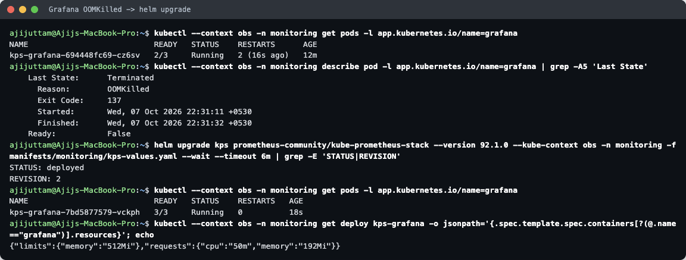

---

## Task 1 — Monitoring

### What was deployed

```
                 scrape /metrics every 15 s                    alert rules
 shop (x2) ──────────────┐                                  ┌──> Alertmanager
 payments ───────────────┼──> Prometheus ── PromQL ─────────┤
 kubelet/cAdvisor (CPU, mem)                                └──> Grafana dashboards
 kube-state-metrics (replicas, limits)
 node-exporter (node)
 loadgen ──(~3 req/s)──> shop ──HTTP──> payments
```

- **kube-prometheus-stack** via Helm ([`kps-values.yaml`](manifests/monitoring/kps-values.yaml)). It installs the Prometheus Operator, Prometheus, Alertmanager, Grafana, kube-state-metrics and node-exporter. I gave each component small requests/limits, 6 h retention, and turned off the etcd/scheduler/controller-manager/kube-proxy scrapes, because minikube does not expose them and they would only show as DOWN.
- **The app** ([`app/app.py`](app/app.py)): one image, two roles. `shop` serves `GET /order`, which does a fake DB step and then calls `payments` (`GET /pay`). It exposes:
  - `/metrics`: `http_requests_total{path,code}` (counter), `http_request_duration_seconds` (histogram), `app_info`, `app_uptime_seconds`, `app_error_injection_percent`
  - `/healthz` and `/readyz`, used by the liveness and readiness probes
  - `/admin/errors?pct=N` (make N % of requests fail) and `/admin/burn?seconds=N` (burn CPU) for the incident drill
- A **ServiceMonitor** (`shop-apps`) tells the Operator to scrape every Service labelled `monitor: "true"`. There is no hand-written scrape config.
- A **load generator** Deployment sends about 3 requests per second so the graphs always have real data.

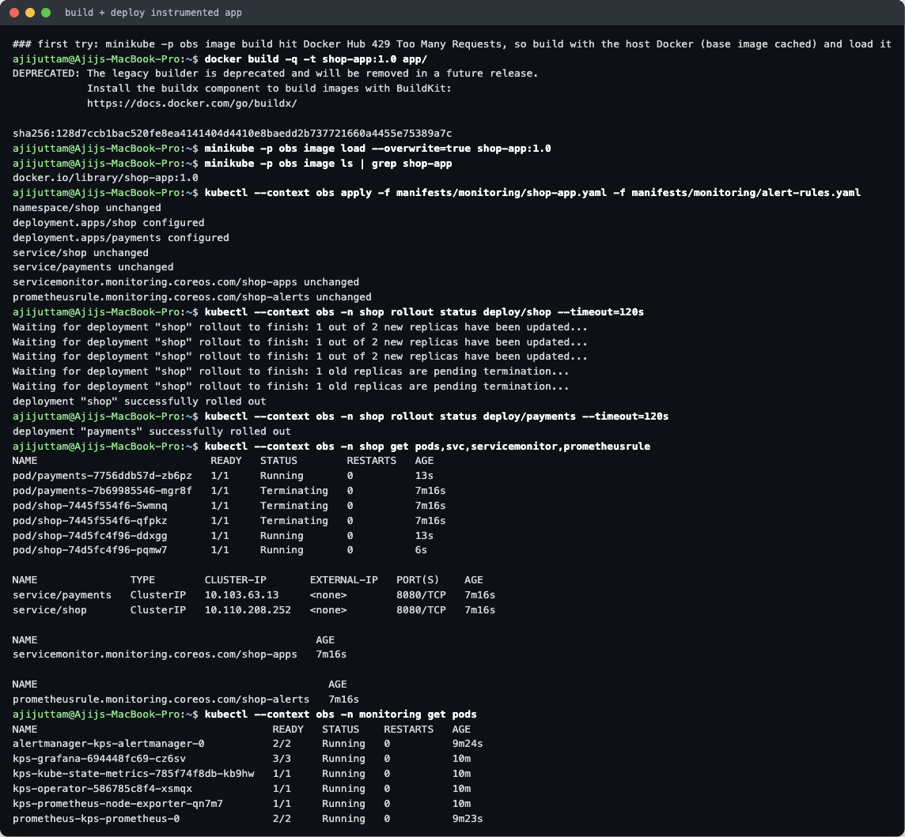

### Metrics

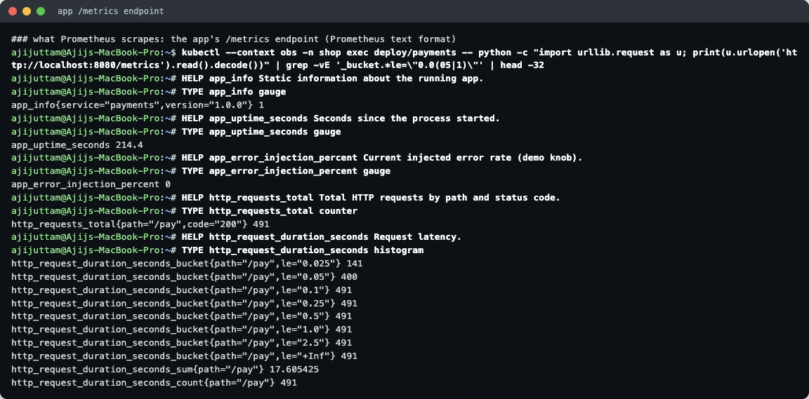

This is what Prometheus scrapes: plain text, one sample per line, with `# HELP`/`# TYPE` metadata. The histogram buckets are cumulative. For example, `le="0.05"} 54` of `count 62` means 54 of the 62 payment calls took ≤ 50 ms.

**Targets.** All targets were `up`, including the 3 app pods that the ServiceMonitor discovered on its own. Prometheus attached the `namespace`, `pod` and `service` labels for free:

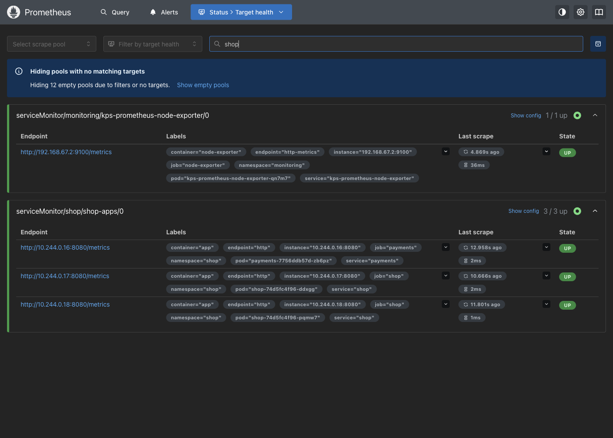

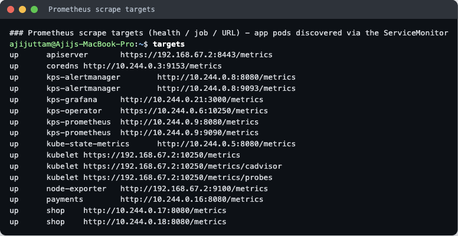

**PromQL on real traffic** ([`03c-promql.txt`](lab/03c-promql.txt)):

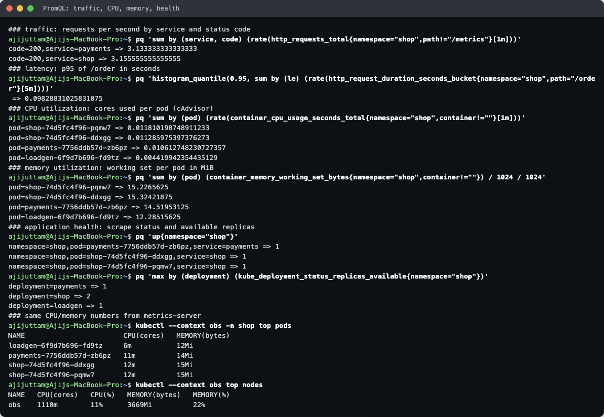

| Signal | Query (shortened) | Result at baseline |
|---|---|---|
| Traffic | `sum by (service,code)(rate(http_requests_total[1m]))` | shop **3.16 req/s**, payments **3.13 req/s**, all `200` |
| Latency | `histogram_quantile(0.95, …/order…)` | p95 **≈ 98 ms** |
| **CPU utilization** | `rate(container_cpu_usage_seconds_total[1m])` per pod | ≈ **0.011 cores** per app pod (11–12m in `kubectl top`) |
| **Memory utilization** | `container_memory_working_set_bytes` per pod | ≈ **15 MiB** per app pod |
| **Application health** | `up{namespace="shop"}`, `kube_deployment_status_replicas_available` | all `1`. shop **2** available, payments **1** |

CPU and memory come from **cAdvisor** (inside the kubelet). Replica counts come from **kube-state-metrics**. The `up` metric is Prometheus's own record of whether each scrape worked. `kubectl top` (metrics-server) gave the same numbers, which is a useful cross-check.

### Logs

The app writes **one JSON object per line** to stdout. Kubernetes keeps the container's stdout, so `kubectl logs` reads it, and `jq` can filter it like a database ([`04-logs.txt`](lab/04-logs.txt)):

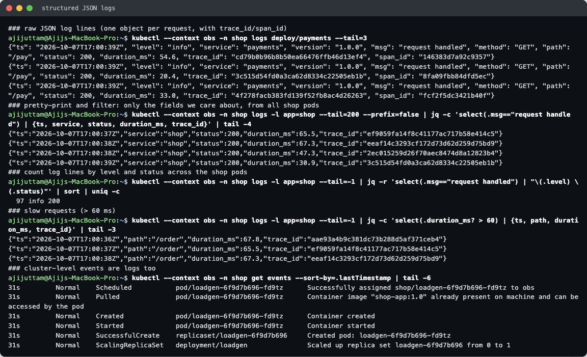

Because the logs are structured, I could answer questions with no extra tools: "show only status + latency", "count by level/status" (`97 info 200` at baseline), and "requests slower than 60 ms". Every line has a `trace_id`, which links the logs to traces (Task 2). Kubernetes **events** (`kubectl get events`) are a second kind of log: they record what the cluster itself did (scheduled, pulled, started).

### Alerts — a simulated incident

The rules are in [`alert-rules.yaml`](manifests/monitoring/alert-rules.yaml) (a `PrometheusRule`, which the Operator loaded automatically):

| Alert | Fires when | `for` |
|---|---|---|
| `ShopHighErrorRate` | more than 10 % of requests (per service) return 5xx | 1m |
| `ShopHighCPU` | a pod uses more than 80 % of its **CPU limit** | 1m |
| `ShopHighMemory` | a pod uses more than 90 % of its memory limit | 2m |
| `ShopNoReadyReplicas` | a Deployment has 0 available replicas (the "pod down" case) | 30s |
| `ShopTargetDown` | a scrape of an app pod fails (`up == 0`) | 30s |

Before the incident, all 5 rules were green (inactive):

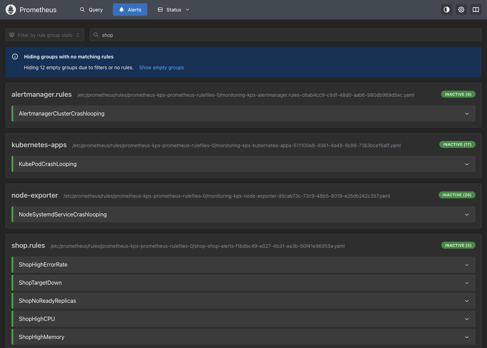

**Phase 1: errors + CPU** ([`05a`](lab/05a-incident-errors-cpu.txt), [`05a2`](lab/05a2-incident-alerts.txt)). At 22:33:05 I made `payments` fail 40 % of calls and made one `shop` pod burn CPU:

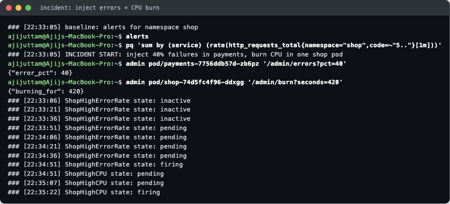

- `ShopHighErrorRate` went **inactive → pending (22:33:51) → firing (22:34:51)**. The `rate(...[1m])` window needs time to fill up, and then the `for: 1m` must pass. This is why alerts lag the real problem by 1–2 minutes, and that lag is on purpose: it stops a single bad scrape from paging anyone.
- `ShopHighCPU` fired at 22:35:22 with the pod at **0.4998 cores = 99.96 % of its 500m limit** (`kubectl top`: `501m`). CPU cannot go past the limit. The kernel **throttles** the container instead.
- Both services showed **35–38 % errors**. The shop's errors (`502`) are the payments failures passing upstream.

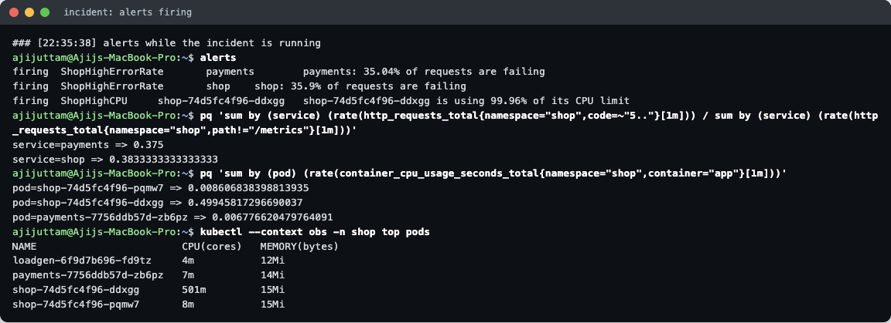

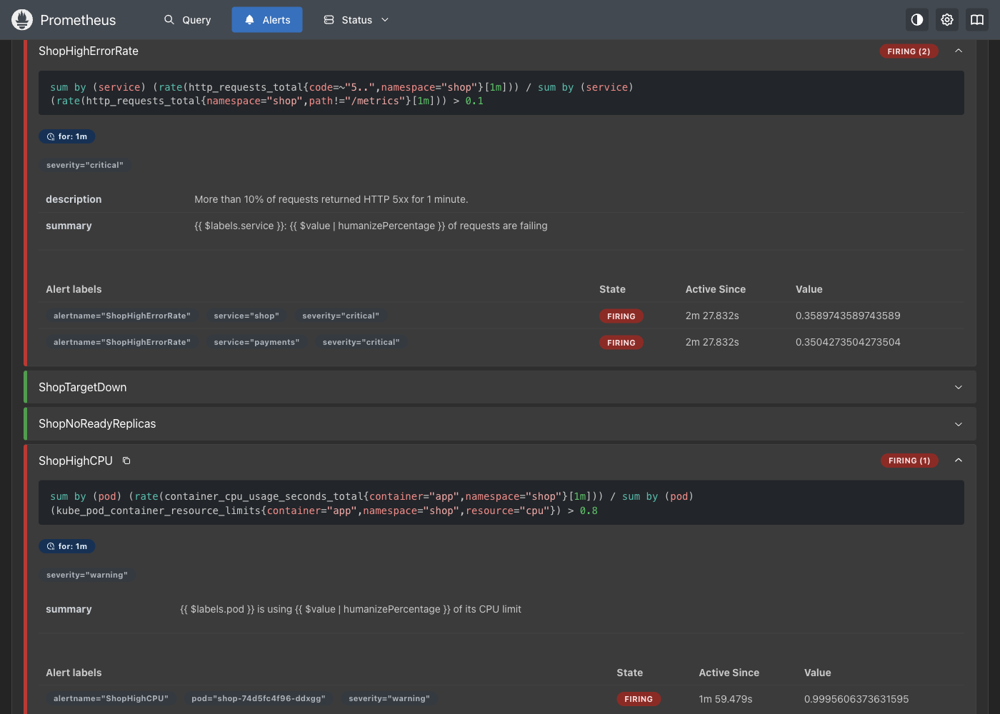

Alertmanager received the firing alerts. In production it would group them and route them to Slack, e-mail or PagerDuty:

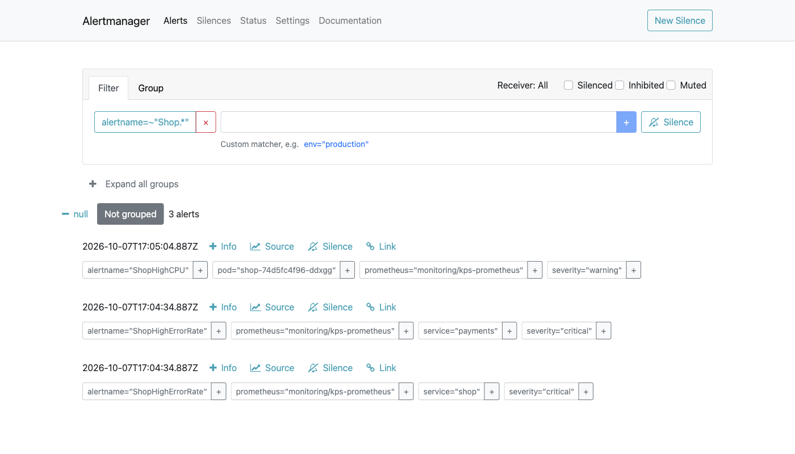

**Grafana during the incident.** I provisioned my own dashboard as code ([`grafana-dashboard.yaml`](manifests/monitoring/grafana-dashboard.yaml), auto-loaded by the Grafana sidecar):

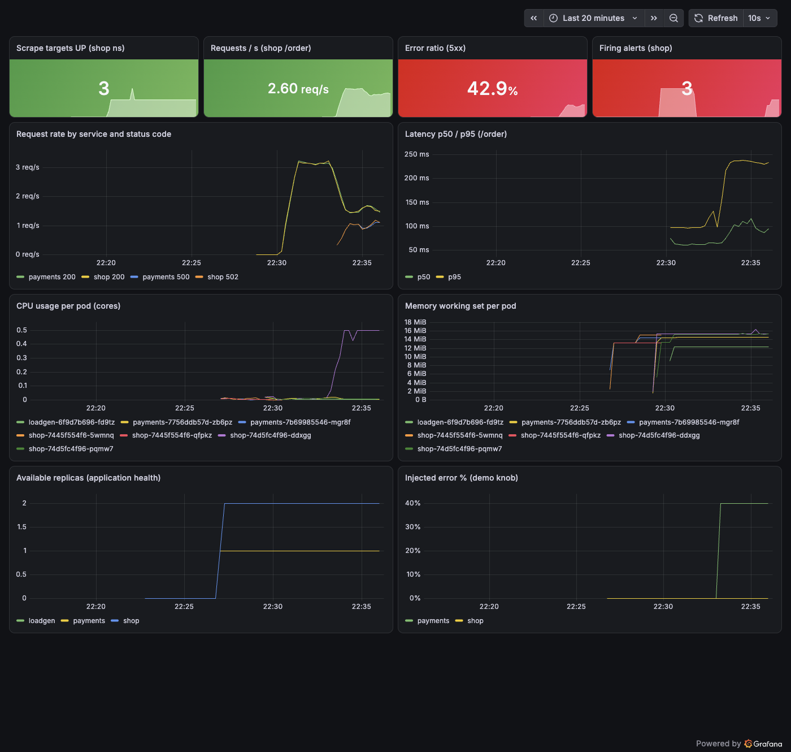

What the dashboard shows that the alerts alone don't:
- The error ratio stat turned red (**42.9 %**), and "Firing alerts" shows **3**.
- **The CPU burn hurt latency and throughput too.** p95 rose from ~100 ms to **~230 ms**, and total requests per second dropped. The loadgen sends requests one at a time, so every request that landed on the throttled pod slowed down the whole stream.
- The "Injected error %" panel shows exactly when the fault started, which is handy for checking cause and effect.

**Phase 2: pod down** ([`05c`](lab/05c-incident-pod-down.txt)). I turned error injection off and scaled `payments` to 0:

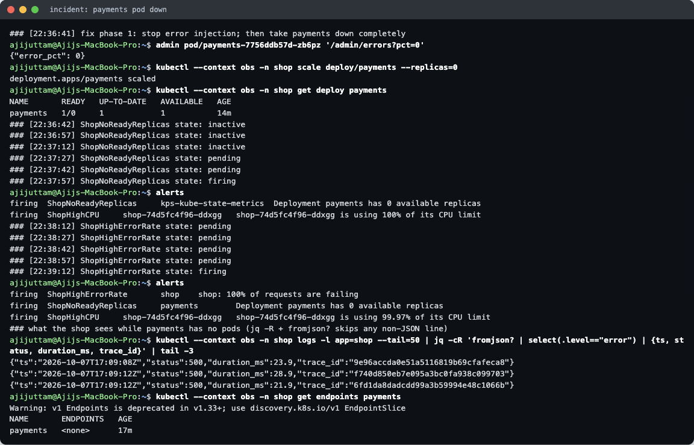

- `ShopNoReadyReplicas` fired after ~75 s. `ShopHighErrorRate` fired again for `shop`, this time at **100 %**, because the `payments` Service had **no endpoints** (`<none>`).
- The Grafana p95 for `/order` jumped to **~2 s** (recovered graph below), even though the requests were failing. Some calls to a Service with no endpoints wait for the connection to fail instead of failing fast. A clear case for client timeouts and circuit breakers.
- **`ShopTargetDown` did *not* fire, and that is correct.** When a pod is deleted, Prometheus removes it from its targets. The pod is not "scraped and down", it just no longer exists. `up == 0` only catches pods that exist but can't be scraped. To catch "my service is gone" you need a kube-state-metrics rule like `ShopNoReadyReplicas`. That was the most useful lesson of the drill.

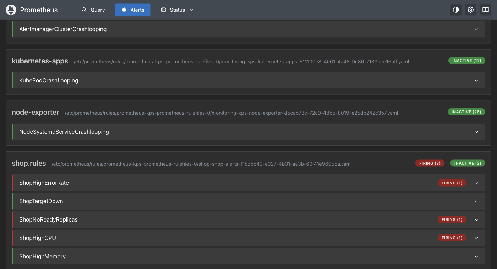

**Recovery** ([`05d`](lab/05d-recover.txt)): I scaled payments back to 1, and all Shop alerts **resolved by 22:40:53**, about 86 s later. Traffic returned to ~3.2 req/s with 0 errors.

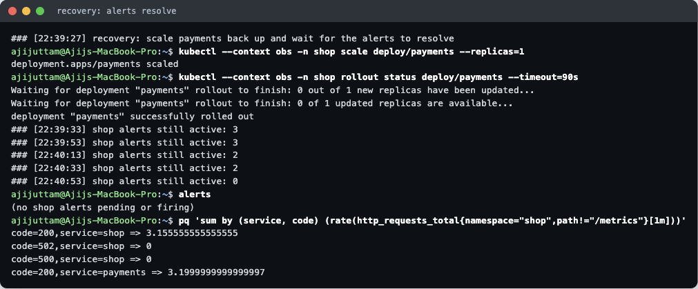

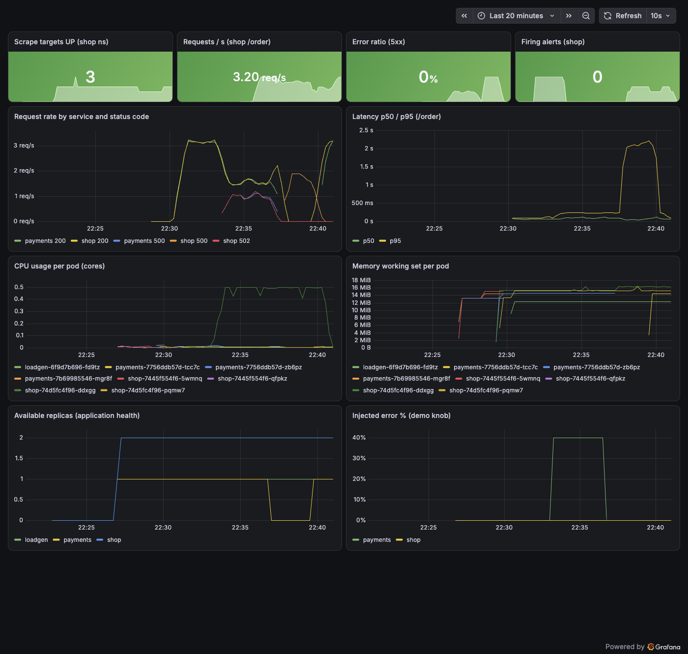

The whole incident is visible on one timeline: the errors (red/orange lines), the CPU plateau at 0.5 cores, the latency spike to 2 s while payments was at **0** replicas, then the return to normal.

The built-in kube-prometheus-stack dashboard **"Kubernetes / Compute Resources / Namespace (Pods)"** shows the same CPU/memory story against requests and limits. The burning pod used **859 % of its CPU request** but only **85.9 % of its limit**. That gap is the difference between the two settings: requests decide where a pod is scheduled, limits decide when it gets throttled.

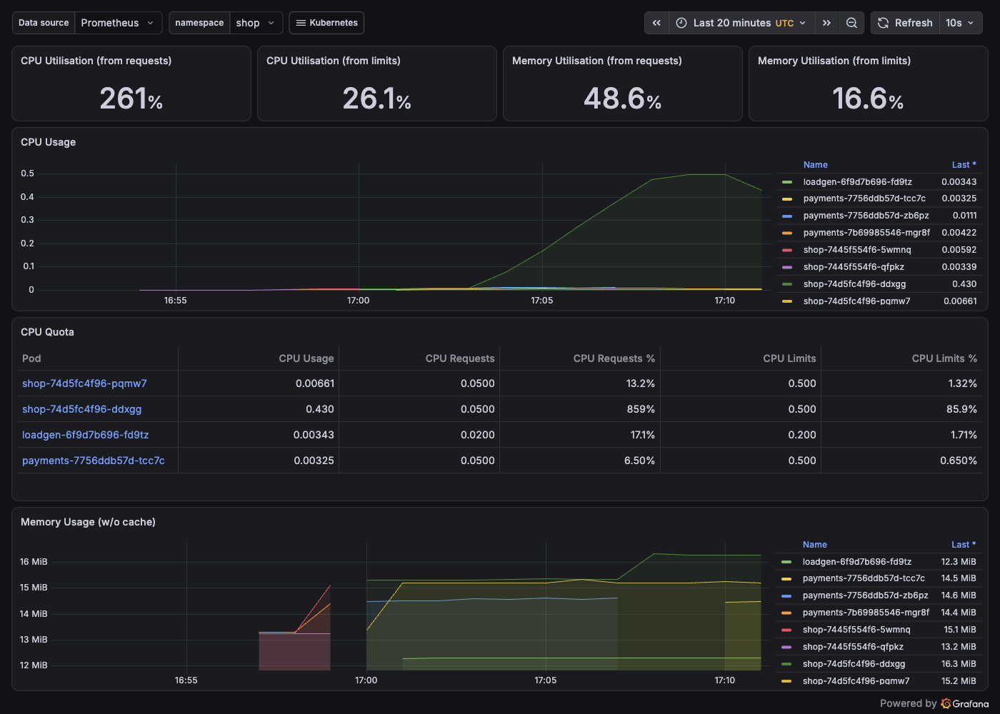

> Two small mistakes I fixed on the way: (1) my first alert-listing helper filtered on `namespace="shop"`, but `sum by (service)` drops that label, so the first "alerts" printout missed my alerts. I changed the filter to match `alertname` starting with `Shop`. (2) The "Error ratio" panel showed *No data* until the first 5xx existed, so I added `or vector(0)`.

---

## Task 2 — Observability

### Monitoring vs observability

**Monitoring** answers questions you *already knew to ask*: "is CPU above 80 %?", "is the error rate above 10 %?". Those are the dashboards and alerts from Task 1. **Observability** is how well you can answer *new* questions from the data your system already emits, without shipping new code: "why are only *some* orders slow?", "which service failed *this* request?". Monitoring tells you **that** something is wrong. Observability lets you find out **why**.

### The three pillars

| Pillar | What it is | Good at | Weak at | In this lab |
|---|---|---|---|---|
| **Metrics** | Numbers sampled over time, with labels (counter, gauge, histogram) | Cheap to store, fast to query, perfect for **dashboards and alerts** and spotting trends | No per-request detail. High-cardinality labels (user id) explode storage | `/metrics` → Prometheus → Grafana and alerts |
| **Logs** | Timestamped records of discrete **events**, ideally structured (JSON) | Full detail of *what happened*: error messages, inputs, decisions | Expensive at volume, hard to aggregate if unstructured, one service at a time | JSON lines on stdout, read with `kubectl logs` + `jq` |
| **Traces** | The **journey of one request** across services: a tree of *spans* (timed operations) sharing one `trace_id` | Shows **where the time went** and **which hop failed** in a distributed call | Usually sampled, needs context propagation in every service | Spans sent to **Jaeger** over **OTLP** |

They work best **together**: a metric/alert says *something* is wrong → the trace shows *where* → the logs for that `trace_id` show *exactly what*.

### Demo: one request, followed through all three pillars

This is a real demo, not just documentation. The app creates a `trace_id` for each `/order` and passes it to `payments` in B3 headers (`X-B3-TraceId`, `X-B3-SpanId`). Both services send their spans to **Jaeger v2** as **OTLP/HTTP JSON** (the OpenTelemetry wire format, to `:4318/v1/traces`), and every log line includes the same `trace_id`. I wrote the OTLP exporter by hand with the standard library to keep the image tiny. A real service would use the OpenTelemetry SDK, which does the same thing.

**1. The alert fired** (Task 1, `ShopHighErrorRate`). **2. The logs gave a trace id.** During the incident, the same id showed up in the error logs of **both** services ([`05b-incident-logs.txt`](lab/05b-incident-logs.txt)):

```
{"ts":"2026-10-07T17:05:42Z","service":"shop","status":502,"trace_id":"f833ba40df1597aad9fb2f6f0ca02fe0"}
{"ts":"2026-10-07T17:05:42Z","service":"payments","status":500,"trace_id":"f833ba40df1597aad9fb2f6f0ca02fe0"}
```

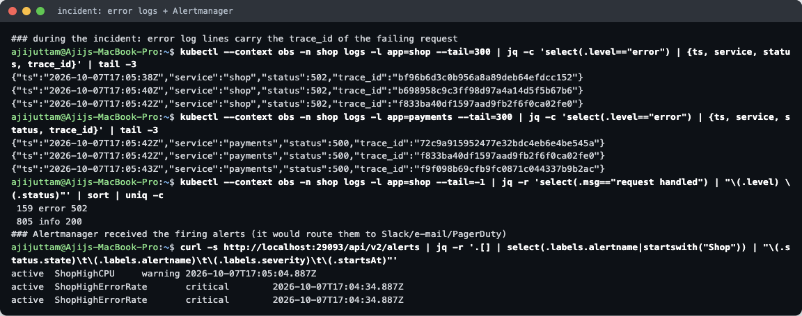

**3. The trace showed where it failed** ([`06-traces.txt`](lab/06-traces.txt)):

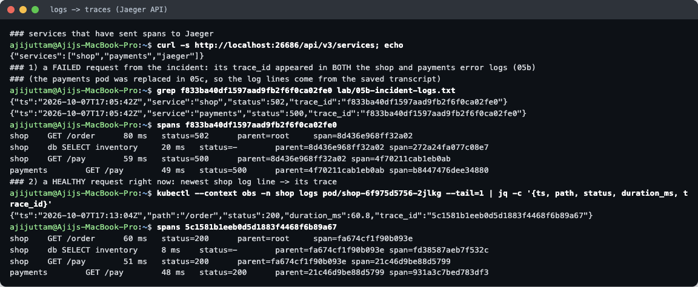

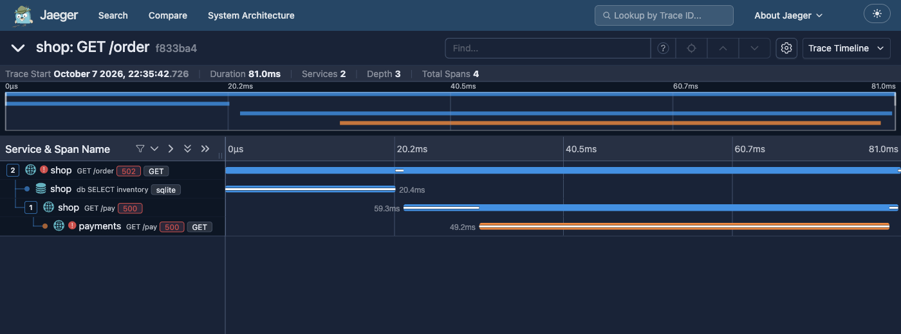

The trace has 4 spans in **2 services** at depth 3. The fake DB step took 20 ms and succeeded. The outgoing `GET /pay` from shop took 59 ms and got a `500`, and inside it the `payments` server span (49 ms) is where the `500` came from. So the root cause was in **payments**, and shop only passed it on as a `502`. Without the trace, the shop log alone would point at the wrong service.

A healthy request for comparison, with the span details opened (attributes plus resource info such as `k8s.pod.name`):

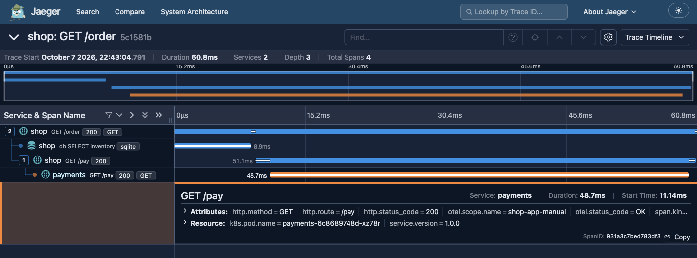

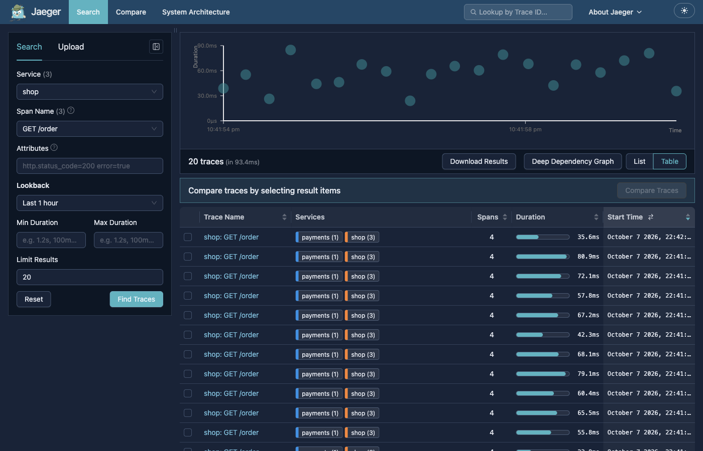

> **Bug I found with the trace UI:** at first, healthy spans also showed a red error icon, because I sent an attribute `error="false"` and Jaeger flags any `error` tag. I changed the app to set only the OTLP **span status** (`OK`/`ERROR`), then rebuilt and restarted it ([`06a-fix-span-status.txt`](lab/06a-fix-span-status.txt)). The error trace above was recorded before the fix, and its red marks are real failures.

**Problems I hit:** Jaeger v2's default config has **no Zipkin receiver** (only OTLP and Jaeger protocols), so my first Zipkin-JSON exporter sent spans nowhere. Switching to OTLP fixed it. Also, the old `/api/services` endpoint returns 404 on Jaeger v2, so I used `/api/v3/services`.

### Why observability is required

- **Distributed systems fail in partial, new ways.** One slow dependency, one bad pod, a retry storm. You can't write a dashboard in advance for every failure.
- **Speed of recovery (MTTR).** In the drill, alert → log → trace → root cause took a few queries instead of guessing.
- **Pods are short-lived.** The payments pod with the incident logs was **gone** after I scaled it down (`06-traces.txt` had to read the saved transcript). Data must leave the pod (central log store, Prometheus, Jaeger), or it disappears with the pod.
- **SLOs and capacity.** You need the numbers (latency percentiles, error ratios, CPU vs limits) to set targets and to size requests and limits. The Grafana OOM above is an example of sizing without data.

### Common tools

| Area | Tools |
|---|---|
| Metrics | **Prometheus** (pull model + PromQL), Thanos / Mimir / VictoriaMetrics (long-term, HA), Datadog, CloudWatch |
| Dashboards | **Grafana** |
| Alerting | **Alertmanager**, Grafana Alerting, PagerDuty / Opsgenie for on-call |
| Logs | **Loki** + Promtail/Alloy, **ELK/EFK** (Elasticsearch, Logstash/Fluentd/Fluent Bit, Kibana), OpenSearch, Splunk |
| Traces | **Jaeger**, **Grafana Tempo**, Zipkin, AWS X-Ray |
| Instrumentation standard | **OpenTelemetry** (SDKs + OTLP + Collector), vendor-neutral for all three pillars |
| All-in-one SaaS | Datadog, New Relic, Dynatrace, Honeycomb, Grafana Cloud |

### Kubernetes observability

| Layer | Where the data comes from | Used here |
|---|---|---|
| Node | node-exporter (CPU, memory, disk, network of the machine) | ✔ |
| Container resources | **cAdvisor** in the kubelet: CPU, memory, throttling per container | ✔ CPU and memory panels, `ShopHighCPU` |
| Kubernetes objects | **kube-state-metrics**: desired vs available replicas, restarts, limits, pod phase | ✔ `ShopNoReadyReplicas`, limit ratios |
| Quick view | **metrics-server** → `kubectl top`, and the HPA uses it too | ✔ |
| Control plane | API server metrics (etcd/scheduler too on real clusters) | ✔ apiserver target |
| Logs | Container stdout/stderr → node files → `kubectl logs`; in production a DaemonSet (Fluent Bit/Alloy) ships them to Loki/Elasticsearch | `kubectl logs` + `jq` (no central log store, to save memory) |
| Events | `kubectl get events`: scheduling, image pulls, OOMKills, probe failures | ✔ |
| Health | Liveness/readiness/startup **probes** decide restarts and Service endpoints | ✔ `/healthz`, `/readyz` |
| Discovery | Prometheus Operator **ServiceMonitor/PodMonitor** + labels, so new pods are scraped with no config edits | ✔ |

The key Kubernetes idea is **labels**. Prometheus copied `namespace`, `pod` and `service` onto every app metric, so one query can be sliced by any of them, and a new pod is monitored the moment it starts.

---

## Task 3 — GitOps with Argo CD

### What is GitOps?

GitOps means running a system by keeping its **desired state declared in Git**, while an **agent inside the cluster** keeps making the real state match it:

- **Git is the source of truth.** The YAML in the repo *is* the spec. Every change is a commit, so you get a review (pull request), an author, a timestamp and a diff, and `git revert` undoes it.
- **Declarative configuration.** You describe *what* should exist (`replicas: 3`, `image: shop-app:1.0`), not the commands to get there. The tool works out create/update/delete itself.
- **Continuous reconciliation.** A controller (Argo CD) keeps comparing **desired** (Git) with **actual** (cluster) and fixes any difference: new commits *and* manual drift.
- **Pull, not push.** CI does not need cluster credentials. The agent inside the cluster *pulls* from Git.

### The setup: Git without GitHub

Docker Hub rate limits blocked Gitea, so I built a tiny **smart-HTTP Git server** ([`git-server/`](git-server/)): alpine + lighttpd running git's own `git-http-backend` CGI, with the repo kept on a PVC. Inside the cluster it is `http://git-server.git.svc:3000/shop-gitops.git`. I push to it from my Mac through a port-forward. Every commit is authored as **Ajij Uttam**.

```
 my laptop                         minikube cluster "obs"
 ─────────                         ────────────────────────────────────────────────
 git commit ──git push──(pf)──> git-server pod (namespace git, PVC)
                                        ^
                                        | poll every 30 s (git fetch)
                                  Argo CD (namespace argocd) ──apply/prune/self-heal──> namespace gitops-demo
                                                                                       (Deployment web, Service web)
```

**Install** ([`07-argocd-install.txt`](lab/07-argocd-install.txt)): the same command as the course README, pinned to **v3.5.4**. I set `timeout.reconciliation: 30s` (the default is about 3 min) so the demo moves faster, and scaled Dex and the notifications controller to 0 because neither is used here and memory was tight.

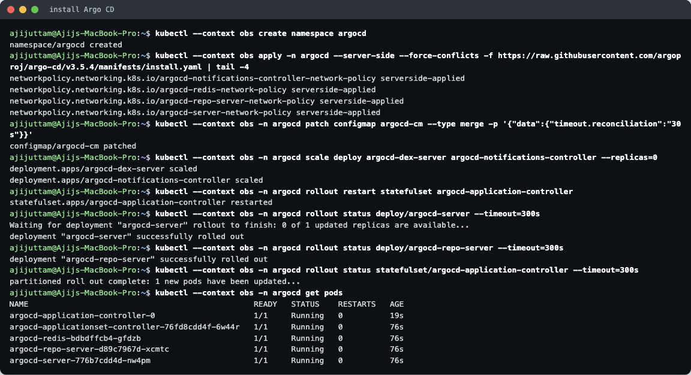

**Bootstrap** ([`08a`](lab/08a-git-server.txt), [`08b`](lab/08b-argocd-app.txt)): first commit → push to the in-cluster server → `argocd repo add` (connection **Successful**) → `kubectl apply` of [`application.yaml`](manifests/gitops/application.yaml). That is the **only** `kubectl apply` in the whole GitOps part. Argo CD then created the namespace, Service and Deployment by itself: **Synced to main (8ccc06c), Healthy**, 2 pods, app reports `version 1.0.0`.

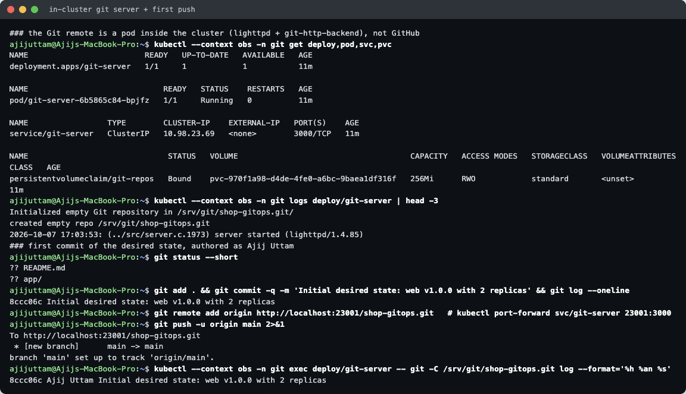

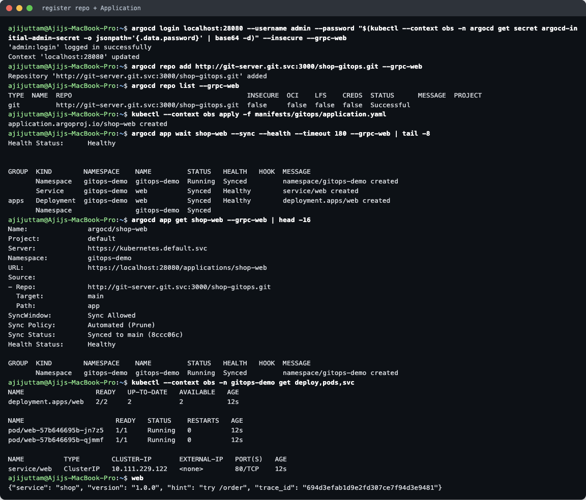

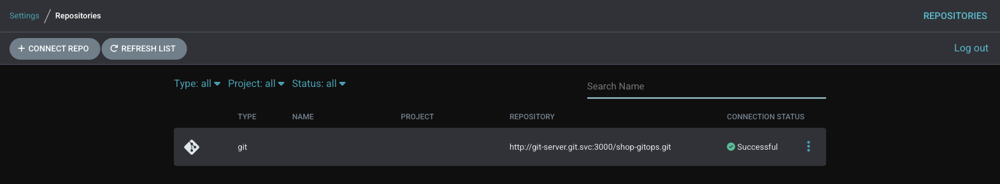

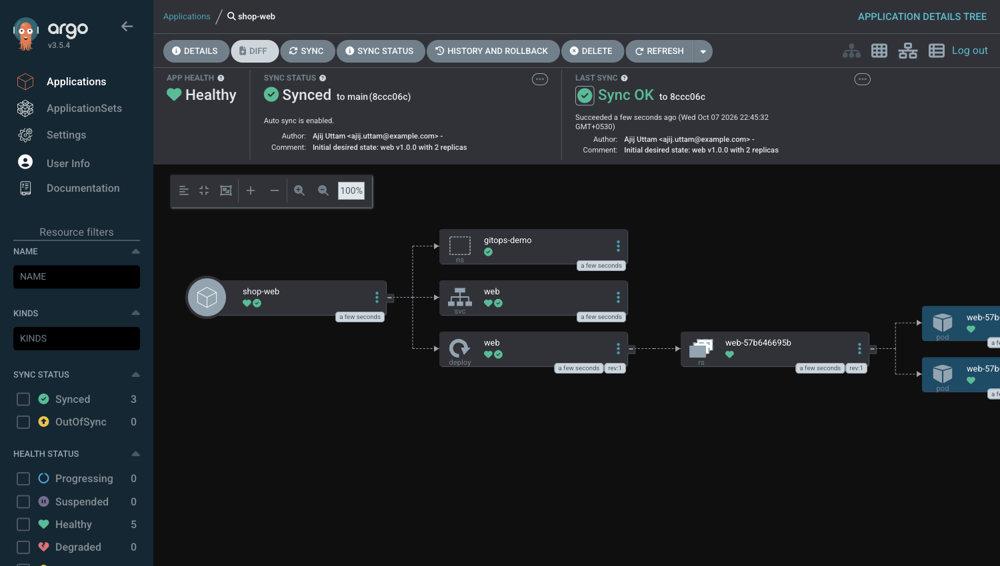

### 1. GitOps workflow: commit → sync → rollout

[`09-gitops-workflow.txt`](lab/09-gitops-workflow.txt): one commit changes `replicas: 2 → 3` and `APP_VERSION 1.0.0 → 1.1.0`. No kubectl.

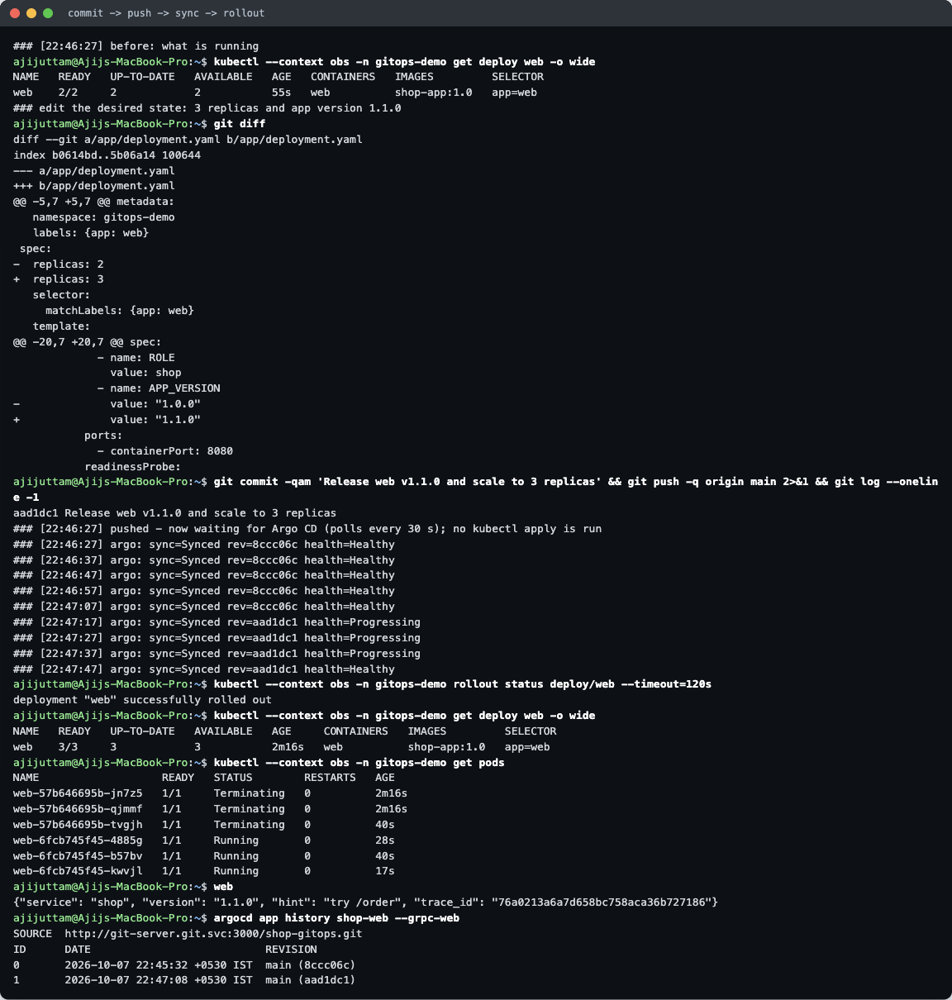

- Pushed **22:46:27**. Argo CD history shows the sync of `aad1dc1` at **22:47:08** (~40 s, one poll cycle). The app was Healthy at 22:47:47 once the rolling update finished.
- The Deployment rolled out a **new ReplicaSet** (`rev:2`) with 3 pods while the old one scaled down. The app now answers `"version": "1.1.0"`.

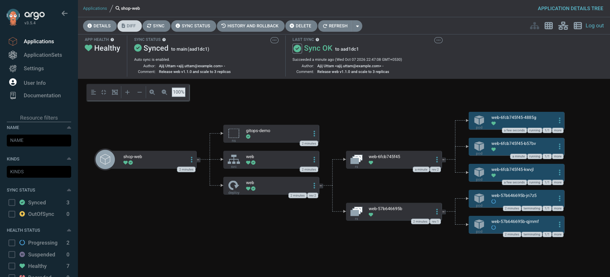

### 2. Continuous reconciliation: self-heal

[`10-self-heal.txt`](lab/10-self-heal.txt): I changed the live Deployment by hand (`kubectl scale --replicas=1` and `kubectl set env APP_VERSION=hotfix-by-hand`).

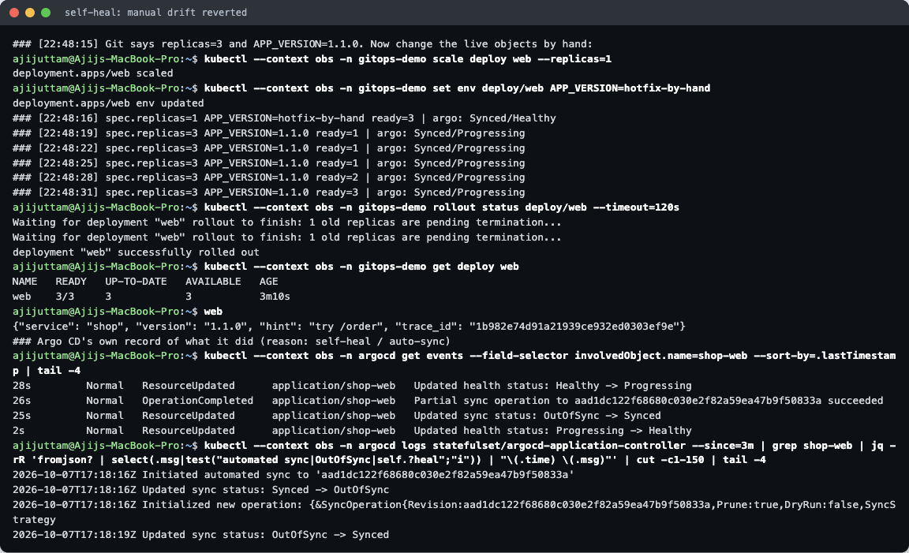

At 22:48:16 the live object said `replicas=1 APP_VERSION=hotfix-by-hand`. **Three seconds later** (22:48:19) it was back to `replicas=3 APP_VERSION=1.1.0`. The controller log shows `Updated sync status: Synced -> OutOfSync` and `Initiated automated sync` in the same second. Self-heal reacts to **watch events** on the live objects, so it does not wait for the 30 s Git poll. This is the GitOps rule in practice: a manual "hotfix" does not stick, so the fix has to go through Git.

### 3. Declarative config and prune

[`11-prune.txt`](lab/11-prune.txt): a commit added a `web-feature-flags` ConfigMap, and Argo CD created it. Then I `git rm`-ed the file, and Argo CD **deleted** it (`ConfigMap … Pruned  pruned`).

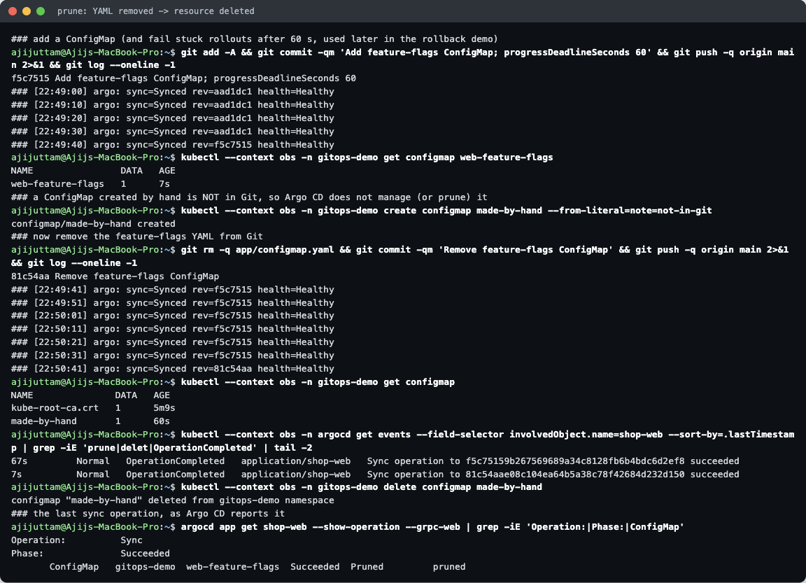

I also created `made-by-hand` with kubectl. It **survived** the sync, because Argo CD only prunes objects it manages (ones tracked from Git). It is not a "delete everything else" tool, so anything made by hand is simply invisible to it. That is a good reason never to make cluster changes outside Git.

### 4. Bad release and rollback with `git revert`

[`12a`](lab/12a-bad-release.txt): commit `6832cb4` "Release web v2.0.0" pointed at an image tag that does not exist (`shop-app:2.0`).

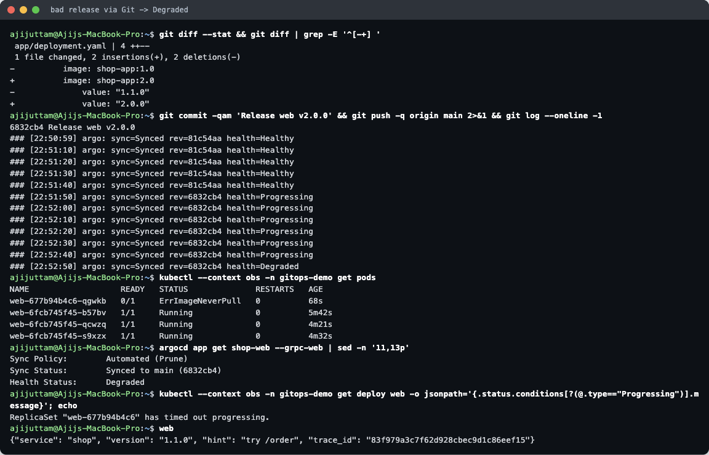

- Argo CD synced it faithfully. **GitOps applies whatever Git says, even when Git is wrong.** The new pod stuck in `ErrImageNeverPull`.
- With `progressDeadlineSeconds: 60` (added in the prune commit), the Deployment reported `ReplicaSet … has timed out progressing`, and Argo CD marked the app **Degraded** at 22:52:50.
- **Users were not hurt**: the rolling update keeps old pods until new ones are Ready, so the 3 v1.1.0 pods kept serving (`web` still returned `1.1.0`).

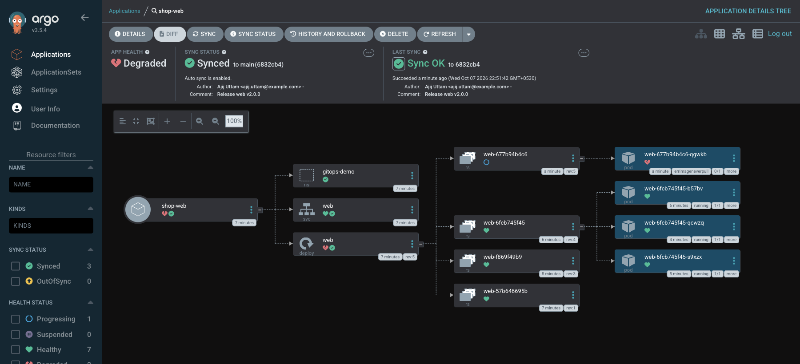

[`12b`](lab/12b-rollback.txt): the rollback is just another commit, `git revert --no-edit HEAD`, then push. Argo CD synced `eaa2310` and was **Healthy at 22:53:42** (41 s after the revert).

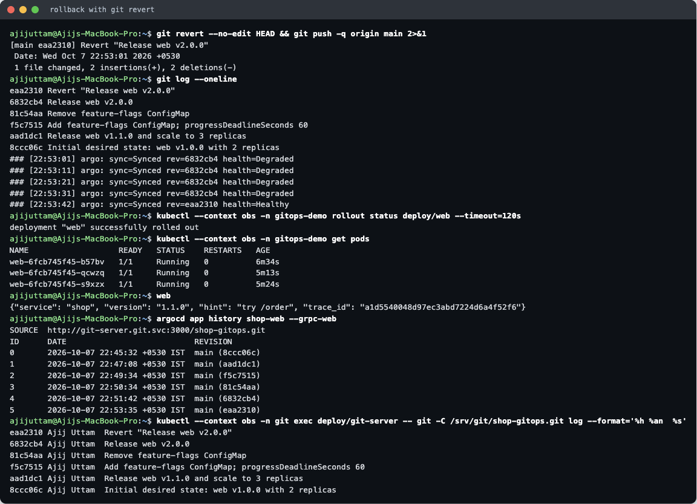

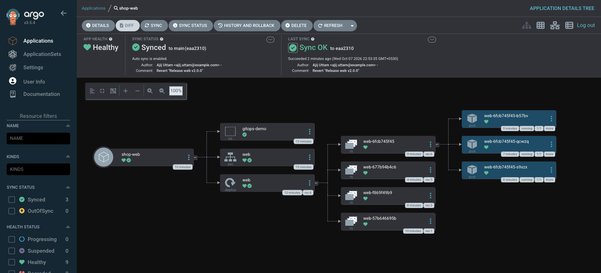

Notice the pods after the revert are the **same three pods** (`web-6fcb745f45-*`, 6–9 minutes old). The reverted template is identical to `rev:4`, so Kubernetes reused that ReplicaSet and only deleted the broken one. The full history lives in Git (6 commits, all by Ajij Uttam) and in Argo CD (6 sync entries):

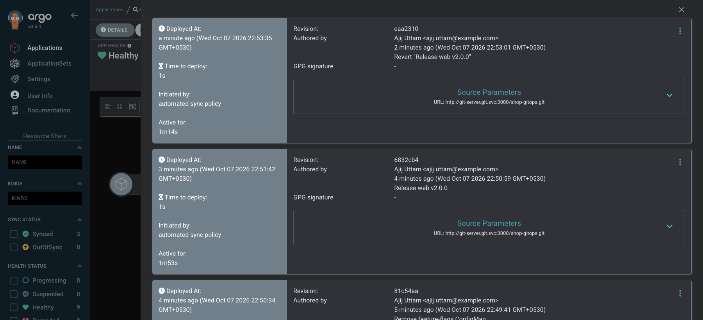

**Why `git revert` and not the Argo CD "Rollback" button?** With auto-sync on, Argo CD refuses a UI rollback (it would fight the automated sync), and a UI rollback would make the cluster disagree with Git anyway. `git revert` keeps Git as the source of truth and leaves an audit trail of *why* the rollback happened.

### Kubernetes + GitOps: summary

| Concept | Shown by |
|---|---|
| Git = source of truth | Every change (scale, release, ConfigMap, rollback) was a commit. The only kubectl apply was the one-time `Application` |
| Declarative config | YAML in `gitops-repo/app/`. Argo CD worked out create/update/delete |
| Continuous reconciliation | Drift reverted in **~3 s**. New commits picked up within **~40 s** |
| Prune | ConfigMap removed from Git → deleted from the cluster |
| GitOps workflow | edit → commit → push → Argo CD sync → rolling update → Healthy |
| Rollback | `git revert` → push → Healthy again, history kept |

---

## Cleanup

`minikube delete -p obs`, then I removed the images I had built or pulled (`shop-app:1.0`, `git-http-server:1.0`, `jaegertracing/jaeger:2.22.0`/`latest`), the `prometheus-community` Helm repo, and the Argo CD CLI context, and stopped all port-forwards. The Colima `fs.inotify.max_user_instances=1024` setting was left in place: it is a runtime sysctl that only raises a limit and resets when the VM restarts.
