# Networking Fundamentals — Homework

**Name:** Ajij Uttam  **Enrollment No:** 24bcs10103

Commands were run inside the Ubuntu 24.04 lab container (`ubuntu-lab`, built from [`../Linux_Fundamentals/lab/Dockerfile`](../Linux_Fundamentals/lab/Dockerfile)), which runs nginx on port 80. `ping` and `traceroute` were also run from the macOS host, for a reason explained in section 15. Script: [`lab/run.sh`](lab/run.sh). Raw output for each command is in [`lab/`](lab/).

---

### 1. `hostname`
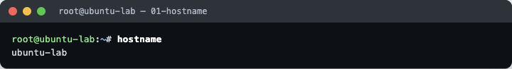

Prints the machine's name: `ubuntu-lab`, set with `--hostname` when the container was started. It identifies the machine in logs and prompts, and in `/etc/hosts` below.

### 2. `whoami`


Prints the effective user: `root`. Useful in scripts to check privileges before running admin commands.

### 3. `ip a`
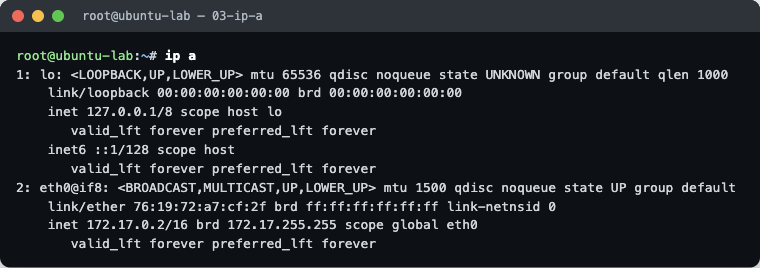

Lists every network interface and its addresses:
- `lo` is the loopback interface, `127.0.0.1/8`, which is traffic to the machine itself.
- `eth0@if8` has `172.17.0.2/16`, the container's address on Docker's default bridge. `state UP` and `LOWER_UP` mean the link is active. `link/ether` is its MAC address.

### 4. `hostname -I`
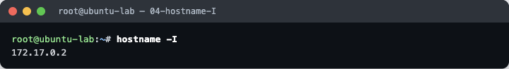

Prints only the IP addresses (`172.17.0.2`), with no interface details. Handy in scripts.

### 5. `ip route`
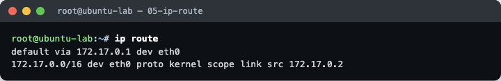

```
default via 172.17.0.1 dev eth0
172.17.0.0/16 dev eth0 proto kernel scope link src 172.17.0.2
```
Anything outside the local `172.17.0.0/16` subnet goes to the **default gateway** `172.17.0.1` (the Docker bridge on the host). Addresses inside the subnet are reached directly on `eth0`.

### 6. `ping`
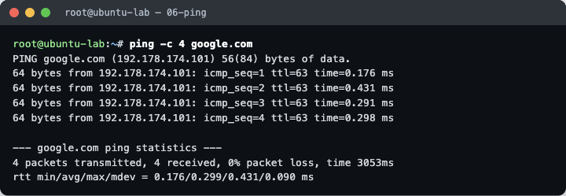

Sends ICMP echo requests: `4 transmitted, 4 received, 0% packet loss`. This proves DNS resolution and reachability. Note the **~0.3 ms** round trip: that is too fast for Google, see section 15.

### 7. `nslookup`
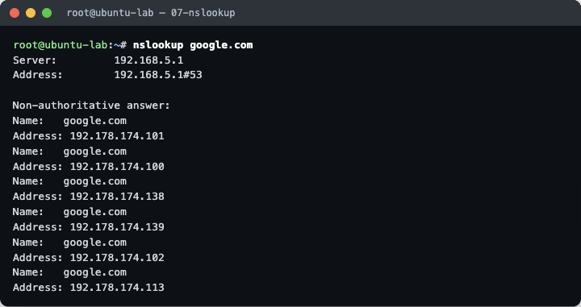

Asks the DNS server (`192.168.5.1`, Colima's VM resolver) for `google.com`. It returned six A records, so Google answers from several IPs. *Non-authoritative* means the answer came from a cache, not from Google's own name servers.

### 8. `dig`
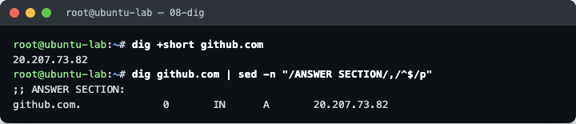

A more detailed DNS tool. `dig +short github.com` gives just the IP (`20.207.73.82`). The full output's `ANSWER SECTION` shows the record type (`A`) and TTL.

### 9. `curl`
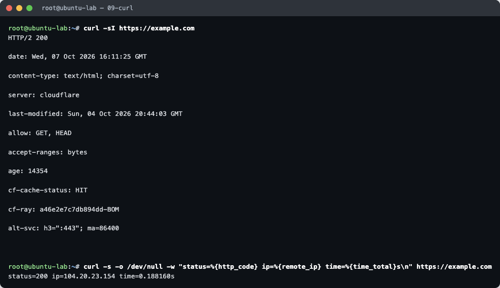

`curl -sI` fetches only the **HTTP headers**: `HTTP/2 200`, `server: cloudflare`, `cf-cache-status: HIT`. That means example.com is served from Cloudflare's cache (Mumbai PoP, `-BOM` in `cf-ray`). The `-w` format prints status code, remote IP and total time (`0.188s`).

### 10. `ss -tulnp`
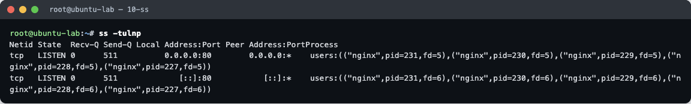

Shows listening sockets: **t**cp, **u**dp, **l**istening, **n**umeric ports, **p**rocess. nginx is listening on port `80` for IPv4 (`0.0.0.0`) and IPv6 (`[::]`), with its master and worker PIDs. This is the first command to run when a service "isn't reachable".

### 11. `/etc/hosts`
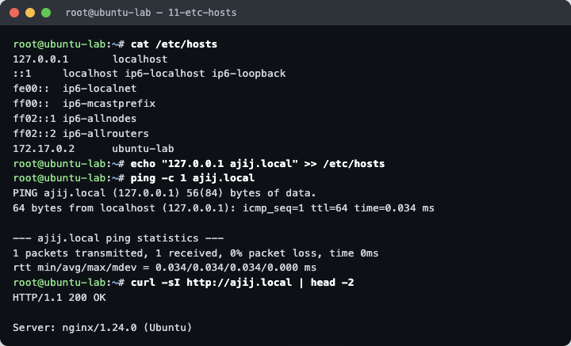

A static name → IP table that is checked **before DNS**. Docker added `172.17.0.2 ubuntu-lab`. I appended `127.0.0.1 ajij.local`. Then `ping ajij.local` resolved to `127.0.0.1` and `curl http://ajij.local` reached the local nginx (`200 OK`), all without any DNS server.

### 12. `tracepath`
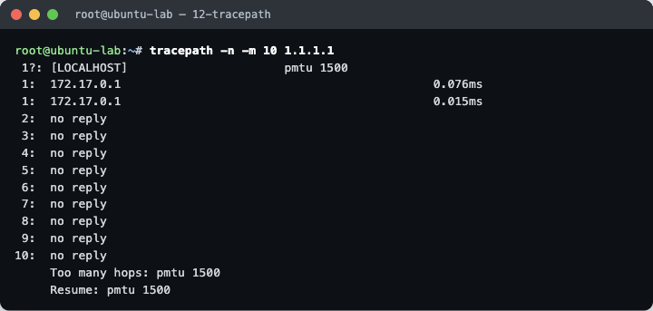

Traces the route hop by hop and discovers the path MTU (`pmtu 1500`) without needing root. From inside the container only hop 1 (`172.17.0.1`, the Docker gateway) answered. The rest show `no reply`.

### 13. `traceroute`
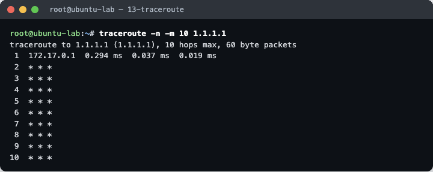

Same idea: it sends packets with increasing TTL, and each router that drops one reports back. Again only the Docker gateway answers from inside the container, then `* * *`.

### 14. `telnet`
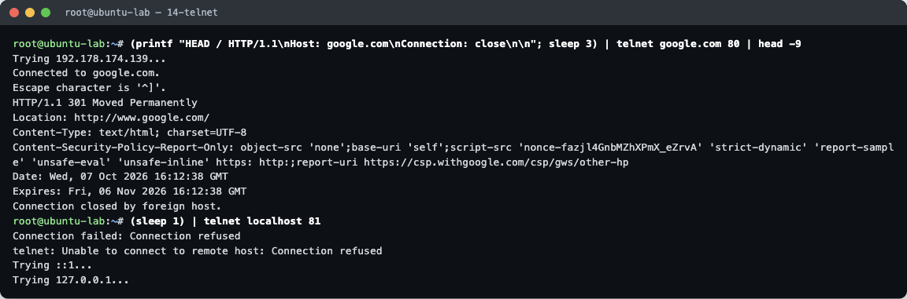

Opens a raw TCP connection to test whether a port is open:
- `telnet google.com 80` → `Connected`. A hand-typed `HEAD / HTTP/1.1` got a real `301 Moved Permanently` back, so port 80 is open and speaking HTTP.
- `telnet localhost 81` → `Connection refused`. Nothing is listening on 81 (compare with `ss` above).

### 15. Why `ping`/`traceroute` look odd inside the container (host comparison)
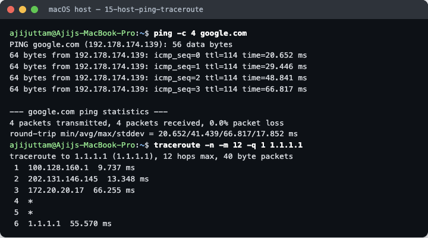

Colima runs Docker inside a VM that uses **user-mode networking**: the VM's network stack answers ICMP on the real host's behalf and does not forward TTL-expired replies. That explains the 0.3 ms "Google" ping and the traceroutes that stop after the gateway. Running the same commands on the macOS host gives the real picture:

- `ping google.com` takes **20–67 ms** with `ttl=114`.
- `traceroute 1.1.1.1` reaches Cloudflare in **6 hops**: home gateway `100.128.160.1` → ISP `202.131.146.145` → `172.20.20.17` → two silent routers (`*`) → `1.1.1.1` at ~56 ms.

**Takeaway:** a container's network view depends on how its runtime connects it to the outside. Check results against the host before trusting latency or path numbers.
