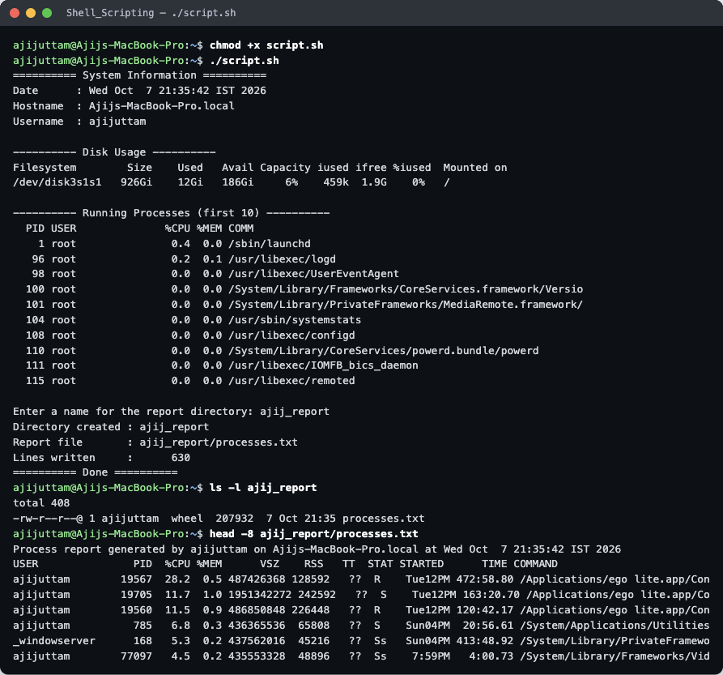

# Shell Scripting — System Information Script

**Name:** Ajij Uttam  **Enrollment No:** 24bcs10103

Script: [`script.sh`](script.sh) · Full captured run: [`run_output.txt`](run_output.txt)

## What the script does

| Requirement | How it is done in `script.sh` |
|---|---|
| Print current date | `CURRENT_DATE=$(date)` → `echo` |
| Print hostname | `HOST_NAME=$(hostname)` → `echo` |
| Print username | `USER_NAME=$(whoami)` → `echo` |
| Print disk usage | `df -h /` |
| Print running processes | `ps -eo pid,user,pcpu,pmem,comm \| head -11` |
| Variables | `CURRENT_DATE`, `HOST_NAME`, `USER_NAME`, `DIR_NAME`, `REPORT_FILE` |
| User input | `read -p "Enter a name for the report directory: " DIR_NAME` |
| Create a directory | `mkdir -p "$DIR_NAME"` |
| Create a file | `touch "$REPORT_FILE"` |
| Store processes with `>` | `echo "header" > "$REPORT_FILE"` then `ps aux >> "$REPORT_FILE"` |

`>` **overwrites** the file, so re-running the script starts a fresh report. `>>` **appends**, so the full `ps aux` listing goes under the header line instead of replacing it.

## Run

```bash
chmod +x script.sh
./script.sh
```



```
========== System Information ==========
Date      : Wed Oct  7 21:35:42 IST 2026
Hostname  : Ajijs-MacBook-Pro.local
Username  : ajijuttam

---------- Disk Usage ----------
Filesystem        Size    Used   Avail Capacity iused ifree %iused  Mounted on
/dev/disk3s1s1   926Gi    12Gi   186Gi     6%    459k  1.9G    0%   /

---------- Running Processes (first 10) ----------
  PID USER              %CPU %MEM COMM
    1 root               0.4  0.0 /sbin/launchd
   96 root               0.2  0.1 /usr/libexec/logd
  ...

Enter a name for the report directory: ajij_report
Directory created : ajij_report
Report file       : ajij_report/processes.txt
Lines written     :      630
========== Done ==========
```

## Verifying the file

```
$ ls -l ajij_report
-rw-r--r--@ 1 ajijuttam  wheel  207932  7 Oct 21:35 processes.txt
$ head -3 ajij_report/processes.txt
Process report generated by ajijuttam on Ajijs-MacBook-Pro.local at Wed Oct  7 21:35:42 IST 2026
USER               PID  %CPU %MEM      VSZ    RSS   TT  STAT STARTED      TIME COMMAND
...
```

The directory and file were created from the name typed at the prompt. The file holds the header line plus 629 lines of `ps aux` output.

> Run on macOS (`/bin/bash` 3.2). The script also works unchanged on Linux. Only the `df`/`ps` column layout differs.
