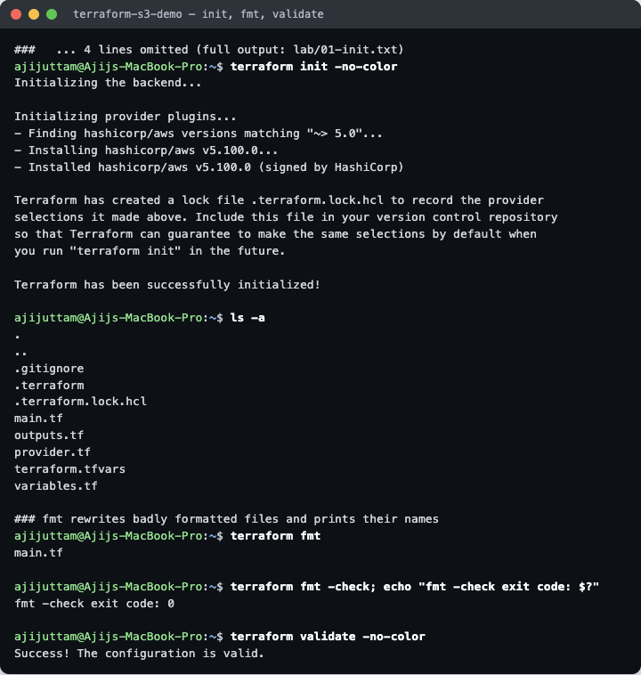
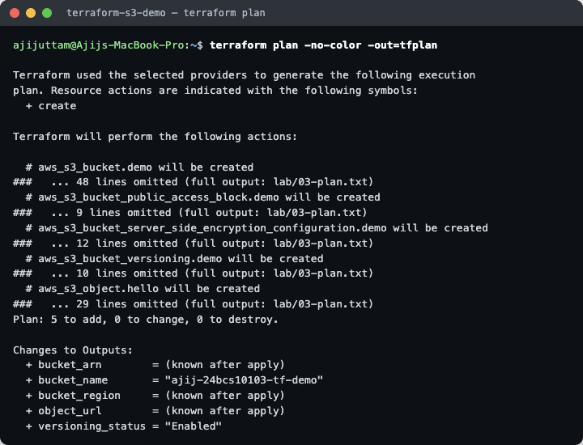
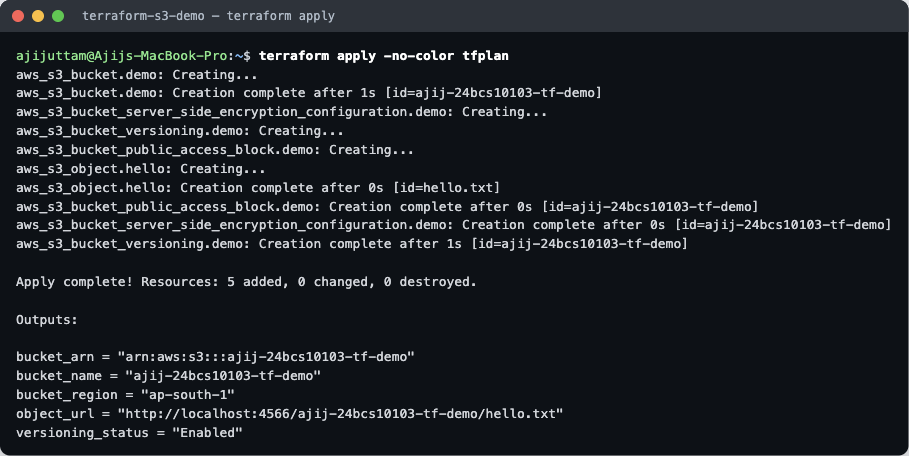
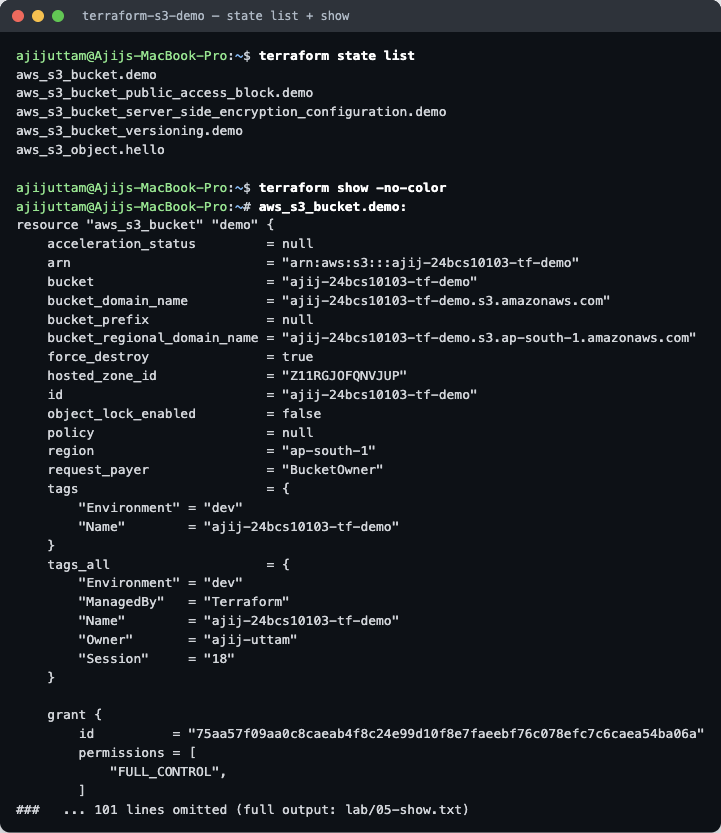
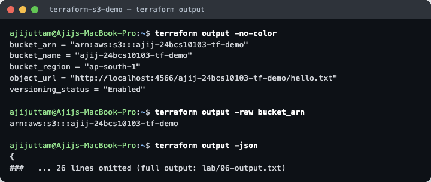
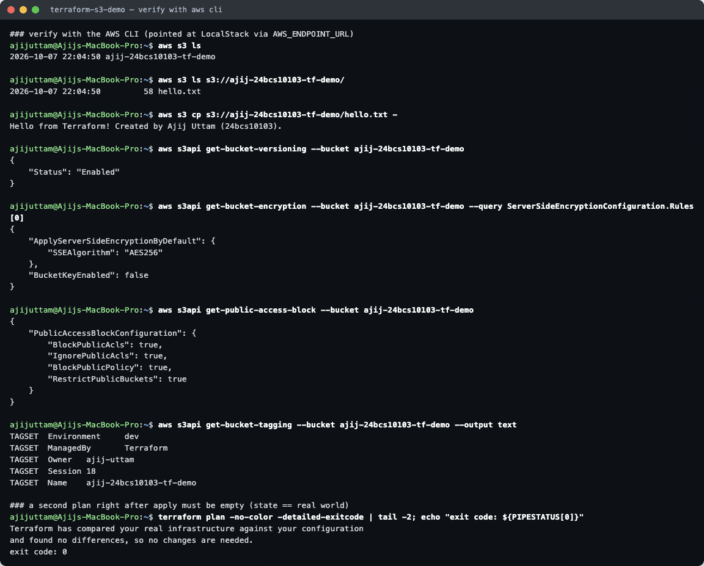
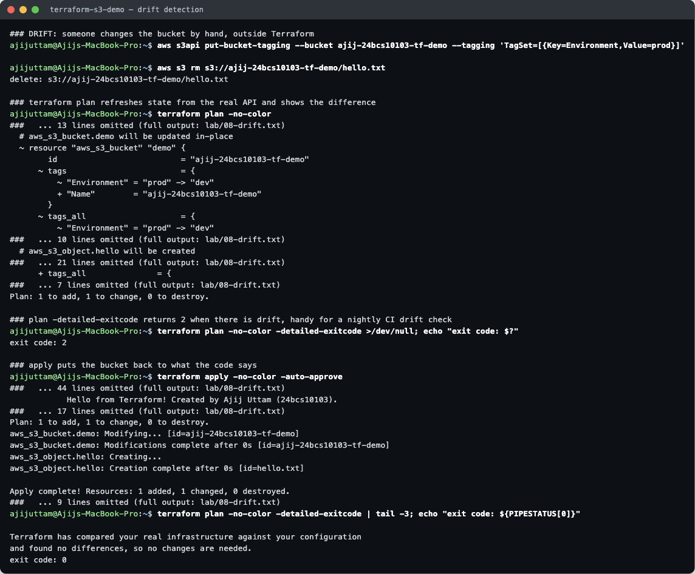
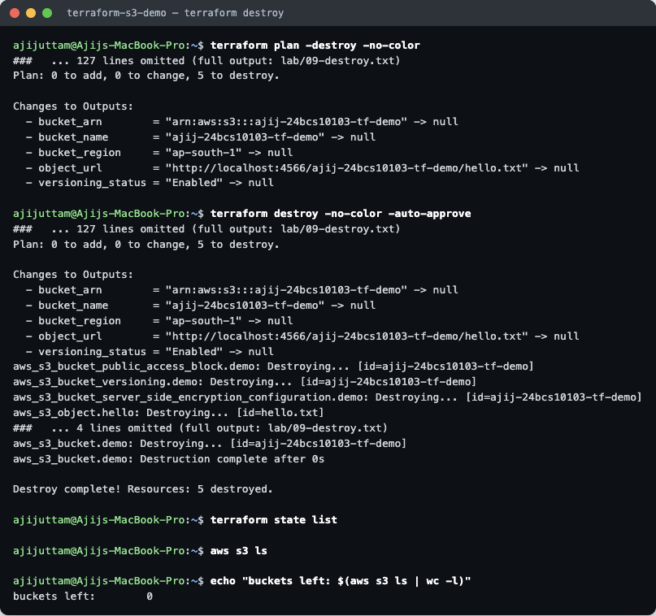

# Terraform & Infrastructure as Code — Homework

**Name:** Ajij Uttam  **Enrollment No:** 24bcs10103

**Environment:** macOS (Apple Silicon), Terraform **v1.16.4**, AWS provider **v5.100.0**, AWS CLI **v2.36.30**.
I did not use a real AWS account. Every `terraform` and `aws` command ran against **[LocalStack](https://github.com/localstack/localstack) 4.0.3 (community)** in Docker. LocalStack is an AWS emulator that serves the real AWS APIs on `http://localhost:4566`. The Terraform code is normal AWS code. Only the `provider "aws"` block points at LocalStack (see [What changes for real AWS](#what-changes-for-real-aws)).

```bash
docker run -d --name ajij-localstack -p 4566:4566 -e SERVICES=s3,ec2,iam,sts localstack/localstack:4.0
bash lab/run-s3-demo.sh       # runs init → fmt → validate → plan → apply → show → output → verify → drift → destroy
```

`localstack/localstack:4.0` is pinned on purpose. Newer `latest` images need a LocalStack auth token, and the 4.0 community tag still starts without one.
The runner script is [`lab/run-s3-demo.sh`](lab/run-s3-demo.sh). It loads dummy credentials (`test`/`test`) and `AWS_ENDPOINT_URL=http://localhost:4566`, and it points `AWS_CONFIG_FILE`/`AWS_SHARED_CREDENTIALS_FILE` at `/dev/null`, so no real AWS profile can ever be used. Raw output of every step is in [`lab/`](lab/). The screenshots are cut from those files (omitted lines are marked `### ...`).

| Deliverable | Where |
|---|---|
| Task 1: Terraform S3 project | [`terraform-s3-demo/`](terraform-s3-demo/) (main.tf, variables.tf, outputs.tf, provider.tf, terraform.tfvars, [README.md](terraform-s3-demo/README.md)) |
| Task 2: AWS services research | [IAM](aws-services/01-iam/README.md) · [EC2](aws-services/02-ec2/README.md) · [S3](aws-services/03-s3/README.md) · [VPC](aws-services/04-vpc/README.md) · [DynamoDB & RDS](aws-services/05-dynamodb-rds/README.md) |

---

## Task 1 — Terraform S3 Demo

### What the code creates

| File | Purpose |
|---|---|
| [`provider.tf`](terraform-s3-demo/provider.tf) | `terraform {}` block (Terraform ≥ 1.6, `hashicorp/aws ~> 5.0`) and the `aws` provider: region, LocalStack endpoint, and `default_tags` that every resource gets |
| [`variables.tf`](terraform-s3-demo/variables.tf) | Inputs: `aws_region`, `bucket_name` (with a `validation` rule for legal S3 names), `environment`, `enable_versioning`, `localstack_endpoint` |
| [`terraform.tfvars`](terraform-s3-demo/terraform.tfvars) | Values for those inputs (`bucket_name = "ajij-24bcs10103-tf-demo"`, region `ap-south-1` Mumbai) |
| [`main.tf`](terraform-s3-demo/main.tf) | **5 resources:** the bucket, versioning, default AES-256 encryption, a public-access block, and one object `hello.txt` |
| [`outputs.tf`](terraform-s3-demo/outputs.tf) | `bucket_name`, `bucket_arn`, `bucket_region`, `versioning_status`, `object_url` |

The extra resources (versioning, encryption, public-access block) follow the S3 best practices from the [S3 research](aws-services/03-s3/README.md). Since AWS provider v4 they are separate resources and no longer arguments of `aws_s3_bucket`.

### 1. `terraform init`, `fmt`, `validate`



- `init` downloaded the AWS provider plugin (**v5.100.0**) into `.terraform/` and wrote **`.terraform.lock.hcl`**. The lock file pins the exact version and checksums, so it **is committed**. `.terraform/` and state files are not (see [`.gitignore`](terraform-s3-demo/.gitignore)).
- I mis-indented one line of `main.tf` on purpose. `terraform fmt` rewrote it and printed the file name `main.tf`, and then `fmt -check` exited with **0** (everything formatted).
- `validate` checks syntax, types and references without calling AWS: *Success! The configuration is valid.*

### 2. `terraform plan`



The plan is saved to a file (`-out=tfplan`), so `apply` runs exactly what was reviewed. Result: **Plan: 5 to add, 0 to change, 0 to destroy.** Values such as `arn` show as *(known after apply)* because AWS assigns them. Full plan: [`lab/03-plan.txt`](lab/03-plan.txt).

### 3. `terraform apply`



Terraform built the dependency graph from the references (`bucket = aws_s3_bucket.demo.id`). The **bucket was created first**, then the 4 dependent resources were created **in parallel**: *Apply complete! Resources: 5 added, 0 changed, 0 destroyed.*

### 4. `terraform show` (and `state list`)



`terraform show` prints the **state file**, which is Terraform's record of what exists. You can see real values that were unknown at plan time: `arn = "arn:aws:s3:::ajij-24bcs10103-tf-demo"`, `region = "ap-south-1"`, the merged `tags_all` (my tags plus the provider's `default_tags`), and the object's `version_id` (versioning is on). Full output: [`lab/05-show.txt`](lab/05-show.txt).

### 5. `terraform output`



```
bucket_arn = "arn:aws:s3:::ajij-24bcs10103-tf-demo"
bucket_name = "ajij-24bcs10103-tf-demo"
bucket_region = "ap-south-1"
object_url = "http://localhost:4566/ajij-24bcs10103-tf-demo/hello.txt"
versioning_status = "Enabled"
```

`terraform output -raw bucket_arn` prints a bare value for scripts. `-json` gives machine-readable output for CI ([`lab/06-output.txt`](lab/06-output.txt)).

### 6. Check the bucket with the AWS CLI



The AWS CLI, which knows nothing about Terraform, confirms the bucket, the object (`cp ... -` prints *Hello from Terraform! ...*), versioning `Enabled`, `SSEAlgorithm: AES256`, all 4 public-access flags `true`, and the 5 tags. A **second `terraform plan` straight after apply reports "No changes" (exit code 0)**, so the state matches the real bucket.

### 7. Bonus — drift detection



*Drift* means the real infrastructure no longer matches the code, usually because someone changed it by hand in the console. I simulated that with the CLI:

1. `put-bucket-tagging` replaced all tags with `Environment=prod`.
2. `aws s3 rm` deleted `hello.txt`.

`terraform plan` refreshes the state from the API first. It found both changes and planned to fix them: **`~` update in-place** for the tags (`"prod" -> "dev"`, plus the missing tags re-added) and **`+` create** for the missing object. *Plan: 1 to add, 1 to change, 0 to destroy.*
`plan -detailed-exitcode` returns **2** when changes are pending (0 = clean, 1 = error), which a nightly CI job can use to alert on drift. `apply` put everything back, and the next plan was clean again (exit code 0).

### 8. `terraform destroy`



`destroy` deletes in **reverse dependency order**: the 4 child resources first, then the bucket. `force_destroy = true` lets Terraform delete a bucket that still holds objects (and old versions). The result is *Destroy complete! Resources: 5 destroyed.* `terraform state list` is empty and `aws s3 ls` shows **0 buckets**.

### Problem I hit: provider 6.x and LocalStack tags

My first run used `version = "~> 6.0"`, as in the course demo, which installed **v6.67.0**. Apply succeeded, but the bucket had **no tags** (`tags = {}` in `terraform show`, `NoSuchTagSet` from the CLI). See [`lab/00-provider-v6-localstack-issue.txt`](lab/00-provider-v6-localstack-issue.txt).
With `TF_LOG=debug` I saw that provider 6.x sends the tags **inside the `CreateBucket` request** and never calls `PutBucketTagging`, and the LocalStack 4.0 community image ignores tags in `CreateBucket`. Fix: pin `~> 5.0` (v5.100.0), which uses `PutBucketTagging`. On real AWS, `~> 6.0` works and is what I would use.

### What changes for real AWS

Only the provider block. Remove the LocalStack-only parts:

```hcl
provider "aws" {
  region = var.aws_region          # keep
  # access_key / secret_key = "test"  -> delete; use `aws configure`, SSO or an IAM role
  # skip_credentials_validation, skip_metadata_api_check, skip_requesting_account_id -> delete
  # s3_use_path_style = true        -> delete
  # endpoints { ... }               -> delete
  default_tags { ... }             # keep
}
```

Also: the bucket name must be **globally unique** across all AWS accounts, the account ID in ARNs would be real (LocalStack uses `000000000000`), `object_url` would be `https://<bucket>.s3.ap-south-1.amazonaws.com/hello.txt`, and for team work the state should live in a **remote backend** (S3 bucket with versioning plus state locking) instead of a local `terraform.tfstate`.

---

## Task 2 — AWS Services Research

| # | Service | Category | Covers |
|---|---|---|---|
| 01 | [IAM](aws-services/01-iam/README.md) | Governance / security | users, groups, roles, policies, permissions, least privilege, best practices, use cases |
| 02 | [EC2](aws-services/02-ec2/README.md) | Compute | AMI, instance types, key pairs, security groups, EBS, public vs private IP, lifecycle, use cases |
| 03 | [S3](aws-services/03-s3/README.md) | Storage | buckets, objects, storage classes, versioning, lifecycle, encryption, bucket policies, use cases |
| 04 | [VPC](aws-services/04-vpc/README.md) | Networking | CIDR, subnets, route tables, IGW, NAT GW, security groups, NACLs, public vs private subnet |
| 05 | [DynamoDB & RDS](aws-services/05-dynamodb-rds/README.md) | Databases | NoSQL, tables/items/attributes, partition & sort key · engines, instances, security, backups, Multi-AZ, read replicas |

---

## Files

```
Terraform/
├── README.md                     ← this file
├── terraform-s3-demo/            ← Task 1 (Terraform project, .terraform.lock.hcl committed, state git-ignored)
├── aws-services/01-iam … 05-dynamodb-rds/README.md   ← Task 2
├── lab/                          ← run-s3-demo.sh + raw output of every step (01-init.txt … 09-destroy.txt)
│   └── screens/                  ← the trimmed transcripts used for the screenshots
└── images/                       ← terminal screenshots
```
